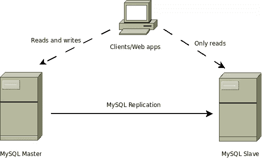

# 改善 WordPress 性能的数据库变化

> 原文：<https://www.sitepoint.com/database-changes-to-improve-wordpress-performance/>

如果你正在创建一个网站——无论是新闻网站、博客还是电子商务网站，你都有可能考虑使用 WordPress。随着网站越来越受欢迎，一旦用户开始对它感兴趣，核心 WordPress 可能不足以有效地处理传入的流量。然后，您将需要扩大您的网站，以处理更高的传入连接量。

有很多方法可以扩展你的 WordPress 网站，但是在这篇文章中我们将重点关注数据库的调整。WordPress 使用 MySQL 作为数据库，这篇文章假设你熟悉 WordPress 的数据库结构。

作为预防措施，您不应该直接在服务器上执行数据库查询。在尝试执行此处提到的任何操作之前，请始终保留适当的备份。

## 打扫

出于备份和安全的目的，WordPress 在数据库中存储了大量数据，最终用户可能无法直接看到这些数据。例如，WordPress 将你发布的文章、页面和草稿的每一次修改都保存在数据库中。尚未发表的评论也存储在数据库中。未使用的标签，类别，死链接和媒体也存储在数据库中。

当你的网站是新的时，所有这些数据可能不会导致 WordPress 性能的显著下降，但是随着你的网站的增长，这些不必要的数据会增加你的数据库的大小，从而使查询变慢。

你可以[关闭对你的帖子](http://www.wpbeginner.com/wp-tutorials/how-to-disable-post-revisions-in-wordpress-and-reduce-database-size/)的修改，与其他垃圾数据相比，这些帖子通常会占用你数据库中最大的空间，但我建议你定期清理你的数据库，因为修改有时会派上用场。这里[列出了清理你的 WordPress 数据库的 10 个步骤](http://premium.wpmudev.org/blog/clean-up-optimize-wordpress/)，包括删除所有不必要的数据。

## 清除…的碎片

当您添加一些条目、删除一些其他条目以及添加更多条目时，数据不一定会按顺序存储在同一个位置。它们可能会占用硬盘中的不同扇区。这些片段是逻辑数据单元，没有任何单独的意义，但作为一个整体构成了完整的数据库。有许多类型的分裂:横向、纵向和混合或混合。

虽然操作系统和 MySQL 在写入或读取数据时会处理碎片，但高度的碎片会导致更长的执行时间，从而使您的站点更慢。

对 MySQL 数据库进行碎片整理最简单的方法是使用 [phpMyAdmin](http://www.phpmyadmin.net/home_page/index.php) ，它提供了一个 GUI 来执行这个任务，以及许多其他常见的数据库管理任务。

如果您想要对单个表进行碎片整理，您可以执行一个空的`ALTER TABLE`命令。它实际上是从头开始重建表，因此，所有数据都存储在同一个位置。要对整个数据库进行碎片整理，需要一个 SQL 转储，删除表并恢复转储——再次，重建所有的表。碎片整理有助于减少索引时间。

## 数据库缓存

在 WordPress 中，请求首先由 web 服务器(通常是 Apache)提供服务，然后交给 PHP，PHP 处理请求，提取或操作数据库中的一些数据，然后显示结果。当一个站点上有很多传入请求，并且每个请求都提供相同的内容时，每次处理请求并从数据库中提取相同的数据是低效的。这就是缓存的用武之地。有很多方法可以缓存数据，但是在这篇文章中，我们将讨论数据库缓存。

概括地说，有两种方法来执行数据库缓存。您可以缓存整个表，也可以缓存 SQL 查询的结果。有各种各样的产品可以帮助你执行数据库缓存，比如 [memcached](http://memcached.org/) 。然而，我建议你使用 WordPress 插件来执行数据库缓存，除非你在这个领域有经验。

一个很好的执行数据库缓存的插件是 [W3 Total Cache](http://wordpress.org/plugins/w3-total-cache/) ，尽管它也做许多其他类型的缓存。

或者，您也可以缓存您的自定义查询。例如，如果你有一个显示最活跃用户的查询，你不需要每次 WordPress 服务一个页面时都运行它(因为它应该很少改变)。因此，您可以使用 [Transients API](http://codex.wordpress.org/Transients_API) 让查询只在特定的时间间隔后运行。这里有一个关于[使用瞬态 API 在 WordPress](http://www.wpbeginner.com/wp-tutorials/speed-up-your-wordpress-by-caching-custom-queries-using-transients-api/) 中缓存你的查询的指南。

## 缩放比例

你还在寻找解决方法吗？难道没有其他方法帮助你处理你收到的巨大流量吗？别担心，我们把最好的留到了最后。

在高可用性架构中，扩展数据库非常重要。一种扩展数据库的技术是使用主从复制。

来源——[MySQL 性能博客](http://www.mysqlperformanceblog.com/2009/11/13/finding-your-mysql-high-availability-solution-%E2%80%93-replication/)

在主从复制中，您有一个主机和一个或多个从机。每个从设备都有一份主设备数据的副本。web 应用程序可以读写主应用程序，但是从应用程序只允许读操作。当您的应用程序需要处理非常多的读取操作时，这种设置非常有用。如果主服务器出现故障，所有读取操作都将正常工作，但是写入操作将会失败，直到指定新的主服务器。

主从系统对于涉及写操作的应用来说效率不高，因为它会导致不一致。例如，如果两个不同的从设备中的一个没有更新到主设备的最新状态，则它们可以给出不同的读取值。

你可以使用插件 [HyperDB](https://wordpress.org/plugins/hyperdb/) 和 [HAProxy](http://www.haproxy.org/) 作为负载平衡器，在 WordPress 中实现主从复制。这里的[是一个教程，详细介绍了在数字海洋](https://www.digitalocean.com/community/tutorials/how-to-optimize-wordpress-performance-with-mysql-replication-on-ubuntu-14-04)上设置这种配置的步骤——你可以将同样的技术应用于任何提供商。

## 最后的想法

我们讨论了许多方法，可以帮助你为你的网站下一次流量激增做好准备。你成功地接待了新来访者吗？这个教程对你有帮助吗？你使用了这里没有提到的新技术吗？欢迎在下面的评论中告诉我们！

## 分享这篇文章