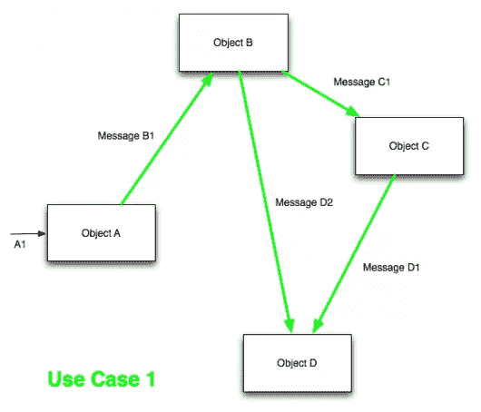
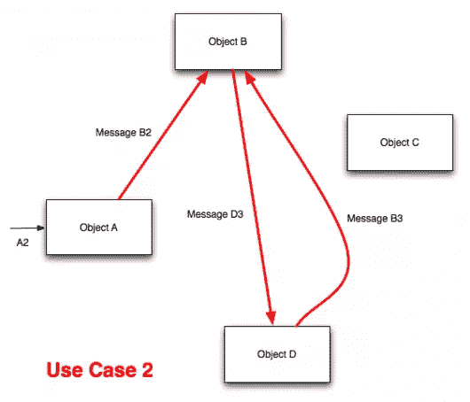
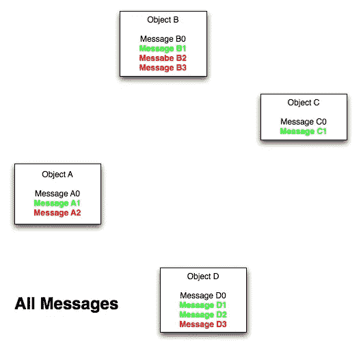

# 数据上下文交互:面向对象范式的演变

> 原文：<https://www.sitepoint.com/dci-the-evolution-of-the-object-oriented-paradigm/>

本文是对 DCI(数据上下文交互)的实际介绍。我不打算解释它背后的所有理论。相反，我将向您展示 DCI 试图解决什么样的问题，以及如何在 Ruby 中实现它。

## OO 擅长什么

让我们先来看看传统面向对象编程做得很好的一些问题。

面向对象编程非常擅长捕捉状态。类、字段和属性是强大的功能，允许您定义状态并显式地使用它。因为我们在编程语言中内置了这些表达状态的方法，所以在编译时和运行时推理对象的状态都很简单。在编译时，我们可以查看对象的类定义。在运行时，我们可以向对象询问它的字段。

所有面向对象语言都很好解决的另一个问题是表达与对象状态相关的操作。这样的操作不涉及任何协作。它们位于拥有对象的本地。我们通过为一个类定义方法来表达局部操作。当我们为一个类定义一个方法并创建该类的一个对象时，我们知道该对象将拥有那个方法。很有描述性。

Ruby `String`是一个只有局部操作的对象的好例子。每个字符串都有一个字节或字符数组，所有操作都使用该数组。该对象是独立的；不需要与其他对象协作。我不认为任何人在理解如何使用字符串方面有任何问题。这就是 OO 语言要解决的问题。

## OO 没有做到的事情

面向对象编程没有做到的是表达对象之间的协作。为了向您确切地展示我的意思，让我们来看两个系统操作(两个用例),它们需要同一组对象相互协作。

### 用例 1

这里我们有一个系统操作，有四个对象在相互对话。

### 用例 2

这里我们有另一个用例，使用同一组对象的另一个系统操作。但是你可以看到合作模式是不同的。信息是不同的。

### 代码中没有表示系统操作

我们看到了实现用例 1 和用例 2 的两个系统操作。我们如何在代码中表示它们？理想情况下，我希望能够打开一个文件，并找出我正在处理的用例的协作模式。如果我正在处理用例 1，我不想知道关于用例 2 的任何事情。我认为这是代码中系统操作的成功表现。

不幸的是，传统的面向对象编程并没有给我们任何这样做的方法。它给了我们一些工具来表达对象的状态，并将本地行为附加到这些对象上。但是我们没有任何好的方法来描述对象在运行时如何通信来执行一个用例。因此，代码中没有表示系统操作。

### 源代码！=运行时间

最终，我们还是会以某种方式编写代码和程序系统操作。我们怎么做呢？我们把它们分成许多小方法，放入许多不同的对象中。

我们在这里看到的是，所有用例所需的所有方法都被塞进了这些对象中。执行第一个用例所需的方法是绿色的，第二个用例是红色的。此外，这些对象有一些本地方法。这些本地方法由绿色和红色方法使用。

这幅图说明的问题是源代码没有反映运行时发生的事情。源代码告诉我们四个独立的对象，每个对象都有很多方法。运行时告诉我们，我们有四个相互对话的对象，这些方法中只有一小部分与特定用例相关。这种不匹配使得程序难以理解。源代码告诉我们一个故事，运行时告诉我们一个完全不同的故事。

最重要的是，没有办法明确地定义系统操作(用例)，所以我们必须跟踪所有的方法调用来了解正在发生的事情。我们无法打开任何文件来找出特定的用例。更糟糕的是，由于所有的类都包含许多不同用例的方法，我们不得不花费大量的时间来过滤它们。

## DCI 来了

DCI 是 Trygve Reenskaug(MVC 模式的发明者)发明的解决这些问题的范例。

### 用例 1 (DCI)

让我们来看看以 DCI 风格实现的第一个用例。

")

这里我们所拥有的是从用例中分离出系统的稳定部分，只包含数据和本地方法。所有传统的面向对象技术都可以用来建模稳定的部分。特别是，我推荐使用领域驱动的设计技术，比如集合和存储库。但是这里没有上下文行为，也没有交互——只有本地方法。

### 我们如何为交互建模？

我们有了一个新的描述交互的抽象概念:上下文。它是一个包含给定用例的所有角色的类。每个角色都是交互中的合作者，由一个对象扮演。如您所见，上下文行为集中在角色中。上下文只是将角色分配给对象，然后触发交互。

### 用例 2 (DCI)

以 DCI 风格实现的第二个用例:

")

我想指出，我们的对象(对象 A-D)保持不变。我们不需要添加任何方法来支持第二个用例。我们拥有的所有方法都是基本的、独立的和局部的。所有用例特定的行为都被提取到上下文和角色中。

另一件事是，我们没有同时看到红色和绿色方法。每个上下文只包含执行自身所需的方法。

这听起来可能太抽象了，所以让我们来看一个代码示例，看看它是如何在 Ruby 中实现的。

## 代码示例

这是 DCI 的 hello world 示例。每个对 DCI 感兴趣的人都从把钱从一个账户转到另一个账户开始。

我意识到我将要展示的例子过于简单了。因为它非常简单，所以可以使用服务、常规实体或函数来成功实现。所以把这个例子看作是你如何组织你的代码的一个例子。

当我们讨论从一个账户向另一个账户转账时，我们需要以某种方式存储账户信息。Account 类负责做到这一点。它存储帐户余额和交易列表。