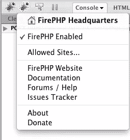
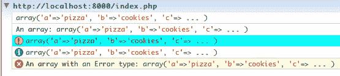
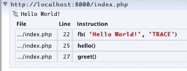

# 用 Firebug 和 FirePHP 调试 PHP

> 原文：<https://www.sitepoint.com/debug-php-firebug-firephp/>

如果你和我一样，在做网络项目时，你会比 T2 更早放弃水。小 bug 是一个非常有用的 HTML/CSS/JavaScript/Ajax 调试器。但是你知道它也可以用来调试 PHP 吗？是的，多亏了一个叫做 FirePHP 的附加 Firefox 扩展。

通过将这个位于 Firebug 之上的扩展与服务器端库相结合，您的 PHP 脚本将能够向浏览器发送调试信息，并方便地编码在 HTTP 响应头中。设置完成后，您可以将 PHP 脚本中的警告和错误记录到 Firebug 控制台，就像开发 JavaScript 一样。

首先，你需要从 Mozilla 的 Firefox 插件网站安装 FirePHP 扩展。这要求您已经安装了 Firebug。安装 FirePHP 后，当您下次打开 Firebug 面板时，您会看到一个额外的蓝色 bug。点击这个 bug，会出现一个菜单，允许你启用或禁用 FirePHP:



当然，这还不能解决任何问题。您还需要安装 FirePHP 服务器端库，可以从这里获得。这是一个独立版本的库，既可以手动下载，也可以使用 PEAR 安装。之后，您只需在代码中包含这个库。还有一些版本旨在与各种框架或内容管理系统集成，如 WordPress 的 WP-FirePHP 插件(T1)或 Joomla 的 JFirePHP 插件(T2)。出于演练的目的，我将把重点放在独立功能上。

一旦您的服务器上有了 FirePHP 库，您就需要在您的脚本中包含这样一行:

`require_once('FirePHPCore/fb.php');`

因为 FirePHP 通过 HTTP 头发送日志数据，所以您需要缓冲脚本的输出，以便响应头可以包含脚本中生成的内容。在 PHP 中，这是通过调用脚本顶部附近的`ob_start`来完成的:

`ob_start();`

完成这些步骤后，您就可以开始使用 FirePHP 了。您所需要做的就是用您想要记录的任何内容调用`fb`函数，以及一个可选的标签和一个可选的常量来将消息定义为标准日志、警告、错误或信息。例如:

```
$var = array('a'=>'pizza', 'b'=>'cookies', 'c'=>'celery');
fb($var);
fb($var, "An array");
fb($var, FirePHP::WARN);
fb($var, FirePHP::INFO);
fb($var, 'An array with an Error type', FirePHP::ERROR); 
```

这段代码将在 Firebug 控制台中产生以下输出:



您还可以使用 FirePHP 来跟踪您的应用程序的执行:通过传入`FirePHP::TRACE`常量，您将看到行号、类名和函数名，其中调用了`fb`。所以这段代码:

```
 function hello() {
  fb('Hello World!', FirePHP::TRACE);
}
function greet() {
  hello();
}
greet(); 
```

将产生如下输出:



这种跟踪功能对于调试更复杂的脚本非常有用，因为它让您确切地知道从哪里调用函数。

当然，您需要记住在您的代码上线之前删除您的调试语句！

FirePHP 的内容比我在这里介绍的要多得多。我已经向您展示了 FirePHP 的简化过程 API，但是还有一个更高级的面向对象 API，它具有许多附加特性。你可以在 [FirePHP 网站](http://www.firephp.org/)上了解所有相关信息，所以一定要去看看。

## 分享这篇文章