# 使用 Visual Studio 模拟器调试 WebGL 和 HTML5 移动体验

> 原文：<https://www.sitepoint.com/debug-webgl-html5-mobile-experiences-visual-studio-emulators/>

本文是微软网站开发系列的一部分。感谢您对使 SitePoint 成为可能的合作伙伴的支持。

随着最近 **Visual Studio 2015 RTM** 的推出，免费的[Visual Studio Emulator for Android](http://blogs.msdn.com/b/visualstudioalm/archive/2015/07/20/visual-studio-emulator-for-android-in-vs2015-rtm.aspx?WT.mc_id=16516-DEV-sitepoint-article52)也随之而来。在本文中，我将向您展示如何在这些非常快速的 Android 模拟器上测试您的 WebGL 体验。

首先，[下载 Visual Studio 2015 RTM](https://www.visualstudio.com/downloads/download-visual-studio-vs?CR_CC=200657563/?WT.mc_id=16516-DEV-sitepoint-article52) (比如**免费社区版**)或者[不经过 Visual Studio 直接安装 Android 模拟器](http://aka.ms/vsemu/?WT.mc_id=16516-DEV-sitepoint-article52)。然后，阅读[介绍 Visual Studio 的 Android 模拟器](http://blogs.msdn.com/b/visualstudioalm/archive/2014/11/12/introducing-visual-studio-s-emulator-for-android.aspx?WT.mc_id=16516-DEV-sitepoint-article52)，它解释了这个很酷的模拟器如何工作以及支持的功能。

*注:我最近发表了一篇文章，描述了如何在 Windows Phone* *上* [*远程调试和评测 HTML5 网站和应用的性能。随着*](http://blogs.msdn.com/b/davrous/archive/2014/07/21/how-to-remotely-debug-and-profile-the-performance-of-your-html5-websites-amp-apps-on-windows-phone.aspx?WT.mc_id=16516-DEV-sitepoint-article52) [*Windows 10 SDK 工具*](https://dev.windows.com/en-us/downloads/windows-10-developer-tools/?WT.mc_id=16516-DEV-sitepoint-article52) *的发布，您现在可以使用相同的方法**来调试 Windows Mobile 10 和 Mobile Edge** 。*

## WebGL 测试

安装完成后，您可以**启动工具**:

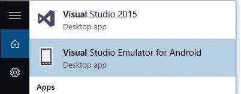

并选择您感兴趣的图像:

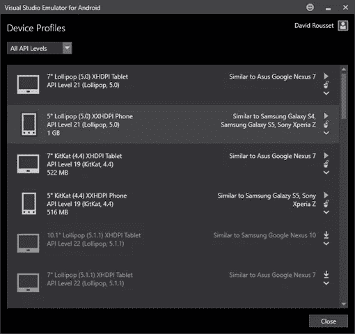

让我们选择“ **5”棒棒糖(5.0) XXHDPI 手机**——类似三星 Galaxy S4”并按下播放。如果这是您第一次启动模拟器，它将为您配置 Hyper-V 网络设置。

一旦启动，启动默认安装的浏览器，并尝试，例如，导航到[http://www.babylonjs.com/](http://www.babylonjs.com/?WT.mc_id=16516-DEV-sitepoint-article52)，迄今为止最好的可用 WebGL 框架。如果您尝试启动我们的一个场景，您会看到一个错误:

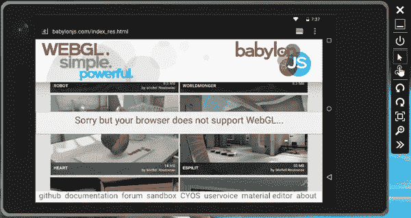

的确，**这个棒棒糖图片附带的默认浏览器不支持 WebGL** 。我们需要**在上面安装 Chrome** 。

搜索一个 **x86 版本的 Chrome APK** ，比如这个: [Chrome 43.0.2357.93 (x86)](http://www.apkmirror.com/apk/google-inc/chrome/chrome-43-0-2357-93-x86-android-apk-download/) 和**直接把 APK** 拖放到模拟器中。它应该安装它:

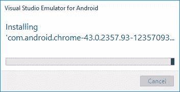

但是如果你用 Chrome 再次导航到同一个网址，你还是会遇到同样的错误。这一次，是因为 **Chrome 没有启用 WebGL 作为模拟器——它不在他的白名单**中。若要强制执行，请导航至“**关于:标志**，并启用此选项:`Override software rendering list`。

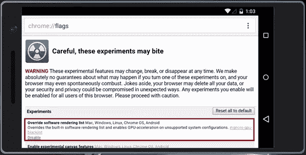

你现在应该可以启动我们的一个场景了，比如我们著名的**埃斯皮里图**场景:【http://www.babylonjs.com/index.html?ESPILIT/】T2

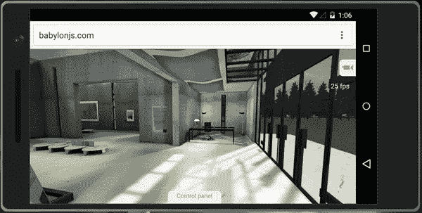

在我的第一代联想 X1 上使用简单的**HD 4000**GPU 在 Windows 10 上使用 25 fps ！对于一个模拟器来说还不错！显然，您仍然需要一个真实的设备来测试 WebGL 代码的性能。

更好的是，由于模拟器完美地支持触摸，你也可以在你的 WebGL 体验中测试和调试多点触摸。例如，将摄像机切换到“**虚拟操纵杆摄像机**”:

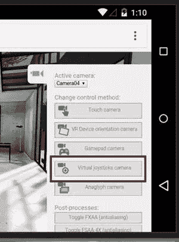

现在，您只需用两根手指轻触电脑屏幕，即可进入 3D 场景:

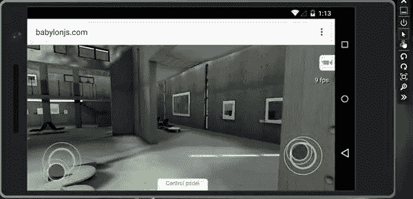

**<u>注意:</u>** 为此，我们使用[指针事件](http://blogs.msdn.com/b/davrous/archive/2013/10/21/handling-touch-in-your-html5-apps-thanks-to-the-pointer-events-of-ie10-and-windows-8.aspx?WT.mc_id=16516-DEV-sitepoint-article52)和我们的 HandJS polyfill 将这些事件传播到[触摸事件](https://www.w3.org/TR/touch-events/)，因为 Chrome 还不支持指针事件。

**在 Windows Phone/Mobile 上，IE11 和 Edge 中默认启用 WebGL。**因此，只需启动 Windows Phone 模拟器并导航至您的 WebGL 内容。

**<u>注意:</u>** 在 Visual Studio 模拟器内部甚至连 Web 音频都支持 Chrome！举个例子，这个演示在 it 界行得通:【http://www.babylonjs-playground.com/index.html?22 

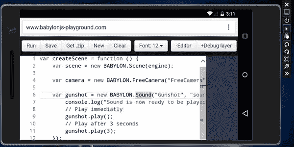

## 与 Vorlon.js 更进一步

我们最初制作 **Vorlon.js** 是为了**简化移动网络开发者的生活**。如果你还没听说过它，可以看看我们网站上的视频:【http://www.vorlonjs.io/[和这篇文章:](http://www.vorlonjs.io/?WT.mc_id=16516-DEV-sitepoint-article52)[我们为什么做 vorlon.js 以及如何用它远程调试你的 JavaScript】](http://blogs.msdn.com/b/eternalcoding/archive/2015/04/30/why-we-made-vorlon-js-and-how-to-use-it-to-debug-your-javascript-remotely.aspx?WT.mc_id=16516-DEV-sitepoint-article52)

让我们首先回顾一下如何在 Android 和 Windows Phone 模拟器上调试您的层。例如，我目前在业余时间玩 **Flexbox** 来改进 Babylon.js 网站。感谢 **Modernizr 插件**，你可以看到模拟器支持 Flexbox，你甚至可以通过 **DOM Explorer** 查看布局尺寸:

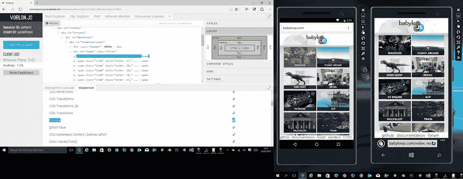

例如，你可以在 Android 模拟器(左边)看到突出显示的**“大厦”flexbox 项目**，它的大小目前是`172px x 112px`。

让我们回顾一下 **Windows Phone 模拟器**(在右边)上的同一个站点:

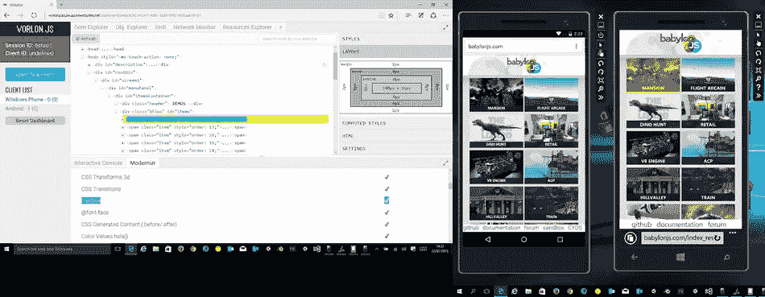

当然，IE11 Mobile 也支持 flexbox，而这一次，相同的 Flexbox 项目目前是`140px x 91px`。

另一个有趣的功能是**交互控制台**。有时，**使用 WebGL，很难知道为什么你的代码在移动设备上失败了**。这通常是因为手机的 GPU 不支持特定的功能，或者因为着色器无法编译。例如，我们的“**景深/末端**”演示就是如此。着色器对于 Windows Phone 来说太复杂了，您可以使用我们的工具来验证它:

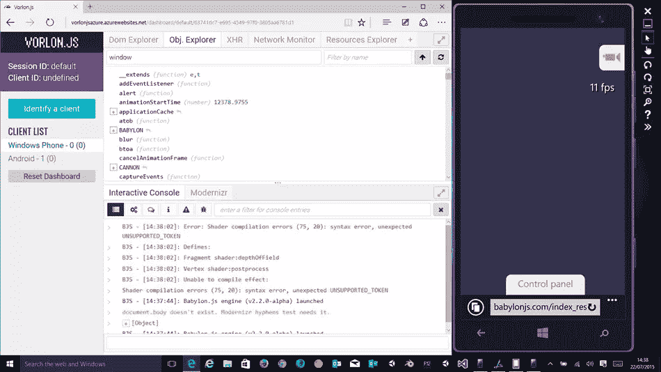

我们已经有很多其他插件可以帮助你，我们目前正在努力添加新的，甚至走得更远。谁知道呢，在不久的将来，我们可能会为 babylon.js 设计一个。

## JavaScript 的更多实践

这篇文章是微软技术倡导者的 web 开发系列的一部分，内容涉及实用的 JavaScript 学习、开源项目和互操作性最佳实践，包括[微软 Edge](http://blogs.windows.com/msedgedev/2015/05/06/a-break-from-the-past-part-2-saying-goodbye-to-activex-vbscript-attachevent/?WT.mc_id=16516-DEV-sitepoint-article52) 浏览器和新的 [EdgeHTML 渲染引擎](http://blogs.windows.com/msedgedev/2015/02/26/a-break-from-the-past-the-birth-of-microsofts-new-web-rendering-engine/?WT.mc_id=16516-DEV-sitepoint-article52)。

我们鼓励您使用 [dev.modern.IE](http://dev.modern.ie/tools/?utm_source=SitePoint&utm_medium=article52&utm_campaign=SitePoint) 上的免费工具跨浏览器和设备进行测试，包括 Windows 10 的默认浏览器 Microsoft Edge:

*   [扫描你的网站，寻找过时的库、布局问题和可访问性](http://dev.modern.ie/tools/staticscan/?utm_source=SitePoint&utm_medium=article52&utm_campaign=SitePoint)
*   [在 Mac、Linux 和 Windows 上使用虚拟机](http://dev.modern.ie/tools/vms/windows/?utm_source=SitePoint&utm_medium=article52&utm_campaign=SitePoint)
*   [在您自己的设备上远程测试 Microsoft Edge](https://remote.modern.ie/?utm_source=SitePoint&utm_medium=article52&utm_campaign=SitePoint)
*   GitHub 上的编码实验室:跨浏览器测试和最佳实践

来自我们的工程师和布道者的关于 Microsoft Edge 和 Web 平台的深入技术学习:

*   【2015 年微软 Edge 网络峰会(对新浏览器、新支持的网络平台标准以及来自 JavaScript 社区的演讲嘉宾有何期待)
*   哇，我可以在 Mac 电脑上测试 Edge & IE 浏览器& Linux！(来自雷伊·班戈)
*   [在不破坏网络的情况下推进 JavaScript】(来自 Christian Heilmann)](http://channel9.msdn.com/Events/WebPlatformSummit/2015/Advancing-JavaScript-without-breaking-the-web/?WT.mc_id=16516-DEV-sitepoint-article52)
*   使网络正常工作的边缘渲染引擎(Jacob Rossi)
*   [用 WebGL](https://channel9.msdn.com/Events/WebPlatformSummit/2015/Unleash-3D-rendering-with-WebGL-and-Microsoft-Edge/?WT.mc_id=16516-DEV-sitepoint-article52) 释放 3D 渲染(来自 David Catuhe，包括 [JS](http://vorlonjs.com/?WT.mc_id=16516-DEV-sitepoint-article52) 和 [babylonJS](http://babylonjs.com/?WT.mc_id=16516-DEV-sitepoint-article52) 项目)
*   [托管网络应用和网络平台创新](https://channel9.msdn.com/Events/WebPlatformSummit/2015/Hosted-web-apps-and-web-platform-innovations/?WT.mc_id=16516-DEV-sitepoint-article52)(来自律师奶爸和基里尔·赛克谢诺夫，包括 [JS](http://manifold.js.com/?WT.mc_id=16516-DEV-sitepoint-article52) 项目)

更多面向网络平台的免费跨平台工具和资源:

*   [适用于 Linux、MacOS 和 Windows 的 Visual Studio 代码](https://code.visualstudio.com/?WT.mc_id=16516-DEV-sitepoint-article52)

[用节点编码。JS](https://www.microsoftvirtualacademy.com/en-US/training-courses/building-apps-with-node-js-jump-start-8422/?WT.mc_id=16516-DEV-sitepoint-article52) 和[在 Azure 上免费试用](https://azure.microsoft.com/en-us/pricing/free-trial/?WT.mc_id=16516-DEV-sitepoint-article52)

## 分享这篇文章