# Adobe AIR:带调试的超负荷开发

> 原文：<https://www.sitepoint.com/debugging-adobe-air-application/>

Adobe 旗舰 RIA 平台的 AIR 1.5 更新已经发布，它将为您的开发提供大量新功能。在本文中，我们将看看 Aptana IDE 中提供的奇妙的新调试系统。最后还会有一次测验，所以请注意！[前 200 名提交答案的人](https://www.sitepoint.com/quiz/adobe/debugging-adobe-air-applications)将免费收到一本*Adobe Flash Platform action script 富互联网应用程序开发参考*(这是印刷版)，感谢 Adobe。

##### 入门指南

在我们开始之前，请确保您有 Aptana 和 AIR 插件的最新更新。你可以使用我们之前的文章中的说明来安装它们，在构建 AIR 应用的强大工具一节中。

最新的更新对本教程至关重要；如果有疑问，重启 Aptana 并使用**帮助>检查 Aptana 更新现在**检查更新。你应该至少有 Aptana Studio 1.2.1 和 Apollo/AIR 插件 1.2.1。使用**帮助>关于 Aptana Studio** 查看你的 Aptana 版本，点击棕色方框查看你的 Aptana AIR 版本。

我们需要带调试器旋转的一切都包括在内。我们将使用 Adobe AIR 1.5 应用程序模板、AIR 自省器框架和 jQuery 框架。

##### 有什么新鲜事？

AIR 1.0 版本在 AIR HTML 内省程序中包含了一个有用但有限的调试工具。通过 AIR 1.5 调试启动程序中的新工具，Aptana 已经成功地在 Aptana Studio 中重新创建了调试工作流，并提供了分步调试、断点、监视等功能。在本教程中，我们将从头到尾介绍如何调试 AIR 项目。经验丰富的 AIR 开发人员可以直接跳到“在轮子上调试”部分。

##### 创建用于调试的项目

一旦 Aptana 设置好，关闭它，然后再次启动它。您应该会看到开始屏幕:

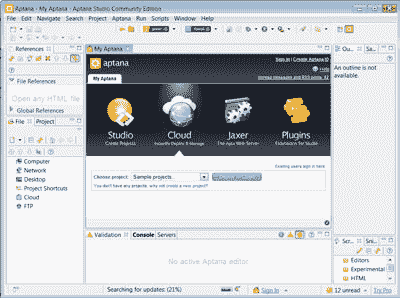

这个工作台的大部分与 AIR 调试无关，所以我们可以通过关闭除 Project 之外的所有视图来简化透视图。

让我们创建一个新的 AIR 项目；打开 **Aptana 项目**下的**文件>新建>项目**，选择 **Adobe AIR 项目**。

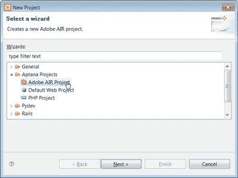

点击**下一步**并给你的项目命名——我选择了“调试”。

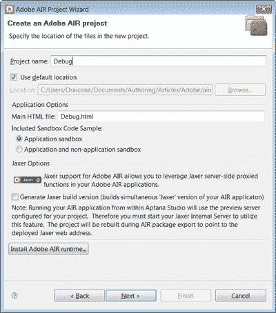

点击**下一步**，接受默认的应用属性，再次点击**下一步**。默认窗口选项应该没问题，所以再次点击**下一步**，导入 AIR 框架对话框出现。

我们需要这个项目的 AIRAliases 和 AIR HTML 内省。后者默认保持未选中状态，因此添加它并点击下一个的**。**

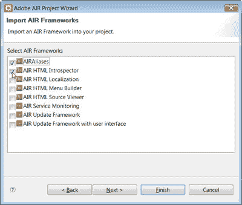

Adobe AIR 的调试系统与 JavaScript 框架配合得很好。在“导入 JavaScript 库”对话框中添加您选择的框架。点击**结束**，我们就可以开始了！

##### 跟踪脚本执行

Aptana 创建了一组示例文件来演示 AIR 平台。这是我们的工作台目前的样子:

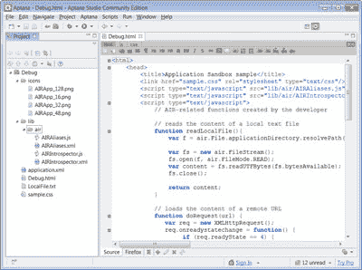

特别是，我们现在有了一个`Debug.html`文件(或者类似的，取决于您的项目名称)，其中包含 JavaScript 示例和对我们的 AIR 框架的引用。
其中一个例子使用了`readLocalFile`函数，所以让我们添加一些调试说明。更新它以添加对`air.trace`的呼叫，如下所示:

```
function readLocalFile(){  

  var f = air.File.applicationDirectory.resolvePath("LocalFile.txt");  

  **air.trace("Opening LocalFile.txt in applicationDirectory");**  

  var fs = new air.FileStream();  

  fs.open(f, air.FileMode.READ);  

  var content = fs.readUTFBytes(fs.bytesAvailable);  

  fs.close();  

  **air.trace("Read contents of LocalFile.txt: " + content);**  

  return content;  

}
```

保存文件，并使用运行调试按钮启动它:


我们的应用程序窗口出现:

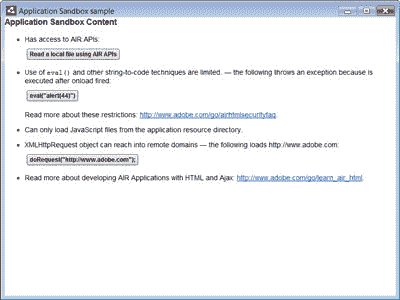

单击“使用 AIR APIs 读取本地文件”按钮。文件被读取，并出现警报窗口:

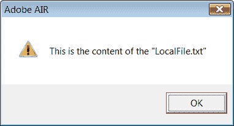

点击 **OK** (或者类似的，取决于你的操作系统)，返回 Aptana。控制台视图应该出现在代码窗口的下方。

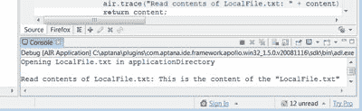

AIR 架构非常类似 Flash 调试方法，应用程序可以“跟踪”消息，然后将消息发送回父应用程序，通常是 AIR 调试启动器(“ADL”)。在这种情况下，Aptana 接收这些调试消息，并将它们发送到控制台视图。

当然，将文本转储到控制台是有用的，但是如果我们想要查看脚本执行的内部，并检查对象呢？带来了空气 HTML 内省，空气世界的萤火虫。

##### 运行时探索

返回到打开的应用程序沙盒示例窗口，然后按 F12。将出现 AIR HTML/JS 应用程序自省器窗口:

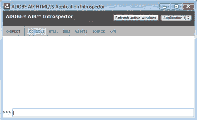

自省器包括一个 JS 控制台、一个 DOM 树和节点检查器，以及 AIR 项目中文件的源代码(包括解析后的源代码)查看器。还有一个`XMLHttpRequest`监视器来监视 AJAX 请求。最重要的是，自省器有一个 API，我们可以直接在 AIR 应用程序中使用它。回到我们之前修改过的`readLocalFile`函数，将其改为:

```
function readLocalFile(){  

  var f = air.File.applicationDirectory.resolvePath("LocalFile.txt");  

  **air.Introspector.Console.log("Opening LocalFile.txt in applicationDirectory");**  

  var fs = new air.FileStream();  

  fs.open(f, air.FileMode.READ);  

  var content = fs.readUTFBytes(fs.bytesAvailable);  

  **air.Introspector.Console.info(fs);**  

  fs.close();  

  return content;  

}
```

关闭 AIR 应用程序，保存`Debug.html`，再次点击**运行**按钮。当应用程序打开时，再次点击**读取本地文件**按钮，但是注意自省窗口——它可能隐藏在你的 dock 或任务栏中。您可能需要点击 **F12** 来找到它，如果控制台是空的，再次点击**读取本地文件**按钮。现在，内省窗口有了两个新条目:

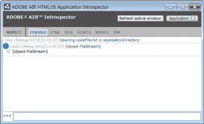

将我们的调试消息记录到控制台是有用的，但是自省器可以更进一步:看看控制台窗口中的`[object FileStream]`。这表明我们已经向控制台发送了一个`FileStream`对象——当然是`var fs = new air.FileStream()`。点击第二行的灰色加号 **(+)** 查看对象。

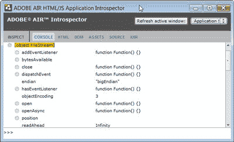

您可以使用窗口底部的 **> > >** 提示符实时检查和操作对象。例如，我们可以选择在脚本中保持文件流打开，从控制台调用对象的一些方法(通过在全局变量中给对象分配一个引用)，然后在完成后手动运行`fs.close()`。

这样我们就可以密切关注脚本的执行，甚至可以窥见其内部。但是管理代码执行呢？如果我们可以简单地暂停我们的 JavaScript，从里到外看一下，会怎么样？让我们来看看 Aptana 插件的最新更新，调试平台集成。

##### 在轮子上调试

随着 AIR 1.5 的更新和 Aptana Studio 1.2.1 的发布，Aptana 和 Adobe 创建了一个令人惊叹的调试平台，利用 Eclipse 的强大功能为开发人员提供了比以往更多的功能。让我们来看看这个新平台能有什么帮助。

关闭我们的示例 AIR 应用程序并返回到`Debug.html`编辑器。编辑器的左边有两列——一列用于代码折叠，一列用于断点。在第 17 行，第二个`air.Introspector.Console`行，双击左边的空白处。出现一个蓝点:

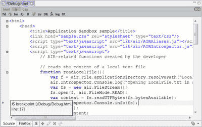

这设置了一个断点，或一个脚本执行将暂停并给我们一些喘息时间的点。现在，保存`Debug.html`并使用**调试**按钮运行您的应用程序，而不是运行:

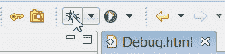

当应用程序窗口打开时，点击**读取本地文件**按钮。这一次，窗口冻结，Aptana Studio 出现一个对话框:

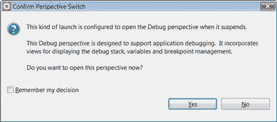

Debug 透视图是 Eclipse 调试系统的一个标准特性，Aptana 已经设法将其与 Adobe AIR SDK 紧密集成。单击“是”确认视角切换；debug 透视图已经设置好，可以进行调试。Aptana 将重新排列工作台，直到它看起来像这样:

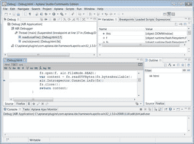

虽然 debug 透视图显示了一个非常繁忙的界面，但是您稍后会发现这种能力唾手可得。我们来看看这个视角下的不同观点。

Debug 视图(与我们的项目名称无关)为脚本执行提供了一个基本的堆栈和控制面板。这里，它列出了管理脚本执行线程的 AIR 调试器控件，以及 AIR 调试启动程序(ADL)服务器。单击堆栈跟踪中的任何条目都会将打开的编辑器面板导航到正确的文件和行，帮助您快速浏览代码。

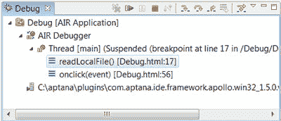

Variables 视图将显示当前范围内的任何变量和对象。与空气内省器类似，您可以使用它来检查对象。注意我们的`readLocalFile`函数中的变量，包括前面的`FileStream`对象，都包含在内。因为它们是标准的 JavaScript 对象，所以您可以自由地打开它们并检查它们的内部。

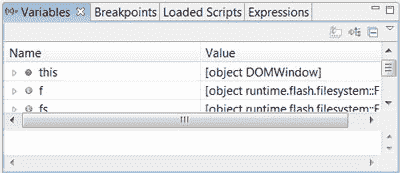

对接这一观点未能做到公平。右键单击变量标题选项卡，单击分离，并根据需要调整结果窗口的大小。(或者，您可以将它停靠在工作台的一侧，以换取水平屏幕空间。)好多了。

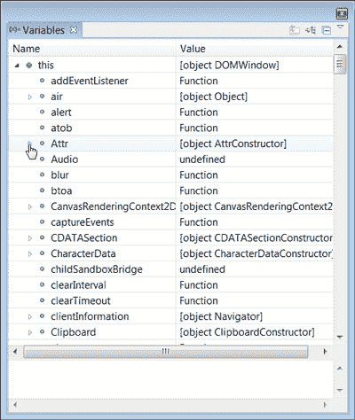

(您总是可以使用**窗口>显示视图**或**Alt+Shift+Q-V**再次找到该视图)

接下来是表情。与变量类似，表达式允许您实时观察表达式的值。这可能是一个简单的变量，也可能是一个函数调用。例如，在加载 jQuery 时，我经常使用 Expressions 视图来检查页面上与特定 CSS 选择器匹配的 DOM 节点。要使用表达式视图，请使用小工具栏中的第一个按钮添加监视表达式。


让我们创建一个手表表达式。但是首先，让我们恢复脚本执行:点击 Debug 视图上的 **Resume** 按钮。

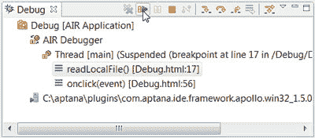

会出现一个警告框，报告*这是 LocalFile.txt 的内容*，但是它可能隐藏在你的 Aptana 窗口下。找到它并点击 **OK** 按钮，否则你的 AIR 应用程序会反对。我们的 AIR 应用程序现在已经恢复运行，Debug 视图将报告一个“*Thread[main](Running)*”；我们现在准备添加一个表达式。试一个简单的，比如`window.innerHeight`，探索结果。

我们有一套优秀的工具来调试我们的 JavaScript，但是我们的 HTML 本身呢？这就是 Outline 视图的用武之地。使用 Outline 面板，您可以检查组成页面的 DOM 节点的结构。您甚至可以查看某些节点内部，并检查脚本标记中定义或引用的 JavaScript 对象。类似地，Loaded Scripts 视图逐个文件地显示定义的函数。

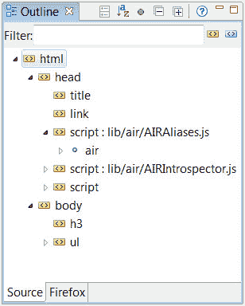

最后，我们有通常的控制台视图。如果我们使用 AIR trace 调试方法而不是自省器，我们可以将输出发送到控制台。在计算表达式时，这甚至会暴露给 Flash Player 运行时，因此您可以创建一个具有嵌入式函数的复杂表达式，并将一些输出发送到控制台。边调试边调试！

##### 最后的想法

空中调试已经成熟。Aptana 中的 AIR 工具链非常通用，甚至可以作为标准 web 页面的出色调试环境，这要归功于 AIR 平台内置的成熟 JavaScript 引擎和 WebKit 渲染器。新的调试平台与 Flex Builder 3 中包含的 Flex 调试系统一样强大；它使 AIR 成为一个强大的基于 web 的平台，展示了 JavaScript 的威力，是所有 web 开发人员的必看之作。

同时，[通过参加小测验来测试一下](https://www.sitepoint.com/quiz/adobe/debugging-adobe-air-applications)这篇文章的内容。前 200 名提交答案的人将收到 Adobe Flash Platform action script Reference for Rich Internet Application Development 的印刷本，由 Adobe 免费送货上门。[立即参加测验！](https://www.sitepoint.com/quiz/adobe/debugging-adobe-air-applications)

## 分享这篇文章