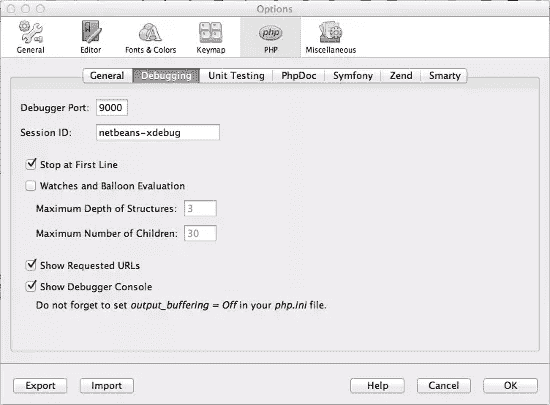
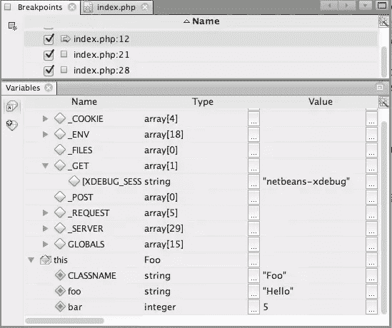
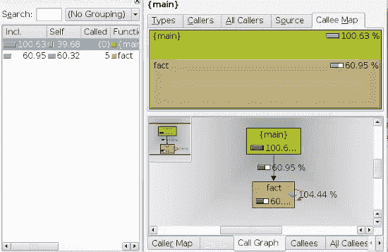
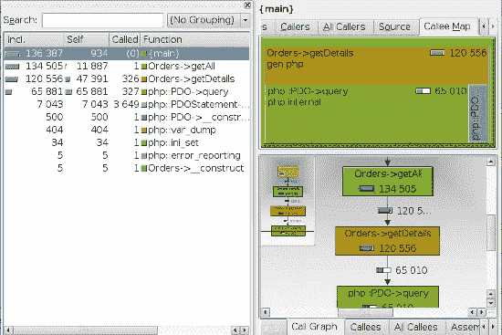
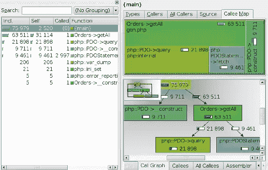

# 用 Xdebug 调试和分析 PHP

> 原文：<https://www.sitepoint.com/debugging-and-profiling-php-with-xdebug/>

PHP 是 web 开发中最流行的语言，但过去对它的一个普遍批评是它缺乏合适的调试器。使用 Java 和 C#等语言的开发人员可以享受一套强大的调试工具，这些工具通常与他们的 ide 直接集成。但是 web 服务器和 PHP IDEs 的不可连接性阻止了我们使用许多相同的工具。我们在代码中手工添加了调试语句…直到 Xdebug 填补了空白。

Xdebug 是由吴镇男·雷森斯开发的一个免费开源项目，可能是最有用的 PHP 扩展之一。它不仅提供基本的调试支持，还提供堆栈跟踪、分析、代码覆盖率等等。在本文中，您将看到如何安装和配置 Xdebug，如何从 Netbeans 调试您的 PHP 应用程序，以及如何在 KCachegrind 中读取分析报告。

## 安装和配置 Xdebug

如果你用的是 XAMPP 或者 MAMP，Xdebug 是预装的；你只需要在你的`php.ini`里启用它。如果你在 Ubuntu 这样的平台上使用基于包的安装，你可以通过你的包管理器用一个类似于`apt-get install php5-xdebug`的命令来安装它。

我的`php.ini`中 Xdebug 的条目如下所示:

```
[xdebug]
zend_extension="/Applications/MAMP/bin/php5.2/lib/php/extensions/no-debug-non-zts-20060613/xdebug.so"
xdebug.remote_enable=1
xdebug.remote_host=localhost
xdebug.remote_port=9000
```

`zend_extension`指定 Xdebug 模块的路径。`xdebug.remote_enable`值切换扩展是否激活。`xdebug.remote_host`是您的系统的名称或 IP 地址(这里我指定了 *localhost* ，因为我在同一台机器上工作，但是如果您需要为您的设置指定不同的内容，该值可以是 IP 地址或 DNS 主机名)。`xdebug.remote_port`是客户端监听来自 Xdebug 的连接的端口(默认值为 9000)。

当您使用 Xdebug 时，确保您没有使用任何其他 Zend 扩展是很重要的，因为它们可能会与 Xdebug 冲突。

还有其他安装选项。Xdebug 网站[提供了一个简单的向导](http://xdebug.org/wizard.php "Xdebug: Support; Tailored Installation Instructions")来引导你完成安装。您可以将`phpinfo()`或`php –i`的输出粘贴到文本框中，让向导分析您的服务器配置，并指导您如何为您的机器编译 Xdebug。

## 排除故障

通常情况下，使用`var_dump()`和`exit` / `die()`组合进行调试是很有诱惑力的。但是这种方法的问题是，你必须修改代码进行调试；您必须记住添加输出语句的每个地方，并在调试完成后删除它们。Xdebug 克服了这个问题，它允许你在任何你想要的地方暂停应用程序的执行。然后，您可以检查该范围内的变量值，以便更好地了解 PHP 在做什么。

您可以轻松地将 Netbeans 配置为 Xdebug 客户端。打开选项窗口(“工具”>“选项”),转到 PHP 部分的调试选项卡。输入`php.ini`中给出的调试端口和一个会话 ID，您需要将它与您想要调试的请求一起传递。现在，您可以通过单击 tools 选项卡中的 Debug 来运行调试器。



在源文件打开的情况下，按工具栏中的 Debug 按钮开始调试。它将在浏览器中打开应用程序，如果您在选项窗口中启用了“在第一行停止”选项，PHP 的执行将在文件的第一行暂停。否则，它将一直运行，直到遇到第一个断点。从那里，您可以使用继续按钮继续到下一个断点。

注意浏览器的地址栏中的`XDEBUG_SESSION_START`参数。要触发调试器，必须将`XDEBUG_SESSION_START`作为请求参数(GET/POST)传递，或者将`XDEBUG_SESSION`作为 cookie 参数传递。

调试工具栏中还有一些其他有用的操作。它们是:

*   单步执行–单步执行当前正在执行的行
*   单步执行–单步执行函数(对于非内置函数)
*   步出–步出当前功能

您可以通过单击编辑器边距中的行号来添加断点，然后暂停断点的执行。可以通过再次点击它们来删除它们。或者，转到窗口>调试>断点，这将列出程序中的所有断点，您可以只选择/取消选择那些您需要的断点。

运行时，当前范围内变量的状态显示在变量窗口中。它将显示局部变量和超级全局变量的值，如`$_COOKIE`、`$_GET`、`$_POST`和`$_SERVER`。您可以在逐步执行语句的过程中观察它们的值的变化。



## 压型

分析是优化任何应用程序的第一步。分析工具记录重要的细节，比如语句和函数执行所花费的时间，它们被调用的次数等等。可以分析输出以了解瓶颈在哪里。

Xdebug 也可以用作 PHP 的分析工具。要开始分析您的应用程序，请将以下设置添加到`php.ini`:

```
xdebug.profiler_enable = 1
xdebug.profiler_output_name = xdebug.out.%t
xdebug.profiler_output_dir = /tmp
xdebug.profiler_enable_trigger = 1
```

在 Xdebug 中，默认情况下禁用性能分析，因此使用`xdebug.profiler_enable`来启用它。`xdebug.profiler_output_name`是探查器日志的文件名(%t 说明符在文件名后附加一个时间戳；[关于说明符的完整列表，参见文档](http://xdebug.org/docs/all_settings#trace_output_name "Xebug: Documentation")。Xdebug 将分析输出存储在由`xdebug.profiler_output_dir`指定的目录中。您可以将它更改为您选择的位置，但是记住它必须对运行 PHP 脚本的用户帐户具有写权限。

剖析会降低性能，因为 PHP 引擎需要查看每个函数调用并记录其细节，所以您不希望一直运行它。`xdebug.profiler_enable_trigger`指示 Xdebug 仅在`XDEBUG_PROFILE`作为 GET 或 POST 参数传递时执行分析。

Xdebug 创建的日志文件可大可小，具体取决于应用程序正在执行的操作。此外，它并不是真正的读者友好。你会想用类似于 KCachegrind 或 [Webgrind](http://code.google.com/p/webgrind/ "webgrind – Xdebug Profiling Web Frontend in PHP") 的程序来查看它们。KCachegrind 是一个用于 KDE 的剖面数据可视化工具，它需要一个 Unix 环境来运行，而 Webgrind 是一个基于 web 的工具。

打开 KCachegrind 中的 profiling 长文件，会显示从`main()`开始的每个函数调用的开销。下面是 KCachegrind 对一个函数的分析输出进行可视化处理以找到阶乘:



左侧面板(函数配置文件)显示了每个函数在其执行顺序中所花费的时间。右上面板以图形方式显示相同的信息，其大小对应于功能的成本。调用图表示应用程序中函数之间的关系。在这个例子中，只有两个函数，`main()`和`fact()`。`fact()`是递归函数，在图中用圆圈表示。

优化代码时，您应该寻找总成本最高的区域。通常，I/O 操作的成本最高。记得尽可能减少它们。在任何有意义的地方延迟加载文件。

假设您有一个名为`Orders`的类，它将为您提供来自您的 web 商店的所有订单及其详细信息的列表。

```
<?php
class Orders
{
    protected $db;

    public function __construct(PDO $db) {
        $this->db = $db;
    }

    public function getAll() {
        $orders = array();
        $query = "SELECT * FROM orders";
        $result = $this->db->query($query);
        while ($row = $result->fetch(PDO::FETCH_ASSOC)) {
            $row['details'] = 
                $this->getDetails($row['orderId']);
            $orders[] = $row;
        }

        return $orders;
    }

    public function getDetails($orderId){
        $details = array();
        $result = $this->db->query("SELECT * FROM orderdetails WHERE orderId = " . $orderId);
        while ($row = $result->fetch(PDO::FETCH_ASSOC)) {
            $details[] = $row;
        }
        return $details;
    }
}
```

这个类有两个方法:`getAll()`和`getDetails()`。当您调用`getAll()`方法时，它将从订单表中获取所有记录，并遍历这些记录以获取所有记录的详细信息。

让我们来看看分析信息。



虽然绝对数字并不重要，因为它们依赖于平台和运行时条件，但是您可以了解不同函数的相对成本。注意，有些函数被调用了数百次(这当然不好)。代码不需要遍历所有订单，并单独获取每个订单的详细信息。让我们重写`getAll()`函数来使用 JOIN。

```
<?php
pubilc function getAll() {
    $orders = array();
    $query = "SELECT * FROM orders o
        JOIN orderdetails d ON o.orderId = od.Id
        ORDER BY o.orderId
        ";
    $result = $this->db->query($query);
    while($row =$result->fetch(PDO::FETCH_ASSOC)){
        $orders[] = $row;
    }
    return $orders;
}
```

现在，由于查询数量的减少，概要分析产生了更好的结果。此外，代码不再调用`getDetails()`函数。



## 摘要

Xdebug 充当中间人，控制服务器中 PHP 程序的执行。在本文中，您已经看到了 Xdebug 的两个最令人印象深刻的特性——调试支持和分析支持。

它的远程调试允许您在运行时检查值，而无需修改您的程序，从而更好地理解 PHP 正在做什么。剖析有助于发现代码中的瓶颈，以便您可以优化代码以获得更好的性能。

我希望这篇文章能够帮助您认识到 Xdebug 的好处，如果您还没有开始使用它的话，我也鼓励您马上开始使用它。如果你发现这是一个有价值的工具，你甚至可以考虑通过购买支持协议来支持这个伟大的项目。

图片 via[Fotolia](http://us.fotolia.com/?utm_source=sitepoint&utm_medium=website_link&utm=campaign=sitepoint "Royalty Free Stock Photos at Fotolia.com")

## 分享这篇文章