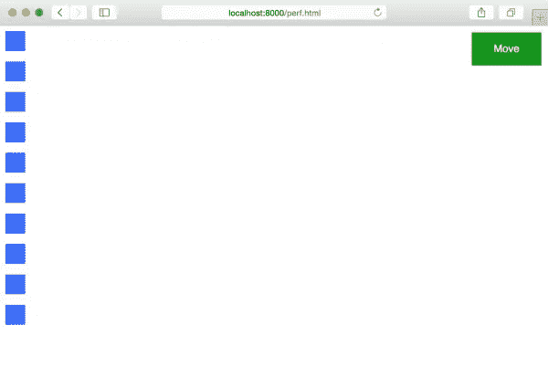
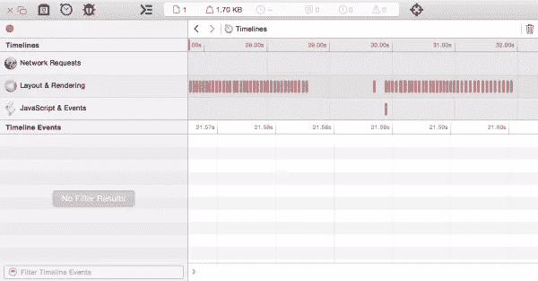
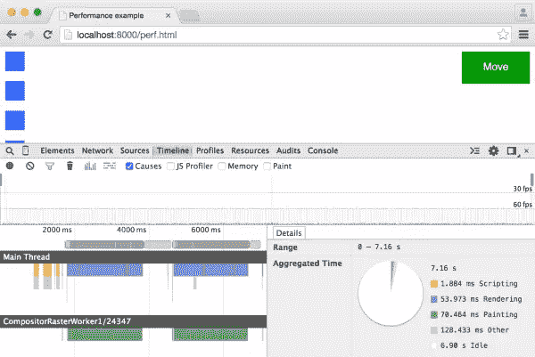
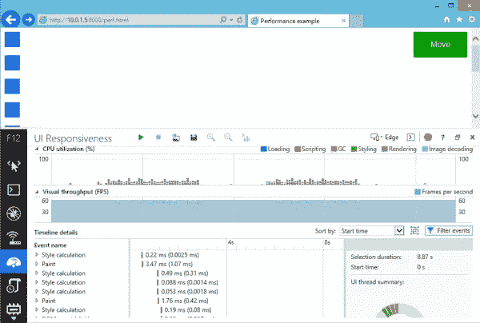
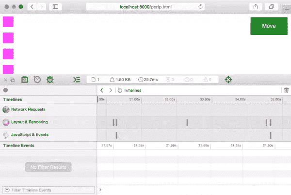
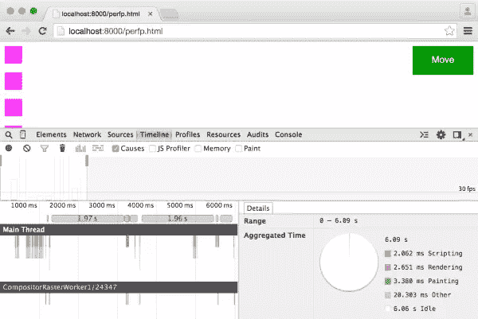
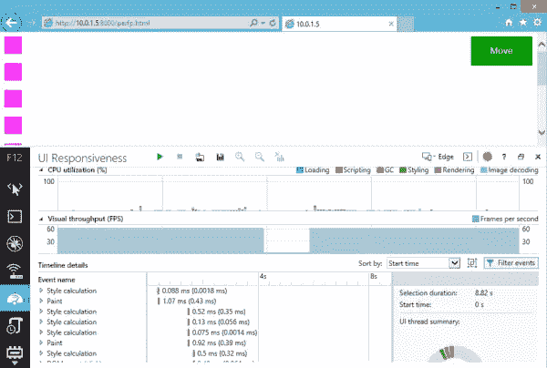
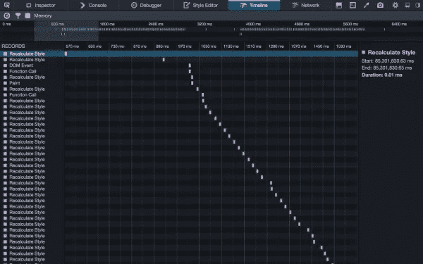

# 为用户界面响应调试 CSS

> 原文：<https://www.sitepoint.com/debugging-css-for-ui-responsiveness/>

下面是我们的书《CSS 大师》的摘录，作者是蒂芙尼·布朗。世界各地的商店都有出售，或者你可以在这里买到电子书。

触发回流的 CSS 属性和值特别昂贵。它们会降低用户界面的响应速度——页面渲染、动画流畅度和滚动性能——尤其是在手机和智能电视等低功耗设备上。

### 什么是回流？{.标题}

**重排**是任何改变部分或全部页面布局的操作。示例包括更改元素的尺寸或更新其左侧位置。这是因为它们迫使浏览器重新计算文档中其他元素的高度、宽度和位置。

**重绘**类似于重排版，它们迫使浏览器重新呈现文档的一部分。在`:hover`中改变按钮的颜色。literal}状态是重画的一个例子。它们比回流少一点麻烦，因为它们不影响节点的尺寸和位置；然而，重画仍然应该保持在最低限度。

回流和重画通常由 DOM 操作触发；例如，添加或删除元素。但它们也可能是由影响元素的尺寸、可见性或位置的属性更改引起的。无论变化是由 JavaScript 还是基于 CSS 的动画引起的，都是如此。

### 注意:页面加载。标题}

当浏览器解析初始 HTML、CSS 和 JavaScript 时，页面加载总是会触发回流和重绘。

从一个项目中完全消除重画和重排版是很困难的。但是，我们可以使用时间轴工具来识别它们并减少它们的影响。

### 时间线工具。标题}

**时间轴工具**刚开始有点糊里糊涂。它们测量前端的性能，捕捉完成各种任务所需的时间。通过记录与页面交互时的活动，我们可以发现 CSS 中的哪些行可能会导致性能瓶颈。

要使用时间线，请单击开发人员工具界面中的“时间线”选项卡。在 Chrome、Opera 和 Firefox 中，它被恰当地命名为 Timeline。Safari 是复数，所以是时间线。Internet Explorer 11 使用更具描述性的 UI 响应。[<sup>【9】</sup>](#ftn.d5e2342)

在任何浏览器中，按下录制按钮开始录制过程。与页面中有问题的部分进行互动，完成后，单击相应的按钮停止录制。

根据您使用的浏览器，您可能会立即或在停止录制后看到数据。Safari 和 Firefox 会实时显示数据，而 Chrome、Opera 和 Internet Explorer 会在您停止录制后呈现性能图表。

每个浏览器中都记录了文档加载、函数调用、DOM 事件、样式重新计算和绘制操作，这让我们对性能瓶颈有了一个大致的了解。至少就 CSS 性能而言，我们所寻求的是两个相关的方面:

*   大量的样式重新计算和绘制操作

*   耗时较长的操作，如时间线
    中较大的方框所示

为了看这在实践中是什么样子，我们将比较两个基本文档，例子 A 和例子 b。literal}元素从 x 位置 0 到 x 位置 1，000。两个例子都使用 CSS 过渡。然而，在示例 A 中，我们将制作`left`的动画。literal}属性。在例子 B 中，我们将使用一个平移变换并制作`transform`的动画。literal}属性。

我们对两者的标记是相同的(结果如图 3.16 所示):

```
<!DOCTYPE html> 
  <html lang="en-US"> 
  <head> 
    <meta charset="utf-8"> 
    <title>Performance example</title> 
    <style type="text/css"
     > /* CSS will go here. */ </style> 
 </head> 
 <body> 
  <button type="button" id="move">Move</button> 
<div></div> 
<div></div> 
<div></div> 
<div></div> 
<div></div> 
<div></div> 
<div></div> 
<div></div> 
<div></div> 
<div></div> 

<script type="text/javascript" src="toggle-move-class.js"> ↵</script> 
</body> 
</html>
```



图 3.16。Safari 中 div 元素的 HTML 演示页面

我们为这两个文档编写的 JavaScript 也是一样的。单击移动按钮切换`moved` {。literal}类在每个`div` {。literal}元素:

```
var move = document.getElementsById('move');
move.addEventListener('click', function(e) {
    var objs = document.body.querySelectorAll('div');
    Array.prototype.map.call(objs, function(o){
        o.classList.toggle('moved');
    });
});
```

我们的 CSS 是事情分歧的地方。示例 A 中使用的 CSS 如下:

```
div {
  background: #36f;
  margin-bottom: 1em;
  width: 30px;
  height: 30px;
  position: relative;
  left: 0;
 transition: left 2s ease-in;
}

.moved {
    left: 1000px;
}
```

当被触发时，这个动画将在我们的时间线中生成大量的样式计算和重画指示器。下图显示了 Safari(图 3.17)、Chrome(图 3.18)、Internet Explorer(图 3.19)和 Firefox(图 3.20)中此过渡的时间线输出



图 3.17。左位置转场的 Safari 时间线输出



图 3.18。Chrome 也是如此



图 3.19。左侧位置转换的 Internet Explorer 11 时间线输出


图 3.20。以及它在 Firefox 中的外观

样式计算和重画的原因与我们正在转换的属性有关:`left` {。文字}。`left` {。literal}属性在发生更改时触发重排，即使该更改是由动画或过渡引起的。

现在，让我们来看看示例 B 的 CSS:

```
div {
  background: #f3f;
  margin-bottom: 1em;
  width: 30px;
  height: 30px;
  position: relative;
  left: 0;
  transition: transform 2s ease-in;
  transform: translateX(0);

}

.moved {
    transform: translateX(1000px);
}
```

这里我们使用了一个转换和过渡。literal}和`translateX(1000px)` {。文字}。

在大多数浏览器中，转换不会触发重绘，我们的时间线包含的重绘操作会少得多。这在 Safar(图 3.21)、Chrome(图 3.22)和 Internet Explorer(图 3.23)中都很明显。Firefox 在这里是个例外；比较图 3.20 和图 3.24。`left`过渡和翻译转换的时间线非常相似。



图 3.21。-webkit-transform 属性转换的 Safari 时间轴输出



图 3.22。Chrome 也是如此，这次使用了 transform 属性



图 3.23。它在 Internet Explorer 11 中的外观



图 3.24。转换属性转换的 Firefox 时间轴输出

### 识别要删除的行。标题}

不幸的是，对于哪些属性会导致回流和重画，并没有一个明确的列表。保罗·刘易斯的 [CSS 触发器最接近，](http://csstriggers.com/)但它是 Chrome 特有的。然而，对于这些属性中的许多属性，浏览器的行为确实是相似的，所以这个资源至少会让您了解哪些属性可能会带来麻烦。

一旦你知道哪些属性*可能*有问题，下一步就是测试假设。禁用该属性――要么用注释，要么添加一个临时的`x-` {。literal}前缀――并重新运行时间线测试。

请记住，性能是相对的，而不是绝对的或完美的。目标是改进:让它比以前表现得更好。如果一个属性或效果的执行速度慢得令人无法接受，那就将其完全删除。

## 分享这篇文章