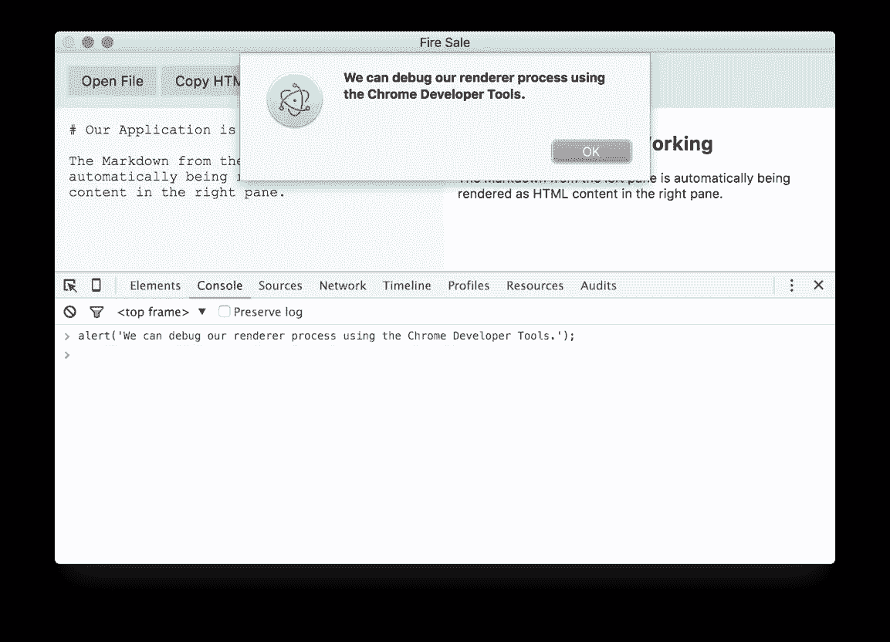
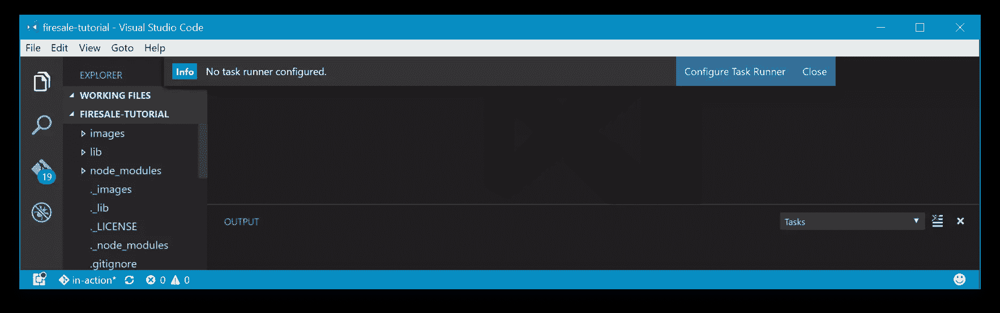
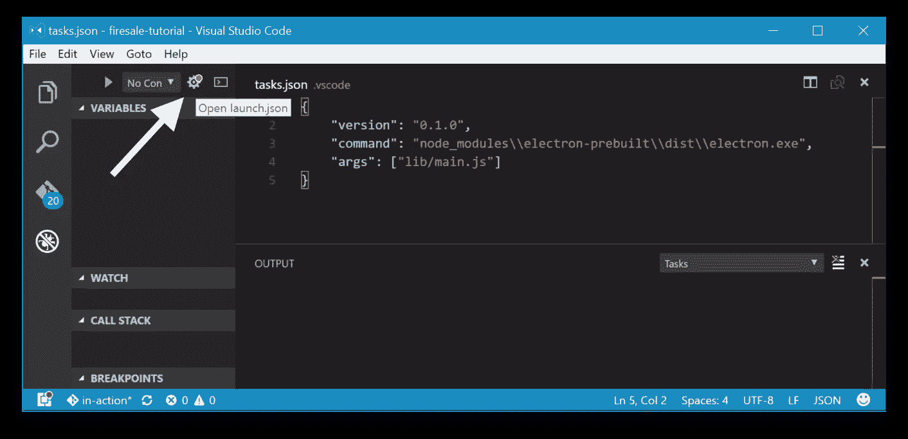
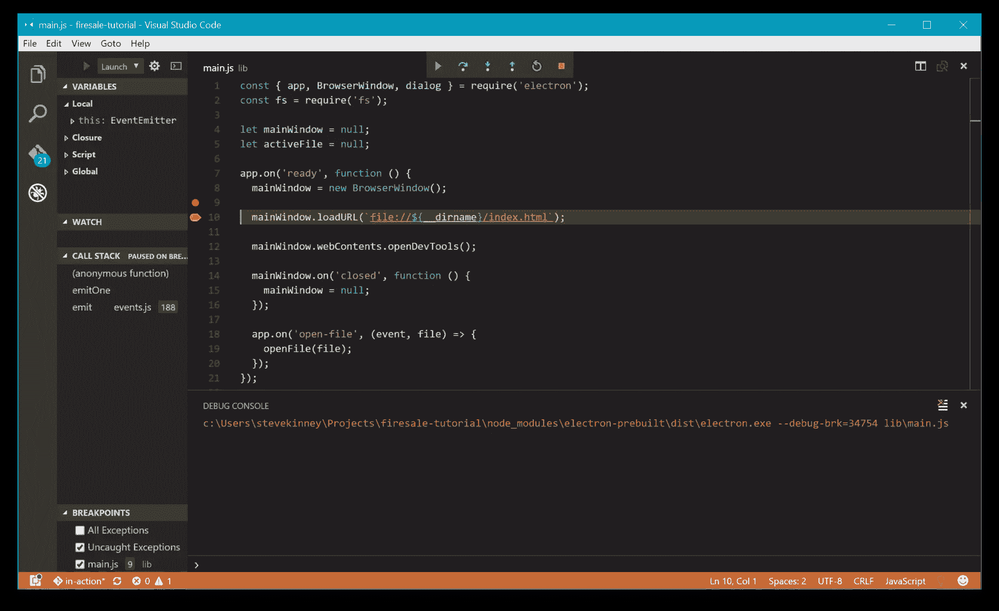

# 调试电子应用程序的技巧和诀窍

> 原文：<https://www.sitepoint.com/debugging-electron-application/>

**调试电子应用程序的提示和技巧摘自 [Electron in Action](https://goo.gl/qOwV3e) ，这是一个构建在 Windows、macOS 和 Linux 上运行的桌面应用程序的分步指南。**

如果您想遵循本文中演示的技术，您可以使用[电子快速启动演示](https://github.com/electron/electron-quick-start)来创建一个最小的电子应用程序:

```
git clone https://github.com/electron/electron-quick-start
cd electron-quick-start
npm install
npm start 
```

如果你想重温一下 Electron，那么看看我们的教程:[用 Electron 创建跨平台的桌面节点应用](https://www.sitepoint.com/desktop-node-apps-with-electron/)。

* * *

想象你有一个新的闪亮的电子应用程序。对你来说一切都很顺利，但可能用不了多久你就需要调试一些棘手的情况了。由于电子应用程序是基于 Chrome 的，所以我们在构建电子应用程序时使用 Chrome 开发工具也就不足为奇了。

## 调试渲染器进程



图 Chrome 开发者工具在渲染过程中是可用的，就像在基于浏览器的应用程序中一样。

调试渲染器过程相对简单。Electron 的默认应用程序菜单提供了在我们的应用程序中打开 Chrome 开发者工具的命令。你可以[创建你自己的定制菜单](https://www.christianengvall.se/electron-menu/)，如果你不想让你的用户知道，你可以取消这个功能。


*图 2:图 2 工具可以在电子提供的默认菜单中切换打开和关闭。*

可以通过另外两种方式访问开发人员工具。在任何时候，你都可以在 macOS 上按`Cmd` + `Opt` + `I`或者在 Windows 或 Linux 上按`Ctrl` + `Shift` + `I`。此外，您还可以通过编程方式触发开发人员工具。

`BrowserWindow`实例上的`webContents`属性有一个名为 [openDevTools()](https://github.com/electron/electron/blob/master/docs/api/web-contents.md#contentsopendevtoolsoptions) 的方法。正如你所料，这个方法在被调用的`BrowserWindow`中打开了开发者工具。

```
app.on('ready', () => {
  mainWindow = new BrowserWindow();

  mainWindow.loadURL(`file://${__dirname}/index.html`);

  mainWindow.webContents.openDevTools();

  mainWindow.on('closed', () => {
    mainWindow = null;
  });
}); 
```

一旦主窗口加载完毕，我们可以通过编程触发主窗口上开发工具的打开。

## 调试主流程

调试主进程并不容易。 [Node Inspector](https://github.com/node-inspector/node-inspector) ，一个调试 Node.js 应用程序的常用工具，并不完全被 Electron 支持。您可以使用`--debug`标志在调试模式下启动您的电子应用程序，默认情况下，这将在端口 5858 上启用远程调试。

在[官方文档](http://electron.atom.io/docs/tutorial/debugging-main-process/)中提供了对使用电子节点检查器的有限支持。由于这仍在不断变化，如果您没有使用 Visual Studio 代码，应该查看最新版本的文档。请注意:您的里程可能会有所不同！

## 用 Visual Studio 代码调试主进程

Visual Studio Code 是一个免费的开源 IDE，可用于 Windows、Linux 和 macOS，并且——巧合的是——由微软构建在 Electron 之上。Visual Studio 代码附带了一组丰富的调试节点应用程序的工具，这使得调试电子应用程序更加容易。设置生成任务的一种快速方法是让 Visual Studio 代码在没有生成任务的情况下生成应用程序。在 Windows 上按`Ctrl` + `Shift` + `B`或者在 macOS 上按`Command` + `Shift` + `B`，会提示您创建一个构建任务，如图 3 所示。



*图 3 在没有构建任务的情况下触发构建任务将提示 Visual Studio 代码为您创建一个。*

> 或者你可以按下`Ctrl` + `Shift` + `P`打开*命令面板*并输入“任务”。然后选择*选择任务:配置任务运行器*，会在`.vscode`文件夹下创建一个`tasks.json`文件并打开。

在每个平台上，设置构建和调试任务是相似的，一个重要的区别是 electronic-pre build 如何为每个操作系统命名预构建的二进制文件。在 Windows 上，二进制文件被命名为`electron.exe`，在 macOS 上，二进制文件被命名为`Electron.app`，而在 Linux 上，它只是`electron`。

*在 Visual Studio 代码中设置构建任务(`tasks.json` )*

```
{
  "version": "0.1.0",
  "command": "node_modules/electron-prebuilt/dist/<name-of-binary>",
  "args": ["lib/main.js"]
} 
```

> 确保用适合您系统的名称替换`<name-of-binary>`。

现在，当你在 Windows/Linux 上按下`Ctrl` + `Shift` + `B`或者在 macOS 上按下`Cmd` + `Shift` + `B`时，你的电子应用就会启动。这不仅对于在 Visual Studio 代码中设置调试非常重要，而且也是启动应用程序的一种便捷方式。下一步是设置 Visual Studio 代码，以便能够启动应用程序并连接到其内置调试器。

## 连接到调试器



*图 4:在调试器窗格中，单击齿轮，Visual Studio 代码将为您创建一个启动调试器的配置文件。*

要创建启动任务，请转到左侧面板中的*调试器*选项卡，并单击小齿轮(图 4)。Visual Studio 代码将询问您想要创建哪种类型的配置文件。选择 *Node.js* 并用下面的示例配置替换文件的内容。

```
{
  "version": "0.1.0",
  "configurations": [{
    "name": "Launch main.js",
    "type": "node",
    "program": "${workspaceRoot}/lib/main.js",
    "stopOnEntry": false,
    "args": [],
    "cwd": "${workspaceRoot}",
    "runtimeExecutable": "${workspaceRoot}/node_modules/electron-prebuilt/dist/<name-of-binary>",
    "runtimeArgs": [],
    "env": { },
    "sourceMaps": false,
    "outDir": null
  }]
} 
```

> 确保用适合您系统的名称替换`<name-of-binary>`。

你可以[在这里](https://code.visualstudio.com/docs/editor/debugging#_launch-configurations)阅读更多关于发布配置的信息。

有了这两个配置文件，您可以单击主流程中任何一行的左边距来[设置一个断点](https://code.visualstudio.com/docs/nodejs/nodejs-tutorial#_debugging-hello-world)，然后按`F5`来运行应用程序。执行将在断点处暂停，允许您检查调用堆栈，查看哪些变量在范围内，并与活动控制台进行交互。断点并不是调试代码的唯一方法。您还可以监视特定的表达式，或者在抛出未捕获的异常时进入调试器。



图 5:内置在 Visual Studio 代码中的调试器允许你暂停应用程序的执行，并调查错误。

## 结论

现在你对调试电子应用程序有了更多的了解，去下载免费的《电子在行动中》第一章吧，看看这个幻灯片演示，了解书中更多的细节。

## 分享这篇文章