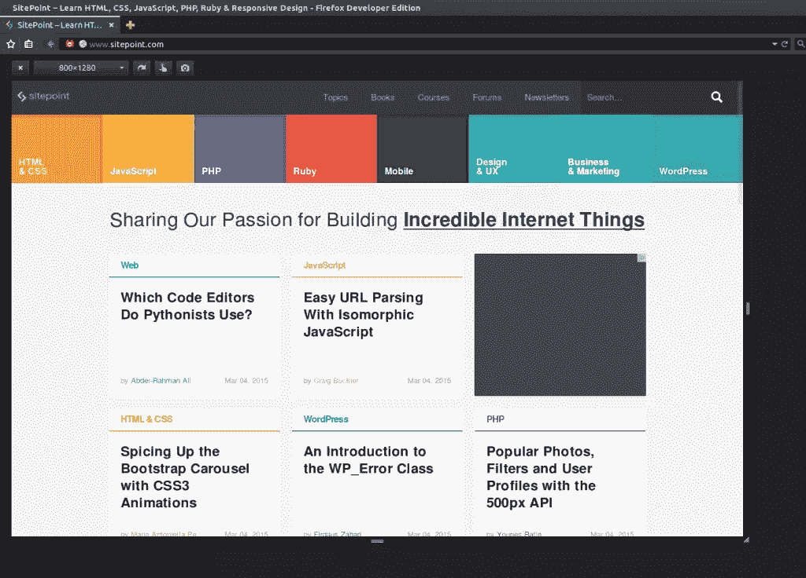
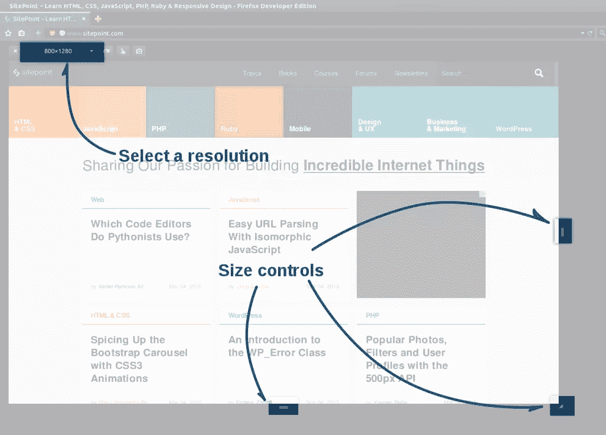
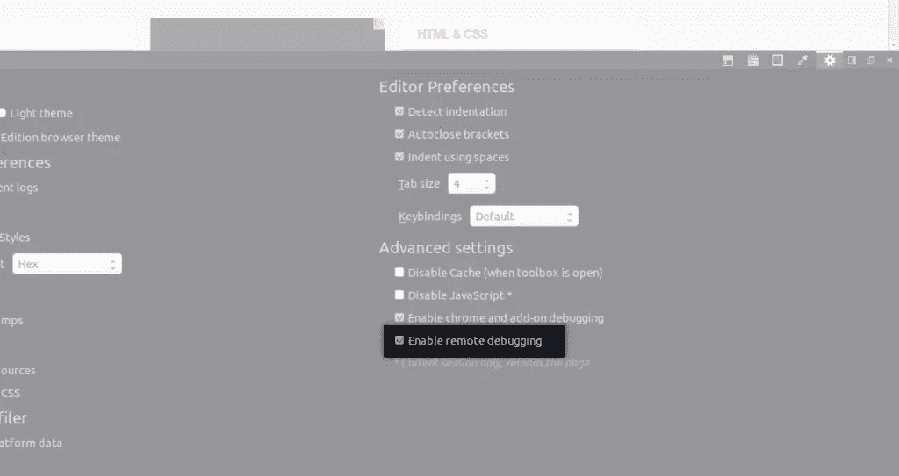
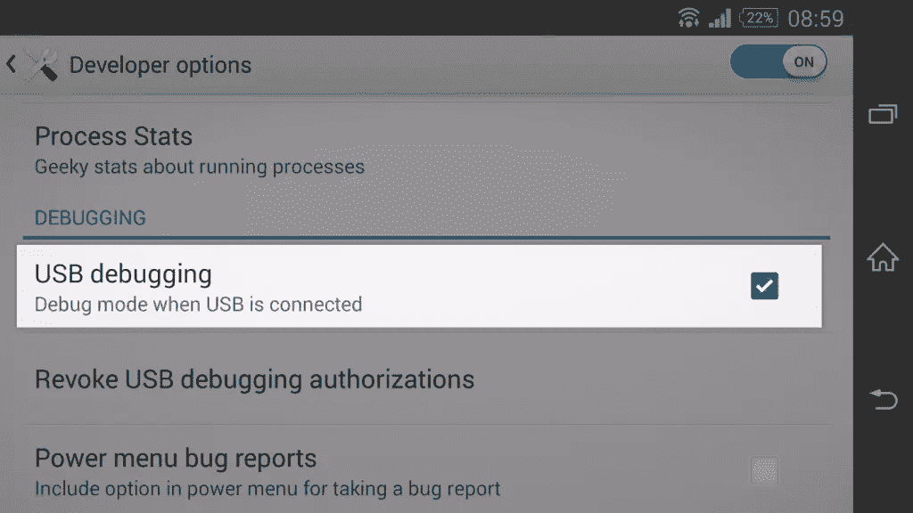
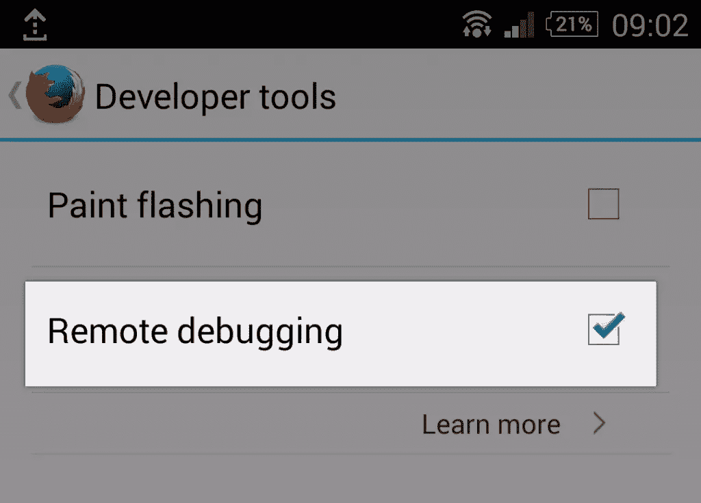
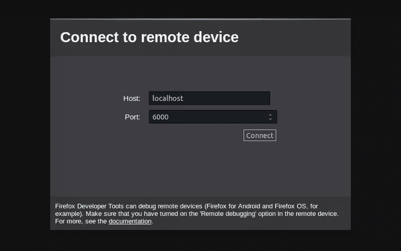
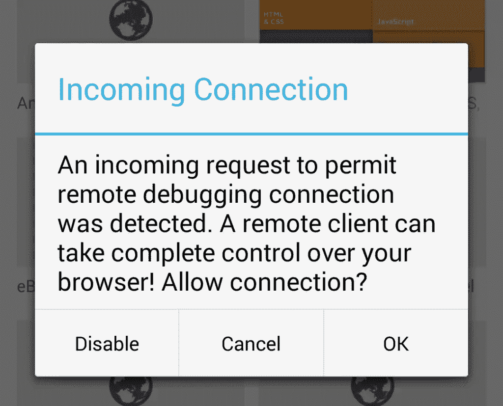

# 用 Firefox 调试移动网站

> 原文：<https://www.sitepoint.com/debugging-mobile-websites-firefox/>

所有主流浏览器现在都提供工具来帮助在移动设备上测试和调试网站。在本文中，我将特别关注 Firefox 的产品，然后将它们与 Chrome 和 Internet Explorer 进行比较。

## 使用 Firefox 响应模式进行测试

响应式网页设计是一个让网站移动友好的好方法，允许我们根据屏幕大小调整布局。

测试响应式设计的最简单方法通常是调整浏览器窗口的大小。然而，它并不总是实用或精确的。这就是火狐的*响应模式*试图帮助的地方。

从 Firefox 15 开始，响应式模式，也称为响应式设计视图，是一种专门为测试网站的移动版本而构建的模式。

你可以从 Firefox 主菜单的 *Web Developer 子菜单*中的*响应式设计视图*条目中激活响应式模式(或者在某些操作系统上的*工具*菜单)。也可以使用开发者工具栏上的按钮或者键盘快捷键`Ctrl + Shift + M`(或者 Mac OS 上的`Cmd + Opt + M`)。通过使用相同的菜单、按钮或键盘快捷键，或者通过关闭响应界面来停用该模式。



### 调整视图大小

通过激活响应式设计视图，Firefox 将调整视图大小，但不会调整窗口大小。与调整窗口大小一样，您可以用鼠标使用视图右侧和底部以及右下角的控件来调整视图大小。

这些控件有助于了解设计如何以及何时适应其布局。您也可以使用视图顶部的预设列表。



此列表包含几种经典分辨率，如 320×480 像素或 768×1024 像素。如果您找不到想要的内容，您可以通过编辑当前选择的大小(在下拉列表中键入)来定义自己的分辨率。这将把新的分辨率保存到预设下拉菜单中。

最后，您可以通过点击列表右侧的旋转按钮来模拟方向变化。

### 触摸事件

响应式设计视图中最右边的按钮允许您截取当前视图的屏幕截图，旁边是“模拟触摸事件”按钮。

使用此按钮，您可以将鼠标事件转换为触摸事件。这样，如果你用鼠标点击视图，Firefox 不会发送鼠标点击事件，而是一个触摸事件。如果您的网站或应用程序需要触摸事件，这种翻译会很有用。

## 使用远程调试来调试代码

响应式设计视图很有用，但它不能取代真正的智能手机(或平板电脑)。如果你的移动设备运行 Android，那么 Firefox 可以提供另一个很棒的工具，远程调试。

远程调试允许您访问开发人员的工具箱，但适用于移动网站。

要使用远程调试，你需要安装 Android 版的 Firefox。您需要一根 USB 电缆将移动设备连接到计算机。注意，和响应式一样，远程调试出现在 Firefox 15 中。

### 准备计算机

Firefox 使用 ADB 来创建计算机和移动设备之间的连接，因此，首先，我们需要安装 ADB。根据你使用的系统，有几种安装 ADB 的方法，比如 Ubuntu 提供了`adb`包，可以像其他包一样安装。

安装 ADB 的最佳方式是下载 Android SDK。你可以在 Android 开发者网站上找到 SDK，它适用于 Windows、OS X 和 Linux。你不需要 Android Studio，所以你可以直接下载 SDK 工具。

接下来，我们需要在 Firefox 上启用远程调试。

打开工具箱和*设置*面板。在这个面板中，您会发现一个标记为“*启用远程调试*”的复选框。如果需要，激活此复选框并重启 Firefox。



### 准备移动设备

在 Android 设备上，我们需要启用 USB 调试。否则，计算机和移动设备将无法通信。

若要启用 USB 调试，请打开移动设备的设置。您可以在这些设置的“*开发者选项*部分找到相应的复选框。如果您没有访问这些设置的权限，您可以在移动设备的设置中点击几次“*关于手机*”部分的“*内部版本号*”条目来获得访问权限。



和你的电脑一样，你需要在 Firefox for Android 中激活远程调试。如果您使用 Firefox 25 或更高版本，请在“设置”菜单的“*开发者工具*”部分选中“*远程调试*”框。

如果你用的是火狐 24 或者更早的版本，不想更新，在地址栏输入“about:config”。在该特殊页面上，搜索`devtools.debugger.remote-enabled`偏好设置，如有必要，点击“*切换*按钮将其设置为`true`。



### 创建连接

现在，我们准备在计算机和移动设备之间创建连接。请注意，您不必在每次想要使用远程调试时都遵循上述所有步骤。除非禁用它，否则每次创建连接时，您只需遵循以下步骤。

#### 启动服务器

首先用 USB 线连接您的移动设备。如果 ADB 服务器尚未运行，请使用以下命令打开命令提示符并启动它。

`adb start-server`

您将确保您的设备被 ADB 检测到。为此，请键入以下命令。

`adb devices`

您应该会看到已连接设备的列表，如下所示。

```
List of devices attached
BH90TFM516  device
```

如果您在设备旁边看到与“*设备*”不同的消息(例如“*无权限*”或“*离线*”)，请通过键入`adb kill-server`关闭 ADB 服务器，并以管理员身份重启。

#### 创建连接

我们现在将转发一个套接字连接。键入的命令取决于您使用的 Android 版 Firefox。

如果您使用 Android 35 或更高版本的稳定版 Firefox，请键入:

`adb forward tcp:6000 localfilesystem:/data/data/org.mozilla.firefox/firefox-debugger-socket`

如果你使用测试版，必须将`org.mozilla.firefox`改为`org.mozilla.firefox_beta`，如果你使用 Aurora，必须改为`org.mozilla.fennec_aurora`，如果你使用 Nightly，必须改为`org.mozilla.fennec`。

最后，如果您使用 Android 34 或更早版本的 Firefox，请键入:

`adb forward tcp:6000 tcp:6000`

#### 连接 Firefox

现在，您已经准备好将 Firefox 的开发人员工具连接到 Firefox for Android。为此，打开 Firefox 的菜单，在“ *Web Developer* ”子菜单中选择“*连接…* ”条目。

这将打开一个包含预填表单的新选项卡。默认值应该没问题，所以点击“ *Connect* 按钮提交表单。



现在，看看你的移动设备。您应该会看到一个消息提示，询问您是否允许连接。点击 *OK* 按钮，查看你的电脑。



您将能够选择要调试的选项卡。点击你想要的，你就可以调试它了。

#### 做你想做的！

选择一个选项卡将打开一个新窗口，其中包含一个新的工具箱，专用于在 Firefox for Android 上打开的选项卡。除了这个工具箱的目标不在你的电脑上，工具都是一样的。

这意味着您可以使用这个工具箱做任何您想做的事情，从查看和编辑 DOM 树到调试脚本和修改样式。例如，您可以在控制台中测试您与传统`alert('Hello World!');`的连接。

## 其他浏览器呢？

我是用 Firefox 开发的，所以我选择在本文中展示它的工具。然而，Firefox 并不是唯一提供这些工具的浏览器。

就像在电脑上一样，不同的浏览器在移动设备上给出不同的结果和不同的 bug。火狐的工具很棒，但是只兼容火狐和安卓版火狐。

### 铬

谷歌 Chrome 有自己的响应模式，可以通过开发者工具访问。与 Firefox 一样，您可以设置特定的分辨率，但没有分辨率列表。在这里，你可以选择一个特定的设备(如谷歌 Nexus 5 或苹果 iPhone 6)。您还可以定义一个用户代理或模拟一种网络，以测试您的网站是否需要很长时间才能在移动网络上加载。

Chrome 为 Android 远程调试 Chrome 提供了可能性。这个工具类似于 Firefox，因为它提供了你喜欢的工具箱，但是是在移动网站上。我们在 Chrome 上启用和使用远程调试的方式类似于我们在 Firefox 上使用的方式。你可以在 [Chrome 的官网](https://developer.chrome.com/devtools/docs/remote-debugging)上找到要遵循的确切步骤。

### 微软公司出品的 web 浏览器

Internet Explorer 有自己的开发工具，其中一些专用于移动世界。有了这些工具，如果在移动设备上加载网站很慢，你就能发现问题所在。和 Firefox 一样，你可以模拟另一种分辨率，和 Chrome 一样，你可以模拟另一个网络。此外，Internet Explorer 允许您模拟特定的地理位置。

微软的浏览器没有类似远程调试的工具，但它与 [weinre](http://blogs.msdn.com/b/interoperability/archive/2013/05/31/now-on-ie-and-firefox-debug-your-mobile-html5-page-remotely-with-weinre-web-inspector-remote.aspx) 兼容。

在 Web 浏览器中使用远程调试功能时，您有哪些经验和技巧？

## 分享这篇文章