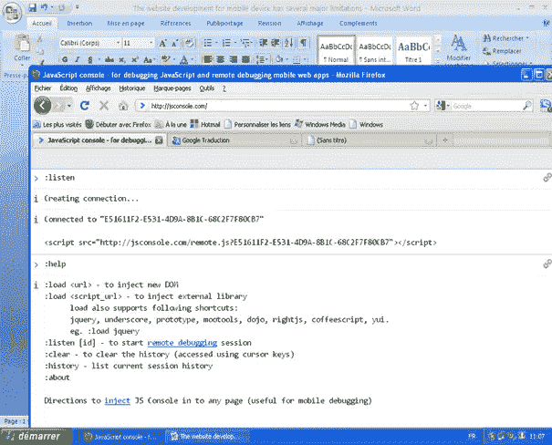

# 使用 jsconsole 调试移动设备

> 原文：<https://www.sitepoint.com/debugging-mobile-with-jsconsole/>

移动设备的 Web 开发有几个主要的限制。

有强烈分歧的屏幕分辨率(从 iPad 到第一代黑莓)，多种浏览器(webkit 但也有 IEMobile，Firefox，Opera mini 和 Mobile 等。)和多个操作系统(Windows Phone、Android、iOS、Palm、Blackberry)。每个设备都有自己的限制和性能。

当要调试这一切时，任务并不容易，因为只有很少的工具允许这样做，而且因为屏幕的大小，即使这样我们也没有脱离险境。

Opera 的蜻蜓已经为远程调试提供了本地解决方案，但是这种技术非常有限，尤其是当你必须考虑其他移动设备/浏览器的时候。一些手机制造商也提供模拟器，但它们无法与提供“感觉和触摸”的真实设备的使用相比较——特别是在 web 客户端编程方面，尤其是 JavaScript。

jsconsole 就是为了帮助我们完成这项危险的任务而创建的。

## 一个移动 JavaScript 控制台

去下面的地址:[http://jsconsole.com](http://jsconsole.com)。

Jsconsole 将允许您通过位于桌面上的控制台远程调试 JavaScript 应用程序，该控制台将用于直接在手机上调试。打个比方，就好像你正在远程使用 Firebug JS 控制台。

一方面，该工具将从您的手机中检索对 console.log 的每个调用，并将它显示在您的桌面上。

另一方面，jsconsole 将允许您将 JavaScript 代码直接注入到页面中。

要明白，这个工具通常只在开发阶段或调试阶段使用，应该在你的网站开始生产之前移除。

## 初始化 js 控制台

第一步是在您的站点和 jsconsole 之间创建链接。为此，请在控制台中输入第一个命令:

`:listen`

这个命令将返回一个标识符和一个标签

现在，您只需将这一行添加到 HTML 代码中的所需位置(例如，在头部)。

如果您经常使用这个工具来避免为每个测试改变标签

`:listen FAE031CD-74A0-46D3-AE36-757BAB262BEA`

同样，您也可以指定想要使用的标识符。例如:

`:listen party`

伴随着这个

`<script src="http://jsconsole.com/remote.js?party"> </ script>`

一旦将此代码插入到您的站点中，您就可以在网页中用一行代码来测试连接，例如:

`<script type="text/javascript">
console.log ("Connection");
</ script>` 
然后用手机登录你的站点，确保你已经收到了桌面控制台的通知。

## 从 jsconsole 发送指令

一旦正确建立了连接，您就可以在手机上发送任何一行 JavaScript 代码。要做到这一点，您只需在控制台中直接键入要运行的代码行。
例如:

`document.innerHTML = "Hello World !";`

您也可以使用您的常规库，例如在您的站点上安装了 jQuery，您可以发送这段代码:

`$ ("# myElement") fadeOut ();`

## 结论

这是一个工具的概述，当我们为移动设备编程时，尤其是当我们使用与它们相关联的函数时，这个工具是非常必要的。Jsconsole 还有其他一些不太重要的有趣特性。为此，我邀请您阅读 jsconsole 站点的文档。

## 分享这篇文章