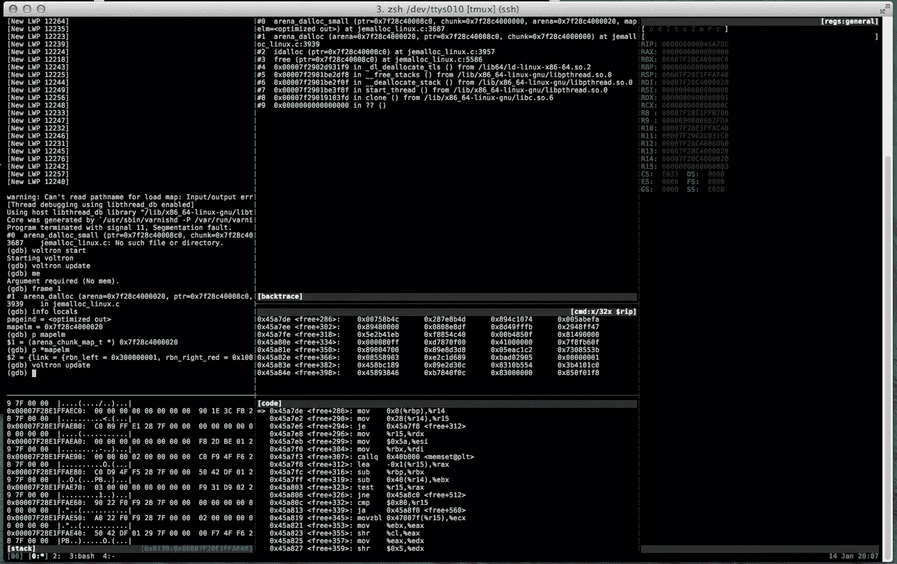

# 调试清漆

> 原文：<https://www.sitepoint.com/debugging-varnish/>

*本文最初发表于 [99designs 科技博客](http://99designs.com/tech-blog/)*

在 [99designs](http://99designs.com.au/) 中，我们大量(ab)使用 Varnish 来使我们的应用程序超快，但也可以在不调用我们对比强烈的 PHP 堆栈的情况下完成常见的简单任务。因此，我们的 Varnish 配置相当复杂，包含超过 1000 行的 [VCL](https://www.varnish-cache.org/docs/3.0/tutorial/vcl.html) ，以及大量的嵌入式 c 语言

当我们开始看到常规的 segfaults 时，很有把握地认为我们中的一个人在编写 C 代码时犯了错误。那么，如何在像 Varnish 这样的系统中找到一个短暂的 segfault 呢？加入我们的兔子洞…

## 获取核心转储

第一步是修改您的生产环境，为您提供有用的核心转储。这里有几个步骤:

1.  首先，通过设置几个 sysctls 来配置内核以提供核心转储:

    ```
    echo 1 > /proc/sys/kernel/core_uses_pid
    echo 2 > /proc/sys/fs/suid_dumpable
    mkdir /mnt/cores
    chmod 777 /mnt/cores
    echo  /mnt/cores/core > /proc/sys/kernel/core_pattern

    ```

    按顺序，这:

    *   告诉内核将 pid 附加到内核文件中，以便于将内核与日志结合起来
    *   告诉内核 [suid 二进制文件](http://en.wikipedia.org/wiki/Setuid)被允许转储内核
    *   在 AWS 的临时存储器上创建一个存储核心的地方(如果你和我们一样在 EC2 上)
    *   告诉内核在那里写核心文件
2.  完成后，没有已知的方法来触发错误，玩等待游戏。

3.  当清漆爆炸时，就是表演时间。将核心文件以及 varnish 通过编译 VCL(位于`/var/lib/varnish/$HOSTNAME`)发出的共享对象复制到一个开发实例中，并开始调试。

## 找到坠机点

如果您可以从 LLVM 项目中获得优秀的 LLDB ,请使用它。在我们的例子中，让它在 Ubuntu 12.04 上工作需要升级一半的系统，导致环境与生产环境太不一样。

如果你花很多时间在调试器上，你可能会想使用一个像 [fG 这样的助手！s gdbinit](https://github.com/gdbinit/Gdbinit) 或 [voltron](https://github.com/snarez/voltron) 让你的生活更轻松。我用 voltron，但是因为 gdb 的 API 有些笨拙，马上就碰到了[的一些](https://github.com/snarez/voltron/pull/44)[bug](https://github.com/snarez/voltron/pull/45)。

最后，调试环境工作正常，是时候深入了解崩溃了。您的情况将与我们的情况不同，但我们最近是这样调试这样一个问题的:



使用 voltron 调试核心转储

*用 voltron 调试核心转储*

在`code`窗格中可以看到，出错指令是`mov 0x0(%rbp),%r14`，试图将`RBP`指向的值加载到`r14`中。在注册视图中，我们看到`RBP`为空。

检查源代码，我们看到出错的例程是内联的，编译器劫持了 RBP(当前堆栈帧的基指针)作为内联例程的参数存储


有问题的汇编代码

*违规汇编代码*

特别感兴趣的是这一部分:

```
 0x000000000045a7c9  <+265>: mov 0x223300(%rip),%rbp # 0x67dad0 <pagesize_mask>  0x000000000045a7d0  <+272>:  not  %rbp 0x000000000045a7d3  <+275>:  and  0x10(%r14),%rbp 0x000000000045a7d7  <+279>: cmpb   $0x0,0x223303(%rip)  # 0x67dae1 <opt_junk>  =>  0x000000000045a7de  <+286>: mov 0x0(%rbp),%r14 0x000000000045a7e2  <+290>: mov 0x28(%r14),%r15
```

用简单的英语说:

*   将`rip`相对地址加载到`rbp` (pagesize_mask)中
*   反转`rbp`位
*   对由`r14`、(`mapelm->bits`)指向的结构中的 16 个字节执行按位 and 运算
*   无意义地检查 pagesize_mask 是否为`NULL`
*   试图将`rbp`指向的地址加载到`r14`中，这将出错。

其由以下物质发出:

```
static inline void
arena_dalloc_small(arena_t *arena, arena_chunk_t *chunk, void *ptr,
    arena_chunk_map_t *mapelm)
{
    arena_run_t *run;
    arena_bin_t *bin;
    size_t size;

    run = (arena_run_t *)(mapelm->bits & ~pagesize_mask);
    assert(run->magic == ARENA_RUN_MAGIC);
    bin = run->bin; // XXX KABOOM
    size = bin->reg_size;
```

我们现在知道这个错误是由一个`bits`成员
被设置为零的`mapelm`结构引起的；但是为什么我们会通过这个有垃圾的坏结构呢？

## 深入挖掘

因为这个函数是内联声明的，所以它实际上被折叠到调用框架中。它实际上出现在回溯中的唯一原因是调用点出现在 DWARF 调试数据中。

我们可以通过从上游装配推断其位置来查看该值，但更容易的是跳到下一个上游框架并检查它:

```
(gdb) frame 1
#1  arena_dalloc (arena=0x7f28c4000020, ptr=0x7f28c40008c0, chunk=0x7f28c4000000) at jemalloc_linux.c:3939
3939    in jemalloc_linux.c
(gdb) info locals
pageind = <optimized out>
mapelm = 0x7f28c4000020
(gdb) p *mapelm
$3 = {link = {rbn_left = 0x300000001, rbn_right_red = 0x100002fda}, bits = 0}
(gdb)
```

因此，这看起来像是[红黑树](http://en.wikipedia.org/wiki/Red_black_tree)中的一个元素，对于`bits`成员有两个邻居和一个空值。让我们仔细检查一下:

```
(gdb) ptype *mapelm
type = struct arena_chunk_map_s {
    struct {
        arena_chunk_map_t *rbn_left;
        arena_chunk_map_t *rbn_right_red;
    } link;
    size_t bits;
}
(gdb) ptype arena_run_t
type = struct arena_run_s {
    arena_bin_t *bin;
    unsigned int regs_minelm;
    unsigned int nfree;
    unsigned int regs_mask[1];
}
(gdb)
```

等等，什么？

回过头来看看我们的方向:

```
run = (arena_run_t *)(mapelm->bits & ~pagesize_mask);
```

代码试图使用 mapelm 结构中的位数生成指向此 arena run 结构的指针，并根据反向 pagesize_mask 定位页面的开始位置。因为 bits 是零，这是第[零页](http://en.wikipedia.org/wiki/Zero_page)的开始；空指针。

这足以让我们看到*它是如何崩溃的，但并没有给我们太多的洞察为什么。我们去挖吧。*

回头看代码片段，我们看到断言 arena_run_t 结构的`magic`成员是正确的，因此知道这一点后，我们可以在内存中寻找其他结构。一个快速 grep 出现了:

```
./lib/libjemalloc/malloc.c:#  define ARENA_RUN_MAGIC 0x384adf93
```

`pagesize_mask`只是页面大小-1，这意味着任何地址与 pagesize_mask 的倒数按位 AND 将给出该页面开始处的地址。

因此，我们可以在内存中的每一个可写页面中搜索正确偏移量处的幻数。

..或者我们可以吗？

```
typedef struct arena_run_s arena_run_t;
struct arena_run_s {
#ifdef MALLOC_DEBUG
    uint32_t    magic;
#  define ARENA_RUN_MAGIC 0x384adf93
#endif

    /* Bin this run is associated with. */
    arena_bin_t *bin;
...
```

结构的幻数和幻成员(方便地定位为每页的前 4 个字节)只有在我们有调试版本时才存在。

## 旁白:我们可以为了利益滥用`LD_PRELOAD`吗？

在这一点上，所有迹象都指向 varnish 的线程池实现中的双重释放，导致一个空桶(`bits` == 0)，或者其内存分配库 jemalloc 中的一个错误。

理论上，通过换入另一个 malloc 库实现，应该很容易排除 jemalloc。我们可以通过使用`LD_PRELOAD`将 tcmalloc 放在它的符号解析路径前面来做到这一点:

我们将补充:

```
export LD_PRELOAD=/usr/lib/libtcmalloc_minimal.so.0
```

到`/etc/varnish/default`和反弹清漆。然后将所有旧的核心文件移开，等待(和基准测试！)

然而，我们的计划有一个缺陷。旧版本的 varnish(请记住，我们是在 Ubuntu 的 LTS 发行版上)厂商的 jemalloc 副本中，并静态链接它，这意味着符号`free`和`malloc`是在编译时解析的，而不是在运行时。这对我们来说意味着不容易预载黑客。

## 重建清漆

简单的解决方法行不通，所以让我们做一个尴尬的:重建清漆！

```
apt-get source varnish
```

拿一份清漆源的拷贝，和 tcmalloc 联系起来。在此之前，我删除了`lib/libjemalloc`,并使用 grep 从代码库中删除了所有对 jemalloc 的引用(这基本上只是对配置脚本和 makefiles 的一些更改)

然后在建之前把`-ltcmalloc_minimal`加到`CFLAGS`上。顺便说一句，tcmalloc 的 ubuntu 包发布了`/usr/lib/libtcmalloc_minimal.so.0`，但没有发布`/usr/lib/libtcmalloc_minimal.so`，这意味着链接器找不到它们。我不得不手动创建一个符号链接。

在生产中使用这种新的 varnish，我们还没有看到同样的崩溃，所以这似乎是 jemalloc 中的一个错误，可能是 libpthread 和 libjemalloc 之间的一个讨厌的交互(崩溃总是发生在线程初始化内部)。

## 自己试试？

但愿不会。但是如果你用自定义扩展做了很多清漆黑客，偶尔的 C 错误是可以预料的。这篇文章向你展示了一个棘手的 Varnish bug，让你了解了调试类似的令人毛骨悚然的 segfaults 的工具和技巧。

如果你在摆弄 voltron，你可能会发现[我的 voltron 配置](https://github.com/richo/dotfiles/blob/master/voltron/config)和[我用来设置我的环境的 tmux 脚本](https://github.com/richo/dotfiles/blob/master/voltron.tmux)是一个有用的起点。

## 分享这篇文章