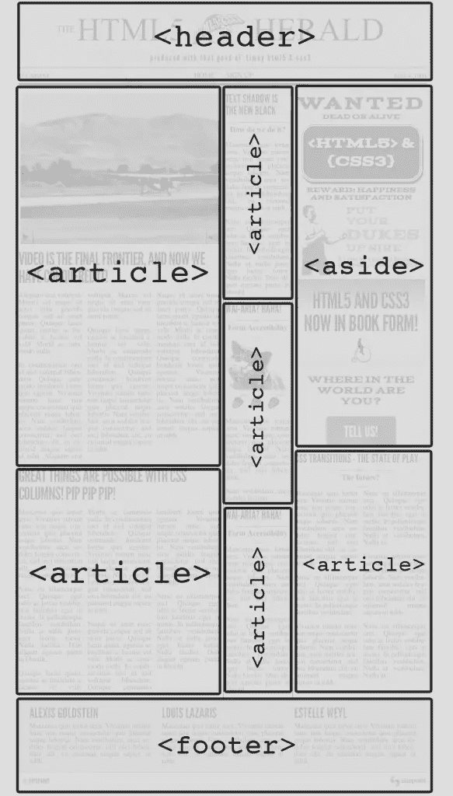

# 定义示例站点的页面结构

> 原文：<https://www.sitepoint.com/defining-sample-sites-page-structure/>


以下是我们的书的摘录，由 Alexis Goldstein、Louis Lazaris 和 Estelle Weyl 撰写的《真实世界的 CSS3，第二版。世界各地的商店都有出售，或者你可以在这里买到电子书。

既然我们已经介绍了页面结构的基础知识和 HTML5 中有助于这一领域的元素，那么是时候开始构建页面中容纳内容的部分了。

让我们从顶部开始，用一个`header`元素。在这里包括*先驱报*的标志和标题以及标语是有意义的。我们还可以为站点导航添加一个`nav`元素。

在`header`之后，我们网站的主要内容分为三个栏目。虽然您可能会尝试使用`section`元素，但是请停下来想想内容。如果每一列都包含一个单独的信息“部分”(比如体育部分和娱乐部分)，那就有意义了。然而，实际上，分成列只是一种视觉上的安排，所以我们将为每一列使用一个普通的老式`div`。

在那些里面，我们有报纸文章；这些当然是`article`元素的完美候选。

然而，最右边的一栏除了一篇文章外，还包含了三个广告。我们将使用一个`aside`元素包装广告，每个广告放在一个`article`元素中。这可能看起来很奇怪，但是回头看看`article`的描述:“一个自包含的组合[……]原则上是可独立分发或可重用的。”一个广告几乎完全符合这个要求，因为它通常会不加修改地在许多网站上转载。

接下来，我们将为出现在广告下方的最终文章添加另一个`article`元素。最后一篇文章将从包含三个广告的`aside`元素中 *排除* 。为了归入`aside`，这个`article`需要与页面的内容有一点点关联。事实并非如此:这篇文章是页面主要内容的一部分，因此将其包含在`aside`中是错误的。

现在第三列由两个元素组成:一个`aside`和一个`article`，一个堆叠在另一个之上。为了有助于将它们结合在一起，并使它们更容易造型，我们将把它们包在一个`div`中。我们没有使用`section`或任何其他语义标记，因为这意味着`article`和`aside`在某种程度上是主题相关的。它们不是——这只是我们设计的一个特点，它们恰好在同一列中。

## 新的`main`元素

此时，可能是引入 HTML5 中已经引入的另一个主要结构元素的好时机:`main`元素。这个元素最初并不是 HTML5 规范的一部分，但自从本书的第一版出版以来，它已经被添加进来了。

不幸的是，定义`main`元素以及如何使用它有点棘手。但是让我们从元素起源的地方开始。在一些 HTML 文档中，开发人员将他们的主要内容包装在一个通用元素中，就像这样:

```
<body> <header> ... </header>
<div id="main"> ... </div>
<footer> ... </footer>
</body>
```

注意这里使用的通用`div`元素是`header`和`footer`元素的兄弟。还要注意值为`"main"`的 ID 属性。除此之外，许多开发者在这个元素中加入了咏叹调`role`:

```
<div id="main" role="main"> ...
</div>
```

我们将在这里避免进入 ARIA 的细节――那在附录 B 中有所涉及――但是基本上，新的`main`元素意味着取代这种实践。

W3C 规范[对`main`的定义如下:](https://www.w3.org/html/wg/drafts/html/master/grouping-content.html#the-main-element)“`main`元素表示文档或应用程序主体的主要内容。主要内容区域由与文档的中心主题或应用程序的中心功能直接相关或扩展的内容组成。”

WHATWG 规范也有类似的定义；然而，除此之外，这两个规范有非常不同的定义。WHATWG 的规范说:

> 对于文档中的`main`元素的数量没有限制。事实上，在很多情况下，拥有多个`main`元素是有意义的。例如，一个包含多个`article`元素的页面可能需要指出每个元素的主要内容

但是一反常态，与此完全矛盾的是，W3C 规范说:

> 作者不得在一个文档中包含一个以上的`main`元素。作者不得将`main`元素作为`article`、`aside`、`footer`、`header`或`nav`元素的后代

此外，W3C 规范增加了在`main`元素上使用`role="main"`属性的建议，直到`main`元素被用户代理完全识别。有了这些知识，我们将采用 W3C 的建议，在我们的页面上只使用一个`main`元素，使用 ARIA 角色作为后备。

回到我们的*先驱报*标记，这是我们在`body`标签中添加了`main`元素后的样子:

```
<body> <header> ... </header> <main role="main">
</main> <footer> ... </footer> <script src="js/scripts.js"></script>
</body>
```

如您所见，`main`元素存在于`header`和`footer`之外。在`main`中，我们将放置我们讨论过的三个栏目，它们构成了*html 5 Herald*的布局和主要内容。

## 继续构建*先驱报*

我们布局的最后一部分是页脚，你可以在*先驱报*的截图中看到它的传统位置——页面底部。因为页脚包含几个不同的内容块，每个内容块形成一个独立的、与主题相关的单元，所以我们将这些内容分割成页脚中的`section`元素。作者信息将形成一个`section`，每个作者坐在自己嵌套的`section`中。然后还有另外一个`section`版权和附加信息。

让我们将新元素添加到页面中，以便我们可以看到文档的位置:

```
<body>
  <header>
    <nav></nav>
  </header>

  <main role="main">
    <div class="primary">
      <article></article>
    </div>

    <div class="secondary">
      <article></article>
    </div>

    <div class="tertiary">
      <aside>
        <article></article>
      </aside>

      <article>
      </article>

    </div>
  </main><!-- main -->

  <footer>
    <section id="authors">
      <section></section>
    </section>
    <section id="copyright">
    </section>
  </footer>

  <script src="js/scripts.js"></script>
</body>
```

下图显示了一个屏幕截图，其中显示了我们的页面，一些标签指示了我们使用的主要结构元素。



我们现在有了一个结构，可以作为我们网站内容的坚实基础。

### 注意:如果我使用了错误的元素怎么办？

虽然有时要记住在什么情况下使用什么元素可能会令人困惑，但我们鼓励您避免强调或花费太多时间在语义决策上。虽然保持一致是件好事，但是使用错误的元素几乎不会有什么后果。如果你的网页是可访问的，这才是最重要的。当然，在某些情况下，正确的语义元素将有利于可访问性，因此我们鼓励您对此进行研究，并确保您选择的元素不会导致您的页面变得不可访问。一个好的起点可能是 [HTML5 Accessibility](http://www.html5accessibility.com/) 或[Accessibility Project。](http://a11yproject.com/)

## 包装东西

本章到此为止。我们已经学习了 HTML5 中内容结构的一些基础知识，并且我们已经开始使用我们所获得的知识来构建我们的示例项目。

在下一章中，我们将更深入地研究 HTML5 的内容，并在处理 HTML5 中的其他元素时继续为页面添加语义。

## 分享这篇文章