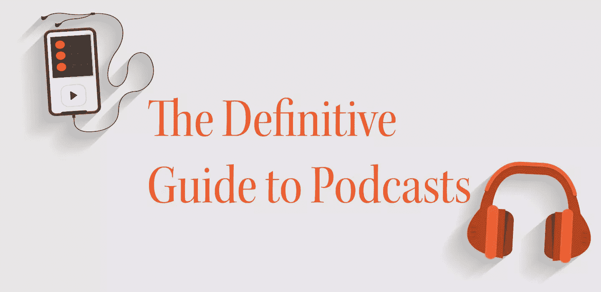
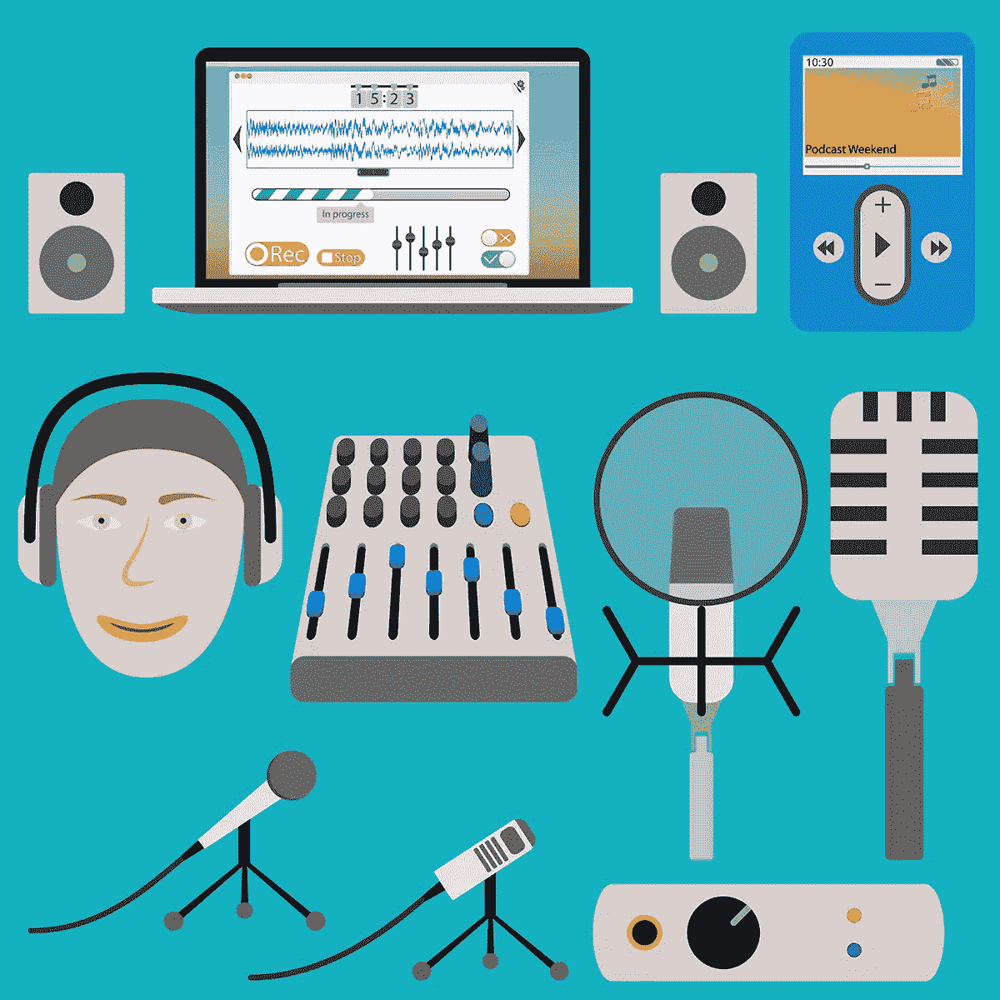

# 播客的权威指南

> 原文：<https://www.sitepoint.com/definitive-guide-podcasts/>

非常不可思议的事情发生了:播客变得很性感。

根据皮尤研究中心(Pew Research Center)的数据，播客消费范围的扩大和上升趋势在每一个可用的指标上都很明显——听播客的美国人的百分比、公众意识的水平以及有多少播客被托管和下载。

大多数人可能没有看到播客的复兴，但作为企业家和内容创作者，我们绝对应该利用它。

Mailchimp 营销经理 Paul Riismandel 是这样说的:

“听播客的人往往充满激情，对他们所听的内容有着持久的依恋。品牌知名度的机会是巨大的。”

你不仅可以提高企业知名度，还可以传播公司新闻，展示你的专业知识，加强你与现有客户的关系，建立虚拟社区，展示对你产品的需求，与业内其他人联系等等。

但是如果不努力工作，你就不会获得任何好处。让我们深入了解开始播客的细节。

## 第一步:选择你的搭档

一个人娱乐很难，所以我们强烈建议你找一两个搭档。如果你是一个创业者，在你的社区里找一个同样需要曝光的人。如果你在自己的初创企业或公司里发布播客，考虑一下让其他和你有良好互动的员工加入进来。

要考虑的最重要的因素首先是，你能与这个人或这些人轻松交谈吗？其次，他们是否愿意每周或每月留出时间来录制剧集？

## 第二步:选择主题

一旦你创建了你的团队，是时候明确你的播客将涵盖的内容了。

我们建议一个与您的专业知识或产品相关的主题；例如，如果你为小企业提供集客营销咨询服务，你可以将播客专注于集客营销:最佳实践、专家访谈、行业变化等等。你可以这样想:什么样的话题会吸引听众，让你转化为潜在客户？

如果你仍然不能确定一个主题，创建一个文氏图。在一个圈里，列出你擅长的所有科目。在另一个圈里，列出你的顾客关心的所有主题。然后找到两者重叠的地方:这应该是你播客的重点。

## 第三步:选择一种格式

接下来，决定每集的时长、发布频率以及每集的结构。

在你承诺一个小时的节目之前，先做一个练习录音，看看你和你的搭档或嘉宾实际上聊了多久。

你可能会发现很难在如此长的时间内保持主题、信息和娱乐性。为一个更长的节目想出足够多的主题也是一个挑战。

要点:你应该强烈考虑以 20 到 30 分钟的剧集开始，至少在开始的时候。美国人口普查局表示[平均通勤时间为 25.4 分钟](http://project.wnyc.org/commute-times-us/embed.html)，所以让你的播客达到这个长度意味着它将完美地融入你的听众的一天。

此外，你可能应该争取每月发行一集——至少在你获得更多经验之前。

制作播客很费时间，低估你发布播客的频率比高估和让你的观众失望要好。

想出一个格式也很重要。这将有助于你在录制时保持专注，并使你的节目保持一致。

有几个不同的格式往往做得非常好。

这是一个每周一次的公共广播节目播客，拥有数百万听众，推广了“三幕”安排。

该剧以一个引人入胜的故事开始(又名“钩子”)。主持人伊拉·格拉斯中途停下来解释这一集的主题。在那之后，我们听到钩子的其余部分。最后，我们听到第二和第三幕。

总结如下:

*   钩
*   介绍
*   钩子的后半部分
*   新故事
*   新故事

或者，你可以借用未经审查的公司的版面，这是一个关于商业和技术的播客。

它更直接:主持人以简短的解释开始，他们是谁，播客是什么，他们将采访谁和/或他们将讨论什么。然后他们开始第一个话题。每一集的结尾都是对每位主持人最近所做事情的总结。

*   介绍
*   话题一
*   话题二
*   话题三
*   推荐

你可以根据自己的喜好、目标、主题和长度选择最合适的形式。但是，您应该尽可能少地更改格式。你想让你的观众知道当他们点击“播放”时会发生什么

## 第四步:购买设备

在这一点上，你已经准备好从构思阶段进入实际创作阶段。不出所料，你需要一些设备。

首先，你可以使用 GarageBand(MAC 免费)、Adobe Audition 或 [Audacity](http://sourceforge.net/projects/audacity/) (也是免费的，如果你有个人电脑，这可能是你的最佳选择。)如果你和你播客上的其他人在你录制的时候都在一个房间里，这些工具是完美的。

如果你要和不同地点的人通话，Skype 是在一个地方收集每个人声音的好方法。创建群组通话，然后开始录音。

*(查看 [Skype 记录您通话的第三方工具列表](https://support.skype.com/en/faq/FA12395/how-can-i-record-my-skype-calls)。)* 

这就引出了麦克风。

[Audio-Technica ATR2100-USB 心形动圈 USB/XLR 话筒](http://www.amazon.com/gp/product/B004QJOZS4/ref=as_li_qf_sp_asin_il_tl?ie=UTF8&camp=1789&creative=9325&creativeASIN=B004QJOZS4&linkCode=as2&tag=northlak-20&linkId=Z27Q7R2YRBFC7QGM)是最受欢迎的“入门级”话筒之一。它只需要 59.95 美元，你可以把它插到混音器和电脑上。

蓝色麦克风 Yeti USB 麦克风价格较贵，为 89 美元，但质量稍好。

## 第五步:记录

一旦你得到了你的设备，你终于可以记录。我们建议事先制定一个基本的大纲，这样你就不会发现自己在剧集中间无话可说。

这可能看起来像什么？它可能是粗糙的:

**J:** 介绍客人，宣传他的新书(1001 种快速启动你销售生涯的方法)

**答:**向客人询问书籍灵感、写作过程、销售手法等。

或者你可以说得更详细些，比如:

我很高兴能有机会与雅各布·福斯特交谈，他是我所认识的软件销量最高的人，也是《1001 种快速启动你销售生涯的方法》的作者。雅各布，你好吗？

做你觉得舒服的事。此外，如果你打算面试别人，提前给他们发问题，或者告诉他们你会问些什么。这些步骤将使实际对话尽可能顺畅。

当你真的在录音的时候，不要担心是否有长时间的沉默或者有人说了一些愚蠢的话。在后期制作过程中，您可以随时删除这些部分。

## 第六步:编辑

这就把我们带到了下一步——编辑。使用 GarageBand 或 Audacity，编辑您的 podcast 以移除您不想要的片段，插入音频或音乐，并去除语言上的“瑕疵”，如分散注意力的噪音或麦克风反馈。

你的播客不必是 NPR 质量。只要它的内容是好的，你的听众不会因为偶尔的错误而失去兴趣。

虽然你可能会非常兴奋地在第一集结束后就发布你的播客，但要等到至少有两三集准备好了再发布。

拥有一个内容存档意味着，如果有一周，你有紧急情况，你不能记录一集，你就不必让你的观众失望，并冒着失去听众的风险。

## 第七步:发布

现在你终于可以发布你的播客了。有很多方法可以让你的播客传播出去，但最简单的方法是花钱请一个播客主持人。

从本质上说，购买一个主机可以让你使用别人的平台，而不是把你的播客放在你自己的网站上。这项服务不仅自动化程度很高(比如即时上传到 iTunes 商店)，还能确保人们能够快速安全地下载你的播客。

受欢迎的播客媒体主机包括 [Libsyn](https://www.libsyn.com) (每月 5 美元起)和 Blubrry(每月 12 美元起)。

Blubrry 有更好的分析能力，所以如果你要花很多时间去挖掘谁下载了你的剧集，他们什么时候下载的，从什么平台下载的，Blubrry 是一个不错的选择。

如果你不想为服务付费， [Buzzsprout](https://www.buzzsprout.com) 有一个免费计划。但是，你每个月只能上传两个小时的音频，并且你的内容只能下载 90 天。

[Soundcloud 是另一个免费选项](https://soundcloud.com/for/podcasting)。该网站的播客功能仍处于测试阶段，因此该平台并非没有问题。但为了弥补这一点，你将获得分析，嵌入式媒体播放器，甚至观众互动。

正如你所看到的，创建、启动和维护一个成功的播客只需要比对着你的 iPhone 备忘录应用说话半个小时多一点的工作。但是我们认为你会发现结果是值得的。

## 分享这篇文章