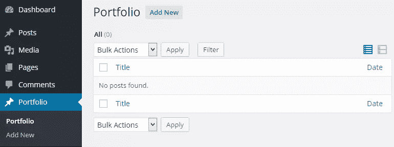
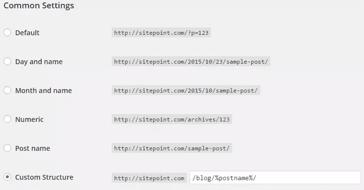

# WordPress 自定义帖子类型的权威指南

> 原文：<https://www.sitepoint.com/definitive-guide-to-wordpress-custom-post-types/>

WordPress 仅仅被称为博客软件的日子已经一去不复返了。

通过插件和主题扩展其功能的能力，将帖子或结构化数据分组为各种类型，以及 [WP Rest API](http://wp-api.org/) 进入 core，使其进一步发展成为成熟的内容管理系统和开发平台。

多年来，我已经成功开发了许多基于 WordPress 的定制 web 应用程序，它们大量使用了定制的帖子类型。这些网络应用的一个例子是我的 WordPress 插件[的](http://profilepress.net)[主题市场](http://profilepress.net/themes/)。

仔细观察上面链接的主题 marketplace，您会发现它使用了自定义分页系统，这在 **Next / Prev** 分页链接的 URL 中显而易见。因此，您可以构建一个内部分页系统，该系统可以很好地查询**自定义帖子类型** (CPT)。

说够了，让我们进入本教程的目的，学习 WordPress 中自定义文章类型的复杂性。

我希望解决我个人在使用 CPT 时遇到的许多障碍，以及一些你可以用它做的很酷的事情。

## 自定义帖子类型定义

WordPress 可以保存和显示许多不同类型的内容。这种内容的单个项目通常被称为帖子，尽管*帖子*也是一种特定的帖子类型。

> 在内部，所有的文章类型都存储在 wp_posts 数据库表的同一个地方，但是通过一个名为 post_type 的列来区分。

**帖子类型**指的是保存在 WordPress 数据库`posts`表中的各种结构化数据。

帖子类型的例子有`post`(一组博客帖子)`page`(一组页面)`attachment`(一组上传的媒体文件)，以及`revision`(一组帖子修订)，这些都是 WordPress 自带或内置的。

有了**帖子类型**的定义，创建并注册到 WordPress 的新帖子类型被称为**自定义帖子类型**。

如果你正在用 WordPress 建立一个公司或商业网站，你可以创建的文章类型有作品集、推荐和产品。

现在我们已经理解了定制文章类型的概念，接下来是学习如何创建它们。

## 创建自定义帖子类型

创建一个定制的文章类型非常简单。首先用`register_post_type()`函数注册帖子类型，最后将`register_post_type()`封装在一个函数调用中，并将其与`init`动作挂钩，如下所示:

```
function portfolio_cpt() {

    $args = array(
        'label'  => 'Portfolio',
        'public' => true,
    );

    register_post_type( 'portfolio', $args );
}

add_action( 'init', 'portfolio_cpt' );
```

从上面的代码中，您可以看到`register_post_type()`有第二个函数参数，该参数接受在定制一个定制 post 类型的每个方面所必需的大量数组参数。

你现在应该看到投资组合自定义文章类型出现在 WordPress 管理仪表板中。



值得注意的是，调用`register_post_type()`时，第二个参数是可选的。也就是说，CPT 也可以按如下方式创建:

```
function portfolio_cpt() {

    register_post_type( 'portfolio' );
}

add_action( 'init', 'portfolio_cpt' );
```

如果以这种方式创建 CPT，它将不会显示在管理仪表板菜单中(尽管仍然可以通过直接 URL 访问“`http://example.com/wp-admin/edit.php?post_type=portfolio`”)并且它的 UI 文字(也称为标签)和管理通知将与内置的`post`帖子类型相同。

让我们回顾一下定制 CPT 的一些数组参数及其各自的功能。

### 标签

自定义帖子类型的复数描述性名称。例如，如果您正在创建一个`movie` CPT，它应该是`Movies`。

它将默认为`register_post_type()`的第一个参数`$post_type`的值。

### 标签

此文章类型的标签数组。每个字符串都是显示在特定管理页面中的一段文本。

如果你正在创建一个公共使用的插件，确保这些字符串[是可翻译的](https://www.sitepoint.com/wordpress-i18n-make-your-plugin-translation-ready/)。

*   **名称**:你的帖子类型名称的复数形式。
*   **singular_name** :你的帖子类型名称的单数形式。
*   **add_new** :添加新帖子的菜单项。
*   **add_new_item** :新建帖子时显示的标题。
*   **edit_item** :编辑帖子时显示的表头。
*   **new_item** :显示在管理标题的收藏夹菜单中。
*   **view_item** :显示在编辑帖子屏幕上的永久链接旁边。
*   **search_items** :编辑帖子屏幕上搜索框的按钮文本。
*   **not_found** :在 admin 中搜索未找到帖子时显示的文本。
*   **not_found_in_trash** :垃圾桶中没有帖子时显示的文本。

标签及其描述的完整列表[可在此处](https://codex.wordpress.org/Function_Reference/register_post_type#Arguments)找到。

### 描述

一个简短的文章类型的描述性总结，尽管我在 WordPress admin 中还没有发现这是在哪里使用的。

### 公众的

根据它的布尔值，它会自动决定其他参数应该是什么，除非它们被特别定义。如果您希望对公共参数有更多的控制，您可以设置三个特定的参数:

*   **show_ui:** 决定是否显示管理画面。
*   **public _ query able:**决定该帖子类型是否可以从前端进行查询。
*   **exclude_from_search:** 帖子是否应该出现在搜索结果中。

### 菜单 _ 位置

默认情况下，一个新的文章类型会被添加到管理中的“评论”菜单项之后。但是你必须有能力把它移动到你选择的合适的位置。

例如，将`menu_position`值设置为 **70** 会将您的菜单项添加到**用户**下面。

### 菜单图标

新的文章类型将默认为文章菜单图标，但是如果您想要一个自定义图标，请将此标签设置为图标或图像文件的 URL。

```
'menu_icon' => get_stylesheet_directory_uri() .img/portfolio-icon.png',
```

您也可以使用任何[大图标](https://developer.wordpress.org/resource/dashicons/)作为您的 CPT 图标。

假设您想使用[下载大图标](https://developer.wordpress.org/resource/dashicons/#download)，将此标签设置为大图标值如下:

```
'menu_icon' => 'dashicons-download',
```

### 等级体系的

此参数允许您决定是否将 CPT 分层。默认值为`false`。设置为`true`以使您的 CPT 分层。

### 支持

`supports`参数允许你定义一个元框和域的数组，当编辑或创建一篇新文章时，这些元框和域将出现在屏幕上。这默认为标题和编辑器。

将此参数设置为`false`将阻止默认(标题和编辑器)行为。

有几个可用选项:

*   `title`:创建文章标题的文本输入字段。
*   `editor`:内容 TinyMCE 编辑器，用于编写。
*   `author`:改变文章作者的选择框。
*   `thumbnail`:特色影像能力。
*   `excerpt`:用于编写自定义摘录的文本区。
*   能够打开/关闭引用通告和 pingbacks。
*   `custom-fields`:自定义字段输入字段。
*   `comments`:打开/关闭评论。
*   允许对你的文章进行修改。
*   `post-formats`:添加帖子格式，参见“帖子格式”一节
*   `page-attributes`:页面显示的属性框。这对于分层帖子类型非常重要，因此您可以选择父帖子。

### 寄存器 _ 元 _ 盒 _cb

提供一个回调函数，在为编辑表单设置元框时将调用该函数。回调函数接受一个参数`$post`，它包含当前编辑的文章的`WP_Post`对象。

这个特性对开发人员特别有用，他们可以创建自定义的元框，这些元框将显示在 CPT 编辑屏幕上。

```
'register_meta_box_cb' => 'metabox_callback_func',
```

### 分类学

一组注册的分类法，如`category`或`post_tag`，将用于这个定制的文章类型。

```
'taxonomies' => array( 'post_tag', 'category '),
```

### has _ 存档

将此参数设置为`true`将为您的自定义帖子类型启用存档。例如，假设您的 CPT 是`books`，访问`http://yoursite.com/books`将显示属于`books`自定义帖子类型的帖子列表。

### 重写

此参数允许您在查看单个帖子或存档时定义自定义帖子类型的永久链接结构。

默认值为`true`，并使用`$post_type`作为废料。为防止重写，设置为`false`。

为了清楚起见，让我们看一些例子。

假设您创建了一个`review`自定义帖子类型，但希望将 URL slug 从*评审*更改为*评估*，使用下面的重写参数将把 URL 从`http://example.com/review/harry-potter/`更改为`http://example.com/assessment/harry-potter/`用于单个帖子，将`http://example.com/review/`更改为`http://example.com/assessment/`用于 CPT 存档。

```
'rewrite' => array(
    'slug'       => 'assessment',
    'with_front' => false
),
```

每当你重写 WordPress URL 时，确保你点击了**设置> >永久链接**中的`Save Changes`按钮来重新创建重写规则。

所以基本上，`slug`定义了新的 URL slug，而`with_front`决定了永久链接结构是否被前置到前端。

还不清楚关于`with_front`？让我们看一个例子。

假设您有一个永久链接结构，URL 后面附加了 *blog* ，如下图所示。



如果`with_front`设置为假，单个帖子和帖子存档的 URL 分别变为`http://example.com/blog/assessment/harry-potter/`和`http://example.com/blog/assessment/`，但是如果设置为`true`，单个帖子和帖子存档的 URL 分别变为`http://example.com/assessment/harry-potter/`和`http://example.com/assessment/`。

注意到后者省略了`blog`吗？这就是区别。

### can _ 出口

使用这个参数来决定属于你的自定义文章类型的文章是否可以通过 WordPress 导出工具导出。默认情况下，这被设置为`true`。

### 查询 _ 已存在

此参数允许您控制用于获取此类帖子的查询变量。

如果设置为`true`，它将允许你通过`example.com/?book=harry-potter`请求一个图书自定义帖子类型，其中**哈利波特**是一个图书条目或帖子的 URL slug。

如果设置为字符串而不是 true(例如*发布*，可以做:`example.com/?publication=harry-potter`。

#### “query_var”的警告

如果在 CPT 注册数组参数中没有定义`query_var`,那么它默认为`$post_type`,因此，它总是被定义的，除非您将其设置为 false。

警告来了。每当一个`query_var`的值作为一个查询字符串被添加到一个 URL 时，它将导致一个 404。

让我澄清一下。假设你的 CPT `query_var`的值是`review`,一个关键字设置为 review 的查询字符串以下列形式被添加到你的 WordPress 站点的任何 URL 中:

*   [http://example.com/?review=some-random-string](http://example.com/?review=some-random-string)
*   [http://example.com/a-post-slug-here/?foo=bar&review = some-random-string](http://example.com/a-post-slug-here/?foo=bar&review=some-random-string)

这将导致 404 发生。

事实上，我是吃了苦头才知道这件事的。当我遇到这个问题时，我在 WordPress core trac 中创建了一个[标签来报告这个问题。](https://core.trac.wordpress.org/ticket/31781)

在 WordPress 核心团队的一些成员回复我的票之前，我花了几个星期才最终弄明白。

## 用插件加速自定义文章类型的设置

既然我们已经讨论了基础，现在是时候指出 WordPress 插件库中有许多插件使得创建自定义文章类型变得非常容易。

示例包括(但不限于):

*   [自定义帖子类型 UI](https://wordpress.org/plugins/custom-post-type-ui/)
*   [豆荚框架](https://wordpress.org/plugins/pods/)
*   [自定义帖子类型生成器](https://wordpress.org/plugins/custom-post-type-maker/)

## 结论

在本教程中，我们学习了什么是自定义帖子类型以及它们是如何创建的。

这实际上是 WordPress 自定义文章类型系列的第一篇。在我的下一个教程中，我们将学习如何定制各种管理通知，如何将定制的分类法注册到文章类型中，以及将上下文帮助标签添加到 CPT 屏幕中。

在那之前，编码快乐！

## 分享这篇文章