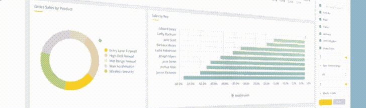
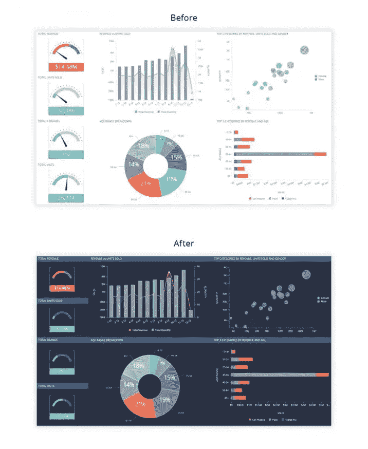
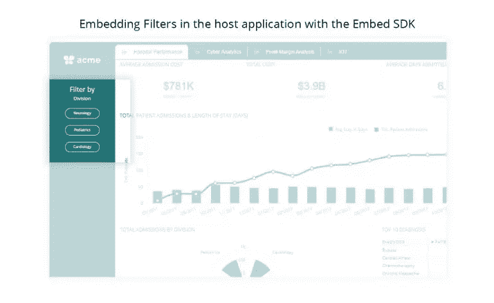
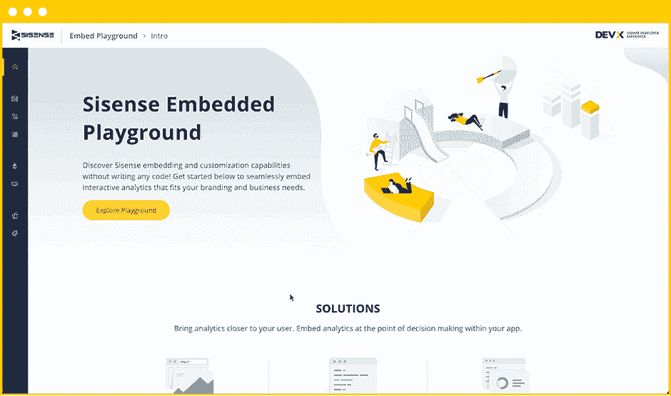
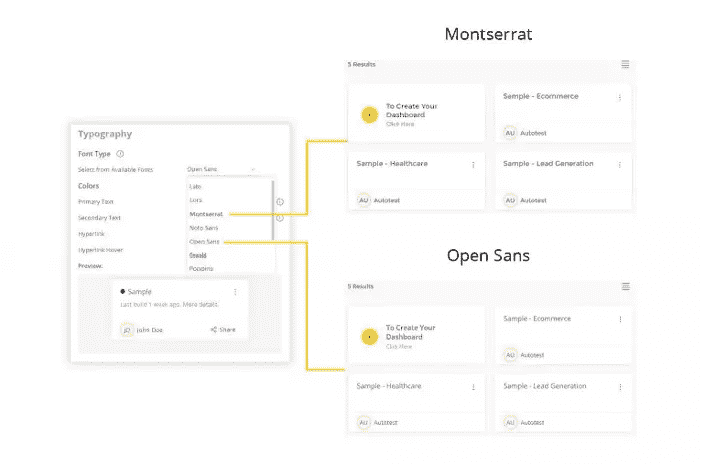
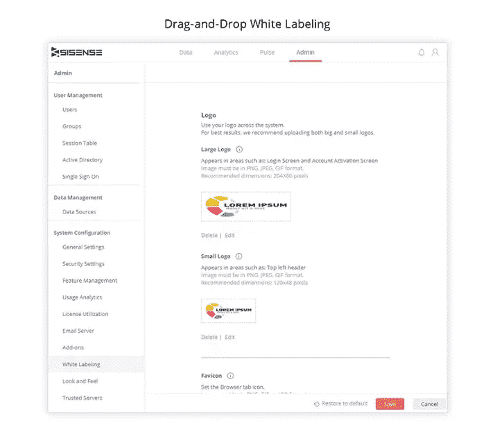

# 使用 Sisense 嵌入式分析提供更好的基于数据的 UX

> 原文：<https://www.sitepoint.com/deliver-better-data-informed-ux-using-sisense-embedded-analytics/>

*本文是与 [StudioWorks](http://studioworks.me/) 合作创作的。感谢您对使 SitePoint 成为可能的合作伙伴的支持。*

几乎所有行业的企业都在学习如何在客户旅程中优先收集数据。越来越多的情况下，数据报告和交互式可视化是应用程序必须为用户提供的价值的重要组成部分，无论这些用户是在您的组织内，外部利益相关者还是大众市场最终用户。

不管你的产品是一个反映供应链效率问题的执行仪表板，还是一个跟踪游戏化健身成就的生物特征的“可量化自我”应用程序，还是一个帮助用户跟踪项目目标的商业应用程序——数据故事在所有数字产品的界面中发挥着越来越大的作用。

与此同时，应用程序流失继续困扰着产品团队，因为市场上越来越多的应用程序具有重叠的用例和功能，这就更有理由让可量化的成就成为应用程序界面的核心组件。可以说，确保应用忠诚度的最佳方式莫过于让用户觉得这是他们不断取得成功的关键因素。

考虑到这一点，很容易理解为什么今天几乎每个移动和网络应用程序都需要某种内置的分析功能。移动应用分析可以帮助您增加产品的粘性，并[提供更好的用户体验](https://www.sitepoint.com/5-simple-ux-principles-guide-product-design/)。反过来，你可以为用户创建一个高价值的应用，这个应用可能会被更频繁地使用。

因此，问题不在于你是否应该在你的应用中加入分析功能。而是应该自建还是使用第三方解决方案？

简而言之，这取决于许多因素。

如果你选择自己构建这些分析功能，你将对应用的功能和品牌有更多的控制权。此外，即使您需要为持续的开发和兼容性更新留出预算，您也能够确保它完全按照您想要的方式运行。

另一方面，购买第三方嵌入式分析解决方案通常是一个便宜得多的选择*和*您将能够更快地在应用中部署分析功能。此外，您将立即获得高质量的源代码组件，因为您将基于行业专家的经验进行构建，而不是基于需要从零开始构建功能的内部团队。

在本文中，我们将深入探讨在应用中添加分析功能是构建还是购买的困境，并解释为什么使用嵌入式分析比构建自己的应用组件更好。我们还将分享在您的应用中使用 [Sisense 嵌入式分析解决方案](https://www.sisense.com/product/embedded-analytics/)的一些最佳实践。

## 为什么嵌入式分析胜过构建自己的分析

使用嵌入式分析的一个主要好处是，它提供了对有用数据的轻松访问。换句话说，它允许您将低延迟仪表板集成到任何应用程序中。仪表板旨在以易于理解和可操作的方式呈现数据，这对于公司来说更有价值，因为它允许用户更快地做出明智的决策。

根据 MicroStrategy 的 2020 年全球企业分析报告，[只有 3%](https://www.microstrategy.com/us/resources/blog/bi-trends/2020-enterprise-analytics-trends-next-gen-embedded-analytics-speeds-time-to-insights?feed=Blog) 的员工能够足够快地找到他们需要的信息，以做出数据驱动的业务决策。借助嵌入式分析，您可以显著改善最终用户的体验，并允许不擅长分析的员工做出数据驱动的决策，而无需求助于 IT 专家。

[https://gfycat.com/ifr/JaggedAppropriateCockerspaniel](https://gfycat.com/ifr/JaggedAppropriateCockerspaniel)

相比之下，自己构建这些数据可视化和仪表板需要大量的 UI 和 UX 工作。简而言之，将花费更多的精力、时间和资源来组合应用程序组件，这些组件的完美程度只有嵌入式分析组件的一半。

企业选择使用嵌入式分析解决方案的一个主要原因是，嵌入式平台是由专家设计的，因此**能够提供简化的集成**，转化为最终用户的体验。

虽然你肯定有资源来拼凑一个即兴的内部分析解决方案，但让它可用是完全不同的事情。因此，您可以使用现成的嵌入式分析解决方案，而不是花费时间开发分析解决方案，然后完善 UI 和 UX。

你可能已经知道，应用程序分析非常复杂，因此很难做好。要构建自己的分析应用组件，您需要一个熟悉需求和数据处理技术的开发团队，以及能够将其转化为易于理解的数据可视化的 UI 和 UX 专家。

全力以赴构建自己的分析解决方案的问题是，它留给你的时间和资源非常少，无法专注于开发核心产品。因此，使用嵌入式分析，**缩短了上市时间**。

正如我们之前提到的，开发您自己的应用分析解决方案可以让您更好地控制功能。然而，这也意味着您必须投入时间和资源来保持更新和提供支持。借助嵌入式分析，您基本上可以**外包维护和持续支持**。

## 构建嵌入式分析产品的技巧

嵌入式分析使得在应用中实现完全开发的商业智能工具成为可能。为了从嵌入式分析中获得最大价值，请记住以下一些最佳实践。

### 1.评估最终用户的需求

不同行业的人会以各种不同的方式使用分析。

例如，电子商务店主可能对营销数字和销售数据更感兴趣。另一方面，医疗保健行业的企业可能会转而寻求评估急诊室程序的有效性，或者寻找降低与可避免的急诊室就诊相关的高成本的方法。

同样，同样重要的是要记住，同一行业或组织中的不同用户也需要以不同的方式使用分析。想想几乎每个组织中的不同部门(如业务管理员和会计部门)，以及他们的分析需求如何变化。

因此，评估最终用户的需求和目标并采取措施确保您的嵌入式分析解决方案与他们的需求和目标相匹配非常重要。

借助 [Sisense](https://www.sisense.com/) ，您可以在嵌入式分析中保持一致的品牌元素，确保无缝的用户体验。除此之外，您还可以自定义调色板并使用可视化层次结构，以便您呈现的信息和可视化效果与您正在构建的应用程序的所有其他方面保持一致。

### 2.优化“数据深度”

你不想让你的应用程序的分析对它的目标用户来说太复杂。这不仅会带来糟糕的体验，还可能会让最终用户不知所措。在设计中，有时少即是多。

第一步是规划出你想要在应用中实现的不同分析功能。接下来，检查哪些类型的用户将需要访问哪些分析功能，并消除那些您不需要的功能。

实现正确平衡并优化您的分析解决方案提供的数据深度的一种方法是最大限度地减少用户获取见解所需的步骤。例如，确保将导出和过滤等基本操作放在一个地方。

这就是为什么选择易于定制的嵌入式分析解决方案如此重要。通过这种方式，您将能够使用简单的拖放工具、插件框架、SDK 和 JavaScript APIs 来调整底层基础架构，以改善用户体验。

Sisense 还提供了一个“嵌入式游乐场”环境，设计师和开发人员可以在为产品实现部署嵌入式接口之前对其进行修补。

### 3.给分析体验贴上白色标签

您的分析解决方案应该与主机应用无缝融合，以便您能够提供完全品牌化的用户体验。它应该有一个单一的应用程序的外观和感觉，同时给你的灵活性，重塑 UX。

Sisense 让你[用排版](https://www.sitepoint.com/4-killer-typography-tips-from-the-worlds-biggest-brands/)建立品牌，并赋予你的分析应用设计一些个性。您可以使用版式来增强可读性和改进导航。

除此之外，Sisense 还提供现成的拖放白标功能，这意味着您可以消除第三方应用程序的痕迹，并提供一致的品牌体验，而无需进行定制开发。

## 结论

提供应用内分析是增加应用粘性并为用户提供更多价值的好方法。在内部构建分析套件会占用大量资源，而嵌入式分析解决方案可以通过最少的部署更轻松、更快速地将其应用推向市场。

通过实施我们在本文中分享的一些最佳实践，您可以专注于您的最终用户需要什么，以充分利用您的嵌入式分析解决方案并提供更好的用户体验。

## 分享这篇文章