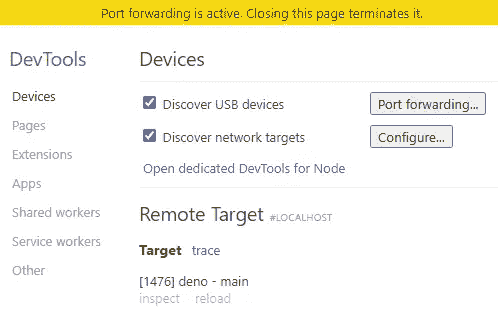
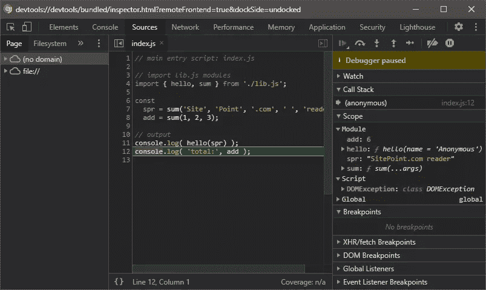

# 如何使用 Deno 的内置工具

> 原文：<https://www.sitepoint.com/deno-built-in-tools/>

**Deno 和 Node.js 之间一个令人惊讶的区别是运行时内置的工具数量。除了读取-评估-打印循环(REPL)控制台，Node.js 需要第三方模块来处理大多数*间接*编码活动，如测试和林挺。Deno 内置工具提供了几乎所有开箱即用的东西。**

在我们开始之前，注意一点。 **Deno 新！**谨慎使用这些工具。有些可能不稳定。很少有配置选项。其他的可能会有不良的副作用，比如递归处理每个子目录中的每个文件。最好从专门的项目目录中测试工具。

## 安装 Deno

使用以下终端命令在 macOS 或 Linux 上安装 Deno:

```
curl -fsSL https://deno.land/x/install/install.sh | sh 
```

或者从 Windows Powershell:

```
iwr https://deno.land/x/install/install.ps1 -useb | iex 
```

进一步的安装选项在 [Deno 手册](https://deno.land/manual/getting_started/installation)中提供。

输入`deno --version`检查安装是否成功。显示 V8 JavaScript 引擎、TypeScript 编译器和 Deno 本身的版本号。

## 升级 Deno

使用以下命令将 Deno 升级至最新版本:

```
deno upgrade 
```

或者升级到[特定版本](https://github.com/denoland/deno/releases)如 v1.3.0:

```
deno upgrade --version 1.30.0 
```

下面的大多数工具在所有版本中都可用，但以后的版本可能会有更多的功能和错误修复。

## 拒绝帮助

通过输入以下命令，可以查看工具和选项列表:

```
deno help 
```

## 读取-评估-打印循环(REPL)

像 Node.js 一样，REPL 表达式评估控制台可以通过在终端中输入`deno`来访问。您输入的每个表达式都会返回一个结果或`undefined`:

```
$ deno

Deno 1.3.0
exit using ctrl+d or close()
> const w = 'World';
undefined
> w
World
> console.log(`Hello ${w}!`);
Hello World!
undefined
> close()

$ 
```

通过使用光标键浏览表达式历史，可以重新输入先前输入的表达式。

## 依赖性检查器

通过输入`deno info <module>`可以查看所有模块依赖关系的树，其中`<module>`是入口脚本的路径/URL。

考虑以下带有导出的`hello`和`sum`函数的`lib.js`库代码:

```
// general library: lib.js

/**
 * return "Hello <name>!" string
 * @module lib
 * @param {string} name
 * @returns {string} Hello <name>!
 */
export function hello(name = 'Anonymous') {

  return `Hello ${ name.trim() }!`;

};

/**
 * Returns total of all arguments
 * @module lib
 * @param {...*} args
 * @returns {*} total
 */
export function sum(...args) {

  return [...args].reduce((a, b) => a + b);

} 
```

这些可以在主入口脚本`index.js`中使用，在同一目录中:

```
// main entry script: index.js

// import lib.js modules
import { hello, sum } from './lib.js';

const
  spr = sum('Site', 'Point', '.com', ' ', 'reader'),
  add = sum(1, 2, 3);

// output
console.log( hello(spr) );
console.log( 'total:', add ); 
```

运行`deno run ./index.js`的结果:

```
$ deno run ./index.js

Hello SitePoint.com reader!
total: 6 
```

可以使用`deno info ./index.js`检查`index.js`使用的依赖关系:

```
$ deno info ./index.js

local: /home/deno/testing/index.js
type: JavaScript
deps:
file:///home/deno/testing/index.js
  └── file:///home/deno/testing/lib.js 
```

类似地，可以检查任何模块 URL 所需的依赖关系，尽管要注意模块将在第一次使用时被下载并缓存在本地。例如:

```
$ deno info https://deno.land/std/hash/mod.ts

Download https://deno.land/std/hash/mod.ts
Download https://deno.land/std@0.65.0/hash/mod.ts
Download https://deno.land/std@0.65.0/hash/_wasm/hash.ts
Download https://deno.land/std@0.65.0/hash/hasher.ts
Download https://deno.land/std@0.65.0/hash/_wasm/wasm.js
Download https://deno.land/std@0.65.0/encoding/hex.ts
Download https://deno.land/std@0.65.0/encoding/base64.ts
deps:
https://deno.land/std/hash/mod.ts
  └─┬ https://deno.land/std@0.65.0/hash/_wasm/hash.ts
    ├─┬ https://deno.land/std@0.65.0/hash/_wasm/wasm.js
    │ └── https://deno.land/std@0.65.0/encoding/base64.ts
    ├── https://deno.land/std@0.65.0/encoding/hex.ts
    └── https://deno.land/std@0.65.0/encoding/base64.ts 
```

更多信息，参见 [Deno 手册:依赖性检查器](https://deno.land/manual/tools/dependency_inspector)。

## 语法检查程序

Deno 提供了一个 linter 来验证 JavaScript 和 TypeScript 代码。这是一个不稳定的特性，需要`--unstable`标志，但是当它被使用时，没有文件会被改变。

林挺有助于发现不太明显的语法错误，并确保代码符合团队的标准。您可能已经在您的编辑器或命令行中使用了 linter，例如 [ESLint](https://eslint.org/) ，但是 Deno 在安装了它的任何环境中都提供了另一种选择。

要递归 lint 当前目录和子目录中的所有`.js`和`.ts`文件，请输入`deno lint --unstable`:

```
$ deno lint --unstable

(no-extra-semi) Unnecessary semicolon.
};
 ^
    at /home/deno/testing/lib.js:13:1

Found 1 problem 
```

或者，您可以指定一个或多个文件来限制林挺。例如:

```
$ deno lint --unstable ./index.js
$ 
```

更多信息，参见 [Deno 手册:Linter](https://deno.land/manual/tools/linter) 。它包括一个规则列表，您可以将这些规则添加到代码注释中，以忽略或实施特定的语法。

## 测试跑步者

Deno 有一个内置的测试运行器，用于对 JavaScript 或 TypeScript 函数进行单元测试。

测试在任何名为`<something>test`的文件中定义，扩展名为`.js`、`.mjs`、`.ts`、`.jsx`或`.tsx`。它必须对 [`Deno.test`](https://doc.deno.land/builtin/stable#Deno.test) 进行一次或多次调用，并传递一个测试名称字符串和一个测试函数。该函数可以是同步或异步的，并使用各种[断言实用程序](https://deno.land/std/testing)来评估结果。

用名为`lib.test.js`的文件创建一个新的`test`子目录:

```
// test lib.js library

// assertions
import { assertEquals } from 'https://deno.land/std/testing/asserts.ts';

// lib.js modules
import { hello, sum } from '../lib.js';

// hello function
Deno.test('lib/hello tests', () => {

  assertEquals( hello('Someone'), 'Hello Someone!');
  assertEquals( hello(), 'Hello Anonymous!' );

});

// sum integers
Deno.test('lib/sum integer tests', () => {

  assertEquals( sum(1, 2, 3), 6 );
  assertEquals( sum(1, 2, 3, 4, 5, 6), 21 );

});

// sum strings
Deno.test('lib/sum string tests', () => {

  assertEquals( sum('a', 'b', 'c'), 'abc' );
  assertEquals( sum('A', 'b', 'C'), 'AbC' );

});

// sum mixed values
Deno.test('lib/sum mixed tests', () => {

  assertEquals( sum('a', 1, 2), 'a12' );
  assertEquals( sum(1, 2, 'a'), '3a' );
  assertEquals( sum('an', null, [], 'ed'), 'annulled' );

}); 
```

要运行所有目录中的所有测试，请输入`deno test`。或者用`deno test <dir>`运行存储在特定目录下的测试。例如:

```
$ deno test ./test

running 4 tests
test lib/hello tests ... ok (4ms)
test lib/sum integer tests ... ok (2ms)
test lib/sum string tests ... ok (2ms)
test lib/sum mixed tests ... ok (2ms)

test result: ok. 4 passed; 0 failed; 0 ignored; 0 measured; 0 filtered out (11ms)

$ 
```

也可以指定一个`--filter`字符串或正则表达式来通过名称限制测试。例如:

```
$ deno test --filter "hello" ./test

running 1 tests
test lib/hello tests ... ok (4ms)

test result: ok. 1 passed; 0 failed; 0 ignored; 0 measured; 3 filtered out (5ms) 
```

通过传递一个`--failfast`选项，可以在第一次失败时停止长时间运行的测试。

更多信息，参见 [Deno 手册:测试](https://deno.land/manual/testing)。也有一些第三方测试模块可用，包括[梅林](https://github.com/crewdevio/merlin)和[鲁尔姆](https://github.com/drashland/rhum)，但这些仍然在表面下使用`Deno.test`。

## V8 调试器

Deno 提供了与 Node.js 相同的 V8 引擎和调试器。可以使用 Chrome 浏览器或 [VS 代码](https://code.visualstudio.com/)连接到调试器，然后单步执行代码以查看变量和对象的变化。

要启动调试器，运行带有`--inspect`或`--inspect-brk`的脚本，在第一行停止。如果您需要从网络上的另一个设备连接到调试器，添加它的 IP 地址和端口，或者使用`--inspect=0.0.0.0:9229`允许从任何地方连接。例如:

```
$ deno run --inspect-brk=0.0.0.0:9229 ./index.js

Debugger listening on ws://0.0.0.0:9229/ws/ceb123...
Debugger session started. 
```

在一个新的 Chrome 标签中打开<chrome:>，`deno`脚本将作为一个新的**远程目标** :</chrome:> 出现



*注意:“节点专用开发工具”不会连接到 Deno 的调试器，即使它们是相似的。*

点击目标的 **inspect** 链接，启动 DevTools。如果您使用过客户端调试，这应该很熟悉。**源**标签是最有用的，它允许你逐步执行代码:



更多信息，参见 [Deno 手册:调试器](https://deno.land/manual/tools/debugger)。

## 代码格式化程序

内置的代码格式化程序以类似于[更漂亮的](https://prettier.io/)的方式自动格式化 JavaScript 和类型脚本代码。Deno 的格式化程序也固执己见，目前不可能配置选项。

要使用它，输入`deno fmt`递归格式化每个子目录中的每个文件*。例如:*

```
$ deno fmt

/home/deno/testing/index.js
/home/deno/testing/test/lib.test.js
/home/deno/testing/lib.js 
```

或者，您可以格式化一个或多个单独的文件，例如，`deno fmt ./index.js`。

如果您检查`lib.test.js`文件，您会看到格式化程序删除了一些空格，并将字符串转换为使用双引号(`"`):

```
// hello function
Deno.test("lib/hello tests", () => {
  assertEquals(hello("Someone"), "Hello Someone!");
  assertEquals(hello(), "Hello Anonymous!");
}); 
```

通过添加一个`// deno-fmt-ignore`注释，可以忽略单独的代码块。例如:

```
// deno-fmt-ignore
const bin = [
              1, 0, 0,
              0, 1, 0,
              0, 0, 1,
            ]; 
```

通过在代码顶部添加一个`// deno-fmt-ignore-file`注释，可以忽略整个文件。

更多信息，参见 [Deno 手册:代码格式器](https://deno.land/manual/tools/formatter)。

*警告！自动格式化会对 JSDoc 注释产生负面影响。*

## 文档生成器

Deno 可以从源代码中的 [JSDoc 注释](https://jsdoc.app/)生成文档，解释函数的用途、参数和返回值。目前，Deno 只会为那些`export`起作用的模块生成文档。例如:

```
$ deno doc ./lib.js

Defined in file:///home/deno/testing/lib.js:9:0

function hello(name)
  return "Hello <name>!" string
  @module lib
  @param {string} name
  @returns {string} Hello <name>!

Defined in file:///home/deno/testing/lib.js:21:0

function sum(...args)
  Returns total of all arguments
  @module lib
  @param {...*} args
  @returns {*} total

$ 
```

添加一个`--json`标志以 JSON 格式输出文档。

更多信息，参见 [Deno 手册:文件生成器](https://deno.land/manual/tools/documentation_generator)。

## 脚本捆绑

您的主脚本及其所有依赖项可以捆绑到一个文件中，使用:

```
deno bundle <main-script> <output-script> 
```

例如:

```
$ deno bundle ./index.js ./index.bundle.js

Bundle file:///home/deno/testing/index.js
Emit "./index.bundle.js" (3.13 KB) 
```

然后可以执行生成的脚本:

```
$ deno run ./index.bundle.js

Hello SitePoint.com reader!
total: 6 
```

这在向最终用户分发脚本或将最终代码库部署到实时服务器时可能会很有用。

*注意:顶级`await`调用在绑定时可能会失败，因此必须添加一个`async`包装函数。这是一个已知问题，将在未来的 Deno 版本中修复。*

更多信息，请参见 [Deno 手册:捆绑](https://deno.land/manual/tools/bundler)。

## 脚本安装程序

Deno 脚本可以全局安装，因此可以从文件系统中的任何位置运行。这类似于安装 global Node.js 模块，但是更加简单易用。

必须传递`deno install`命令:

1.  任何需要的运行时[许可标志](https://deno.land/manual/getting_started/permissions)，如`--allow-read`、`--allow-write`或`--allow-net`。
2.  带有`--name <scriptname>`的可选已安装脚本名称。
3.  带有`--root <path>`的可选安装根文件夹。如果没有设置，Deno 会将脚本安装到在`DENO_INSTALL_ROOT`环境变量或`$HOME/.deno/bin/`中设置的路径。
4.  模块路径或 URL。

上面的示例脚本可以与以下软件一起安装:

```
$ deno install --name myscript ./index.js

✅ Successfully installed myscript
/home/deno/.deno/bin/myscript 
```

在`.deno/bin/`目录下创建一个`myscript`文件，内容如下:

```
#!/bin/sh
# generated by deno install
deno "run" "file:///home/deno/testing/index.js" "$@" 
```

`myscript`现在可以从系统的任何地方运行。例如:

```
cd ~
$ myscript

Hello SitePoint.com reader!
total: 6 
```

这个过程可以很容易地告诉用户如何从发布的 URL 安装应用程序。例如:

```
deno install --name myapp https://myserver.com/myapp.js
myapp 
```

Deno 目前不提供`uninstall`或`remove`命令。删除脚本的唯一方法是从`.deno/bin/`目录或安装它的任何地方手动删除生成的文件。

更多信息，参见 [Deno 手册:脚本安装程序](https://deno.land/manual/tools/script_installer)。

## 完整的 Deno 工具包？

Deno 的工具是新的，有些还是初级的，但是一个文档化的“标准”方法是有好处的。Node.js 提供了许多第三方选项，但这可能导致选择瘫痪或持续的解决方案切换。*你是否坚持使用同一个 Node.js 测试套件？*

然而，要小心:随着 Deno 使用的增长，这些内置工具可能会迅速发展。

## 德诺基金会

跟上德诺的步伐。我们的 Deno Foundations collection 帮助您迈出进入 Deno 世界以及更远的第一步，并且我们会不断增加它。我们将为您带来成为职业选手所需的教程。您可以随时参考我们的索引，因为它在我们对 Deno 的介绍结束时更新:

➤ [德诺基金会](https://www.sitepoint.com/deno-guide#foundations)

## 分享这篇文章