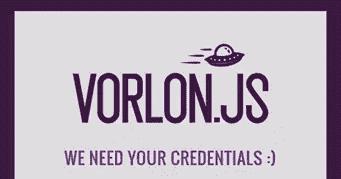
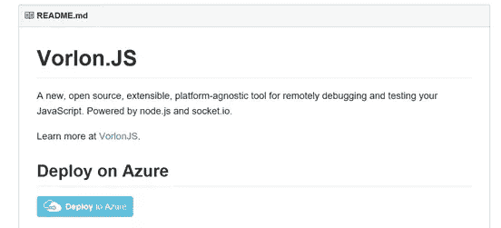
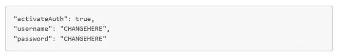
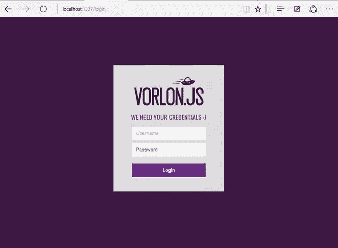
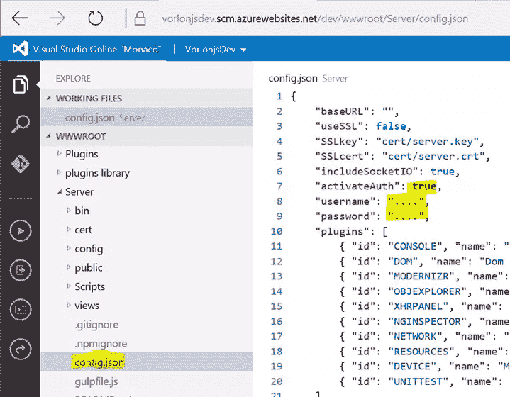

# 如何部署带身份验证的在线 Vorlon.js 服务器

> 原文：<https://www.sitepoint.com/deploy-online-vorlon-js-server-authentication/>

本文是微软网站开发系列的一部分。感谢您对使 SitePoint 成为可能的合作伙伴的支持。

当我们在微软的工程师和技术传道者团队开始创建[vorlon . js](http://vorlonjs.com/?WT.mc_id=16518-DEV-sitepoint-article54)——一个开源、可扩展、平台无关的工具，用于远程调试和测试您的 JavaScript——我们希望它尽可能简单。这是我们最关心的事，也是我们的使命。这就是为什么你只需要运行**NPM install–g vorlon**就可以得到一个 Vorlon 服务器，你只需要在你的客户端添加**一行**代码就可以把它连接到 vor lon 仪表板。这就是为什么在早期版本中我们没有实现任何类型的**认证**。

在本文中，我将向您解释为什么我们添加了身份验证以及如何激活它。

如果你从未使用过 Vorlon.js，请[阅读这篇文章](http://blogs.msdn.com/b/eternalcoding/archive/2015/04/30/why-we-made-vorlon-js-and-how-to-use-it-to-debug-your-javascript-remotely.aspx?WT.mc_id=16518-DEV-sitepoint-article54)来了解我们为什么制作 Vorlon.js 以及如何使用它。

## 我们为什么实施身份认证

当我们第一次公开演示时，我们在微软 Azure 网站上发布了我们自己的 Vorlon 服务器实例。目前，我们没有办法为仪表板指定登录名和密码。

**这曾经导致了一次巨大的失败:)**

公众中有人复制了我屏幕上显示的 url，并从他的计算机访问了仪表板。这打乱了我电脑上显示的内容，彻底搞糟了我们的演示。耶！\o/

从这次失败中，我们决定实现一个简单的身份验证。这显然对我们的演示有所帮助，但如果您想发布一个可公开访问的仪表板版本，这也会对您有所帮助。

## 如何轻松在线部署 Vorlon.js？

Vorlon 确实很容易安装。您需要做的就是在您的机器上安装 Node.js 包管理器(npm ),并运行正确的命令行。您可以从 npm 平台获得一切，并且可以通过在命令行中键入 **vorlon** 来启动您的实例。

从那里你需要让你的服务器可以通过互联网访问，并打开正确的 TCP 端口等。这可能有点复杂。如果你不想自己管理，你可以使用我们在 [Github 库](https://github.com/microsoftdx/vorlonjs)中为你添加的功能。

在 repo 底部的 readme 部分，你会发现一个 **Deploy to Azure** 按钮。

点击此处，我们将自动引导您完成一个 3 步流程，该流程将:

*   在您的 Azure 订阅上创建 Azure 网站*
*   在上面部署最新版本的 Vorlon

如果你没有 Azure 订阅，并想获得一个(免费选项)，请参见本文末尾的更多信息部分。

这一切都是****自动化的。你可以在这里看到一段视频:****

 **[https://www.youtube.com/embed/vkAeBU-YdNo?feature=oembed](https://www.youtube.com/embed/vkAeBU-YdNo?feature=oembed)

## 如何激活认证

***请注意:*** *目前认证仅在 GitHub repo 上的**开发-0.0.16** 分支可用。要获得它，您需要从这个分支部署代码(在您想要的地方手动或使用 Azure deploy)。我们将在 9 月底发布的 0.0.16 版本的 npm 包中提供它。*

我们使用 [passport.js](http://passportjs.org/?WT.mc_id=16518-DEV-sitepoint-article54) 实现了认证。我们选择激活一个简单的模式，让您指定一个登录名和密码。目前，您只能指定一个帐户。我们以后可能会实现一个更复杂的版本(包括 **Twitter** 和**脸书**认证和多账户管理)。

您可以通过向`config.json`文件添加 3 个值来激活 Vorlon.js 仪表板上的基本认证:

该文件位于您的 Vorlon.js 部署文件夹的 **/server** 文件夹中(或者如果您使用 **npm** 进行部署，则位于 *node_modules* 文件夹中)。

重启您的 Vorlon 实例和 **BAM** ，现在会提示您并要求您提供用户名和密码。

简单对吗？:)

## 在 Azure 上部署时如何更改 config.json 文件

如果您选择在 Azure 订阅上部署 Vorlon，您可以使用 Visual Studio Online Monaco 访问 Azure Web 应用程序上托管的文件。这是一个免费的工具，可以在 Azure Dashboard 的 web 应用程序的**配置**部分操作。

然后，您可以访问 web 应用程序仪表板页面上的 **Edit in Visual Studio Online** 按钮。

导航到 config.json 文件并编辑它以激活身份验证(或者添加/删除插件！):

***注意:不要忘记重新启动服务，这一点要考虑在内。***

## 我想使用 Azure Web 应用程序，但还没有帐户，我有什么选择？

您可以在[http://azure.microsoft.com/](http://azure.microsoft.com/?WT.mc_id=16518-DEV-sitepoint-article54)创建一个账户。这将使你能够创建免费的 azure web 应用程序。另一种测试方式是获得一个[免费 Azure 试用版](https://azure.microsoft.com/en-us/pricing/free-trial/?WT.mc_id=16518-DEV-sitepoint-article54)——你将拥有一个无信用卡账户来试用 Azure 一个月。

最后，如果你是一家初创公司，或者其他符合要求的企业，你可以创建一个 [BizSpark 账户](https://www.microsoft.com/bizspark/?WT.mc_id=16518-DEV-sitepoint-article54)。这将给你三年的免费 Azure 云服务。

如果你**真的**想在其他地方举办 Vorlon 没有问题，它会以同样的方式工作:)

*如果你对这篇文章或 Vorlon.js 有任何问题，请随时在 Twitter 上联系我:[http://twitter.com/meulta](http://twitter.com/meulta)*

## JavaScript 的更多实践

这篇文章是微软技术倡导者的 web 开发系列的一部分，内容涉及实用的 JavaScript 学习、开源项目和互操作性最佳实践，包括[微软 Edge](http://blogs.windows.com/msedgedev/2015/05/06/a-break-from-the-past-part-2-saying-goodbye-to-activex-vbscript-attachevent/?WT.mc_id=16518-DEV-sitepoint-article54) 浏览器和新的 [EdgeHTML 渲染引擎](http://blogs.windows.com/msedgedev/2015/02/26/a-break-from-the-past-the-birth-of-microsofts-new-web-rendering-engine/?WT.mc_id=16518-DEV-sitepoint-article54)。

我们鼓励您使用 [dev.modern.IE](http://dev.modern.ie/tools/?utm_source=SitePoint&utm_medium=article54&utm_campaign=SitePoint) 上的免费工具跨浏览器和设备进行测试，包括 Windows 10 的默认浏览器 Microsoft Edge:

*   [扫描你的网站，寻找过时的库、布局问题和可访问性](http://dev.modern.ie/tools/staticscan/?utm_source=SitePoint&utm_medium=article54&utm_campaign=SitePoint)
*   [在 Mac、Linux 和 Windows 上使用虚拟机](http://dev.modern.ie/tools/vms/windows/?utm_source=SitePoint&utm_medium=article54&utm_campaign=SitePoint)
*   [在您自己的设备上远程测试 Microsoft Edge](https://remote.modern.ie/?utm_source=SitePoint&utm_medium=article54&utm_campaign=SitePoint)
*   [GitHub 编码实验室:跨浏览器测试和最佳实践](https://github.com/deltakosh/interoperable-web-development)

来自我们的工程师和布道者的关于 Microsoft Edge 和 Web 平台的深入技术学习:

*   【2015 年微软 Edge 网络峰会(对新浏览器、新支持的网络平台标准以及来自 JavaScript 社区的演讲嘉宾有何期待)
*   哇，我可以在 Mac 电脑上测试 Edge & IE 浏览器& Linux！(来自雷伊·班戈)
*   [在不破坏网络的情况下推进 JavaScript】(来自 Christian Heilmann)](http://channel9.msdn.com/Events/WebPlatformSummit/2015/Advancing-JavaScript-without-breaking-the-web/?WT.mc_id=16518-DEV-sitepoint-article54)
*   使网络正常工作的边缘渲染引擎(Jacob Rossi)
*   [用 WebGL 释放 3D 渲染](https://channel9.msdn.com/Events/WebPlatformSummit/2015/Unleash-3D-rendering-with-WebGL-and-Microsoft-Edge/?WT.mc_id=16518-DEV-sitepoint-article54)(来自大卫·卡图赫，包括[伏龙。JS](http://vorlonjs.com/?WT.mc_id=16518-DEV-sitepoint-article54) 和 [babylonJS](http://babylonjs.com/?WT.mc_id=16518-DEV-sitepoint-article54) 项目)
*   [托管网络应用和网络平台创新](https://channel9.msdn.com/Events/WebPlatformSummit/2015/Hosted-web-apps-and-web-platform-innovations/?WT.mc_id=16518-DEV-sitepoint-article54)(来自律师奶爸和基里尔·赛克谢诺夫，包括[流形。JS](http://manifoldjs.com/?WT.mc_id=16518-DEV-sitepoint-article54) 项目)

更多面向网络平台的免费跨平台工具和资源:

*   [适用于 Linux、MacOS 和 Windows 的 Visual Studio 代码](https://code.visualstudio.com/?WT.mc_id=16518-DEV-sitepoint-article54)
*   [用节点编码。JS](https://www.microsoftvirtualacademy.com/en-US/training-courses/building-apps-with-node-js-jump-start-8422/?WT.mc_id=16518-DEV-sitepoint-article54) 和[在 Azure 上免费试用](https://azure.microsoft.com/en-us/pricing/free-trial/?WT.mc_id=16518-DEV-sitepoint-article54)

## 分享这篇文章**