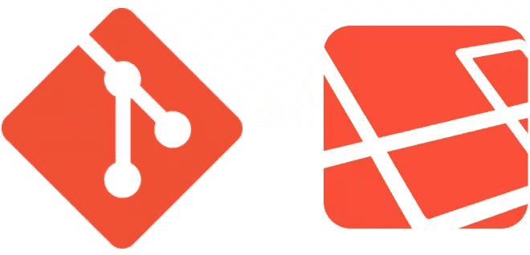
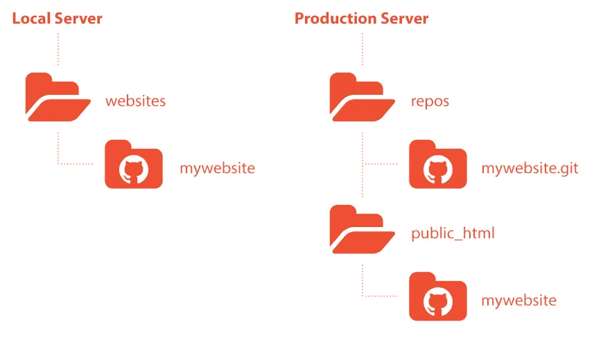
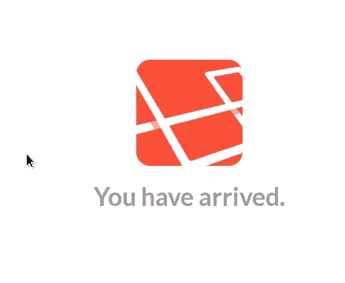
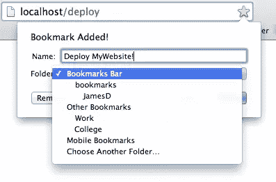

# 使用 Laravel 和 Git 部署您的网站

> 原文：<https://www.sitepoint.com/deploy-website-using-laravel-git/>



如果没有为您的网站使用某种部署工作流，您就不可能成为一名成功的 web 开发人员。不管你的工作流程是好是坏。如果你不能让你的网站投入生产，那么你的客户永远不会为你的辛勤工作付钱。

有许多不同的方法将您的网站部署到您的生产服务器。他们每个人都有自己的利弊清单，每个人都以同样的方式开始和结束。什么是一个好的网站部署工作流程是发生在中间。

有一天，我在做一个项目，在这个项目中，我使用 [FileZilla](https://filezilla-project.org/) 将我的文件 FTP 到我的现场制作服务器上。我从来不认为 FileZilla 是最容易使用的界面，但很长一段时间以来，我认为它是标准的做法。

对于同一个项目，我还使用 Git 来跟踪我的文件更改。当我停下来思考时，我开始打字。如果部署网站像推送 Git 存储库一样简单，岂不是很方便？

仔细想想，Git 是在部署中处理网站文件的完美工具。它跟踪你所有的文件更改，并且它只通过一个命令来推送或提取它所需要的内容。我决定踏上谷歌之旅，寻找在部署自己的网站时使用 Git 的方法。

我发现使用 Git 部署网站的一个流行方法是充分利用 Git 挂钩 ( [汤姆·奥兰喜欢使用类似的方法](https://www.sitepoint.com/interview-tom-oren-rob-allen/#how-have-you-implemented-deployment))。想象一下，当你在终端控制台输入`git push origin`时，Git 钩子会启动一个预定义的脚本。该预定义脚本访问您的生产服务器，并提取您最近的文件更改。使用您用来推送更改的相同命令，您也可以更新您的网站。我认为这种方法很棒，直到我意识到仅仅因为我推我的本地存储库并不意味着我准备好使用它。

我想要像用 Git 推送存储库一样简单的东西。更重要的是，我希望在推送直播内容时能够完全掌控。我能够找到一个类似的工作流程，使用 Git 来处理文件传输。最重要的是，我发现我还可以使用 PHP 框架 [Laravel](http://laravel.com/) 来自动化更多重复的任务。

以下是我想到的网站部署工作流程:

## 结构入门

在本节中，我们将建立一个`--bare`存储库作为我们的中央存储库，并通过克隆创建两个存储库。一个是我们将执行部署过程的本地网站，另一个是我们的实时网站。我们还将安装 Laravel。



在开始之前，您需要一个本地服务器和一个安装了 Git 的生产服务器。

##### 有用的资源:

*   [安装家园 _ 改良](https://www.sitepoint.com/quick-tip-get-homestead-vagrant-vm-running/)
*   [安装 Git 和刷新程序](https://www.sitepoint.com/git-for-beginners/)

#### 1.初始化您的`--bare`存储库

SSH 进入您的生产服务器，找到您希望中央存储库所在的目录。

```
ssh username@domain.com
cd repos
```

现在初始化您的存储库。

```
git init --bare --shared mywebsite.git
```

> 将此文件夹放在公共文件夹结构之外通常被认为是一种好的做法。这样，别人就不会偶然发现你的私人储存库。

#### 2.克隆以创建实时网站

确定您希望在`public_html`中的哪个位置托管您的实时网站文件。

```
cd ~/public_html/
```

现在克隆刚刚创建的中央`--bare`存储库，并注销这个 SSH 会话。

```
git clone username@domain.com:~/repos/mywebsite.git mywebsite
exit
```

#### 3.克隆以创建本地网站

如果你使用的是类似于 [Homestead](https://www.sitepoint.com/quick-tip-get-homestead-vagrant-vm-running/) 的东西，你可能需要使用 travel 命令 SSH 到你的本地服务器来访问你的文件。

```
vagrant ssh
```

按照您刚刚经历的步骤创建您的 live 网站。

```
cd websites
git clone username@domain.com:~/repos/mywebsite.git mywebsite
```

#### 4.设置 Laravel

在设置 Laravel 之前，您需要将其安装在您的本地网站上。

##### 有用的资源:

*   [安装 Laravel](http://laravel.com/docs/installation)

打开`/app/config/remote.php`，将您的远程服务器设置添加到配置文件中。

```
'connections' => array(
        'production' => array( 
            'host'      => 'domain.com',
            'username'  => 'username',
            'password'  => '********************',
            'key'       => '',
            'keyphrase' => '',
            'root'      => '/var/www',
        ),
    ),
```

> 记住“production”键，因为我们稍后将需要引用它。

将您的文件添加到您的本地网站存储库中，以便我们可以跟踪对它们的任何更改。

```
git add .
```

执行您的初始提交。

```
git commit -m 'initial commit with laravel'
```

最后，推到生产服务器上的中央存储库。

```
git push origin master
```



当你访问你的本地主机时，你应该看到 Laravel 的“你已经到达。”屏幕。

干得好！您已经完成了所有的设置和配置，所以现在您应该准备好开始有趣的工作了。

## 使用 Git 的核心工作流

一旦一切都设置好了，用 Git 部署你的网站就是小菜一碟。让我们看看代码，试着理解它的核心是什么。

> 理解工作流很重要，因为我们将在后面用 Laravel 在 PHP 中重写它。它还将帮助我们调试可能出现的任何问题。

#### 1.继续 SSH 到您的活动服务器，然后找到您的生产存储库。

```
ssh username@domain.com
cd public_html/mywebsite
```

#### 2.现在拉下您的中央存储库来合并新的文件更改。

```
git pull origin master
```

如果到目前为止你做了所有正确的事情，你应该看看 Laravel 的“你已经到了”当你访问你的网站时。

如果你想就此打住，我不会看轻你的。这本身就是一个非常可靠的部署工作流。但是我们可以通过使用 Laravel 实现自动化来提高效率。

## 使用 Laravel 实现自动化部署

好了，现在我们知道了如何使用 Git 部署网站，让我们使用 Laravel 来自动化这个过程。这一部分可能是不必要的，但如果你已经在使用 Laravel，我会问，“为什么不呢？”在这里使用 Laravel 使这个网站部署工作流变得简单、高效、可控和可定制。

#### 1.让我们首先创建一个引用控制器的简单路由。

打开`/app`文件夹中的`routes.php`页面，将下面一行 PHP 代码添加到文件中。

```
Route::get('/deploy', 'Server@deploy');
```

每当我们访问`http://localhost/deploy`时，`Server`控制器中的公共函数`deploy`就会执行。

#### 2.现在让我们创建我们引用的控制器，并保存它。

从一个扩展了`BaseController`的空`Server`类开始。

```
class Server extends BaseController {

    }
```

现在将一个公共函数`deploy`插入控制器。

```
class Server extends BaseController {

        public function deploy() {

        }
    }
```

将其保存在您的`/app/controllers`文件夹中，并将其命名为`Server.php`。

这就是有趣的地方！

#### 3.将 Laravel 的 SSH facade 插入到 deploy 函数中，并重复 Git 部署工作流。

插入 [SSH 门面](http://laravel.com/docs/ssh)。我们想访问我们之前设置的`production`远程配置。

```
SSH::into('production')->run();
```

现在`run()`函数将接受我们需要提供的两个参数。第一个，也是最重要的一个，是我们在执行`deploy`函数时想要运行的终端命令数组。

```
SSH::into('production')->run(array(
	    'cd ~/public_html/mywebsite',
	    'git pull origin master'
	));
```

第二个是我们希望调用的函数，用于处理我们从服务器接收到的反馈。

```
SSH::into('production')->run(array(
	    'cd ~/public_html/mywebsite',
	    'git pull origin master'
	), function($line){

	    echo $line.PHP_EOL; // outputs server feedback
	});
```

现在，无论何时我们想要部署我们的网站，我们所要做的就是访问`http://localhost/deploy`然后我们就完成了。够简单了吧？是，也不是。

在今晚结束之前，我们需要处理几个安全漏洞。任何人和他们的母亲都可以偶然发现`http://domain.com/deploy`并按原样部署我们的网站。我们需要做的是制定一些措施来防止这种情况发生。

有很多方法可以做到这一点，我们可以争论哪种方法是最安全的，直到我们脸都绿了。你可以用密码保护路由，你可以通过 IP 地址阻止访问，等等。

对于这个例子，我们将使用`.gitignore`，并在运行我们刚刚创建的`route`之前检查以确保该文件存在。

#### 4.在控制器中创建一个`.gitignore`文件来忽略`Server.php`。

创建一个新文件并在`/app/controllers`中保存为`.gitignore`。

将下面一行文本添加到文件中并保存。

```
Server.php
```

#### 5.在运行部署我们网站的`route`之前，确保`Server.php`文件存在。

还记得我们之前创建的用于部署网站的`route`吗？我们需要用这个条件语句来包装它，然后我们就可以开始使用它了。

```
if (file_exists(__DIR__.'/controllers/Server.php')) {
        // route goes here
    }
```

当我们全部完成时，它应该看起来像这样。

```
if (file_exists(__DIR__.'/controllers/Server.php')) {
	    Route::get('/deploy', 'Server@deploy');
    }
```

## 最后，变得有创意

所以你有它！只需准备好所有更新的文件，提交，推送，就可以开始部署 Git 友好的工作流了。



如果你愿意的话，你可以进一步学习本教程。只需将`http://localhost/deploy`添加到您的书签中，即可实现快速一键式部署。您甚至可以创建一个简单的 HTML 表单，发布到允许您提取特定分支的页面。可能性是无限的。

使用 Git 和 Laravel 进行部署已经使部署我的网站这一枯燥而令人生畏的任务变得有趣起来。如果你理解 Git 的话，它很容易设置，但是它更容易使用。

请与我分享你用来使网站部署更容易的创造性方法！

## 分享这篇文章