# 将您的 Rails 应用程序部署到 AWS

> 原文：<https://www.sitepoint.com/deploy-your-rails-app-to-aws/>

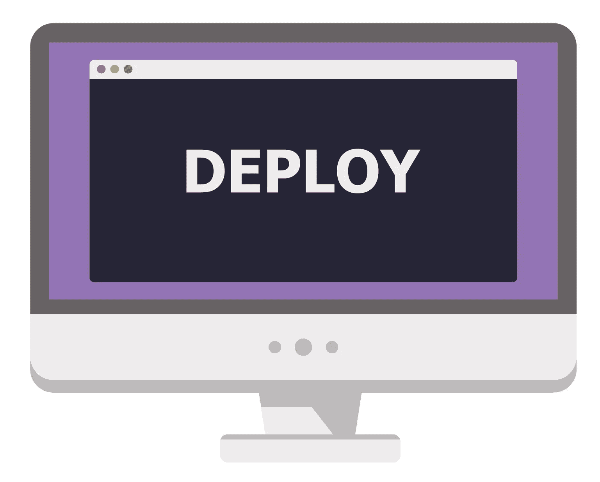

作为开发人员，我们通常关心任何应用程序的开发部分。我们不太考虑部署部分，因为我们认为这是系统管理员的责任。但是很多时候，我们没有专门的 SysAdmin 可用，所以我们必须戴上 SysAdmin 的帽子，把事情做好。部署 Rails 应用程序有很多选择。今天，我将介绍如何使用 Capistrano 将 Rails 应用程序部署到 Amazon Web Services (AWS)。

我们将使用 Puma + Nginx + PostgreSQL 栈。Puma 将是应用服务器，Nginx 是反向代理，PostgreSQL 是数据库服务器。这个堆栈也可以在 MRI Ruby 或 JRuby 上使用。这两种红宝石的大部分步骤都是一样的，但我也会强调它们的不同之处。

如果您有一个现有的应用程序，您可以跳过下一节，直接跳到下一节。

## 示例 Rails 应用程序

让我们用联系模型和 CRUD 创建一个示例 Rails 应用程序。该应用程序使用 Rails 4.2 和 PostgreSQL:

```
rails new contactbook -d postgresql 
```

生成应用程序后，创建一个联系模型和 CRUD:

```
cd contactbook
rails g scaffold Contact name:string address:string city:string phone:string email:string 
```

在`config/database.yml`中设置您的数据库用户名和密码，然后创建并迁移数据库:

```
rake db:create && rake db:migrate 
```

让我们来看看它是如何工作的:

```
rails s 
```

将你最喜欢的浏览器指向[http://localhost:3000/contacts](http://localhost:3000/contacts)，检查是否一切正常。

## 配置 Puma 和 Capistrano

我们现在将为部署配置应用程序。如前所述，Puma 是应用服务器，Capistrano 是我们的部署工具。Capistrano 为 Puma 和 RVM 提供了集成，因此将这些宝石添加到 Gemfile 中。我们还将使用 figaro gem 保存应用程序配置，如生产数据库密码和密钥:

```
gem 'figaro'
gem 'puma'
group :development do
  gem 'capistrano'
  gem 'capistrano3-puma'
  gem 'capistrano-rails', require: false
  gem 'capistrano-bundler', require: false
  gem 'capistrano-rvm'
end 
```

通过捆绑器安装 gems:

```
bundle install 
```

是时候配置 Capistrano 了，首先生成配置文件，如下所示:

```
cap install STAGES=production 
```

这将在 **config/deploy.rb** 和**config/deploy/production . Rb**为 Capistrano 创建配置文件。 **deploy.rb** 是主配置文件， **production.rb** 包含环境特定的设置，如服务器 IP、用户名等。

将以下几行添加到位于应用程序根目录下的 **Capfile** 中。完成后，Capfile 包括 RVM、Rails 和 Puma 集成任务:

```
require 'capistrano/bundler'
require 'capistrano/rvm'
require 'capistrano/rails/assets' # for asset handling add
require 'capistrano/rails/migrations' # for running migrations
require 'capistrano/puma' 
```

现在，编辑 **deploy.rb** 如下:

```
lock '3.4.0'

set :application, 'contactbook'
set :repo_url, 'git@github.com:devdatta/contactbook.git' # Edit this to match your repository
set :branch, :master
set :deploy_to, '/home/deploy/contactbook'
set :pty, true
set :linked_files, %w{config/database.yml config/application.yml}
set :linked_dirs, %w{bin log tmp/pids tmp/cache tmp/sockets vendor/bundle public/system public/uploads}
set :keep_releases, 5
set :rvm_type, :user
set :rvm_ruby_version, 'jruby-1.7.19' # Edit this if you are using MRI Ruby

set :puma_rackup, -> { File.join(current_path, 'config.ru') }
set :puma_state, "#{shared_path}/tmp/pids/puma.state"
set :puma_pid, "#{shared_path}/tmp/pids/puma.pid"
set :puma_bind, "unix://#{shared_path}/tmp/sockets/puma.sock"    #accept array for multi-bind
set :puma_conf, "#{shared_path}/puma.rb"
set :puma_access_log, "#{shared_path}/log/puma_error.log"
set :puma_error_log, "#{shared_path}/log/puma_access.log"
set :puma_role, :app
set :puma_env, fetch(:rack_env, fetch(:rails_env, 'production'))
set :puma_threads, [0, 8]
set :puma_workers, 0
set :puma_worker_timeout, nil
set :puma_init_active_record, true
set :puma_preload_app, false 
```

我们稍后将编辑 **production.rb** ，因为我们还不知道服务器 IP 和其他细节。

另外，创建 **config/application.yml** 来保存开发环境中任何特定于环境的设置。figaro gem 使用该文件将设置加载到环境变量中。我们也将在生产服务器上创建相同的文件。

需要记住的一点是从 Git 存储库中排除 **config/database.yml** 和 **config/application.yml** 。这两个文件都包含敏感数据，出于明显的安全考虑，这些数据不应签入版本控制。

## 创建 EC2 实例

配置好应用程序并准备好部署后，是时候启动新的 EC2 实例了。登录 [EC2 管理控制台](https://console.aws.amazon.com/ec2/)(显然，您需要注册一个 AWS 帐户):

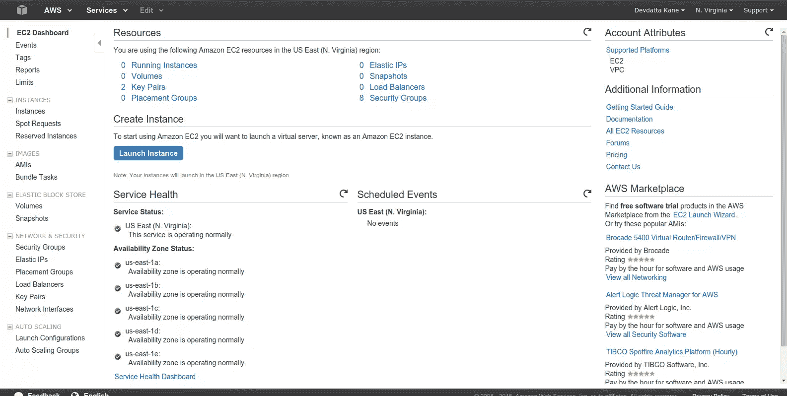

单击“启动实例”:

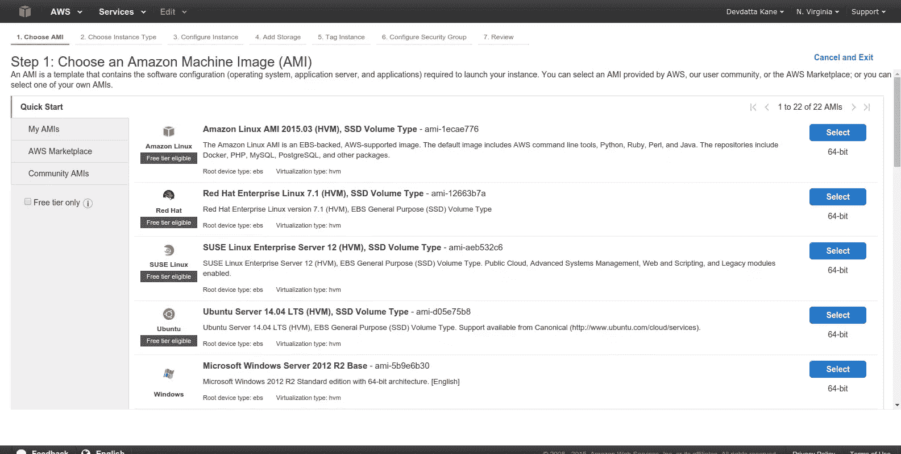

选择一个 Amazon 机器映像(AMI)。我们将使用“LTS Ubuntu 服务器 14.04”:

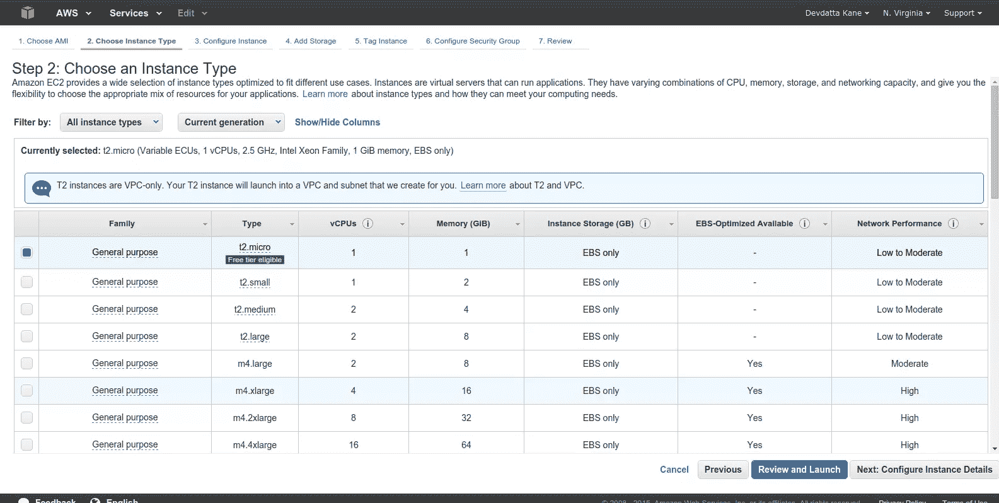

根据您的要求选择实例类型。我选择“t2.micro ”,因为它免费/便宜。对于真正的生产服务器，您可能希望更大。单击“下一步:配置实例详细信息”继续。

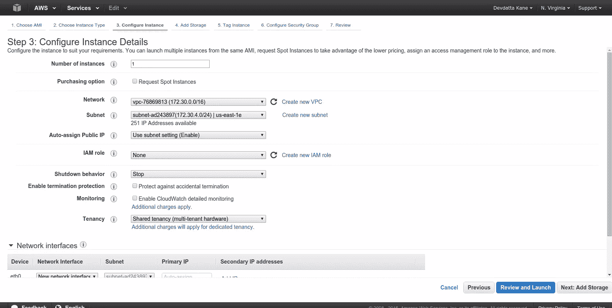

默认设置适合我们的教程。单击“下一步:添加存储”。

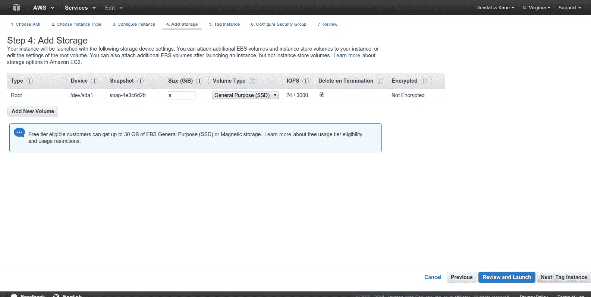

默认存储为 8GB。根据您的空间需求进行调整。单击“下一步:标记实例”

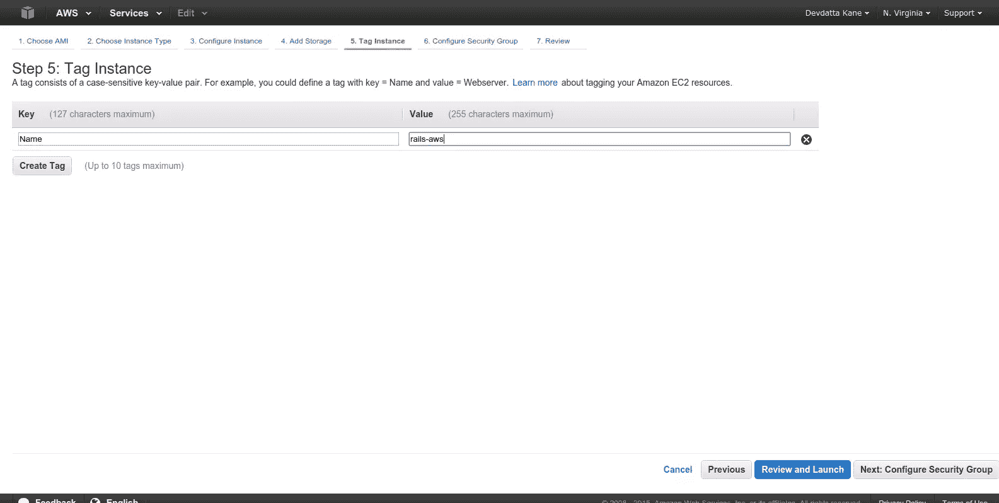

输入实例名称。单击“下一步:配置安全组”。

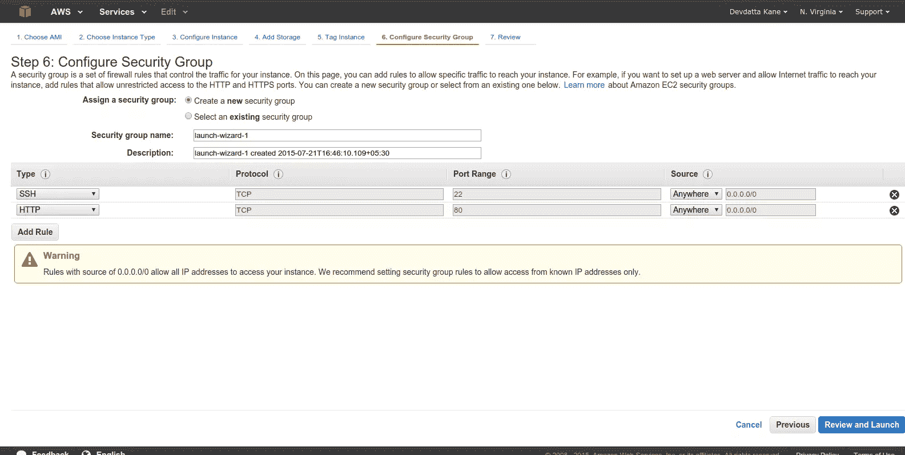

单击“添加规则”。从“类型”中选择“HTTP”。这是从互联网访问 nginx 服务器所必需的。点击“查看并启动”

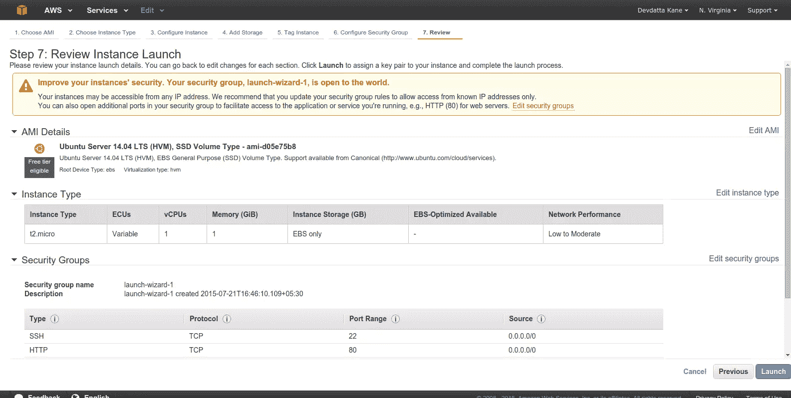

检查所有设置是否正确。点击“启动”

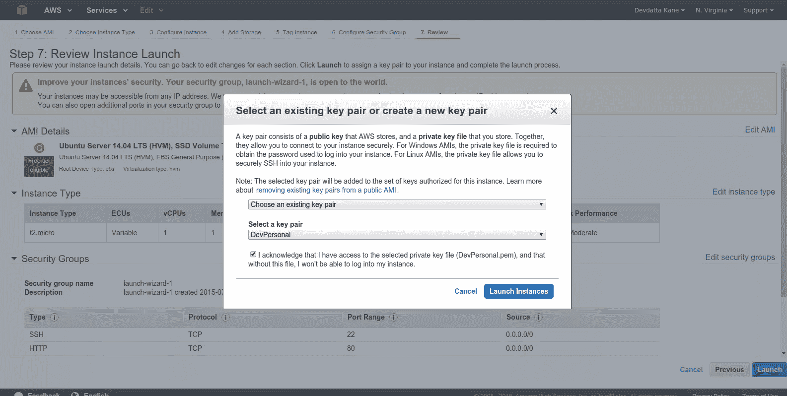

选择或创建一个密钥对以连接到实例。为了 ssh 到 EC2 实例，您的本地机器上必须有私钥。关键要活在你的 **~/里。ssh** 目录。单击复选框“我确认…”并单击“启动实例”。等待实例启动。


该实例应处于“正在运行”状态。选择实例并单击“连接”。

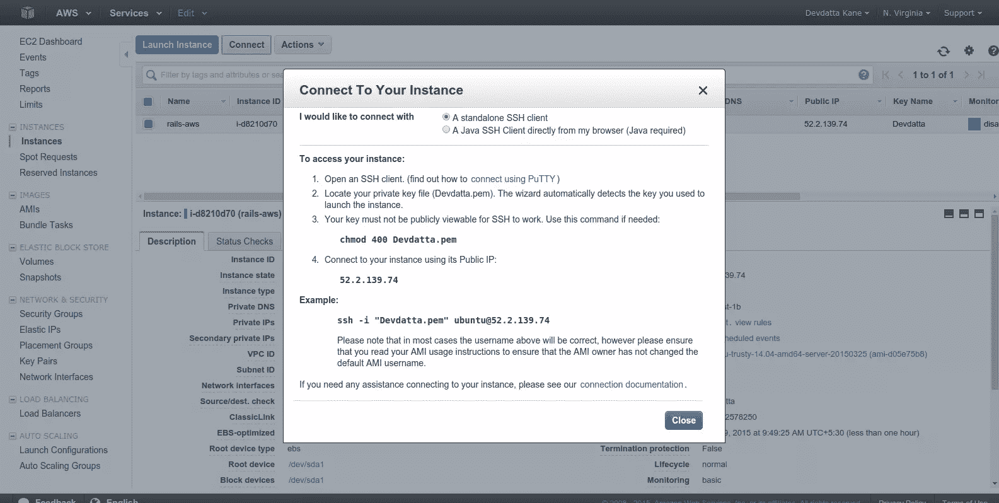

记下“公共 IP”地址(在截图中是 52.2.139.74。你的将会不同。).我们将需要它来连接到服务器。

## 设置服务器

我们现在已经配置了服务器，是时候设置一些基本的东西了。首先，用我们选择的私钥 SSH 到服务器。用私钥的完整路径替换“Devdatta.pem ”:

```
ssh -i "Devdatta.pem" ubuntu@52.2.139.74 
```

您已登录到全新的服务器。首先更新现有包:

```
sudo apt-get update && sudo apt-get -y upgrade 
```

创建一个名为`deploy`的用户来部署应用程序代码:

```
sudo useradd -d /home/deploy -m deploy 
```

这将创建用户`deploy`及其主目录。应用程序将被部署到此目录中。为`deploy`用户设置密码:

```
sudo passwd deploy 
```

输入密码并确认。RVM 需要这个密码来安装 Ruby。此外，还要将`deploy`用户添加到 sudoers 中。运行`sudo visudo`并将以下内容粘贴到文件中:

```
deploy ALL=(ALL:ALL) ALL 
```

保存文件并退出。

由于我们将使用 GitHub 托管我们的 Git 存储库，`deploy`用户将需要访问存储库进行部署。因此，我们现在将为该用户生成一个密钥对:

```
su - deploy
ssh-keygen 
```

不要为密钥设置密码，因为它将被用作部署密钥。

```
cat .ssh/id_rsa.pub 
```

复制输出，并将[设置为 GitHub](https://help.github.com/articles/generating-ssh-keys/#step-4-add-your-ssh-key-to-your-account) 上的部署键。

Capistrano 将通过 ssh 连接到服务器，作为`deploy`帐户进行部署。因为 AWS 只允许公钥认证，所以将公钥从本地机器复制到 EC2 实例上的`deploy`用户帐户。在大多数情况下，公钥是默认的`~/.ssh/id_rsa.pub`密钥。在服务器上:

```
nano .ssh/authorized_keys 
```

将您的本地公钥粘贴到文件中。保存并退出。

Git 是通过 Capistrano 进行自动化部署所必需的，所以在服务器上安装 Git:

```
sudo apt-get install git 
```

如果您使用的是 JRuby，请安装一个 Java 虚拟机(JVM):

```
sudo apt-get install openjdk-7-jdk 
```

### 安装 Nginx

首先，安装我们的反向代理 Nginx:

```
sudo apt-get install nginx 
```

现在，按照我们的要求配置默认站点。打开站点配置文件:

```
sudo nano /etc/nginx/sites-available/default 
```

注释掉现有内容，并将以下内容粘贴到文件中。

```
upstream app {
  # Path to Puma SOCK file, as defined previously
  server unix:/home/deploy/contactbook/shared/tmp/sockets/puma.sock fail_timeout=0;
}

server {
  listen 80;
  server_name localhost;

  root /home/deploy/contactbook/public;

  try_files $uri/index.html $uri @app;

  location / {
    proxy_set_header X-Forwarded-Proto $scheme;
    proxy_set_header X-Forwarded-For $proxy_add_x_forwarded_for;
    proxy_set_header X-Real-IP $remote_addr;
    proxy_set_header Host $host;
    proxy_redirect off;
    proxy_http_version 1.1;
    proxy_set_header Connection '';
    proxy_pass http://app;
  }

  location ~ ^/(assets|fonts|system)/|favicon.ico|robots.txt {
    gzip_static on;
    expires max;
    add_header Cache-Control public;
  }

  error_page 500 502 503 504 /500.html;
  client_max_body_size 4G;
  keepalive_timeout 10;
} 
```

保存文件并退出。我们将 nginx 配置为反向代理，通过 UNIX 套接字将 HTTP 请求重定向到 Puma 应用服务器。我们还不会重启 nginx，因为应用程序已经准备好了。现在让我们安装 PostgreSQL。

### 安装 PostgreSQL

```
sudo apt-get install postgresql postgresql-contrib libpq-dev 
```

安装 postgreSQL 后，创建一个生产数据库及其用户:

```
sudo -u postgres createuser -s contactbook 
```

从`psql`控制台设置用户密码:

```
sudo -u postgres psql 
```

登录控制台后，更改密码:

```
postgres=# \password contactbook 
```

输入您的新密码并确认。用`\q`退出控制台。是时候为我们的应用程序创建一个数据库了:

```
sudo -u postgres createdb -O contactbook contactbook_production 
```

### 安装 RVM 和鲁比

我们将使用 RVM 来安装我们想要的 Ruby 版本:

```
su - deploy
gpg --keyserver hkp://keys.gnupg.net --recv-keys 409B6B1796C275462A1703113804BB82D39DC0E3
\curl -sSL https://get.rvm.io | bash -s stable 
```

这将把 RVM 安装到`deploy`用户的主目录中。注销并再次登录，将 RVM 加载到`deploy`用户的 shell 中。用 Ctrl+D 退出，然后用`su - deploy`重新登录。

现在，安装 Ruby:

用于使用 MRI 红宝石-`rvm install ruby`

对于 JRuby-`rvm install jruby`

安装 Ruby 后，切换到已安装的版本:

```
rvm use jruby 
```

运筹学

```
rvm use ruby 
```

安装捆扎机:

```
gem install bundler --no-ri --no-rdoc 
```

创建 Capistrano 所需的目录和文件。我们将创建 **database.yml** 和 **application.yml** 文件来存储数据库设置和其他特定于环境的数据:

```
mkdir contactbook
mkdir -p contactbook/shared/config
nano contactbook/shared/config/database.yml 
```

将以下内容粘贴到 **database.yml** 中:

```
production:
  adapter: postgresql
  encoding: unicode
  database: contactbook_production
  username: contactbook
  password: contactbook
  host: localhost
  port: 5432 
```

之后，创建 **application.yml**

```
nano contactbook/shared/config/application.yml 
```

并添加以下内容:

```
SECRET_KEY_BASE: "8a2ff74119cb2b8f14a85dd6e213fa24d8540fc34dcaa7ef8a35c246ae452bfa8702767d19086461ac911e1435481c22663fbd65c97f21f6a91b3fce7687ce63" 
```

使用`rake secret`命令将密码更改为新密码。

好了，我们差不多搞定服务器了。回到您的本地机器，开始使用 Capistrano 进行部署。编辑**config/deploy/production . Rb**来设置服务器 IP。打开文件，将以下内容粘贴到文件中。更改 IP 地址以匹配您的服务器的 IP 地址:

```
server '52.2.139.74', user: 'deploy', roles: %w{web app db} 
```

现在让我们使用 Capistrano 开始部署:

```
cap production deploy 
```

由于这是第一次部署，Capistrano 将在服务器上创建所有必要的目录和文件，这可能需要一些时间。Capistrano 将部署应用程序、迁移数据库并启动 Puma 应用服务器。现在，登录到服务器并重启 nginx，这样我们的新配置就会重新加载:

```
sudo service nginx restart 
```

打开浏览器，指向*/联系人*。应用程序应该工作正常。


## 包裹

今天，我们学习了如何使用 Capistrano 在 AWS 上部署 Rails 应用程序。我们的应用程序很简单，不使用额外的服务，比如后台作业，所以我今天没有介绍它。但是复杂的应用程序可能需要安装和配置这些服务。但那是以后的事了。

欢迎您的评论和意见。

## 分享这篇文章