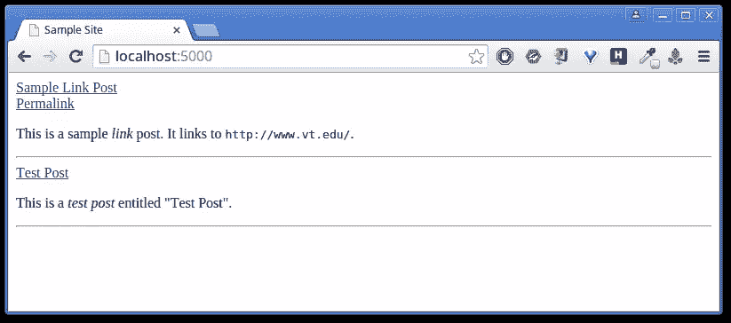

# 将您的第一个 Camel.js 博客部署到 Heroku

> 原文：<https://www.sitepoint.com/deploying-camel-js-blog-heroku/>

Camel 是一个 Node.js 博客平台，它被设计成快速、简单和精简的。

用《骆驼》的作者凯西·利斯的话说:

> Camel 既不是一个静态的博客平台，也不是一个真正动态的平台。第一次加载帖子时，通过将 Markdown 转换为 HTML 来呈现，然后通过添加页眉和页脚以及替换元数据来进行后期处理。完成渲染后，生成的 HTML 将被存储并从此处开始使用。

如果你想看看骆驼在野外奔跑的一些例子，你可以在[Liss More](http://caseyliss.com)查看原始的骆驼动力博客，或者我的两个骆驼动力博客:[的数据小飞侠博客](http://blog.datamcfly.com)，和【RogerStringer.com】的。后者的前身是 WordPress 博客，有超过 2550 篇博文，涵盖了超过十年的博客，它很顺利地迁移到了 Camel。

我从 2014 年 10 月开始使用 Camel，使用它很有趣，尽管最初的设置可能有点有趣。记住这一点，在本文中，我们将介绍如何设置您的第一个 Camel 博客并部署到 Heroku。

## Camel 入门

首先，确保您已经安装了 Node.js 和 npm。你可以从这里下载节点[，从这里](http://nodejs.org/)下载 npm [。如果你需要安装 Node.js(或 npm)的帮助，那么看看](https://www.npmjs.com/)[最近的这篇 SitePoint 文章](https://www.sitepoint.com/beginners-guide-node-package-manager/)，它涵盖了这个主题。

接下来，我们需要一份骆驼回购协议:

```
git clone https://github.com/cliss/camel.git
```

这将创建一个名为`camel`的文件夹，进入这个文件夹并运行`npm install`来安装依赖项。

现在，我们可以通过键入`node camel.js`来测试 Camel 是否在工作。如果一切顺利，您应该能够在浏览器中访问`http://localhost:5000`,并看到一个基本的 Camel 安装。



## Camel 模板系统

Camel 的模板文件存储在`templates`文件夹中。

```
+-- templates/
|     +-- defaultTags.html
|     +-- header.html
|     +-- footer.html
|     +-- postHeader.html
|     `-- rssFooter.html

```

*   是我们存储站点元数据的地方，比如作者信息、站点 URL 和站点标题。
*   是我们博客的标题，显示在网站的每一页上。
*   `footer.html`是站点页脚，也显示在每个页面上。
*   `postHeader.html`是用来显示文章标题的文件。这将被插入到网站标题之后，并在每篇文章中显示。
*   `rssFooter.html`显示在每个 RSS 项目的末尾。这可以是一个回到你博客的链接，或者是一个告诉读者文章来源的简介。

在 Camel 中，循环的处理略有不同，它们不是在单独的文件中，而是作为手柄模板存储在`posts/index.md`文件中:

```
@@ Title=Home
@@ BodyClass=homepage
@@ DayTemplate=<div class="day">...</div>
@@ ArticlePartial=<div class="article">...</div>
@@ FooterTemplate=<div class="paginationFooter">...</div>
```

此页面包含三个在站点范围内使用的把手模板:

*   `DayTemplate`用于渲染每天列表上的帖子。
*   `ArticlePartial`用于渲染单篇文章。
*   `FooterTemplate`用于在页面底部呈现分页。

最后，我们需要考虑造型。打开`templates/header.html`，将`<body>`标签替换为:

```
<body class="@@BodyClass@@">
  <div class="container">
    <div class="content">
      <div class="header">
        <div class="siteTitle"><a href="/">@@SiteTitle@@</a></div>
        <div class="siteByline">By @@siteAuthor@@</div>
        <nav>
          <a href="/about" rel="author">About</a>
          <span class="dot">&bull;</span>
          <a href="/rss">RSS</a>
        </nav>
      </div><!-- header -->
      <div class="main">
```

这将为我们的站点标题提供定义。

打开`templates/footer.html`并添加网站页脚:

```
</div><!-- main -->
      </div><!-- content -->
      <footer>
        <p class="copyright">Copyright &copy; 2015 - My Site</p>
      </footer>
    </div><!-- container -->
  </body>
</html>
```

最后打开`public/css/site.css`添加一些样式。我们将使用[这个片段](https://github.com/sitepoint-editors/Code-Snippets/blob/master/Camel.js/site.css)，但是您可以随意添加自己的片段。

将您的更改提交到 Git:

```
git add .
git commit -m "Added basic styling"
```

然后重启服务器并刷新浏览器

### 关于缓存的一句话

默认情况下，每次对您的 Camel 博客进行任何更改并希望在浏览器中查看它们时，您都必须重启服务器(缓存每三十分钟清除一次)。这很快就会变得令人讨厌。

要解决此问题，请取消注释`camel.js`中的以下行:

```
// app.get('/tosscache', function (request, response) {
//     emptyCache();
//     response.send(205);
// });
```

重启服务器，然后您将有一个`/tosscache`路径可用，顾名思义，清空缓存并允许您预览更改而无需重启。

## 活放骆驼

现在是时候让全世界看到你的骆驼博客了。我们将使用 Heroku 作为我们的网络主机，因为它可以很好地处理 Node.js 站点。

首先，注册一个免费账户。然后，下载并安装[Heroku tool belt](https://toolbelt.heroku.com/)——一个非常方便的命令行工具，可以让你从终端管理你的站点。

通过五个简单的步骤，我们现在将创建我们的 Heroku 应用程序并部署我们的博客。从终端的`camel`文件夹中:

1.  登录 Heroku。
2.  在 Heroku 中创建应用程序。
3.  把你的网站推向 Heroku。
4.  `heroku ps:scale web=1`告诉 Heroku 创建一个 [dyno](https://devcenter.heroku.com/articles/dynos) (一个工人，响应网络请求)。
5.  `heroku open`在新的自定义网址打开浏览器。

### 添加您自己的域名

现在，您将获得一个随机生成的子域，表示为`http://random-name-12345.herokuapp.com`。这对于测试来说没问题，但对于你希望每个人都阅读的真正的世界级博客来说就不一样了。

要将您自己的域名添加到 Heroku 应用程序，请从终端运行以下命令:

```
heroku domains:add www.mysite.com
```

然后，当你使用你的 DNS 管理工具时，它可能是 GoDaddy、CloudFlare(或其他任何地方)，你只需将你的域名作为一个`CNAME`记录指向你的站点。

因此，如果您有 Heroku 子域:`random-name-12345.herokuapp.com`，并且您将它指向一个名为`myawesomeblog.com`的域，您的 CNAME 将如下所示:

```
www CNAME random-name-12345.herokuapp.com
myawesomeblog.com CNAME random-name-12345.herokuapp.com
```

## 本地管理职位

当您添加新帖子时，文件会先添加到年份文件夹，然后添加到月份文件夹，最后添加到您为其创建帖子的日期文件夹。例如，要添加 2015 年 2 月 24 日的帖子，我们需要以下文件夹结构:

```
`-- posts/
    +-- 2015/
    |     +-- 2/
    |     |   +-- 24/
    |     |   |    `-- my-new-blog-post.md

```

文件`my-new-blog-post.md`是新帖。如果你在新的一个月或一天创建一篇文章，那么你可以在进行的过程中创建这些文件夹。

页面，比如`/about`，是在`posts`文件夹的根目录下创建的。

现在，让我们编辑我们的`my-new-blog-post.md`并添加一些内容。对于每个帖子，元数据在顶部指定，可以在正文中使用。

```
@@ Title=Hello, World!
@@ Date=2015-03 17:50
@@ Description=This is a short description used in Twitter cards and Facebook Open Graph.
@@ Image=http://somehost.com/someimage.png

This is a *test post* entitled "@@Title@@".
```

`Title`和`Date`字段是必填的。任何其他元数据，比如`Description`和`Image`，都是可选的。

## 向 Heroku 推送更新

一旦你添加或编辑了文章，你会想要将更新后的博客部署到 Heroku。

为此，将文件提交给 Git ( [，如上图](#commit-git)所示)，然后运行:

```
git push heroku master
heroku open
```

哪个会把你的修改推送到 Heroku 并在你的浏览器中打开更新的博客

这种方法的唯一缺点是，你被限制在你设置它的计算机上。如果你是移动用户，并且想在平板电脑或手机上编辑文章，这并不合适。

幸运的是，Heroku 已经覆盖了你，并允许你与你的 Dropbox 帐户同步。

## 从您的 Dropbox 帐户管理帖子

设置你的 Camel 博客与你的 Dropbox 账户同步，你可以在任何地方编辑文章。我经常从我的 iPhone 或 iPad 上起草帖子，然后把新帖子发布到 Heroku 上。

要设置这个，让我们进入你的 Heroku 帐户，点击你为你的博客设置的 Heroku 应用程序。

点击`Deploy`按钮，选择`Dropbox`。

然后，系统会提示您将 Dropbox 帐户链接到 Heroku 应用程序。完成此操作后，您的 Camel 博客将出现在您的 Dropbox 帐户中。

Heroku 在以下文件夹结构中设置您的站点:

```
`– Apps/
    +– Heroku/
    |     +– my-camel-blog/

```

从现在开始，你可以直接进入那个文件夹，添加或编辑文章和模板。

### 通过 Dropbox 部署

完成更改后，就可以再次部署了。

使用 Dropbox 设置，通过登录 Heroku 仪表板将更改推送到 Heroku，而不是从终端推送更改。

当您准备好部署变更时，输入变更内容的简短描述，然后单击 Heroku 仪表板上的`Deploy`按钮。您为部署输入的消息用作提交消息。

仪表板将在你开始发布后显示发布的进度，并让你知道是否有任何问题。

## 结论

在本教程中，你已经学习了如何将你的第一个 Camel 博客部署到 Heroku，如何在本地使用你的博客，以及如何使用 Dropbox 在任何设备上编辑和撰写文章。

总的来说，Camel 是一个整洁的博客引擎，它很容易扩展和构建。例如，如果你看一下 Camel 的[数据小飞侠版本，我已经添加了对类别和网站地图的支持。](http://github.com/DataMcFly/camel)

相比其他博客引擎，我更喜欢 Camel，主要是因为它简单且不臃肿。

## 分享这篇文章