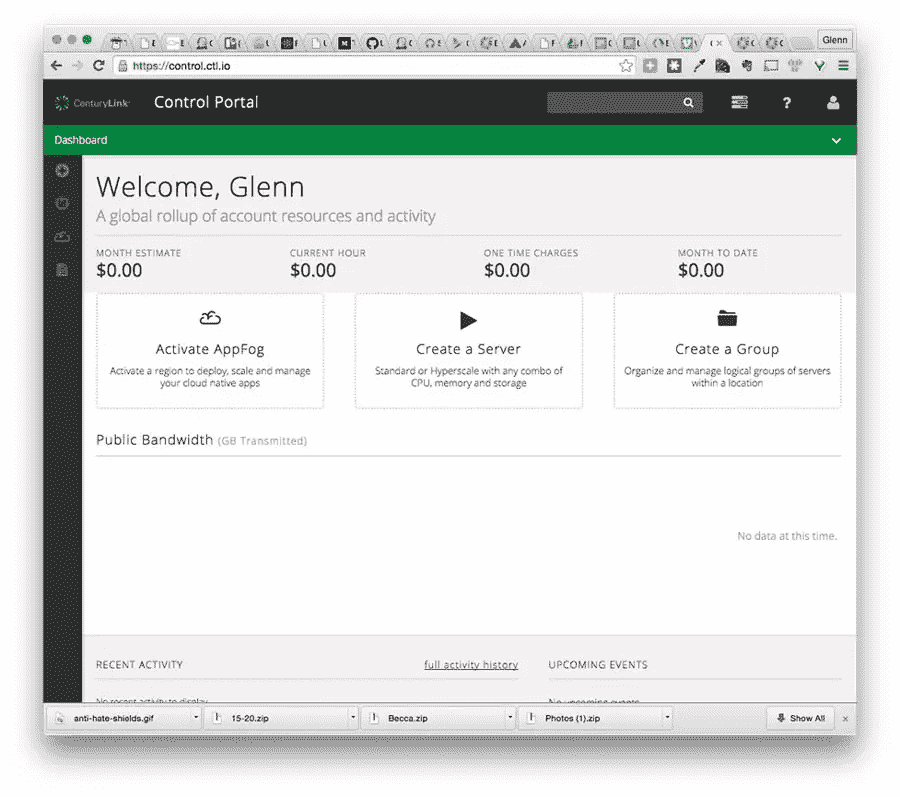
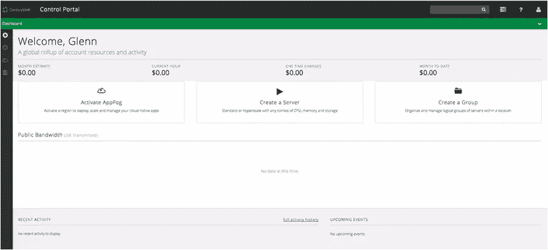
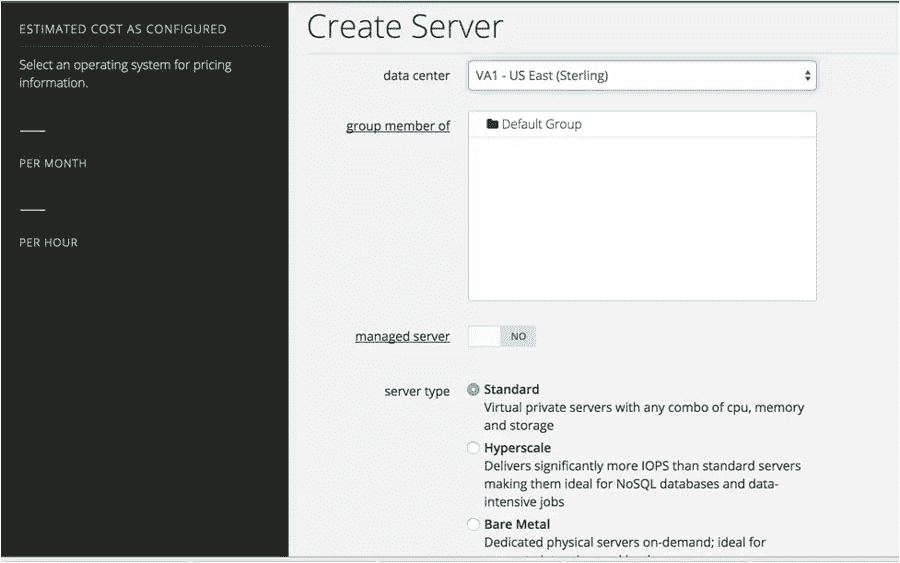
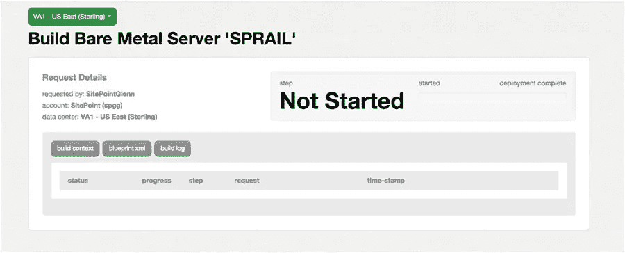
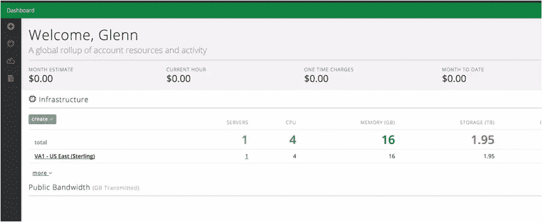
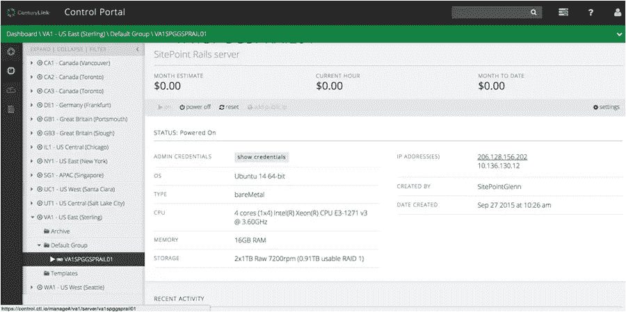

# 用裸机部署 Ruby 应用:一种新型的虚拟机

> 原文：<https://www.sitepoint.com/deploying-ruby-apps-bare-metal-self-sufficient-containers-right-way/>

*本文由[世纪云](https://www.ctl.io/)赞助。感谢您对使 SitePoint 成为可能的赞助商的支持。*

CenturyLink 是一家提供多种平台即服务(PaaS)产品的公司。在为特定的应用程序选择使用哪种服务时，基本上有两条途径。第一首曲目是 AppFog，是一首你懂我爱的纯 PaaS。AppFog 提供基础设施，您提供应用程序和数据。AppFog 提供了用于部署的命令行界面(CLI ),以及用于监控您的资源的漂亮仪表板。

CenturyLink 提供的另一个领域是基础设施即服务，包括虚拟机和另一个名为裸机的产品，我们将在本文中讨论。裸机提供“物理服务器的计算能力，加上虚拟机的自动化和按需付费的灵活性”。裸机服务器不是共享虚拟机，所以你不用担心资源共享。但是，它们像虚拟机一样运行，因此您可以在隔离物理机的情况下获得虚拟机的响应能力和快速部署。

对于不适合其他虚拟化环境的数据库服务器或应用程序，您可能会使用裸机。像批量计算这样的任务，在短时间内需要大量的计算资源，非常适合裸机。此外，像分析这样的项目非常合适，因为您可以管理 Hadoop 等软件的复杂性和分析计算的独特需求。

另一个有趣的功能是裸机服务器被集成到 CenturyLink Cloud 中，就像 AppFog 这样的服务一样。这允许您混合 PaaS 应用程序、数据库、昂贵的计算任务以及任何其他任务，从同一个仪表板管理它们。据我所知，没有其他 PaaS 提供这样的菜单，你必须在 Amazon Web Services (AWS)上做大量的工作才能获得同样的便利。

[这里的](https://www.ctl.io/knowledge-base/servers/server-comparison-matrix/)是裸机服务器与其他服务器选项的比较。

在今天的帖子中，我将介绍如何创建一个裸机服务器，并为其部署一个(非常)简单的 Rails 应用程序。

## 设置

在我们开始我们的旅程之前，您需要一个 CenturyLink 的帐户以便跟进。有免费试用(需要付费方式，仅供参考)。所以，去世纪链接网站点击“免费试用”。遵循注册程序，您就可以开始了。

## 调配裸机服务器

在登录到 [CenturyLink 控制门户](http://control.ctl.io/)后，显示仪表板:



要开始创建服务器的过程，请单击大的“创建服务器”或边栏上的“+”并选择“服务器”。



并非所有数据中心都提供裸机服务器。我必须从“数据中心”下拉列表中选择“VA1–美国东部(英镑)”，以便将“裸机”作为“服务器类型”的选项。如果您所在的数据中心应该有裸机服务器，但您无法选择它们，请联系客户服务部以确保您的帐户启用了它们。



CenturyLink 有一些关于如何配置服务器的很棒的文档，你可以点击这里的。我使用了以下选项:

*   的**组成员:默认组**
*   **服务器类型**:裸机
*   **配置** : 4 核(最小选项)
*   **操作系统** : Ubuntu 14 64 位
*   **服务器名** : sprail
*   **主域名系统**:8.8.8.8(谷歌域名系统)
*   **二级域名系统**:8.8.4.4(谷歌域名系统)

点击“创建服务器”后，您将看到以下内容:



如果您停留在此页面上，服务器将经历 3 个设置步骤:验证、请求资源和启动。

当我们配置我们的服务器时，配置要求选择一个组。在我们的示例中，我们选择了“默认组”。我打赌你想知道什么是“团体”，是吗？在 CenturyLink Cloud 上，群组允许您批量管理多个服务器。可以分组完成的工作示例如下:

*   批量操作，如加电/断电等。
*   根据项目或任何其他逻辑原因对服务器和资源进行分组。
*   创建服务器之间的父子关系，级联任务等。
*   支持复杂的计费，您可以向客户收取使用费。

群体是非常强大的，你应该[阅读](https://www.ctl.io/groups/)关于他们的文章以了解更多。

值得注意的是，CenturyLink 确实提供了一个 REST API，它为您通过仪表板可以做的任何事情提供端点，包括配置服务器。

一旦您选择了服务器并确定了大小，我们将开始创建 Rails 应用程序。

## 部署 Rails 应用程序

当我返回控制面板时，我的数据中心现已列出:



单击该数据中心会显示数据中心的特定视图，但这并不十分有趣。要访问服务器，请展开数据中心左侧列表中的“默认组”文件夹，并选择您的服务器:



在这里，您可以检索管理员凭据(在配置期间设置)并查看服务器的配置，包括要连接的服务器的 IP 地址。确保您已连接到创建服务器时提供给您的 VPN。(参见“[如何配置客户端 VPN](https://www.ctl.io/knowledge-base/network/how-to-configure-client-vpn/) ”中的说明。).

现在，您将能够使用 ssh root@通过 SSH 进入机器。当系统提示您输入密码时，请使用您在设置期间指定的密码。

正如我提到的，裸机服务器的行为类似于虚拟机，但它们不是共享的。因此，将 Rails 部署到裸机服务器与将任何 POSIX 设备设置为 Rails 服务器完全一样。这些步骤是:

1.  创建部署用户。
2.  安装一个 web 服务器(在我们的例子中是 Nginx)。
3.  浓缩你的 Rails 应用
4.  将 Rails 应用程序添加到源代码控制中。
5.  推动你的改变。
6.  运行部署任务。

前 4 个步骤是一次性的，因此一旦部署工作开始，将应用程序部署到一个非常强大的独立机器上是一个简单(并且非常可脚本化)的两步过程。

## 服务器端设置

对于这些任务，您需要通过 SSH 登录到裸机服务器。

### 创建部署用户

如果您不熟悉基本的 Unix 任务，比如创建用户，这并不太难。在服务器上键入以下内容:

```
$ adduser deploy
...Answer the prompts, give the user a good password...
$ gpasswd -a demo sudo
```

最后一个命令将 deploy 用户添加到 sudoers 组，这样我们就可以在需要时运行更高特权的命令。

### 创建/使用公钥

如果您以部署用户的身份对 SSH 使用公钥认证，那么您的部署会顺利得多。如果您的*本地*机器上有一个密钥对，您可以使用它，否则使用 ssh-keygen 创建一个。同样，这是在您的本地/开发机器上:

```
$ ssh-keygen
...ssh-keygen output...
Generating public/private rsa key pair.
Enter file in which to save the key (/Users/your-user-name/.ssh/id_rsa):
```

只需点击回车键接受文件名。系统会提示您输入密码短语，我建议您暂时不要输入。如果您选择添加一个密码短语(顺便说一句，这样更安全)，每次部署时都会提示您输入。

您现在应该在您的 **~/中有一个 **id_rsa.pub** 文件。宋承宪**目录。需要复制到服务器上。这个**。pub** 文件需要复制到服务器。最简单的方法是通过`ssh-copy-id`命令，它就是为此目的而设计的。在您的本地计算机上:

```
$ ssh-copy-id deploy@SERVER-IP-ADDRESS
```

将提示您输入部署用户的密码，然后将复制公钥文件。

此时，`ssh deploy@SERVER-IP`应该“正常工作”,不会提示输入密码。

### 安装 Nginx

让我们安装 Nginx。包管理器使这变得简单。作为服务器上的 root 用户，键入:

```
$ apt-get install nginx git-core nodejs -y
... All kinds of output..
```

好了，Nginx 安装好了。如果你打开浏览器，进入**http://SERVER-IP-ADDRESS，你会看到 Nginx 的欢迎页面:

### 安装红宝石(RVM)和朋友

我爱 RVM。它让生活变得更容易。让我们[把它](https://rvm.io/rvm/install)安装在服务器上，这样我们就可以随着我们不可思议的应用程序的增长和永久存在而轻松升级 Ruby。

以部署用户的身份 SSH 到机器中。

```
$ gpg --keyserver hkp://keys.gnupg.net --recv-keys
409B6B1796C275462A1703113804BB82D39DC0E3
...output..
gpg: Total number processed: 1
gpg:               imported: 1  (RSA: 1)

$ \curl -sSL https://get.rvm.io | bash -s stable --ruby
...this will prompt for the deploy user password...
...then install ruby 2.2.1...
Creating alias default for ruby-2.2.1...

* To start using RVM you need to run `source /home/deploy/.rvm/scripts/rvm`
  in all your open shell windows, in rare cases you need to reopen all shell windows.

$ source /home/deploy/.rvm/scripts/rvm
$ ruby -v
ruby 2.2.1p85 (2015-02-26 revision 49769) [x86_64-linux]
```

非常好。Ruby 已安装。我们也需要 Bundler，因为 Gemfiles 统治着 Ruby 世界。

```
$ gem install bundler --no-ri --no-rdoc
Successfully installed bundler-1.10.6
1 gem installed
```

### 饭桶

我们的部署将从源代码控制中获取最新的代码。对于这个应用程序，我打算使用 Github。记住，当我们安装 nginx 时，我们在前面的 apt-get 安装步骤中安装了 git。部署过程需要能够在不登录的情况下访问我们的 git 存储库，所以这里是另一个公钥认证场景。部署用户还没有密钥文件，所以生成一个:

```
# AS THE DEPLOY USER ON THE SERVER
$ ssh-keygen -t rsa
Generating public/private rsa key pair.
Enter file in which to save the key (/home/deploy/.ssh/id_rsa):
Enter passphrase (empty for no passphrase):
Enter same passphrase again:
Your identification has been saved in /home/deploy/.ssh/id_rsa.
Your public key has been saved in /home/deploy/.ssh/id_rsa.pub.
The key fingerprint is:
90:4d:56:9c:50:7d:b3:05:26:ad:61:64:4b:84:05:26 deploy@VA1SPGGSPRAIL01
The key's randomart image is:
...a really weird piece of ASCII art...
```

有了我们的密钥对，需要将密钥的公共部分[添加到 Github](https://developer.github.com/guides/managing-deploy-keys/) 中。基本上，登录 Github，进入你的[账户设置](https://github.com/settings/profile)点击“SSH 密钥”，然后“添加 SSH 密钥”:

如果你做对了，输入`ssh -T git@github.com`会得到:

```
$ ssh -T git@github.com
Warning: Permanently added the RSA host key for IP address '192.0.2.0' to the list of known hosts.
Hi! You've successfully authenticated, but GitHub does not provide shell access.
```

## Rails 应用程序

因为本文的重点是部署，所以 Rails 应用程序相对简单。我们将创建一个单一的控制器和视图，并更改/添加一些 gem 来表示某种“真实”的部署。

我使用的是 Ruby 2.2 和 Rails 4.2.4，我回到了我的本地机器上。键入 rails new 后，就该修改 Gemfile 了。我简单地添加了美洲狮和各种各样的 T2 宝石。它看起来像这样:

```
 ...other gems...
gem 'puma'

group :development do
  gem 'web-console', '~> 2.0'  # this was already here
  gem 'pry-rails' # I love Pry

  gem 'spring'

  gem 'capistrano',         require: false
  gem 'capistrano-rvm',     require: false
  gem 'capistrano-rails',   require: false
  gem 'capistrano-bundler', require: false
  gem 'capistrano3-puma',   require: false
end 
```

做出这些改变，然后打包走人。

我提到这将是一个简单的应用程序。快速生成一个`Home`脚手架:

```
$ rails g scaffold Thing names:string purpose:string
...lots of output...
$ rake db:migrate
...more output...
```

将根路径改为指向我们的事物列表:

```
# config/routes.rb
Rails.application.routes.draw do
  resources :things
  root to: 'things#index'
end
```

最后一次文件更改是在 secrets 中添加一个值

启动服务器`(rails s)`并打开 [http://localhost:3000](http://localhost:3000/) 可以让你看到我们的进展，让你随心所欲。

停止您的本地服务器(CTRL-C ),让我们将这个东西应用程序置于源代码控制之下。

### 饭桶

在应用程序的根目录中，键入:

```
git init .
git add .
gc -m "Initial commit"
```

现在，我们有了一个本地 git 存储库，我们需要将它推送到 Github。打开浏览器，转到[http://github.com](http://github.com/)，登录，为您的应用程序创建一个存储库。将该存储库作为源远程存储库添加到您的本地存储库，并推送您的更改。现在，您应该有一个包含 Rails 应用程序的 Github 存储库了。[这是我的](https://github.com/sitepoint-editors/bare-metal-fun)。

### 他们明白吗

返回到本地计算机上的应用程序根目录，键入:

```
$ cap install
mkdir -p config/deploy
create config/deploy.rb
create config/deploy/staging.rb
create config/deploy/production.rb
mkdir -p lib/capistrano/tasks
create Capfile
Capified
```

在 **Capfile** (由上述命令创建)中，需要我们包含的各种 capistrano gems 来支持我们的部署:

```
# Capfile
require 'capistrano/setup'

# Include default deployment tasks
require 'capistrano/deploy'
require 'capistrano/rails'
require 'capistrano/bundler'
require 'capistrano/rvm'
require 'capistrano/puma'

# Load custom tasks from `lib/capistrano/tasks` if you have any defined
Dir.glob('lib/capistrano/tasks/*.rake').each { |r| import r }
```

这些任务将设置 Ruby，安装软件包，等等。卡皮斯特拉诺不错。

`cap install`还创建一个**配置/部署. rb** 文件和一个**配置/部署**目录。将 **config/deploy.rb** 文件修改为:

```
# config valid only for current version of Capistrano
lock '3.4.0'

set :application,     'Bare Metal Things'
set :repo_url,        'git@github.com:sitepoint-editors/bare-metal-fun.git'
set :server           '206.128.156.201', roles: [:web, :app, :db], primary: true

set :user             'deploy'
set :puma_threads,    [4, 16]
set :puma_workers,    0

# Default branch is :master
# ask :branch, `git rev-parse --abbrev-ref HEAD`.chomp

# Default deploy_to directory is /var/www/my_app_name
set :deploy_to,     "/home/#{fetch(:user)}/apps/#{fetch(:application)}"
set :use_sudo,      false
set :deploy_via,    :remote_cache

# Puma
set :puma_bind,       "unix://#{shared_path}/tmp/sockets/#{fetch(:application)}-puma.sock"
set :puma_state,      "#{shared_path}/tmp/pids/puma.state"
set :puma_pid,        "#{shared_path}/tmp/pids/puma.pid"
set :puma_access_log, "#{release_path}/log/puma.error.log"
set :puma_error_log,  "#{release_path}/log/puma.access.log"
set :puma_preload_app, true
set :puma_worker_timeout, nil
set :puma_init_active_record, true  
set :ssh_options,     { forward_agent: true, user: fetch(:user) }

# Default value for :scm is :git
# set :scm, :git

# Default value for :format is :pretty
# set :format, :pretty

# Default value for :log_level is :debug
# set :log_level, :debug

# Default value for :pty is false
# set :pty, true

# Default value for :linked_files is []
# set :linked_files, fetch(:linked_files, []).push('config/database.yml', 'config/secrets.yml')

# Default value for linked_dirs is []
# set :linked_dirs, fetch(:linked_dirs, []).push('log', 'tmp/pids', 'tmp/cache', 'tmp/sockets', 'vendor/bundle', 'public/system')

# Default value for default_env is {}
# set :default_env, { path: "/opt/ruby/bin:$PATH" }

# Default value for keep_releases is 5
set :keep_releases,   5

namespace :deploy do
  after :restart, :clear_cache do
    on roles(:web), in: :groups, limit: 3, wait: 10 do
      # Here we can do anything such as:
      # within release_path do
      #   execute :rake, 'cache:clear'
      # end
    end
  end
end
```

将您的更改提交给 git，将其推送到原始存储库，然后部署应用程序。部署应用程序只需输入:

```
$ cap production deploy
...loads of output...
DEBUG [29269dca] Command: cd /home/deploy/apps/bare_metal/current && ( RACK_ENV=production ~/.rvm/bin/rvm default do bundle exec puma -C /home/deploy/apps/bare_metal/shared/puma.rb --daemon )
DEBUG [29269dca]        Puma starting in single mode...
DEBUG [29269dca]        * Version 2.14.0 (ruby 2.2.1-p85), codename: Fuchsia Friday
DEBUG [29269dca]        * Min threads: 4, max threads: 16
DEBUG [29269dca]        * Environment: production
DEBUG [29269dca]        * Daemonizing...
INFO [29269dca] Finished in 0.480 seconds with exit status 0 (successful)
```

不幸的是，这不会完全起作用，即使看起来是这样。我运行了第一个生产部署，以确保权限正常，并创建了 Capistrano 目录结构。然而，我们需要根据我们的 Puma 配置添加几个目录。部署时 SSH 进入服务器，并键入:

```
$ mkdir apps/bare_metal/shared/tmp/sockets -p
$ mkdir apps/bare_metal/shared/tmp/pids -p
$ mkdir apps/bare_metal/shared/config -p
```

现在，Puma 有了一个永久的地方来写它需要的文件。不过，最后一个目录是存放其他东西的:秘密。

### 秘密

在 Rails 中处理秘密一直很有趣。对于我们的简单应用程序，我们只需要 SECRET_KEY_BASE 的本地值，所以我建议我们在服务器上放一个 **config/secrets.yml** 的副本，然后在部署时对其进行符号链接。因此，在本地打开该文件，并为生产放入一个真实的令牌值。改变:

```
production:
  secret_key_base: 
```

到

```
production: 
  secret_key_base: 0c2e91d623cd62510e1ba6fc9ed7313461dc13b2068ff692f3a1803891870e6bb77c05bcfe27f7065e4fb1c380bd7fc720a336ea0ae231bf3bd32ecc34f8282b
```

您可能应该使用自己的令牌，它可以通过 rake secret 生成。

现在，将那个 **secrets.yml** 复制到服务器上的共享配置目录:

```
scp config/secrets.yml deploy@SERVER-IP:/home/deploy/apps/bare_metal/shared/config
```

最后，向 **config/deploy.rb** 文件添加一个任务，以便在部署时对该文件进行符号链接:

```
## config/deploy.rb
namespace :deploy do
  ...other tasks...

  desc "Link shared files"
  task :symlink_config_files do
    on roles(:web) do
      symlinks = {
        #"#{shared_path}/config/database.yml" => "#{release_path}/config/database.yml",
        "#{shared_path}/config/secrets.yml" => "#{release_path}/config/secrets.yml"
      }
      execute symlinks.map{|from, to| "ln -nfs #{from} #{to}"}.join(" && ")
    end
  end

  before 'deploy:assets:precompile', :symlink_config_files
```

然后从 git 中删除该文件:

```
git rm secrets.yml
```

现在，一个`cap production deploy`应该可以完成了。

### Nginx 配置

以 root 用户身份通过 SSH 登录到服务器，并键入

```
vi /etc/nginx/sites-enabled/default
```

将该文件的全部内容替换为:

```
 upstream puma {
  server unix:///home/deploy/apps/bare_metal/shared/tmp/sockets/bare_metal-puma.sock;
}

server {
  listen 80 default_server deferred;
  # server_name example.com;

  root /home/deploy/apps/bare_metal/current/public;
  access_log /home/deploy/apps/bare_metal/current/log/nginx.access.log;
  error_log /home/deploy/apps/bare_metal/current/log/nginx.error.log info;

  location ^~ /assets/ {
    gzip_static on;
    expires max;
    add_header Cache-Control public;
  }

  try_files $uri/index.html $uri @puma;
  location @puma {
    proxy_set_header X-Forwarded-For $proxy_add_x_forwarded_for;
    proxy_set_header Host $http_host;
    proxy_redirect off;

    proxy_pass http://puma;
  }

  error_page 500 502 503 504 /500.html;
  client_max_body_size 10M;
  keepalive_timeout 10;
} 
```

您需要重启 nginx:

```
nginx -s stop
nginx
```

成功！该应用程序现在运行在我们的裸机服务器上。展望未来，部署新应用程序非常简单:

1.  更改
2.  将更改提交到 git 并推送到 Github。
3.  `cap production deploy`

### 结论

本教程介绍了如何将 Rails 应用程序部署到 CenturyLink 裸机服务器上。一旦配置了裸机服务器，部署应用程序的过程实际上与普通服务器没有太大区别。使用裸机服务器的优势使这种环境优于普通的基于云的虚拟机。不用担心共享资源，因为裸机服务器像物理机器一样被隔离。裸机服务器部署速度更快，因此您可以在需要时进行扩展。再加上 CenturyLink 提供的所有服务，您的整个 DevOps 需求完全可以由一家提供商满足。

## 分享这篇文章