# 设计一个干净、时尚的注册表单

> 原文：<https://www.sitepoint.com/design-a-clean-stylish-registration-form/>

设计师和营销人员花费大量的时间、精力和努力说服网站访问者注册试用、时事通讯、免费下载和其他激励措施。设计一个有创意且有趣的注册表格是这个过程中至关重要的最后一部分。你需要在吸引人的设计和简单性之间保持某种平衡。如果添加过多的设计元素或表单域，用户可能会分心。相反，如果你有一个只有文本和默认样式的非常简单的表单，他们可能会觉得它很无聊而忽略这个提议。

所以，今天我将带你仔细权衡设计一个简洁时尚、既简单又吸引人的注册表单。我们将致力于保持它的干净、有趣，同时又有效。所以，让我们开始吧！

**资源:**

织物图案

[木纹](http://webtreats.mysitemyway.com/8-tileable-dark-wood-texture-patterns/)

**最终结果:([要下载完整的分层文件，请单击此处。](https://www.dropbox.com/s/kig2lbgwsvq6sr6/Registration%20Form.zip) )** 

### 第一步

打开 Photoshop，新建一个宽 575 像素、高 600 像素的文件。

### 第二步

现在，创建一个新层，使用油漆桶工具填充颜色#2d3335。

### 第三步

要给背景添加一个漂亮的图案，点击“图层样式”>“图案叠加”，添加一个图案。

[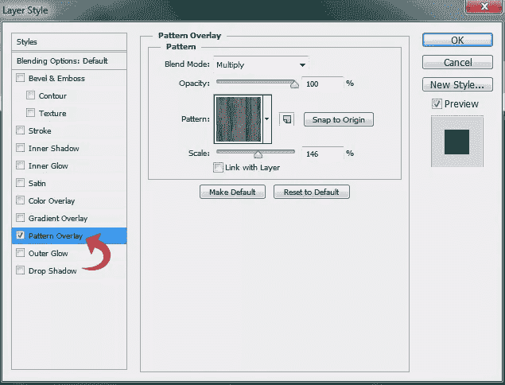](https://www.sitepoint.com/wp-content/uploads/2012/12/Step-3.jpg)

### 第四步

对于表单的基础或背景，选择矩形工具，并使用颜色#d7d7d7 创建一个矩形。

[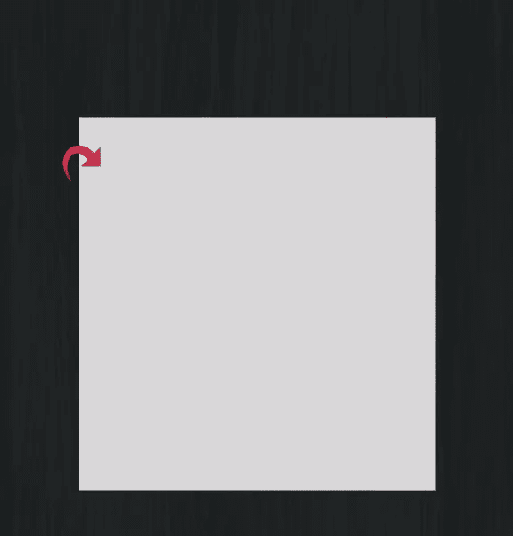](https://www.sitepoint.com/wp-content/uploads/2012/12/Step-4.jpg)

### 第五步

现在，点击图层样式，添加图案、缎面、内阴影和描边。

[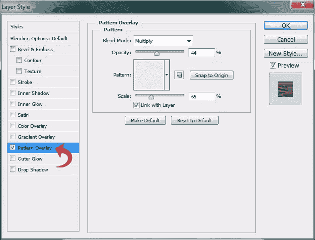](https://www.sitepoint.com/wp-content/uploads/2012/12/Step-5a1.jpg)

[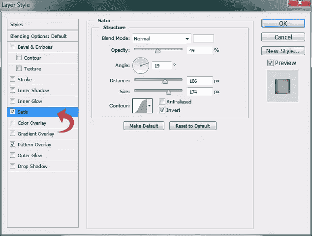](https://www.sitepoint.com/wp-content/uploads/2012/12/Step-5b.jpg)

[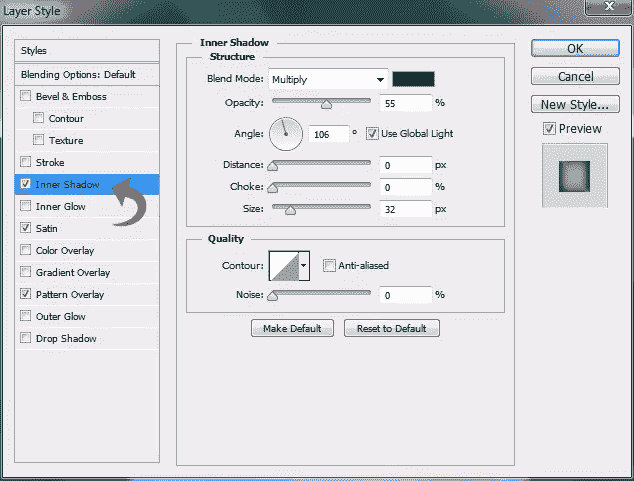](https://www.sitepoint.com/wp-content/uploads/2012/12/Step-5c.jpg)

使用#bfbfbf 颜色添加 1 像素的描边。

[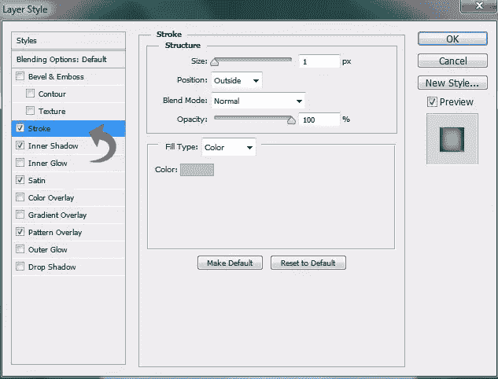](https://www.sitepoint.com/wp-content/uploads/2012/12/Step-5d.jpg)

### 第六步

对于标题，选择文字工具并添加所需的文本。然后，点击“图层样式”>“阴影”

[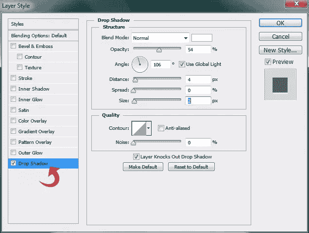](https://www.sitepoint.com/wp-content/uploads/2012/12/Step-6.jpg)

### 第七步

现在我们将创建两个分隔线。对于第一个，选择线条工具，用#bcbcbc 颜色画一条 1px 的线。

现在，点击“图层样式”>“阴影”给线条添加一个薄的阴影。使用以下设置。

### 第八步

右键点击新的线条图层，选择“栅格化图层”然后，用软圆刷选择橡皮擦工具，在侧面使用，达到下图的效果。

### 第九步

重复上述相同的过程创建第二个分割线。

### 第十步

现在，让我们从注册表单字段开始。因此，选择矩形工具，创建一个矩形条纹的颜色#9e0039。

[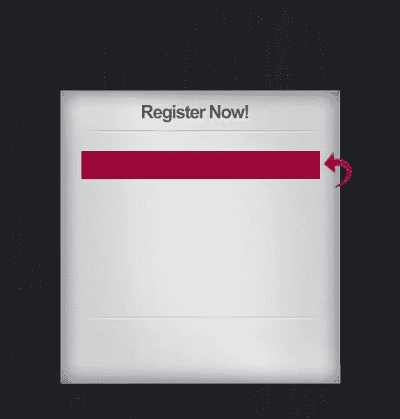](https://www.sitepoint.com/wp-content/uploads/2012/12/Step-10.jpg)

### 步骤 11

点击“图层样式”,使用以下设置添加描边、内阴影和投影。

[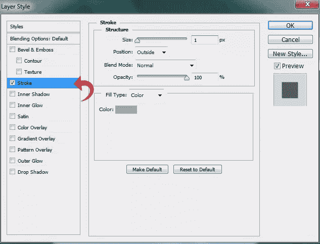](https://www.sitepoint.com/wp-content/uploads/2012/12/Step-11a.jpg)

[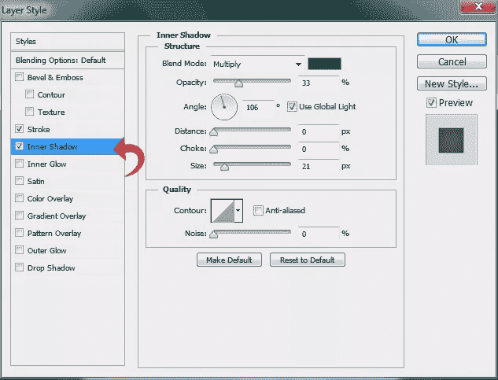](https://www.sitepoint.com/wp-content/uploads/2012/12/Step-11b.jpg)

### 步骤 12

选择文字工具并使用颜色#efefef 添加表单域文本。然后，点击“图层样式”>“阴影”，使用如下设置。

[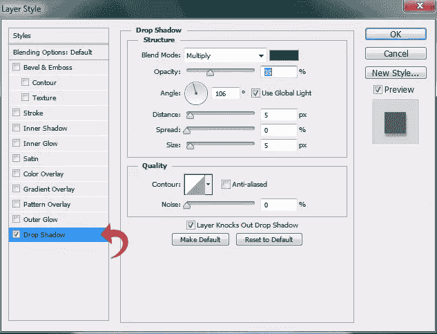](https://www.sitepoint.com/wp-content/uploads/2012/12/Step-12.jpg)

### 第十三步

重复相同的过程创建其他表单域。

### 步骤 14

现在为按钮，再次选择矩形工具，使用颜色#464646 创建一个矩形。

### 第十五步

点击“图层样式”,使用以下值添加描边、内阴影和投影。

[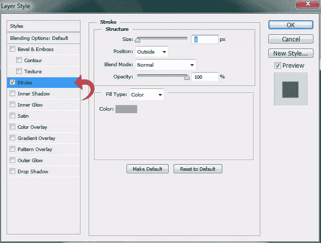](https://www.sitepoint.com/wp-content/uploads/2012/12/Step-15a.jpg)

[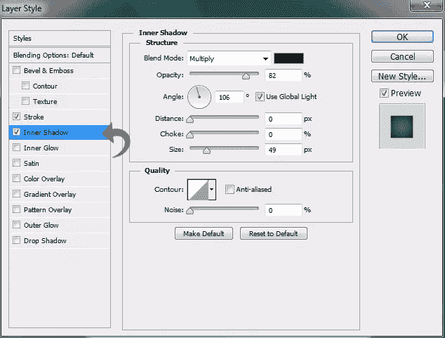](https://www.sitepoint.com/wp-content/uploads/2012/12/Step-15b.jpg)

[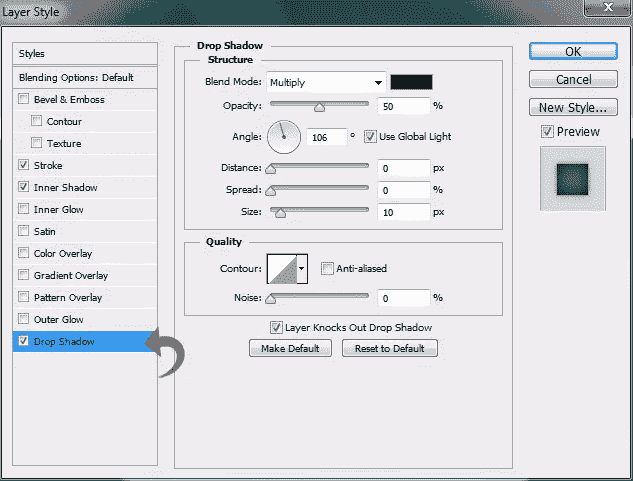](https://www.sitepoint.com/wp-content/uploads/2012/12/Step-15c.jpg)

### 第十六步

使用文字工具添加按钮文本，使用非常轻微的阴影。

### 步骤 17

对于侧边选项，选择矩形工具，使用颜色#464646 创建一个小矩形。然后，点击“图层样式”，给矩形添加描边和内阴影。使用以下设置。

[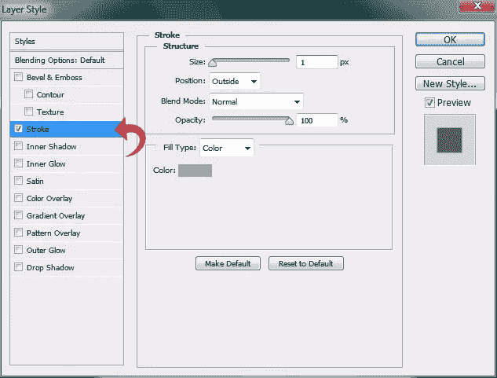](https://www.sitepoint.com/wp-content/uploads/2012/12/Step-17a.jpg)

[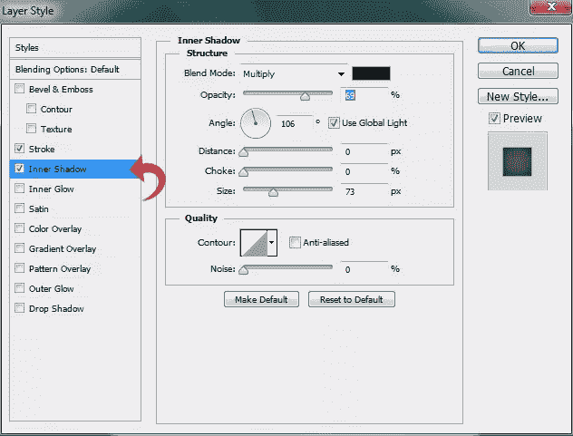](https://www.sitepoint.com/wp-content/uploads/2012/12/Step-17b.jpg)

### 步骤 18

选择文字工具，并添加文字沿右侧使用轻微的阴影。

### 步骤 19

重复相同的过程添加更多选项；你可以简单地复制上述矩形层，并添加文字。

### 步骤 20

现在，把所有的图层组合起来，点击“编辑”>“自由变换”，让整个表格看起来稍微倾斜。不要倾斜太多，否则使用时表单域看起来会很奇怪。

### 步骤 21

现在让我们从钉子和绳子开始。对于洞，创建一个新的层，选择硬圆刷，并使用 16px 的大小和颜色#424242。

### 步骤 22

点击“图层样式”>“内阴影”，应用以下设置。

[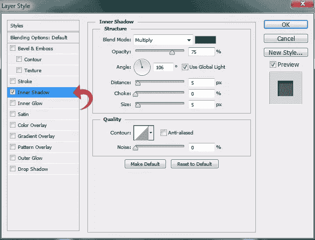](https://www.sitepoint.com/wp-content/uploads/2012/12/Step-22.jpg)

### 步骤 23

减少笔刷大小到 10px，创建一个倾斜的线条。然后，点击“图层样式”，添加“斜面和浮雕”和一个织物图案。使用下面的设置。

[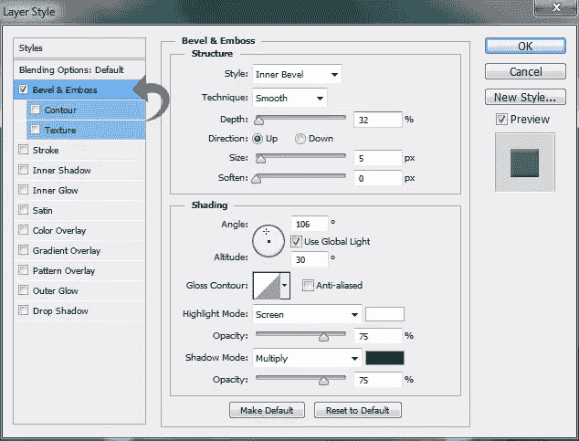](https://www.sitepoint.com/wp-content/uploads/2012/12/Step-23a.jpg)

[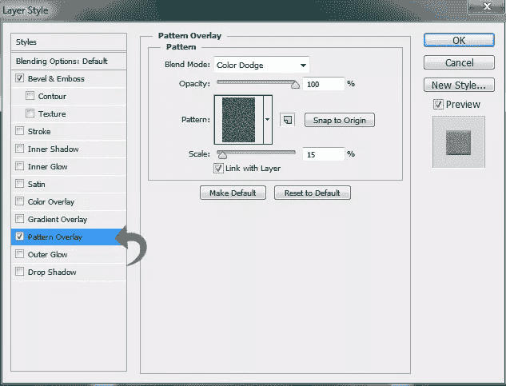](https://www.sitepoint.com/wp-content/uploads/2012/12/Step-23b.jpg)

重复同样的过程创建另一边。

### 步骤 24

对于指甲，选择椭圆工具，创建一个小的圆形。然后，点击“图层样式”,用下面的值给形状添加描边、渐变和阴影。

[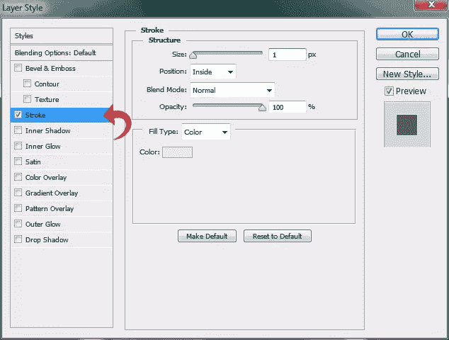](https://www.sitepoint.com/wp-content/uploads/2012/12/Step-24a.jpg)

[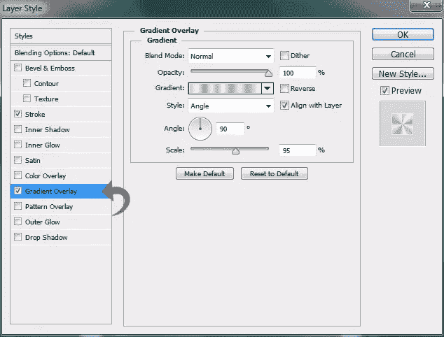](https://www.sitepoint.com/wp-content/uploads/2012/12/Step-24b.jpg)

[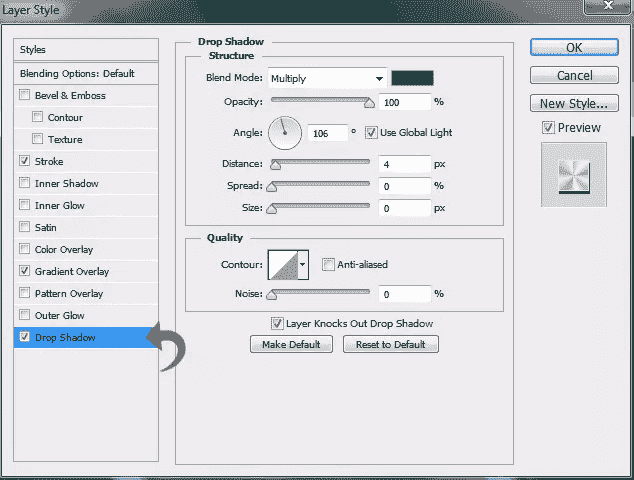](https://www.sitepoint.com/wp-content/uploads/2012/12/Step-24c.jpg)

### 步骤 25

对于阴影，创建一个新层，选择套索多边形工具，创建一个类似于我们的形式，并填充颜色#000000。

现在，点击“滤镜”>“模糊”>“高斯模糊”使用下面显示的设置。

[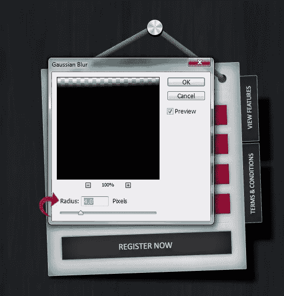](https://www.sitepoint.com/wp-content/uploads/2012/12/Step-25b.jpg)

我们完了！我们整洁的注册表格已经准备好了。

希望你们喜欢这个教程。保重！

## 分享这篇文章