# 在 Photoshop 中设计一张耀眼的节日贺卡

> 原文：<https://www.sitepoint.com/design-a-dazzling-holiday-card-in-photoshop/>

随着圣诞节即将来临，你可能会意识到你还有很多事情要做:买礼物，挂金属箔片，还有，别忘了给家人和同事发那些必须的“节日问候”卡。在假期里，我们中的许多人喜欢使用我们的巧妙技能，你也没有理由不这样做。作为设计师，我们有时会看到商店里出售的设计，我们知道自己可以做得更好。当你邮寄贺卡时，设计自己的贺卡会增添一丝真诚和体贴，更不用说赞美贺卡设计时的自我满足感了。今天，我们将在 Photoshop 中使用渐变、笔刷和混合选项来制作一张令人眼花缭乱的圣诞卡。

### 第一步:新画布

在 Photoshop 中创建一个新文件，并更改尺寸，使其为 1200 像素乘 1920 像素。

[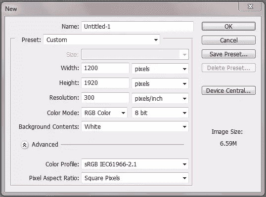](https://www.sitepoint.com/wp-content/uploads/2012/12/Step-1-Canvas.png)

### 第二步:背景

将前景色改为#2e752e，在单独的图层上填充你的画布。

### 步骤 3:渐变

保持你的前景在#2e752e，改变背景颜色为#000000。双击或右键单击你的背景层，进入混合选项菜单，并点击渐变叠加选项。更改渐变编辑器中的渐变，使其反映您的前景和背景颜色。

[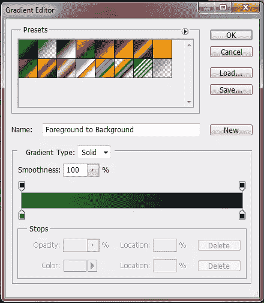](https://www.sitepoint.com/wp-content/uploads/2012/12/Step-3-Graident1.png)

改变混合模式为“柔光”，样式为“放射状”按确定。

[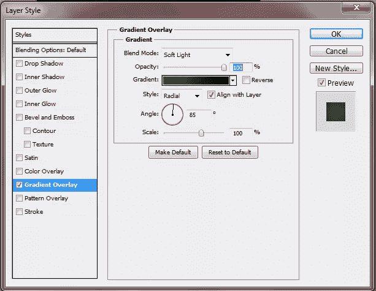](https://www.sitepoint.com/wp-content/uploads/2012/12/Step-3-Gradient2.png)

### 第四步:绿灯

选择一个 400 像素的软圆形笔刷，将前景色改为#309a17。按 F5 访问画笔窗口，并使用以下设置。

[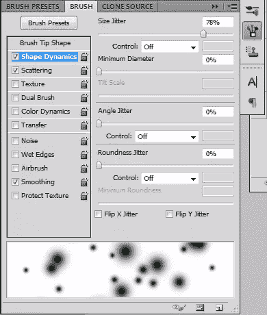](https://www.sitepoint.com/wp-content/uploads/2012/12/Step-4-Green-Lights1.png)

[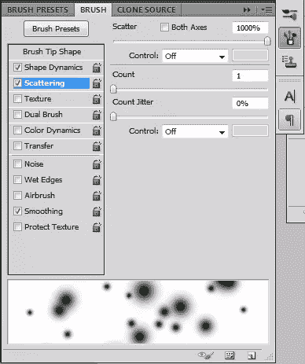](https://www.sitepoint.com/wp-content/uploads/2012/12/Step-4-Green-Lights2.png)

沿着你的画布运行你的画笔。一旦你有了想要的外观，不透明度降低到 50%

[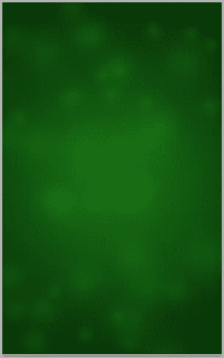](https://www.sitepoint.com/wp-content/uploads/2012/12/Step-4-Green-Lights3.png)

### 下雪

要创建一个白雪覆盖的小山，你首先需要创建一个新层，并确保你的前景色是#ffffff。使用钢笔工具，在卡片的左上角创建一个驼峰形状。

[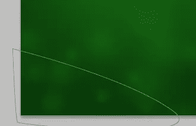](https://www.sitepoint.com/wp-content/uploads/2012/12/Step-5-Snow.png)

用#ffffff 填充驼峰，然后进入混合选项菜单。如下所示更改设置。请注意，内部阴影的颜色是#4e9194。

[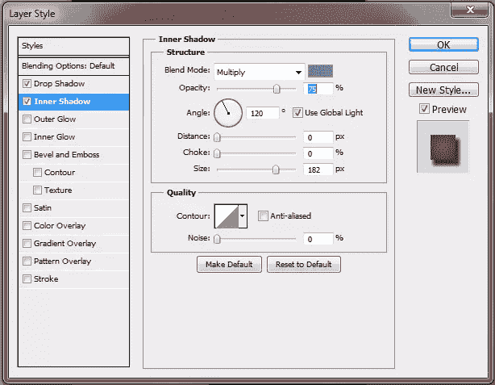](https://www.sitepoint.com/wp-content/uploads/2012/12/Step-5-Snow1.png)

[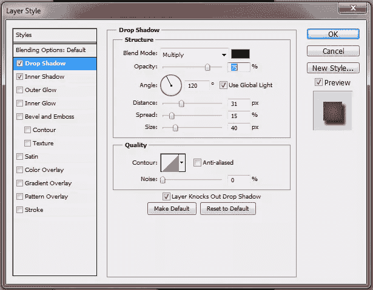](https://www.sitepoint.com/wp-content/uploads/2012/12/Step-5-Snow2.png)

继续创建山丘，直到您获得想要的外观。

### 第六步:树

使用多边形套索工具在画布中间创建一个三角形，填充#008609。这将是你的树。

[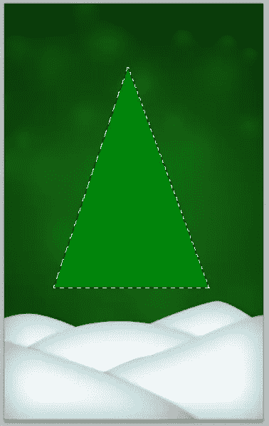](https://www.sitepoint.com/wp-content/uploads/2012/12/Step-6-Tree.png)

### 树枝

为了让树看起来更真实，你需要使用套索工具在树上创建树枝。

打开混合选项菜单，使用以下设置添加斜面和浮雕。

[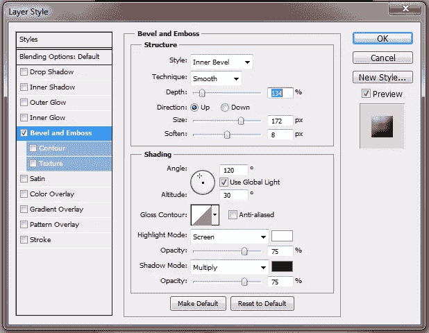](https://www.sitepoint.com/wp-content/uploads/2012/12/Step-7-Spikes1.png)

### 第八步:阴影

在树下新建一层。使用圆形工具，做一个长方形的圆，填充#000000。这将是我们的影子。

[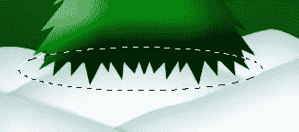](https://www.sitepoint.com/wp-content/uploads/2012/12/Step-8-Shadow.png)

将不透明度改为“柔光”，使用扭曲工具弯曲圆形，这样看起来更真实。

[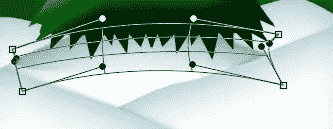](https://www.sitepoint.com/wp-content/uploads/2012/12/Step-8-Shadow1.png)

### 第九步:灯光

在一个新的层中，通过选择树的图像来给树添加灯光，并使用与创建分散的绿光相同的技术，给树添加白光。

### 第十步:圣诞饰品

将前景色改为#f02b2b，并在树的周围战略性地放置红点。这些将是你的圣诞饰品。

双击进入混合模式，并选择斜面和浮雕。

[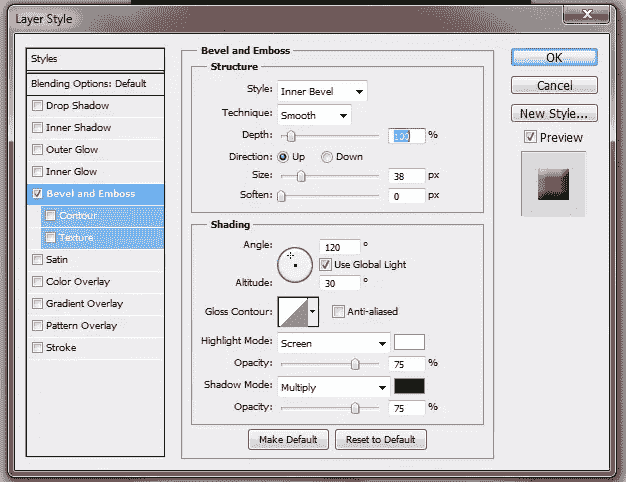](https://www.sitepoint.com/wp-content/uploads/2012/12/step-10-Christmas-Balls1.png)

### 第十一步:开始

转到自定义形状工具，选择星形图像。将你的前景设置为#ffd565，在你的树的顶部添加一颗星星。

给星星添加一个外发光和一个内发光。使用以下设置。

[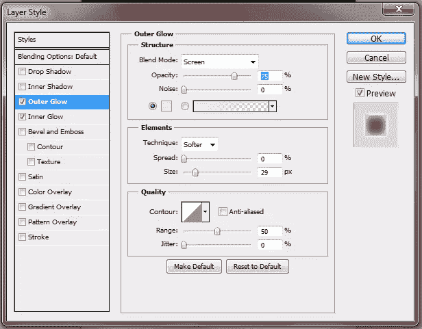](https://www.sitepoint.com/wp-content/uploads/2012/12/Step-11-Star.png)

[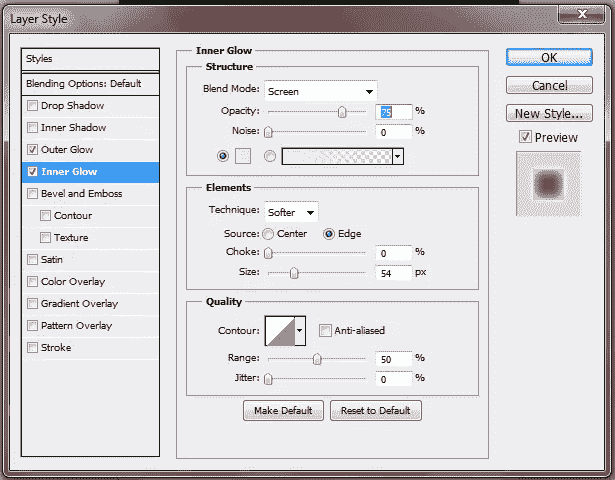](https://www.sitepoint.com/wp-content/uploads/2012/12/Step-11-Star1.png)

### 第十二步:树发光

使用以下值给树层添加外发光。

[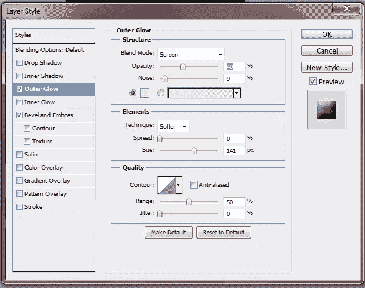](https://www.sitepoint.com/wp-content/uploads/2012/12/Step-12-Tree-Glow.png)

### 结束

添加您想要的文本、边框和其他发光效果，完成您的圣诞卡。

我希望你喜欢你的新圣诞卡。节日快乐！

## 分享这篇文章