# 在 Illustrator 中设计一张干净、无色的名片

> 原文：<https://www.sitepoint.com/design-a-print-ready-black-and-white-business-card-in-illustrator/>

Illustrator 非常适合创建印刷设计。它有大量方便的工具，可以帮助您实现清晰的设计结果。它拥有设计传单、小册子、名片或任何其他印刷媒体所需的一切。设计清晰、时尚的黑白印刷媒体是节省印刷成本又不影响美观的好方法。

今天，我将带领你在 Illustrator 中设计一张干净、无色的名片。我们将设计名片的正面和背面，一路上我将引导您快速了解名片的基本知识。所以，让我们开始吧！

**资源:**

[亚伯拉罕林肯字体](http://www.losttype.com/font/?name=Abraham%20Lincoln "AbrahamLincoln font")
[木材纹理由 Bittbox](http://www.flickr.com/photos/bittbox/3508894316/in/set-72157617708336229 "Wood Texture By Bittbox")

 ****最终结果:[(点击此处下载完成的 Illustrator 文件。](https://www.sitepoint.com/wp-content/uploads/2012/12/Black-and-White-Business-Card2.zip) )**

 ****

### 

### 第一步

在 Illustrator 中创建新文档。我今天要设计一张 89×51 毫米的名片，但是不同的印刷公司尺寸不同。您可以根据打印机输入尺寸。我们使用 3 毫米的出血量。出血是打印后将被剪切的设计片段。我们将使用 CMYK 色彩模式来获得清晰的打印效果。我们将设计卡片的两面，因此保持画板的数量为 2。

[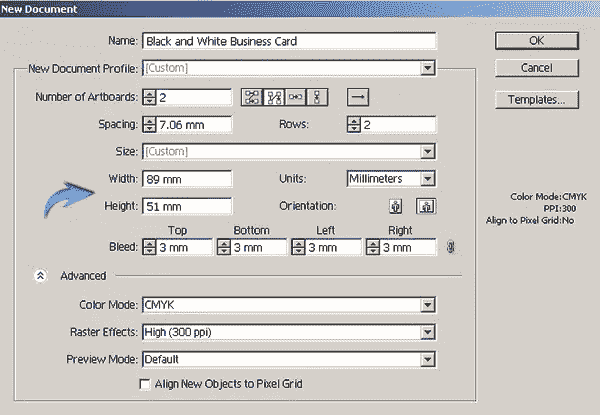](https://www.sitepoint.com/wp-content/uploads/2012/12/11.jpg)

### 第二步

现在，我们将在画板上设置参考线。您可以看到每个画板周围的红色轮廓，这是出血。现在，按 Ctrl + "R "查看标尺，从水平和垂直标尺拖动参考线，并将它们放置在两个画板周围的黑色边框周围，如下所示。

[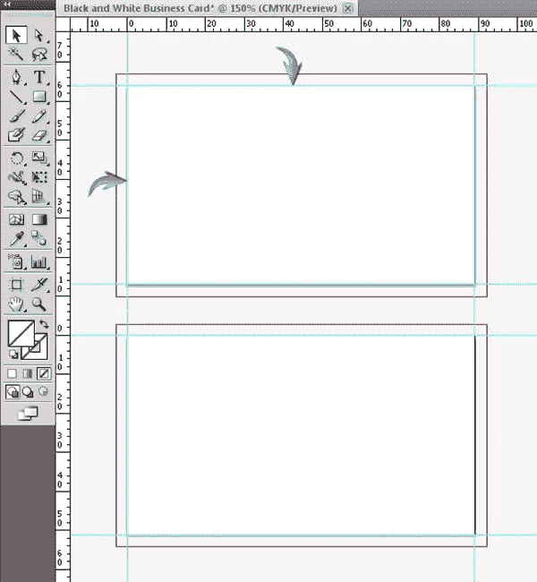](https://www.sitepoint.com/wp-content/uploads/2012/12/2-copy.jpg)

### 第三步

接下来，我们将这些参考线从边界向内移动 5 毫米来定义边距。边距用于安全目的，以确保所有重要内容与边缘保持一定距离。为此，通过按“Shift”键选择左侧垂直参考线和两个底部水平参考线。一旦选择了三个导轨，按“回车”打开“移动”窗口。使用 5 毫米的字段，选择一个 45⁰角度，然后单击“确定”

[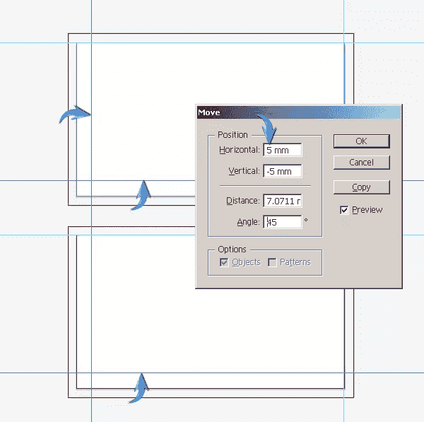](https://www.sitepoint.com/wp-content/uploads/2012/12/3-copy.jpg)

现在，选择剩下的导轨并打开“移动”窗口。在水平方向放置-5 毫米，在垂直方向放置 5 毫米，-135⁰角。现在，右键单击并选择“锁定参考线”

[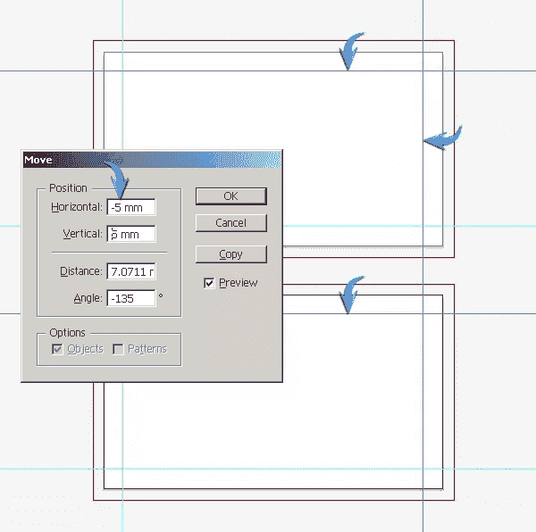](https://www.sitepoint.com/wp-content/uploads/2012/12/3b-copy.jpg)

### 第四步

绘制一个黑色矩形，完全覆盖红色出血内的第一个画板。在第二个画板上绘制一个白色矩形。

[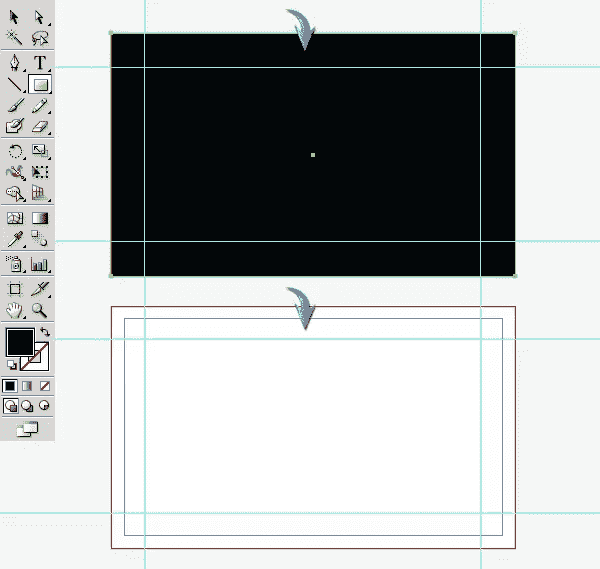](https://www.sitepoint.com/wp-content/uploads/2012/12/4-copy.jpg)

### 第五步

接下来，我们将为卡片的正面和背面制作侧边。沿着第一个画板的左边框绘制两个白色矩形，如下所示。较大的矩形应该接触安全余量，而较薄的矩形应该有微小的间隙。

[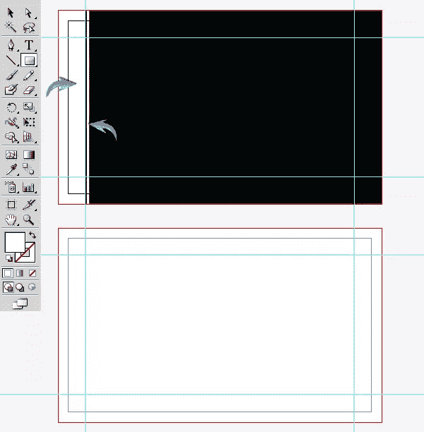](https://www.sitepoint.com/wp-content/uploads/2012/12/5-copy.jpg)

选择这两个矩形图层，点击选项方块(位于图层面板的右上角)，然后选择“在新图层中收集”现在，复制这一层；点击复制层前面的环形目标。最后，右键单击文档并选择“转换”>“反射”垂直翻转 90⁰形成右边框。

[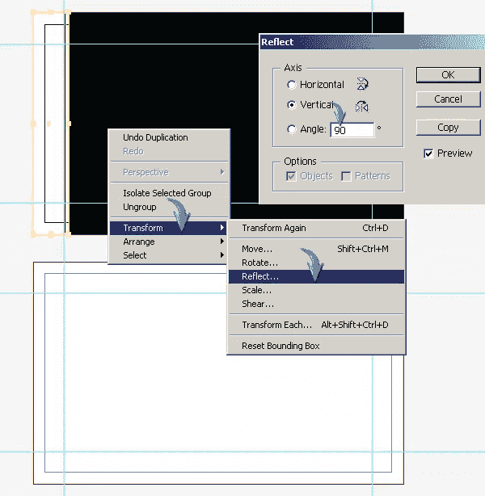](https://www.sitepoint.com/wp-content/uploads/2012/12/5b-copy.jpg)

沿着右边框放置这些矩形。收集两个矩形到一个新的层，复制，并沿着第二个画板拖动它，形成背面的边界。对于背面，将它们的颜色改为黑色。

### 第六步

现在，我们将重点放在卡的正面。在中心画一个白色椭圆。

[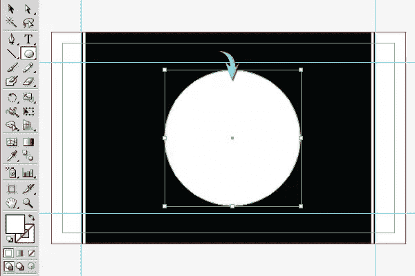](https://www.sitepoint.com/wp-content/uploads/2012/12/6-copy.jpg)

### 第七步

在上一个椭圆内再画一个椭圆，但是这次设置填充颜色为无，选择 0.5 磅的黑色，如下所示。

[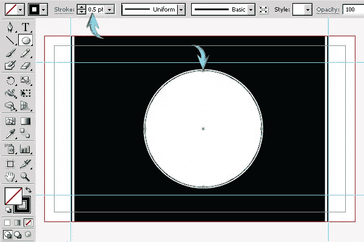](https://www.sitepoint.com/wp-content/uploads/2012/12/7-copy1.jpg)

在前一个笔画中再画两个相似的笔画。保持第二个椭圆的描边粗细为 1 磅，第三个椭圆的描边粗细为 0.5 磅。

[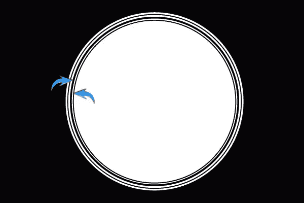](https://www.sitepoint.com/wp-content/uploads/2012/12/7b-copy.jpg)

### 第八步

选择星形工具并右键单击文档以打开星形窗口。使用以下设置来创建我们的星星。

[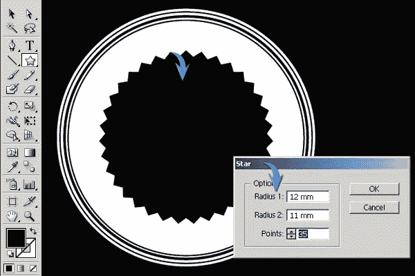](https://www.sitepoint.com/wp-content/uploads/2012/12/8-copy.jpg)

### 第九步

接下来，我们将在中间添加标题文本。我在这里使用“亚伯拉罕·林肯”字体(15 磅)。

[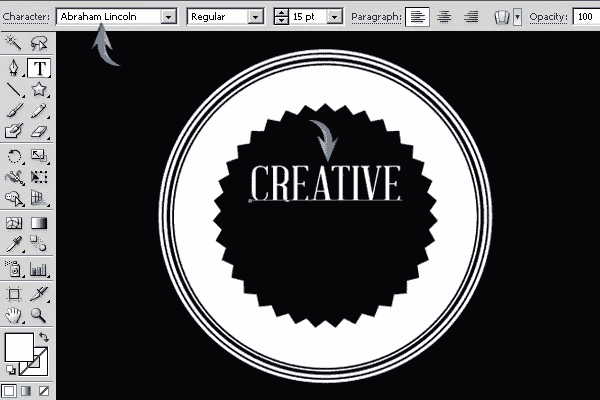](https://www.sitepoint.com/wp-content/uploads/2012/12/9-copy.jpg)

使用线条工具或钢笔工具作为文本分隔线，绘制两条 0.25 磅重的线条，并在这些新线条下键入附加文本。

[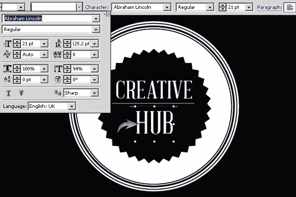](https://www.sitepoint.com/wp-content/uploads/2012/12/9b-copy.jpg)

### 第十步

用 0.25 磅的重量再画几条线，填充黑星内的空白区域。这些可能会根据您的文本而有所不同。

[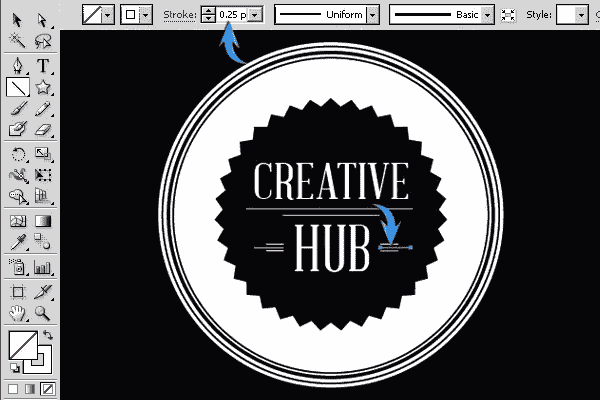](https://www.sitepoint.com/wp-content/uploads/2012/12/10-copy.jpg)

### 步骤 11

如下图所示绘制额外的星星。

[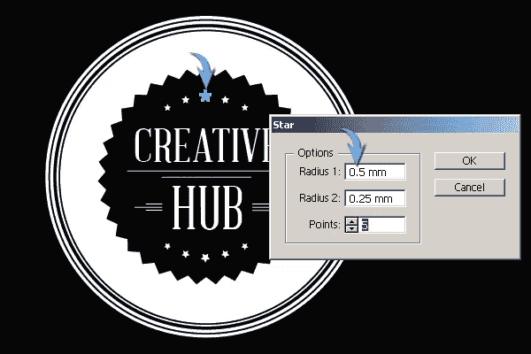](https://www.sitepoint.com/wp-content/uploads/2012/12/11-copy.jpg)

### 步骤 12

现在，我将向您展示如何在 illustrator 中添加圆形文本。对于顶部的拱形文本，使用椭圆工具绘制一个大小合适的椭圆。现在，选择“在路径上键入”工具，按 Ctrl+Alt+“T”打开段落窗口，选择“居中对齐”，然后单击圆的底部中心。这将在您键入时自动将键入光标定位在圆圈的顶部中心。

[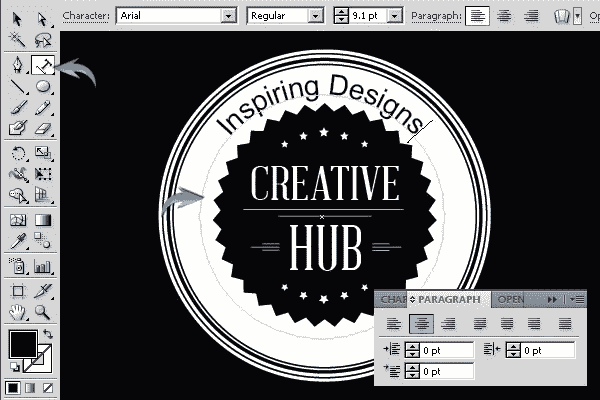](https://www.sitepoint.com/wp-content/uploads/2012/12/12-copy.jpg)

### 第十三步

要在下拱门内添加文本，请选择前面的文本路径，按 Ctrl + "C "复制它，然后按 Ctrl + "F "将其粘贴到前面。现在，进入“文字”>“路径文字”>“路径文字选项”在此使用以下设置。

[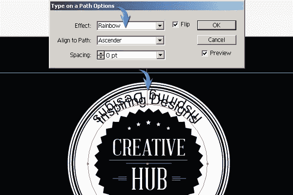](https://www.sitepoint.com/wp-content/uploads/2012/12/13-copy.jpg)

用新文本替换重复的文本。我将在这里使用相同的字体和设置，我用了类似的顶拱文本。选择选择工具(“V”)；您会注意到文本中心有一个手柄，单击并使用选择工具将其拖向圆的底部中心。确保不要将它拖到圆圈内。

[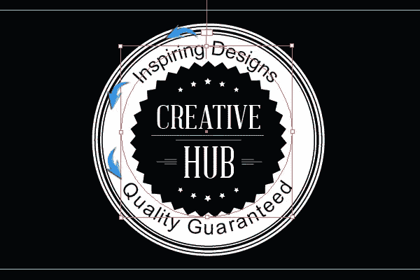](https://www.sitepoint.com/wp-content/uploads/2012/12/13b-copy1.jpg)

### 步骤 14

使用钢笔工具以 1 磅的笔画绘制一条曲线。如下图所示，将其宽度轮廓更改为带有尖头的轮廓。

[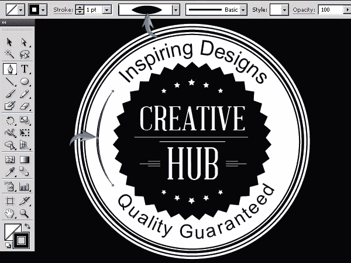](https://www.sitepoint.com/wp-content/uploads/2012/12/14-copy1.jpg)

在新绘制的形状旁边再画一条曲线(0.5 磅)。复制这两条线，并翻转它们，使右侧的线相同。

### 第十五步

回到名片的背面，我们将添加标题文本。

[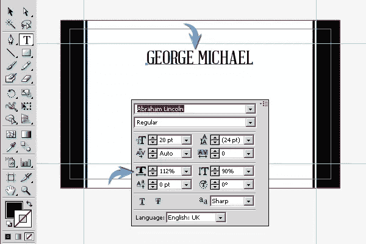](https://www.sitepoint.com/wp-content/uploads/2012/12/15-copy.jpg)

### 第十六步

现在我们要做一条丝带。选择钢笔工具绘制如下所示的形状，设置填充颜色为黑色，使用 0.75 磅的白色。

[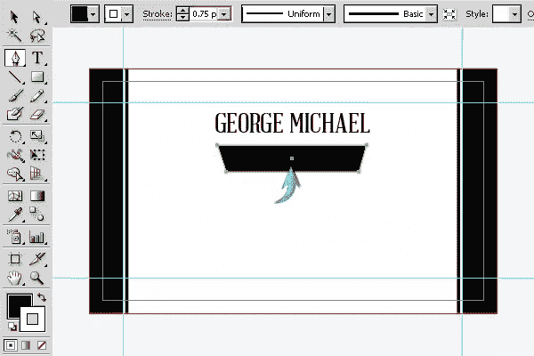](https://www.sitepoint.com/wp-content/uploads/2012/12/16-copy.jpg)

通过制作丝带的边来完成丝带。使用钢笔工具绘制一边，复制它，然后水平翻转它来构建另一边。

### 步骤 17

在新功能区中添加副标题。另外，如果字幕允许的话，你可以在文字旁边画线。

[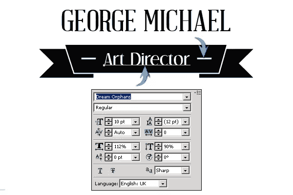](https://www.sitepoint.com/wp-content/uploads/2012/12/17-copy.jpg)

### 步骤 18

现在，要添加联系人详细信息，您可以使用项目符号、图标或任何您喜欢的东西。我们将使用 Illustrator 中的图标。选择“窗口”>“符号”打开符号窗口。现在，点击符号窗口左下角的符号库菜单，从那里选择网络图标。我选择了其中的几个，并把它们拖到单独的新图层上。相应地调整它们的大小。

[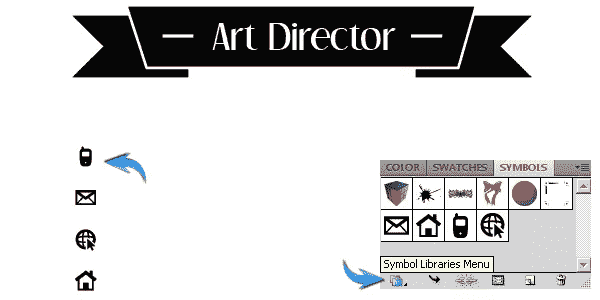](https://www.sitepoint.com/wp-content/uploads/2012/12/18-copy.jpg)

### 步骤 19

现在，我们将添加联系方式。我用了“Arial”字体。

[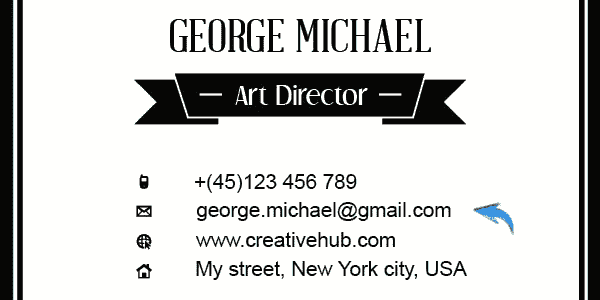](https://www.sitepoint.com/wp-content/uploads/2012/12/19-copy.jpg)

### 步骤 20

我们完成了干净、无色名片的设计。现在是时候存起来打印了。按 Ctrl + "A "选择每个设计元素，然后进入"类型" > "创建轮廓。"这是为了避免任何与字体相关的问题。现在，使用以下设置将此文件保存为 adobe PDF，您的文件就可以发送打印了。

[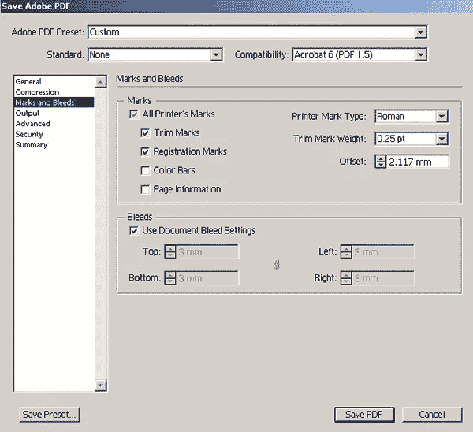](https://www.sitepoint.com/wp-content/uploads/2012/12/20.jpg)

[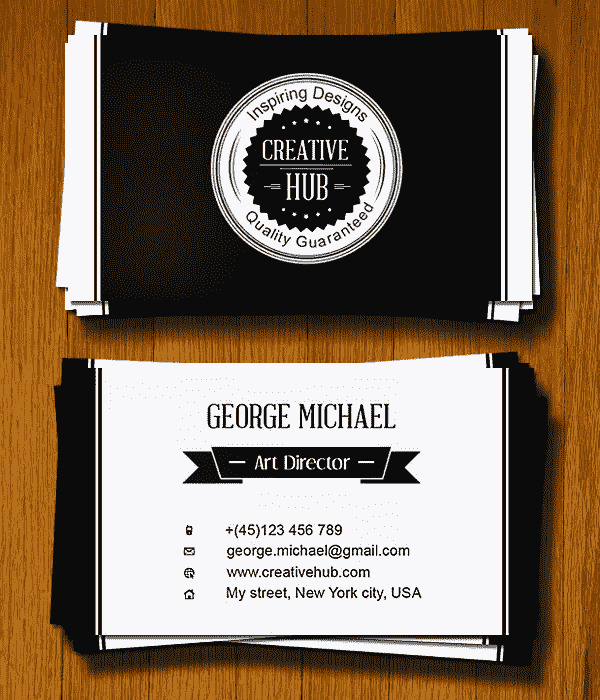](https://www.sitepoint.com/wp-content/uploads/2012/12/Final-result23.jpg)

就这样，伙计们。我希望你喜欢这个教程，并学到一些有用的东西。请分享你的想法！** 

## **分享这篇文章**