# 在 Photoshop 中设计一个质朴的发光广告

> 原文：<https://www.sitepoint.com/design-a-pristine-glowing-advertisement-in-photoshop/>

广告有各种各样的形状和大小，但有一点是肯定的——它们是为了抓住你的注意力。就像海报设计一样，学习如何制作一个简洁而吸引人的广告不仅有趣，而且如果你正在创业并希望控制广告费用，这也是非常有益的。当谈到让你的企业受到关注时，很少有什么能比一个令人惊叹的视觉广告提供更好的开端。

在今天的教程中，我将向你展示如何为 LG Shine 手机设计一个有趣而多彩的广告。您将学习如何组合常用图像来创建无缝背景，以及如何使用 Photoshop 的混合选项来为元素添加发光功能。在本教程结束时，你不仅能够创建一个类似的设计，而且能够使用相同的技术为其他产品(如手表、珠宝和类似产品)创建广告。让我们启动 Photoshop，开始制作我们的发光手机广告吧！

**你会做什么**

[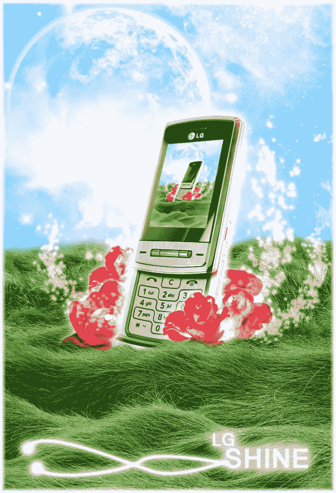](https://www.sitepoint.com/wp-content/uploads/2012/08/LG-Shine.jpg)

**所需资源**

[电话](http://www.mobile-t-mobile.com/uimg/LG-Shine-KE970-full.jpg)

[星系](http://moondust23.deviantart.com/art/galaxy-8-202287976?q=boost%3Apopular%20in%3Aresources%2Fstockart%20galaxy&qo=13)

[星系背景](http://zeroxkinz.deviantart.com/art/Galaxy-Background-309026505?q=boost%3Apopular%20in%3Aresources%2Fstockart%20galaxy&qo=12)

[草](http://starna.deviantart.com/art/Grass-Field-120723178?q=boost%3Apopular%20in%3Aresources%20grass&qo=18)

[月亮](http://ektor182.deviantart.com/art/Moon-37610701?q=boost%3Apopular%20in%3Aresources%20moon&qo=6)

[鲜花](http://browse.deviantart.com/resources/stockart/?q=flowers#/d2ejs79)

[星刷](http://dodokiller.deviantart.com/art/Star-brush-67622693?q=boost%3Apopular%20light%20brush&qo=0)

### 步骤 1:创建新文档

首先打开 Photoshop，进入“文件”>“新建”创建一个新文档。当对话框出现时，更改增量，使您的画布宽度为 750 像素，高度为 1100 像素。确保分辨率为 300，然后按“确定”

[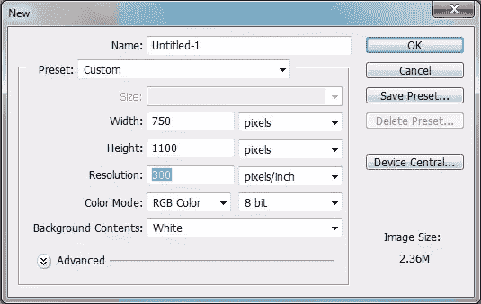](https://www.sitepoint.com/wp-content/uploads/2012/08/step-1.png)

### 步骤 2:定义背景

为了帮助混合我们将在背景上叠加的图片，选择#8ed9ff 作为前景色并填充一个新图层。

### 第三步:种植一些草

打开草的原图，粘贴到画布的下半部分。

一旦你有了你的草，拿一个中等大小的软圆刷，开始擦除顶部边缘，这样你的最终效果类似于下图。

[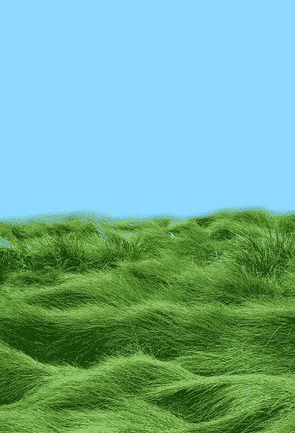](https://www.sitepoint.com/wp-content/uploads/2012/08/step-3-1.png)

### 第四步:添加银河背景#1

复制并粘贴“银河背景”股票图像下方的草层。您可能需要调整图像大小以适合画布。当你得到你的图像后，将图层模式改为“叠加”

### 第五步:添加银河背景#2

打开“银河”图片，就像第一个银河背景一样，你要确保这一层在草层之下，但在第一个银河层之上。可能需要调整大小。将图层模式更改为“屏幕”

### 第六步:放置手机

将 LG Shine 的图像放在画布的中间，使下半部分与草地重叠，上半部分与天空重叠。

[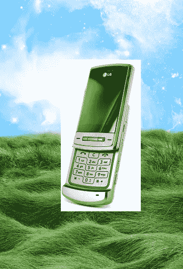](https://www.sitepoint.com/wp-content/uploads/2012/08/step-6.png)

### 第七步:打磨你的手机

为了给我们的 LG Shine 增加色彩，我们需要到色阶面板(Ctrl + "L ")输入以下色阶设置:

[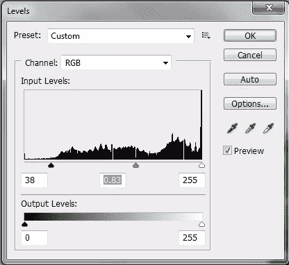](https://www.sitepoint.com/wp-content/uploads/2012/08/step-7.png)

去除手机周围的白色，直到它成为一个独立的图像。

[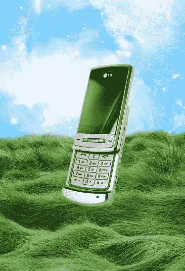](https://www.sitepoint.com/wp-content/uploads/2012/08/step-7-1.png)

### 第八步:草复制

因为手机看起来像是飘在草地上，我们需要做一些调整，让它看起来更真实。要做到这一点，只需复制你的草层，并把它放在手机上方。擦除覆盖手机的部分，直到只有手机的底部边缘被草覆盖。

[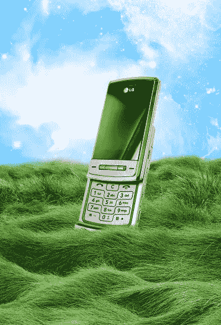](https://www.sitepoint.com/wp-content/uploads/2012/08/step-8.png)

### 第九步:添加月亮

复制并粘贴“月亮”股票图像到一个层下面的草层和上面的星系层。从黑色背景中提取月亮并调整其大小，确保将月亮放在左上角的某个位置。改变图层模式为“变亮”

[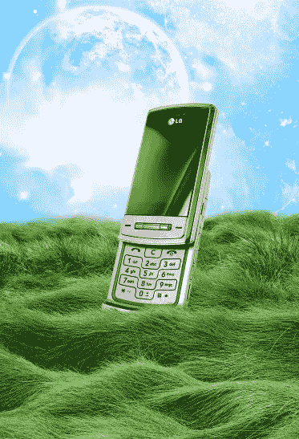](https://www.sitepoint.com/wp-content/uploads/2012/08/step-9.png)

### 第十步:添加一些花

如果你还没有打开文件夹，现在就打开吧。抓取“flower4”文件并粘贴到你的画布上；你需要缩小它的规模。当你把图片缩小到你想要的尺寸后，把花放在手机的右下角，确保这个新的花层正好在手机层的上面。复制花的图像，旋转它，然后拖动手机图像下面的层，然后将它放在手机的左侧，这样你就有了这样的东西。

[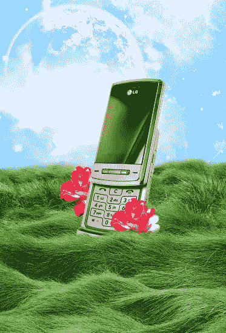](https://www.sitepoint.com/wp-content/uploads/2012/08/step-10.png)

### 第十一步:多花

按照你制作第一朵花的步骤，复制并粘贴“flower6”到你的画布上，并调整它的大小。将图层放在手机下面，将花移到手机的左侧，并在右手边添加一朵类似的花。

[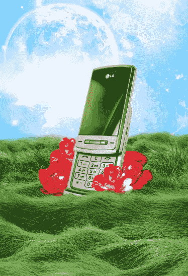](https://www.sitepoint.com/wp-content/uploads/2012/08/step-11.png)

### 步骤 12:添加一些辉光

要在每朵花周围添加一层光晕，双击特定图层进入混合选项面板，选中“外部光晕”框。将设置更改为以下内容:

[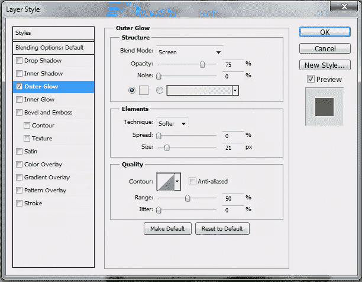](https://www.sitepoint.com/wp-content/uploads/2012/08/step-12.png)

将这些相同的发光效果应用到每朵花和手机上。

[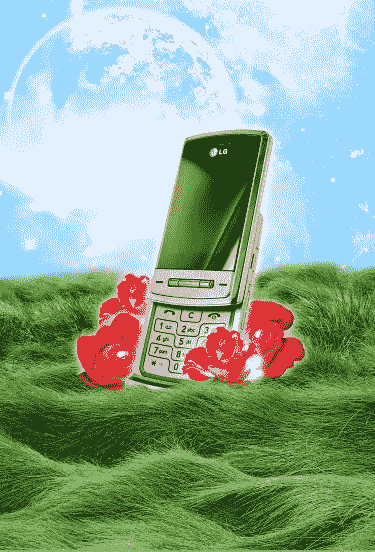](https://www.sitepoint.com/wp-content/uploads/2012/08/step-12-1.png)

### 第十三步:高亮显示手机

创建一个新层，把它放在电话层的上面。用柔软的圆形笔刷，用#ef5190 在手机周边涂抹，然后将图层模式改为“线性减淡”(添加)。

[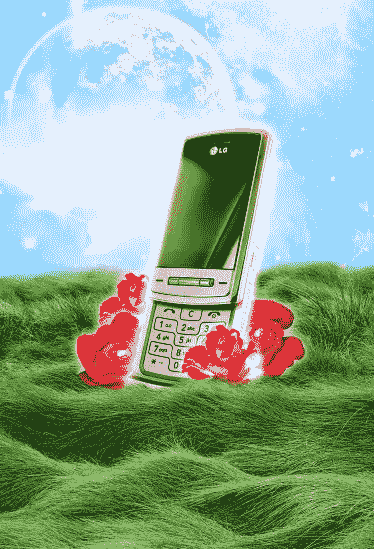](https://www.sitepoint.com/wp-content/uploads/2012/08/step-13.png)

### 第十四步:添加火花

使用你用来创建手机周围发光的颜色，用星形笔刷(笔刷大小为 90 和 40)添加一些闪光的漩涡。确保这是在手机下面的一层完成的。当你对你的漩涡和闪光满意时，在混合选项菜单中选择“外发光”框，然后点击“确定”将图层模式改为“线性减淡”(添加)。

[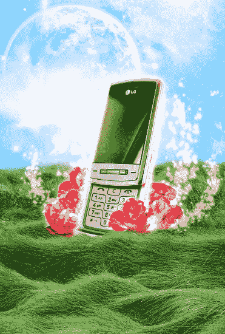](https://www.sitepoint.com/wp-content/uploads/2012/08/step-14.png)

### 步骤 15:构建手机屏幕

选择你的画布(Ctrl + "A ")，然后进入"编辑" > "复制合并。"粘贴复制的图像(这应该是你的整个图像),并将其缩小到手机屏幕的大小。使用“变形”工具(在“变换”菜单下)调整粘贴图像的大小并改变其透视效果，直到它看起来像电话屏幕上的图像。

[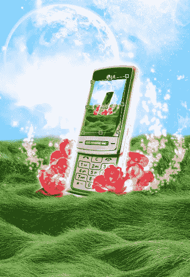](https://www.sitepoint.com/wp-content/uploads/2012/08/step-15.png)

### 步骤 16:添加屏幕发光

为了让我们的手机屏幕看起来更像一个背光的 LED 屏幕，双击图层来访问混合选项并选中“内部发光”框。使用以下设置:

[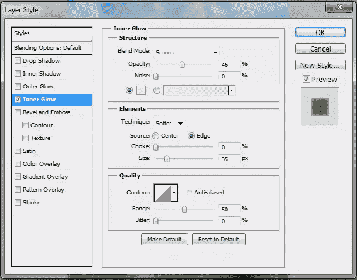](https://www.sitepoint.com/wp-content/uploads/2012/08/step-16.png)

### 第十七步:完成

通过在整个图像周围添加 10 像素的白色边框来完成图像。此外，添加您想要的任何文本—在本例中是电话名称和一副用钢笔工具创建的发光耳机。

[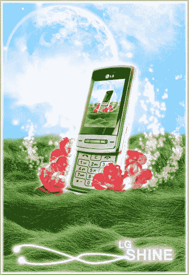](https://www.sitepoint.com/wp-content/uploads/2012/08/step-17.png)

### 结论

如你所见，设计一个广告相当简单。只需单击鼠标或图形笔，即可添加和删除元素。在画布上添加太多对象时要小心；你不希望图像看起来太拥挤，广告的观众会分心或困惑。当你设计你的广告时，尝试不同的股票图像和画笔，当然，玩得开心！

## 分享这篇文章