# 展示了一款光滑、逼真的触摸屏平板电脑

> 原文：<https://www.sitepoint.com/design-a-pristine-touchscreen-tablet/>

如今，触摸屏平板电脑正以各种形状和尺寸问世。平板电脑的种类正在迅速增加，设计师需要在不断增长的屏幕大小和尺寸上展示他们的作品。不要依赖于平板电脑的库存照片，其中大多数会随着新硬件的发布而过时，最好在 Photoshop 中建立一个分层的触摸屏平板电脑，你可以根据需要进行编辑。

今天，我将带你在 Photoshop 中创建一个光滑、逼真的触摸屏平板电脑的过程。在这个过程中，你将学习使用不同的形状工具，钢笔工具，图层蒙版和不同的混合选项，通过一个简单的步骤来实现最终的结果。所以，让我们开始吧！

**最终图层 Photoshop 文件:** [触摸屏 Tablets.psd](https://www.sitepoint.com/wp-content/uploads/2012/11/Touchscreen-Tablets.psd_.zip)

**最终结果:**

[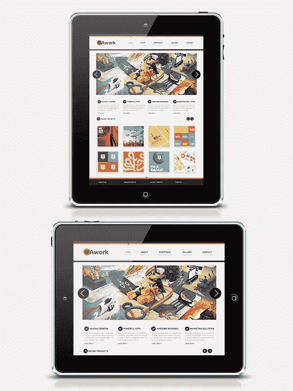](https://www.sitepoint.com/wp-content/uploads/2012/10/Final-result7.jpg)

### 第一步

在 Photoshop 中创建一个宽度为 1200 像素、高度为 1400 像素的新文档。

[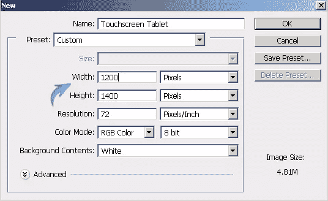](https://www.sitepoint.com/wp-content/uploads/2012/10/116.jpg)

### 第二步

使用油漆桶工具给背景图层填充#eaeaea 颜色。

[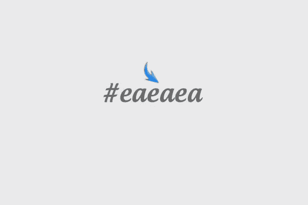](https://www.sitepoint.com/wp-content/uploads/2012/10/27.jpg)

### 第三步

我将向您展示如何创建平板电脑的纵向和横向视图。让我们从纵向视图开始。首先设置#f5f5f5 为你的前景色，选择圆角矩形工具，半径 20px，画出你希望平板大小的矩形。我用过 390px 乘 492px，如下图所示。

[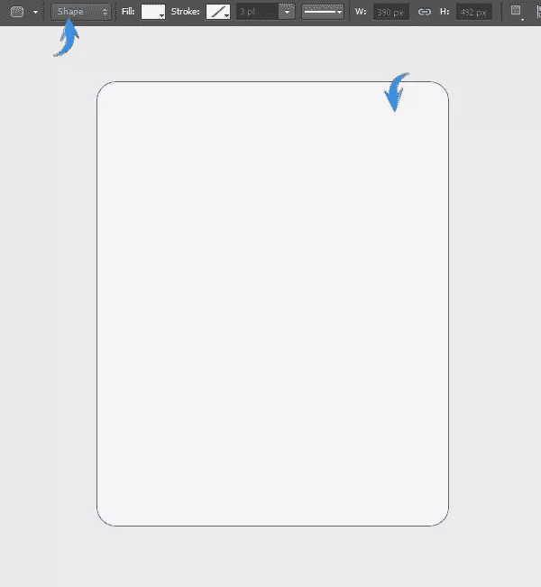](https://www.sitepoint.com/wp-content/uploads/2012/10/35.jpg)

### 第四步

双击这个基础矩形层打开图层样式窗口，应用以下设置。

[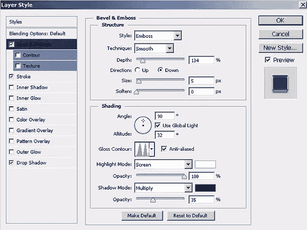](https://www.sitepoint.com/wp-content/uploads/2012/10/44.jpg)

[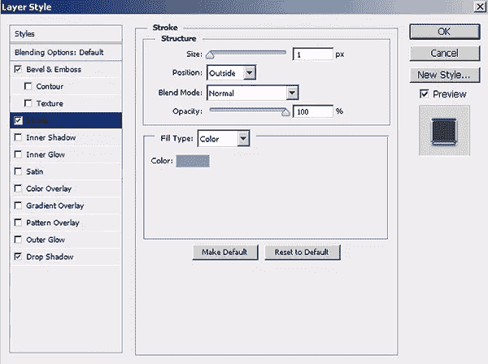](https://www.sitepoint.com/wp-content/uploads/2012/10/4b3.jpg)

[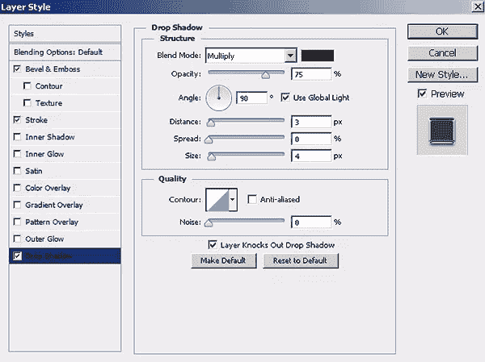](https://www.sitepoint.com/wp-content/uploads/2012/10/4c3.jpg)

### 第五步

设置#1e1e1e 为前景色，使用圆角矩形工具在上一个矩形的框架内绘制一个矩形。

[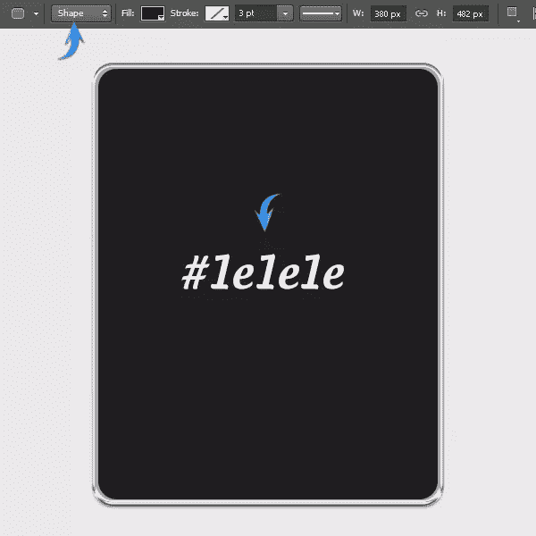](https://www.sitepoint.com/wp-content/uploads/2012/10/54.jpg)

### 第六步

现在按“D”键设置默认颜色，画一个比前面的矩形小 4px 的圆角矩形。

[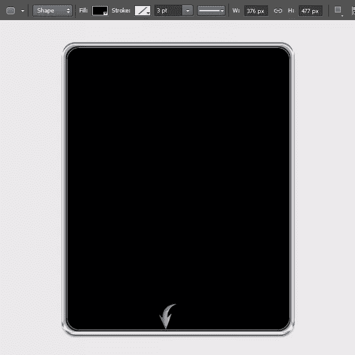](https://www.sitepoint.com/wp-content/uploads/2012/10/64.jpg)

向上拖动一点，使前面的矩形在底部可见。

[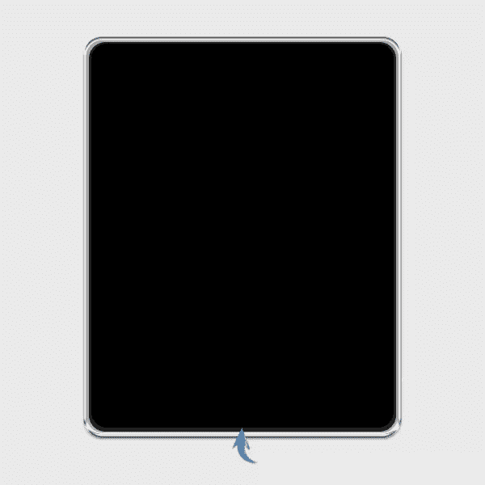](https://www.sitepoint.com/wp-content/uploads/2012/10/6b1.jpg)

### 第七步

使用矩形工具在其余图层的顶部绘制一个矩形，并将其标记为“屏幕”

[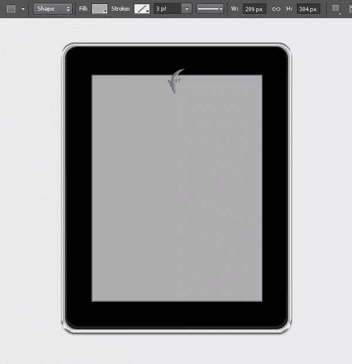](https://www.sitepoint.com/wp-content/uploads/2012/10/74.jpg)

### 第八步

让我们把一些东西放到画布上，显示在我们的平板电脑屏幕上。为此，我将使用我的[设计机构 L](https://www.sitepoint.com/build-a-professional-design-agency-layout-in-photoshop/ "Professional Design Agency Layout") [ayout](https://www.sitepoint.com/build-a-professional-design-agency-layout-in-photoshop/ "Professional Design Agency Layout") 。加载您要在此数位板中显示的文件，并将其复制/粘贴到文档中其余层的顶部。您可以使用自由变换工具(Ctrl+“T”)根据平板电脑屏幕的大小大致调整它的大小。要将它完美地设置在屏幕上，点击文件层，然后按 Ctrl+ <屏幕层缩略图>来选择它的周围。之后，点击图层面板底部的“添加图层蒙版”图标。

[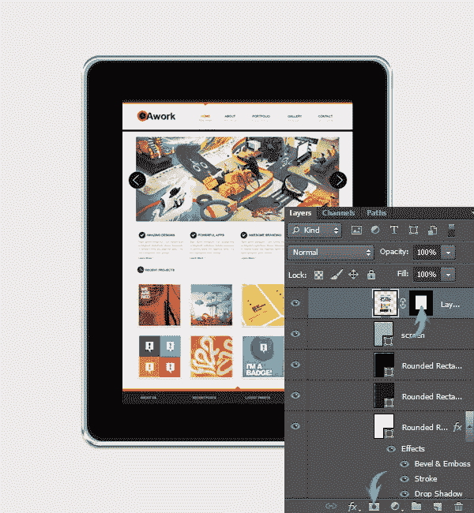](https://www.sitepoint.com/wp-content/uploads/2012/10/84.jpg)

### 第九步

接下来，我们将制作 home 按钮。画一个纯黑色的椭圆。

[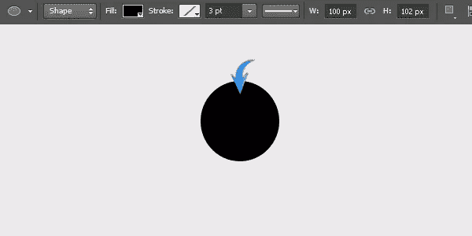](https://www.sitepoint.com/wp-content/uploads/2012/10/95.jpg)

按 Ctrl + <click on="" the="" ellipse="" layer="">在它周围进行选择。现在，选择软圆形笔刷工具，如下图所示在选区内使用。确保在新图层上使用笔刷。减少这一层的不透明度为 20%。</click>

[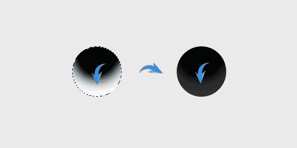](https://www.sitepoint.com/wp-content/uploads/2012/10/9b1.jpg)

在这个新图层上应用下面的内阴影设置。

[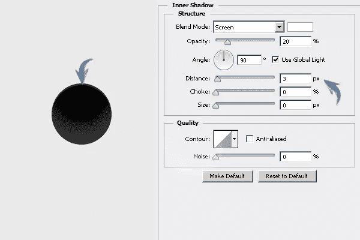](https://www.sitepoint.com/wp-content/uploads/2012/10/9c1.jpg)

### 第十步

在主页按钮的内部制作一个圆角矩形。在顶部的属性栏中，将填充设置为“无”，并将颜色#c4c4c4 的描边设置为大约 1 磅。

[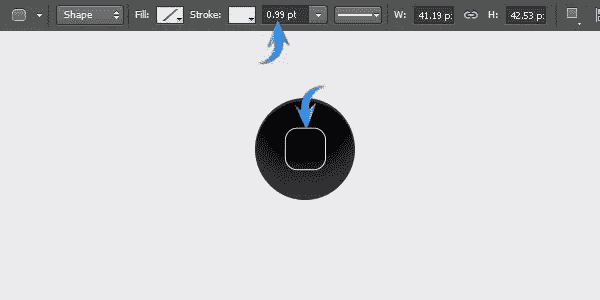](https://www.sitepoint.com/wp-content/uploads/2012/10/104.jpg)

### 步骤 11

接下来，我们将制作照相机。在彼此上方画三个圆。基础圆圈的颜色为#212121，下一个带蓝色的圆圈使用颜色#261963，顶部圆圈为纯黑色。

### 步骤 12

应用下面的图层样式设置在蓝色圆圈层，以完成相机。

[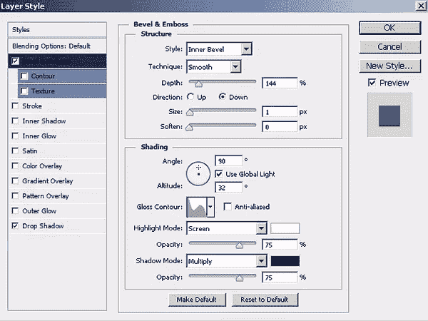](https://www.sitepoint.com/wp-content/uploads/2012/10/124.jpg)

[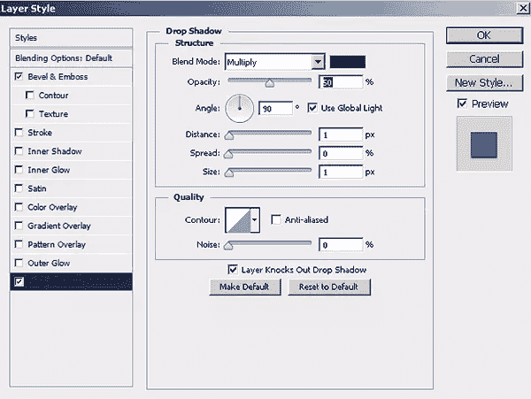](https://www.sitepoint.com/wp-content/uploads/2012/10/12b.jpg)

[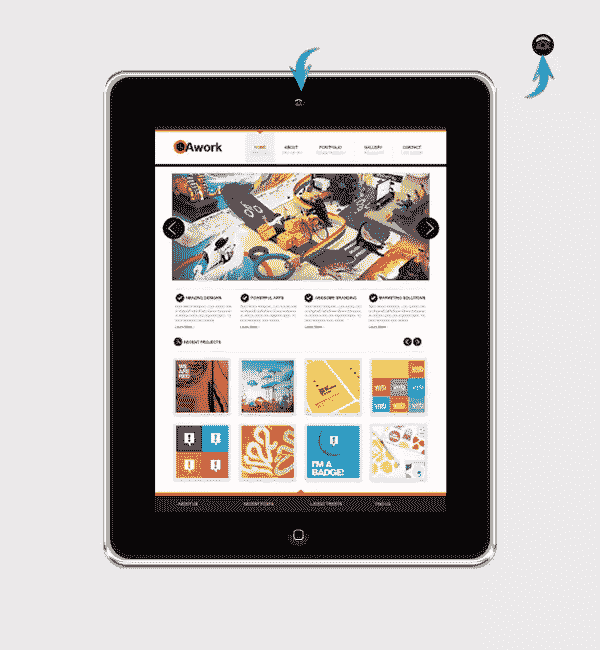](https://www.sitepoint.com/wp-content/uploads/2012/10/12c.jpg)

### 第十三步

接下来，我们将在数位板上创建高光。选择钢笔工具(工具模式:形状)画一个三角形，如下图。

[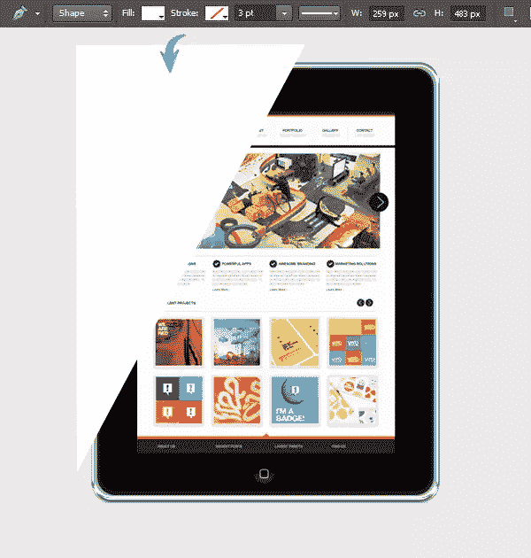](https://www.sitepoint.com/wp-content/uploads/2012/10/135.jpg)

现在通过添加图层蒙版将这个三角形限制在平板上。

[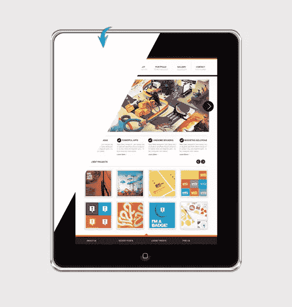](https://www.sitepoint.com/wp-content/uploads/2012/10/13b3.jpg)

### 步骤 14

将高光图层填充为 0%，在这个三角形图层上应用下面的渐变叠加设置。

[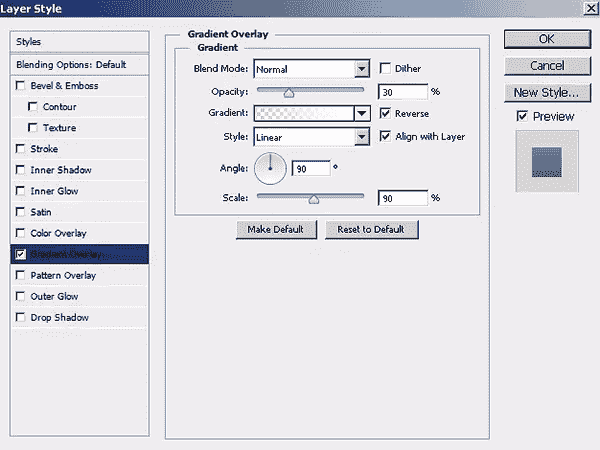](https://www.sitepoint.com/wp-content/uploads/2012/10/144.jpg)

[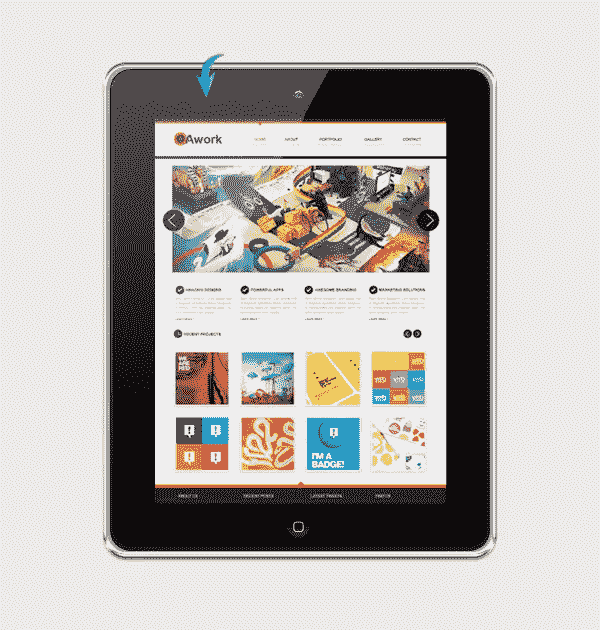](https://www.sitepoint.com/wp-content/uploads/2012/10/14b2.jpg)

### 第十五步

使用 303030 号颜色的矩形工具和钢笔工具制作几个按钮。使所有这些按钮都在背景层之上。

[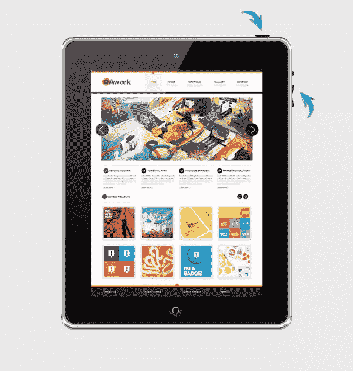](https://www.sitepoint.com/wp-content/uploads/2012/10/154.jpg)

### 第十六步

要为数位板制作阴影，请使用圆角矩形工具绘制一个矩形。右键点击阴影层，选择“栅格化层”

[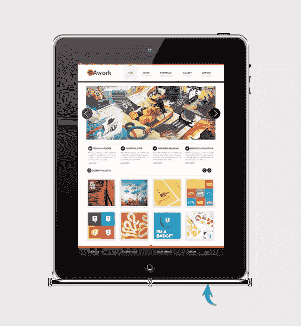](https://www.sitepoint.com/wp-content/uploads/2012/10/164.jpg)

### 步骤 17

现在，进入“滤镜”>“模糊”>“高斯模糊”，这里使用 4px 的值。之后，将阴影层的不透明度降低到 40%。

[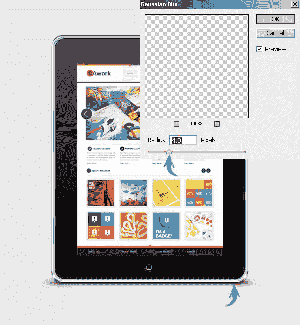](https://www.sitepoint.com/wp-content/uploads/2012/10/174.jpg)

### 步骤 18

我们现在要制作一个写字板的映像。将构成平板电脑的所有层收集到一个组中，复制这个层组，合并它，然后通过“编辑”>“变换”>“垂直翻转”垂直翻转它现在，把它放在原来平板电脑的正下方。

[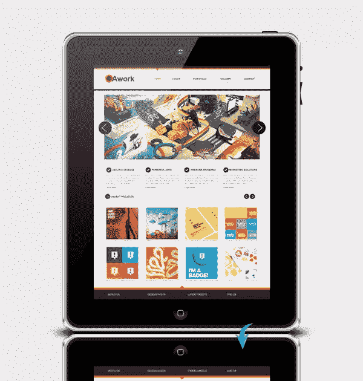](https://www.sitepoint.com/wp-content/uploads/2012/10/184.jpg)

### 步骤 19

我们平板电脑的纵向视图已经准备好了。现在，收集所有这些层到一个组，并将其标记为平板电脑肖像。隐藏或删除该组中的四个图层:高光图层、布局显示图层、阴影图层和反射图层。之后，进入“编辑”>“变换”>“逆时针旋转 90⁰”得到平板的横向视图。

### 步骤 20

现在，使用与纵向视图相同的技术，重新创建横向平板电脑的高光、阴影和反射。在水平屏幕上显示你的作品，完成它。

[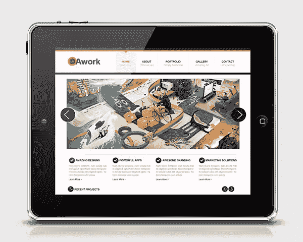](https://www.sitepoint.com/wp-content/uploads/2012/10/204.jpg)

[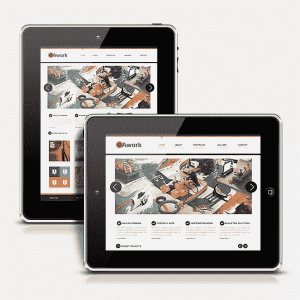](https://www.sitepoint.com/wp-content/uploads/2012/10/20b1.jpg)

就这样，伙计们。希望你喜欢这个教程，并学到一些有用的东西。[点击此处下载分层 PSD 文件](https://www.sitepoint.com/wp-content/uploads/2012/11/Touchscreen-Tablets.psd_.zip)。

## 分享这篇文章