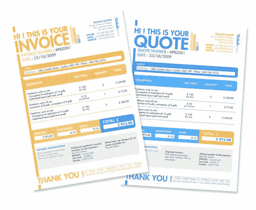
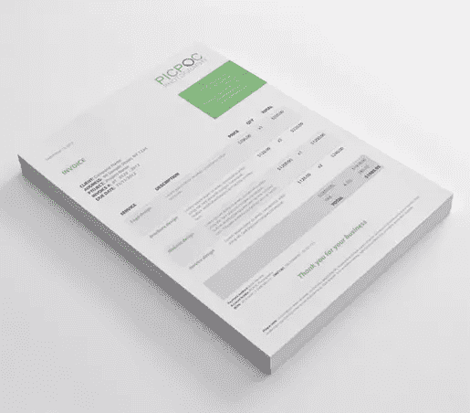
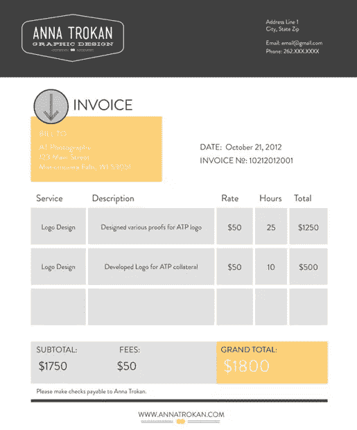
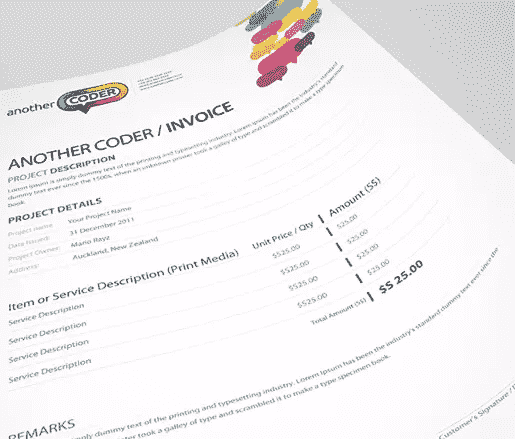
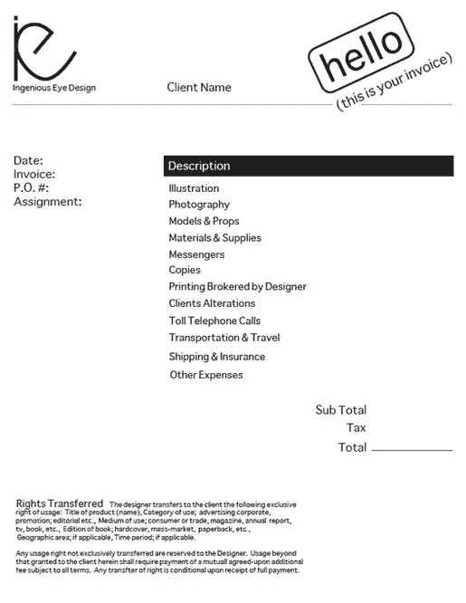
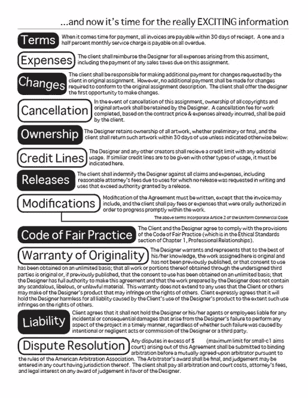
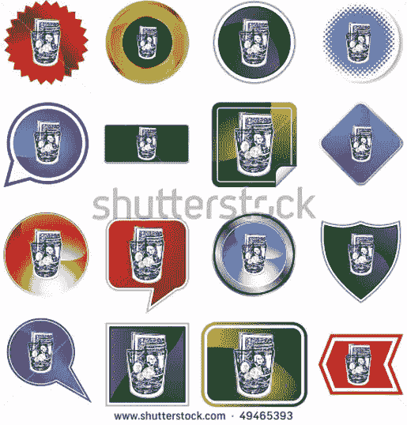

# 设计一张实际上能收回成本的发票

> 原文：<https://www.sitepoint.com/design-an-invoice-that-practically-pays-itself/>

每个自由职业者和小企业主都不得不处理整理发票流程的繁琐任务。这很少是最激动人心的设计项目，但它必须完成。而且，如果做得好，它可以给客户留下深刻印象，并节省大量时间，否则这些时间将用于反复索要报酬和照看薪酬流程。

当我第一次开始开发发票时，我有几个重大失误，从没有包括每张发票都应该包括的关键信息，到简单地让我的客户不容易向我付款。指导方针会让我节省很多时间和头痛。因此，本演练是为第一次整理发票布局并希望获得一些实用指南的人设计的…希望有点风格。

### 关键信息

 
*确保你的客户知道他们从你这里收到的实际上是一张发票。*

首先，每张发票都必须包含一些绝对的、基本的信息——这些信息对于发票的可支付性至关重要，并且易于理解。至少，确保每张发票都有以下内容:

*   **单词“Invoice”**—信不信由你，如果客户收到你的发票，但上面没有写发票，他们可能会将该文件理解为已经支付的过去的账单(收据)，或者只是不知道这是一张他们需要尽快支付的发票。在文件上贴上发票的标签，这样他们就不会有任何疑问或困惑，否则你可能不得不在每次寄出发票时澄清此事。
*   **发票标识符** —在某些情况下，您的客户可能有多张未付发票。当你开始与习惯于 60-90 天付款的大客户合作时，这是很常见的。因此，将某种标识符(如发票日期)与一个唯一的编号一起作为发票编号。例如，对于您发送的第一张发票，您的发票编号可能是 11022012-01(年、月、日，后跟一个唯一的编号)。
*   **公司名称** —确保发票上有您的公司或个人名称。我犯了一个错误，把我的商标而不是我公司的名字放在发票上，然后接到客户的电话，问我到底是谁，为什么我要给他们寄发票！
*   **徽标** —即使你的公司名称出现在发票上，也要把你的徽标放在上面。这对强化你的品牌至关重要。
*   **联系信息** —将您的电话号码和电子邮件地址放在发票的显著位置。如果客户有任何在文档中没有明确回答的问题，要让他们很容易找到您并与您联系。
*   **客户信息** —不要忘了包括客户信息，这样你们两个人都可以知道发票是给谁的。
*   **付款地址** —至少让客户知道他们可以向哪里付款。许多公司喜欢用支票支付，所以你的联系信息可能就足够了。或者，您可能需要包括您的贝宝信息或其他在线交易系统。
*   **账单摘要** —为客户开出账单的每一项提供一个简短的摘要总是明智的。我通常会附上一份相当详尽的描述，尤其是当它纯粹是一份咨询工作，而且我是按小时收费的时候。客户喜欢看到他们的钱得到了什么，这是一个向他们展示他们对你的投资是一个明智的选择的机会。
*   **应付金额** —如果你有几个项目和费用，包括税，确保你有一个最终汇总区域，让客户很容易看到他们应该付给你多少钱。
*   **到期日** —包括到期日会激励客户尽快向你付款。希望你在开始你的项目之前已经和你的客户讨论过这个问题，但是如果这个讨论没有发生，那么你的到期日应该是从你的发票日期起的 30 天。

当然，根据您的业务和政策，您可能需要包括更多内容。例如，背面的术语列表可能是必要的。或者你可能只是想在每张发票的底部附上一封简单的感谢信。

### 让支付变得简单

/628494) 
*让客户尽可能容易地向您发送付款。*

让你的客户容易付款是及时获得资金的一个重要部分。很久以前，我只接受支票。因此，默认情况下，我至少需要一周的时间才能从我的客户那里收到支票，即使他们打开了电子邮件，拿出了支票簿，并在邮件中放入了我的付款，这几乎从未发生过。今天，有几个其他的选择。

即使你仍然接受支票，给客户另一种支付选择。您可以通过 Paypal 和其他商家服务轻松接受信用卡付款，这使得客户更容易立即付款，尤其是如果您提供了他们可以付款的网站链接。在支付链接旁边突出显示你的账户名或电子邮件地址——就像 PayPal 一样——这样客户就能准确知道该向谁付款。

无论你如何接受付款，只要让客户尽可能容易地找到这些信息。不要埋没；突出它。这将使你免于回答善意客户的许多多余问题。

### 设计和布局

 
*一个吸引人却又极简的设计让收发票多了几分惬意。*

你是一名平面设计师。让你的技能发光，甚至在你的发票上。但是，不要犯这样的错误:设计得太过火，以至于信息很难找到。保持设计简洁，吸引人，并支持发票的目的:让客户知道他们欠多少钱，如何支付给你。

使用你的商业信笺是保持品牌一致性的最佳方式；如果你还没有为你的企业创建信笺，那么现在是时候这样做了。只是要确保你的商标和其他品牌图形在页面的顶部、底部，可能的话在左侧，为文档内容留出足够的空间。您还可以使用框、字体样式、颜色或任何其他设计元素来帮助突出重要项目，如总欠款和付款方式。不要使用支付方式的链接，而是使用一个按钮，这样更容易被发现。

在布局中，通常你的联系信息和你的客户信息都在发票的右上角。服务的明细列表应该在发票页面的中央，并在此处列出“总欠款”,但您也可以在发票的另一个显著位置以更大的字体列出总额，例如联系信息下方的顶部、右侧或左侧。实际上，您可以创建最适合您业务的布局。请记住，它总是需要有组织，清晰，并强调重要的元素:账单是多少，如何付款。

最重要的是，一定要把你的发票做成 PDF 格式。这不仅专业，而且便于分发和查看，无论客户是在您的网站上查看发票还是通过电子邮件打开发票。以更易编辑的文件格式发送发票会造成各种混乱。

### 个性化和人性化

 
*让你的个性和人性展现出来。*

如果你是一个有点个性的平面设计师，发票是没有地方可以隐瞒的。同样，只要确保你不允许你的“个性”从实际的发票信息上转移注意力，尤其是重要的部分…你想要得到报酬，记得吗？

用创造性的额外设计让你的发票更像你。例如，使用有趣的写作风格，尤其是如果你有很多额外的术语需要收录:

可爱或聪明的图标(当然是由你专业设计的)不仅是展示你才华的好方法，还能让发票更有趣。一个没多少咖啡的杯子，一个没多少咖啡因的仪表，一个没多少汽油的仪表，一个拿着零钱罐的可怜角色，还有一张“记得付钱给饥饿的艺术家”的纸条，这些都可以让你的发票更有活力。如果你的客户正在付款，而不是全额支付你的发票，用一个可爱的图形显示他们还剩下多少钱，比如一个煤气罐显示需要多少汽油才能加满，或者一个零钱罐慢慢装满零钱，这样会更有趣。

### 结论

作为一名平面设计师，你有额外的压力，要确保你的发票看起来和你的服务一样好。然而，如果你的发票没有得到支付，一个时髦的设计是没有好处的。因此，首先要确保你的发票易于阅读、理解和支付。然后增加足够的个性，让你的客户在给你付款时自己微笑。我的设计师同事们，这是把新顾客变成忠实顾客的一个简单方法。

*您是如何改进自己的发票的？你的发票能让你不用回答客户同样的问题吗？* *或者，你是否确信获得付款将永远是一个繁琐的过程？*

## 分享这篇文章