# 设计一个折纸灵感的标志

> 原文：<https://www.sitepoint.com/design-an-origami-inspired-logo-in-photoshop/>

作为平面设计师，我们经常面对一些我们通常不会承担甚至不会考虑的任务。设计不仅是一个创造性的领域，也是一个有独特需求的领域。当涉及到客户的要求时，徽标常常排在列表的前列。因为标志设计是如此的普遍，所以知道如何创造一个有效的设计是很重要的，而且是视觉上吸引人的，独特的，有创造性的。

就标志设计而言，灵感起着举足轻重的作用。通常这些设计的灵感来自于公司名称、起源、吉祥物，甚至是产品。其他时候，标志设计的灵感来自当前的趋势。在极简主义成为新“事物”的时候，许多品牌都在修改他们的设计，以融入极简主义元素。受到这种对待的不仅仅是徽标，还有整个网站。在今天的教程中，我从日本传统的折纸艺术中汲取灵感。

**资源**

[纸张质地](http://www.psdgraphics.com/file/watercolor-paper-texture.jpg)

 **[完成，分层 Photoshop 文件](https://www.dropbox.com/s/hsmnin86uhw7lb5/Origami%20Logo%20PSD.zip)

### 步骤 1:新建文档

一旦 Photoshop 启动并运行，创建一个新文档。设置你的画布，使其尺寸为 1000 x 800px 像素，然后点击确定。

[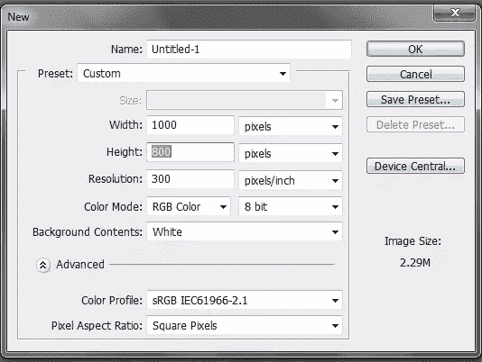](https://www.sitepoint.com/wp-content/uploads/2013/06/step1.png)

### 第二步:素描

为了使我们的标志的建设更容易，我们需要首先把一个草图。不一定要完美；它只是需要给我们一个想法，我们希望我们的标志看起来像什么。你可以直接在 Photoshop 里画草图，也可以用手画，然后扫描进去。

下面，你可以看到我为我的折纸大象标志做的速写。

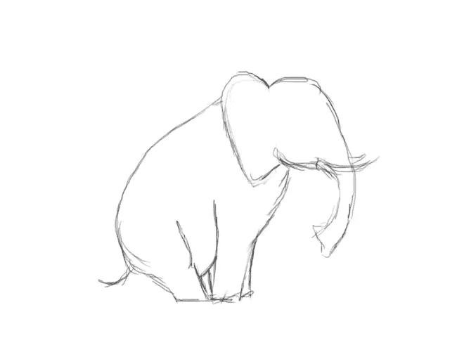

### 第三步:头部轮廓

现在我们的草图已经完成，我们需要创建线条画。换句话说，我们需要做一个立体的草图，这样我们就知道在哪里把大象分成文件夹纸片段。为此，您需要使用钢笔工具，分别绘制头部和身体。我用的颜色是#db0052。你会注意到在下图中，我为头部创建了尖锐的点和边缘。

[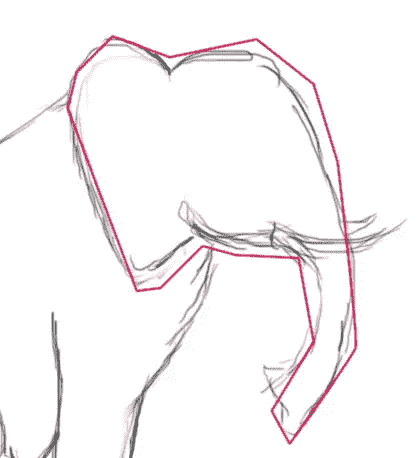](https://www.sitepoint.com/wp-content/uploads/2013/06/step3.png)

不要忘记画出象牙的轮廓。

[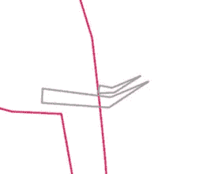](https://www.sitepoint.com/wp-content/uploads/2013/06/step3-1.png)

### 第四步:身体轮廓

新建一个图层，放在头部图层下面。现在，就像你对头部所做的那样，为身体和尾巴画一个立体的轮廓。完成后，你的轮廓应该类似下图。

[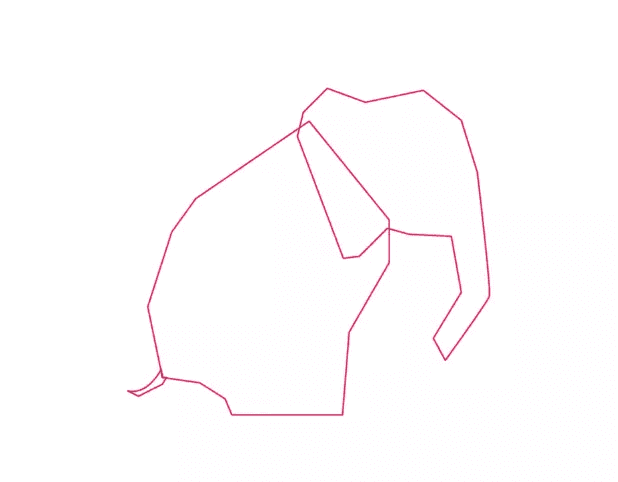](https://www.sitepoint.com/wp-content/uploads/2013/06/step4.png)

### 第五步:削减

既然我们现在已经有了大象的整个轮廓，我们需要开始解剖它，以便知道我们的“褶皱”将去哪里。为了实现这一点，使一个新的层，并将其标签为“削减”。使用不同于之前使用的颜色，开始用钢笔工具创建线条。我用了颜色#00afdb。请注意，您创建的作品越多，您的徽标看起来就越复杂。为了使事情简单化，集中精力画出腿、耳朵和躯干的位置。您的最终图像应该是这样的:

### 第六步:用数字作画

您可能会发现自己对正在进行的行数感到困惑。如果你无法区分不同的作品，那么我建议你创建一个“数字绘画”的效果。简单地创建一个新层，并在每个部分填充不同的颜色。你应该有 16 个部分，除非你已经创建了比我更多的行。

[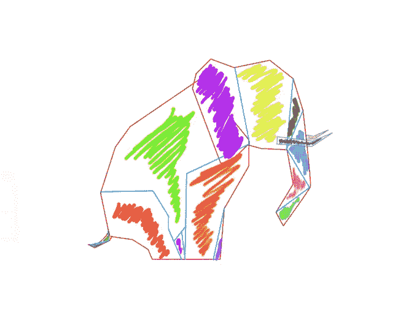](https://www.sitepoint.com/wp-content/uploads/2013/06/step6.png)

如果给每件作品分配不同的颜色让你感到困惑，你总是可以分配数字来区分这些作品。用 1 和 2 来区分棋子。标有 1 的部分将位于下方，标有 2 的部分将重叠。这将有助于你建立阴影。

[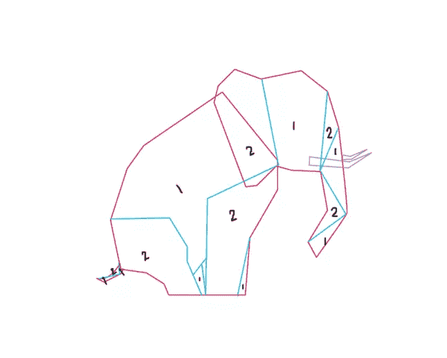](https://www.sitepoint.com/wp-content/uploads/2013/06/step6-1.png)

### 第 7 步:#1 颜色部分

将颜色部分分成两个独立的部分更容易。我们将从给所有标有 1 的部分着色开始。改变你的前景色为#e0246a，用钢笔工具创建你的路径，并填充它们，确保只填充标有 1 的路径。

[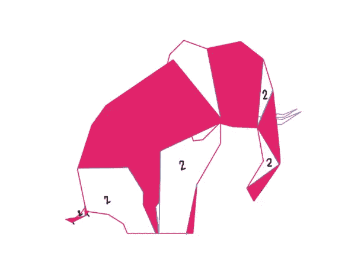](https://www.sitepoint.com/wp-content/uploads/2013/06/step7.png)

### 第八步#2 颜色部分

填充完 1 部分后，将前景色改为#ec2c74，使用步骤 7 中使用的相同技巧。

[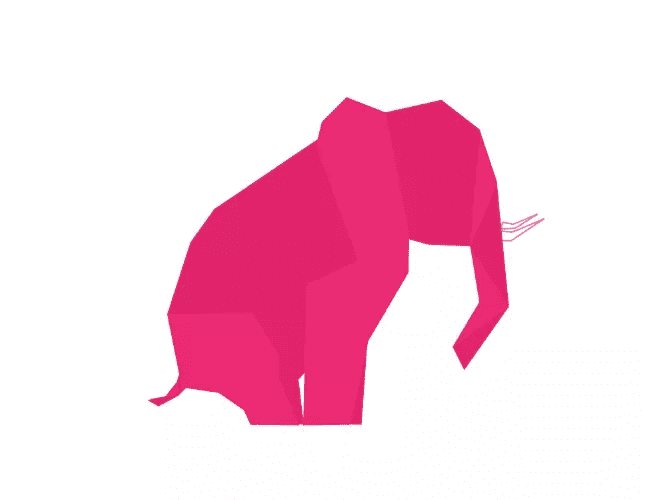](https://www.sitepoint.com/wp-content/uploads/2013/06/step8.png)

### 9 .长牙

新建一个图层，把你的前景色改成#c0c0c0。使用钢笔工具为你的象牙绘制一条路径并填充它们。

[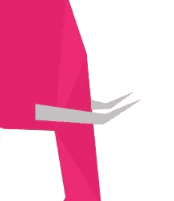](https://www.sitepoint.com/wp-content/uploads/2013/06/step9.png)

### 第十步:耳朵

你可能已经注意到，在编号时，大象的耳朵和前腿都标有 2，所以当你创建路径时，这两个看起来像一个大的形状。对于我们的标志，我们需要这两个形状看起来好像是重叠的。要做到这一点，你只需要为重叠的部分选择正确的颜色，然后创建一个新层。降低“2”层的不透明度，重新打开轮廓。单独描摹耳朵的形状，填入。

[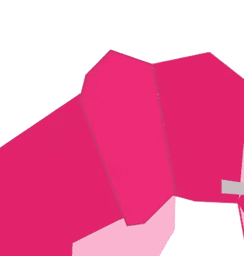](https://www.sitepoint.com/wp-content/uploads/2013/06/step10.png)

### 第十一步:耳影

复制这一层——停留在你新创建的耳朵层——进入“图像”>“调整”>“色调/饱和度”当对话菜单出现时，除了“亮度”选项之外，什么都不要做。将“亮度”值更改为-42。耳朵现在应该是这样的:

[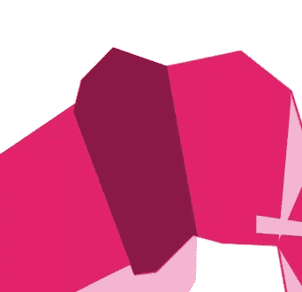](https://www.sitepoint.com/wp-content/uploads/2013/06/step11.png)

将 2px 高斯模糊应用到复制的耳朵上，然后将该层拖动到耳朵层下面，使其看起来与下图相似。

[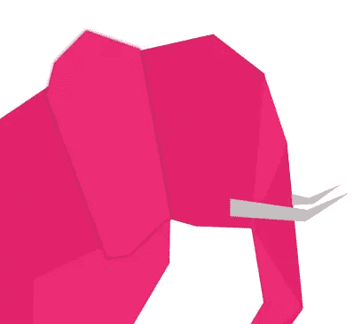](https://www.sitepoint.com/wp-content/uploads/2013/06/step11-1.png)

### 第十二步:身体阴影

就像耳朵一样，你可能注意到大象的身体和左后腿都标有相同的数字，使它看起来像一个整体。要纠正这个问题，只需执行与步骤 10 中相同的步骤，使这两部分看起来分开并重叠。这是您的图像现在应该看起来的样子:

[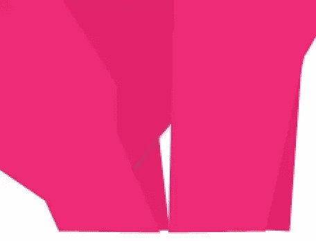](https://www.sitepoint.com/wp-content/uploads/2013/06/step12.png)

### 第 13 步:#2 部分重叠

我们希望最初标记为 2 的部分看起来像是与标记为 1 的部分重叠。我们将使用相同的过程中使用的耳朵和身体的阴影。到“2”层，并复制它。接下来进入“图像”>“调整”>“色调/饱和度”，把亮度降低到-42。

[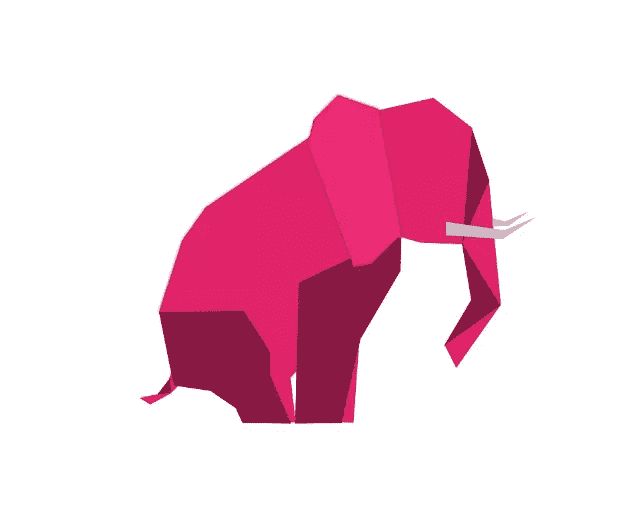](https://www.sitepoint.com/wp-content/uploads/2013/06/step13.png)

移动这个复制的层到原来的“2”层下面，并应用高斯模糊。

[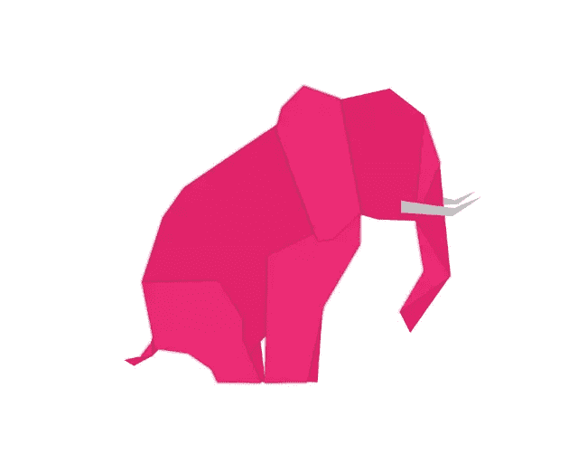](https://www.sitepoint.com/wp-content/uploads/2013/06/step13-1.png)

### 第 14 步:#2 截面梯度

确保你在原来的“2”层，你的前景色是#e0246a，你的背景色是#ffffff。双击层进入“混合选项”菜单。选择“渐变叠加”框，改变渐变，使其反映你选择的颜色。输入如下所示的相同数字。

[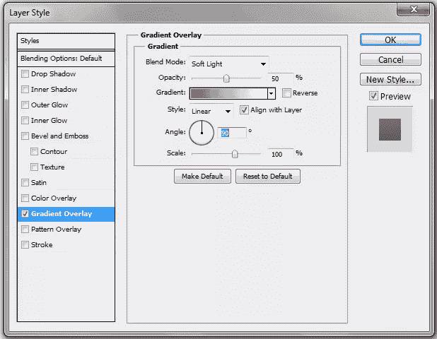](https://www.sitepoint.com/wp-content/uploads/2013/06/step14.png)

不要忘记你的大象的耳朵是分开的，所以你需要复制图层样式并粘贴到那个图层上。

[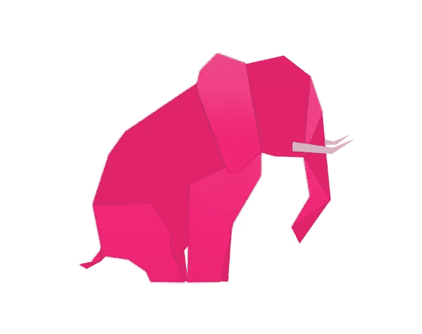](https://www.sitepoint.com/wp-content/uploads/2013/06/step14-1.png)

### 第 15 步:#1 截面梯度

复制步骤 14 中使用的图层样式，粘贴到原来的“1”层和“身体”层。

[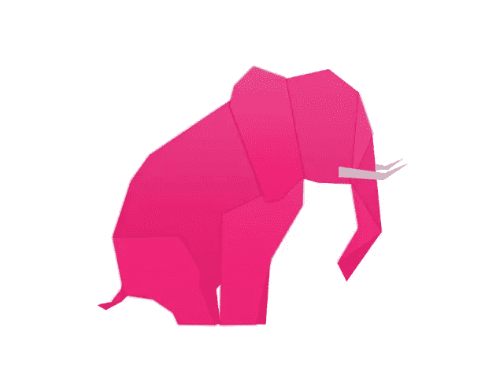](https://www.sitepoint.com/wp-content/uploads/2013/06/step15.png)

### 第十六步:阴影

创建一个新层，把它放在所有其他层的下面。使用椭圆选框工具创建一个阴影，填充颜色#000000。

[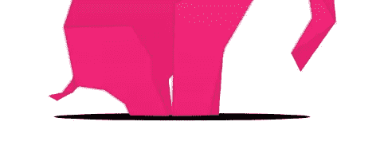](https://www.sitepoint.com/wp-content/uploads/2013/06/step16.png)

将图层不透明度降低到 20%，应用 5px 高斯模糊。

[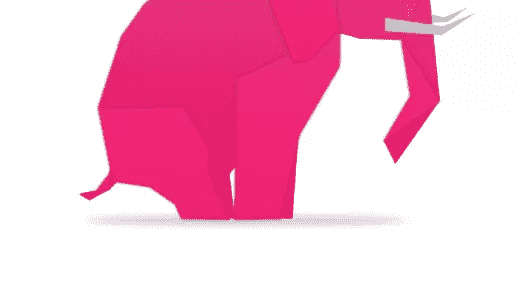](https://www.sitepoint.com/wp-content/uploads/2013/06/step16-1.png)

### 第十七步:纸张质地

将上面的纸纹理复制粘贴到所有图层上，将图层模式改为“分割”

[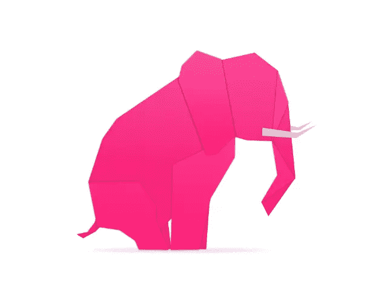](https://www.sitepoint.com/wp-content/uploads/2013/06/step17.png)

### 结束

通过添加背景颜色和公司名称等元素来完成您的徽标设计。

[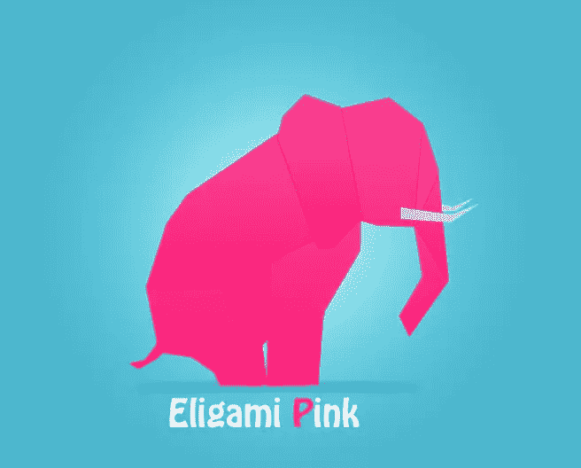](https://www.sitepoint.com/wp-content/uploads/2013/06/finished.png)

[下载 PSD 文件](https://www.dropbox.com/s/hsmnin86uhw7lb5/Origami%20Logo%20PSD.zip)** 

## **分享这篇文章**