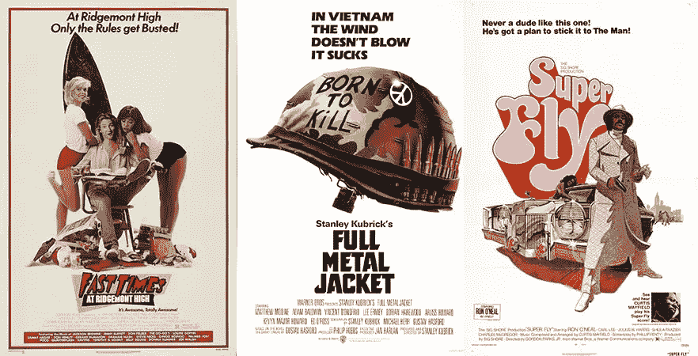
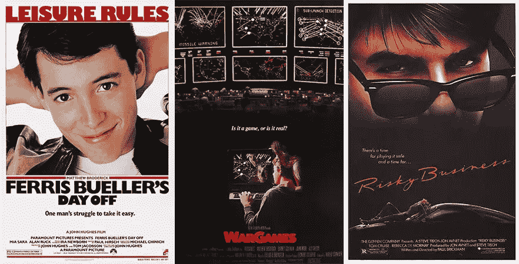
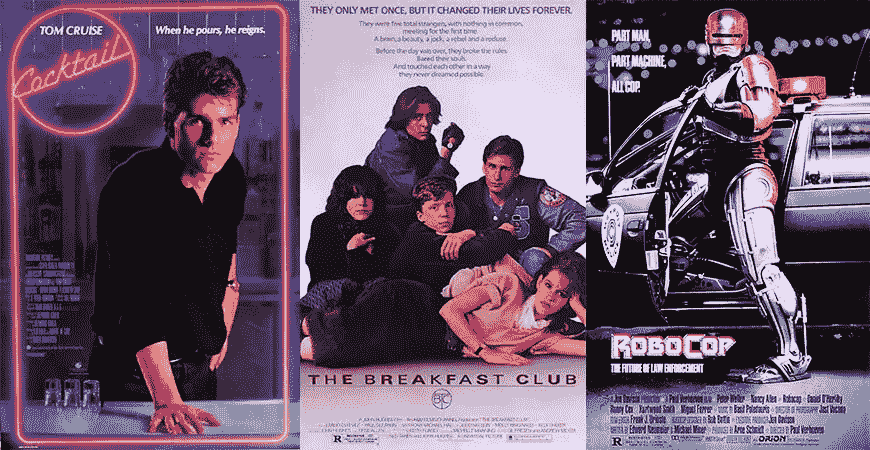
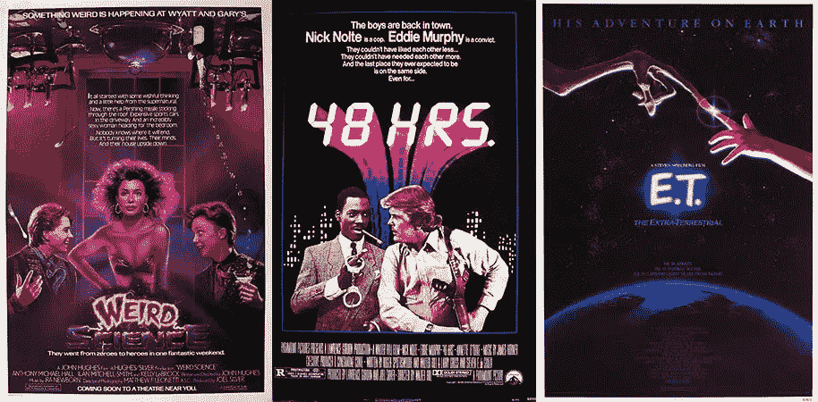
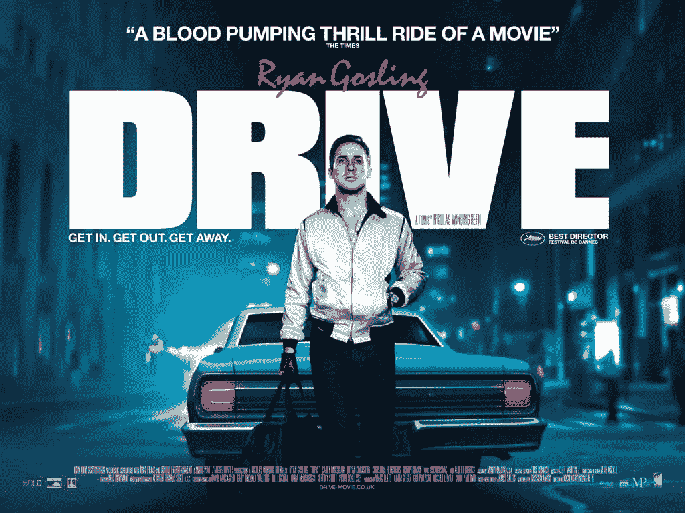

# 设计大赛:80 年代电影海报的秘诀是什么？

> 原文：<https://www.sitepoint.com/design-contest-whats-secret-1980s-movie-posters/>

作为我们 80 年代电影海报大赛的一部分， [Graphic Stock](http://www.graphicstock.com/partner/99designs?utm_source=sitepoint_article4_1115&utm_medium=custom&utm_campaign=sitepoint_article4_1115) 在 SitePoint 上赞助了一个设计系列。本文讨论的主题，以及这些文章——[Photoshop 编辑](https://www.sitepoint.com/making-alternative-80s-film-history-come-life-photoshop/)和 [80s 字体选择](https://www.sitepoint.com/80s-fonts-probably-havent-considered-using/)——可以用来帮助你赢得比赛。注册参加[图形股票试用](http://www.graphicstock.com/partner/99designs?utm_source=sitepoint_article4_1115&utm_medium=custom&utm_campaign=sitepoint_article4_1115)，准备好赢取 5000 美元一等奖的机会。

千禧一代的设计师正站在巨人的肩膀上:索尔·巴斯、亨利·马蒂斯，以及为《漂亮女人》设计海报的人，仅举几例。

因为认识到这些根源对成功至关重要——也是赢得 20 世纪 80 年代电影海报设计大赛的关键——我们从 1980-1989 年左右的剧院大厅网络中获得灵感，制作了一个视觉混合带。

## 这是一个白色背景的好天气

20 世纪 70 年代电影海报的传统背景要么是白色，要么是灰白色，尽管这一趋势在接下来的十年里急剧下降，但它绝不是消失了。里奇蒙高中 (1982 年)和*全金属夹克* (1987 年)的原始海报与*超级苍蝇* (1972 年)的海报完全吻合，证实了白色边框和中央构图即使在八十年代后期仍然非常存在，如果不再是主导主题的话。

## 回到黑色

越来越多的是，给我们带来约翰·兰博、约翰·麦克莱恩和约翰·康纳的十年开始流血——不仅仅是在英勇的暴力方面。背景经历了从高调到低调的转变——艺术品通过让人想起明暗对比的浓重阴影得到了同样的处理。

在《费里斯·布勒的休息日》(1986)的艺术作品中，马修·布罗德里克的脸被完全照亮，但在《T2》军事演习(1983)的海报中，他的脸几乎被隐藏起来了。

主题显然是一个因素，因为《战争游戏》无疑是一部更黑暗的电影；然而，电影海报作为一个整体在八十年代得到了更黑暗的待遇，这一趋势在很大程度上一直延续到今天。

## 如此明亮，你必须戴上墨镜(和黑色皮手套)

撇开黑暗不谈，这些三十年前的海报离“现代”还有很长的路要走黑色今天可能仍然流行，但对于黑色太阳镜和无指手套来说就不那么真实了——这是八十年代时尚(和海报)设计的两个遗物。

你可能会认为太阳镜会分散动作英雄的注意力，对他们来说，视线受阻可能意味着生死之别。在《饥饿游戏》的插图中，我们看不到 KatnissEverdeen 戴着太阳镜——甚至在《T2》的《暮光之城》的《T3》中也看不到吸血鬼戴着太阳镜，他们对光特别敏感——但如果这些电影是在 30 年前制作的，情况可能会有所不同。

时尚设计和平面设计不断相互促进，这就是为什么 20 世纪 80 年代的海报特别注重黑色太阳镜、皮夹克和无指手套等元素。

以下是一些激光相关资产，您可以在自己的设计中使用:

*   [激光灯](https://www.graphicstock.com/stock-image/laser-lights?utm_source=sitepoint_article4_1115&utm_medium=custom&utm_campaign=sitepoint_article4_1115)
*   [红色虚拟激光地板背景](https://www.graphicstock.com/stock-image/red-virtual-laser-floor-background?utm_source=sitepoint_article4_1115&utm_medium=custom&utm_campaign=sitepoint_article4_1115)
*   [蓝色虚拟激光地板背景](https://www.graphicstock.com/stock-image/blue-virtual-laser-floor-background?utm_source=sitepoint_article4_1115&utm_medium=custom&utm_campaign=sitepoint_article4_1115)
*   [绿色虚拟激光地板背景](https://www.graphicstock.com/stock-image/green-virtual-laser-floor-background?utm_source=sitepoint_article4_1115&utm_medium=custom&utm_campaign=sitepoint_article4_1115)
*   [紫色虚拟激光地板背景](https://www.graphicstock.com/stock-image/violet-virtual-laser-floor-background?utm_source=sitepoint_article4_1115&utm_medium=custom&utm_campaign=sitepoint_article4_1115)
*   [蓝色激光数字墙背景](https://www.graphicstock.com/stock-image/blue-laser-digital-wall-background?utm_source=sitepoint_article4_1115&utm_medium=custom&utm_campaign=sitepoint_article4_1115)
*   [紫色激光网格背景](https://www.graphicstock.com/stock-image/violet-laser-light-grid-background?utm_source=sitepoint_article4_1115&utm_medium=custom&utm_campaign=sitepoint_article4_1115)
*   [蓝色激光网格背景](https://www.graphicstock.com/stock-image/blue-laser-light-grid-background?utm_source=sitepoint_article4_1115&utm_medium=custom&utm_campaign=sitepoint_article4_1115)
*   [绿色激光网格背景](https://www.graphicstock.com/stock-image/green-laser-light-grid-background?utm_source=sitepoint_article4_1115&utm_medium=custom&utm_campaign=sitepoint_article4_1115)
*   [红色激光网格背景](https://www.graphicstock.com/stock-image/red-laser-light-grid-background?utm_source=sitepoint_article4_1115&utm_medium=custom&utm_campaign=sitepoint_article4_1115)

## 粉红佳人

在 20 世纪 80 年代，粉色和紫色不仅仅是“漂亮”;他们主导了几个流派，包括科幻和动作。仔细看，你会发现它们出现在《终结者》(1984)的金属字体和史泰龙的《T2 眼镜蛇》(1986)的背景中。与此同时，紫色在科幻动作片《T4》《机械战警》T5(1987)的艺术作品中随处可见，在《早餐俱乐部》T6(1985)和《鸡尾酒 T8》(T9)(1988)这样的爱情剧中也是如此。

今天，粉红色和紫色又回到了柔和女性化的模式，但它们在 20 世纪 80 年代绝对是主流，并被广泛用于各种流派。

您可以使用的粉色和紫色资产的一些示例:

*   [粉红色葡萄酒背景上的气泡](https://www.graphicstock.com/stock-image/bubbles-on-pink-wine-background?utm_source=sitepoint_article4_1115&utm_medium=custom&utm_campaign=sitepoint_article4_1115)
*   [复古粉色背景](https://www.graphicstock.com/stock-image/vintage-pink-backdrop-146907?utm_source=sitepoint_article4_1115&utm_medium=custom&utm_campaign=sitepoint_article4_1115)
*   [粉色闪光纸纹理](https://www.graphicstock.com/stock-image/design-texture-of-pink-glitter-paper-268051?utm_source=sitepoint_article4_1115&utm_medium=custom&utm_campaign=sitepoint_article4_1115)
*   [发光的灯光背景](https://www.graphicstock.com/stock-image/glowing-lights-background?utm_source=sitepoint_article4_1115&utm_medium=custom&utm_campaign=sitepoint_article4_1115)
*   [抽象粉色背景](https://www.graphicstock.com/stock-image/abstract-pinky-background?utm_source=sitepoint_article4_1115&utm_medium=custom&utm_campaign=sitepoint_article4_1115)
*   [浪漫的粉色和白色花纹](https://www.graphicstock.com/stock-image/romantic-pink-and-white-decorative-pattern-268447?utm_source=sitepoint_article4_1115&utm_medium=custom&utm_campaign=sitepoint_article4_1115)
*   [紫色 LED 圆点抽象背景](https://www.graphicstock.com/stock-image/violet-led-dots-abstract-background-149657?utm_source=sitepoint_article4_1115&utm_medium=custom&utm_campaign=sitepoint_article4_1115)
*   [另一个紫色 LED 点抽象背景](https://www.graphicstock.com/stock-image/violet-led-dots-abstract-background?utm_source=sitepoint_article4_1115&utm_medium=custom&utm_campaign=sitepoint_article4_1115)
*   [粉色和黑色条纹图案](https://www.graphicstock.com/stock-image/pink-and-black-stripes-pattern?utm_source=sitepoint_article4_1115&utm_medium=custom&utm_campaign=sitepoint_article4_1115)
*   [粉色背景](https://www.graphicstock.com/stock-image/pink-background?utm_source=sitepoint_article4_1115&utm_medium=custom&utm_campaign=sitepoint_article4_1115)
*   [浪漫粉色木质板材质感](https://www.graphicstock.com/stock-image/design-texture-of-romantic-pink-wooden-boards?utm_source=sitepoint_article4_1115&utm_medium=custom&utm_campaign=sitepoint_article4_1115)
*   [黑色圆点图案](https://www.graphicstock.com/stock-image/black-polka-dots-pattern-on-a-pink-background?utm_source=sitepoint_article4_1115&utm_medium=custom&utm_campaign=sitepoint_article4_1115)
*   [闪亮的粉色质地](https://www.graphicstock.com/stock-image/pink-shiny-texture?utm_source=sitepoint_article4_1115&utm_medium=custom&utm_campaign=sitepoint_article4_1115)
*   [粉色散景纹理](https://www.graphicstock.com/stock-image/pink-bokeh-texture?utm_source=sitepoint_article4_1115&utm_medium=custom&utm_campaign=sitepoint_article4_1115)
*   [粉色垃圾质地](https://www.graphicstock.com/stock-image/pink-grunge-texture?utm_source=sitepoint_article4_1115&utm_medium=custom&utm_campaign=sitepoint_article4_1115)
*   [粉色网络舞台背景](https://www.graphicstock.com/stock-image/pink-network-stage-background?utm_source=sitepoint_article4_1115&utm_medium=custom&utm_campaign=sitepoint_article4_1115)
*   [粉色聚光灯抽象背景](https://www.graphicstock.com/stock-image/pink-spotlight-abstract-background?utm_source=sitepoint_article4_1115&utm_medium=custom&utm_campaign=sitepoint_article4_1115)
*   [粉色天空上的云](https://www.graphicstock.com/stock-image/clouds-on-pink-sky-backdrop)
*   [粉色复古圆点纹理](https://www.graphicstock.com/stock-image/pink-vintage-dots-texture?utm_source=sitepoint_article4_1115&utm_medium=custom&utm_campaign=sitepoint_article4_1115)
*   [复古粉色散景背景](https://www.graphicstock.com/stock-image/retro-pink-bokeh-background?utm_source=sitepoint_article4_1115&utm_medium=custom&utm_campaign=sitepoint_article4_1115)
*   [紫色自然泡泡](https://www.graphicstock.com/stock-image/purple-nature-bubbles?utm_source=sitepoint_article4_1115&utm_medium=custom&utm_campaign=sitepoint_article4_1115)
*   [极光紫色背景](https://www.graphicstock.com/stock-image/aurora-purple-background?utm_source=sitepoint_article4_1115&utm_medium=custom&utm_campaign=sitepoint_article4_1115)

## 用科学蒙蔽观众

八十年代也是数字时代，电影海报是计算机图像、像素化计算机图形、激光和野生电力的主要不动产。

像战争游戏(1983)这样的电影为这提供了有机的机会，而其他电影则更多地使用了概念，特别是通过标题字体。*怪异科学* (1985)， *48 小时艺术作品背后的设计师。* (1982)和 *E.T.* (1982)都使用了印刷术来给标题添加数字或科技感。

以下是一些科技资产的例子:

*   [动态光](https://www.graphicstock.com/stock-image/dynamic-light?utm_source=sitepoint_article4_1115&utm_medium=custom&utm_campaign=sitepoint_article4_1115)
*   [动态蓝光](https://www.graphicstock.com/stock-image/dynamic-blue-light?utm_source=sitepoint_article4_1115&utm_medium=custom&utm_campaign=sitepoint_article4_1115)
*   [等离子球](https://www.graphicstock.com/stock-image/plasma-globe-142382)
*   [光纤](https://www.graphicstock.com/stock-image/fiber-optics-69466?utm_source=sitepoint_article4_1115&utm_medium=custom&utm_campaign=sitepoint_article4_1115)
*   [更多光纤](https://www.graphicstock.com/stock-image/fiber-optics-69468?utm_source=sitepoint_article4_1115&utm_medium=custom&utm_campaign=sitepoint_article4_1115)
*   [技术背景](https://www.graphicstock.com/stock-image/technology-background-98860?utm_source=sitepoint_article4_1115&utm_medium=custom&utm_campaign=sitepoint_article4_1115)
*   [高科技背景](https://www.graphicstock.com/stock-image/hi-tech-background-48783?utm_source=sitepoint_article4_1115&utm_medium=custom&utm_campaign=sitepoint_article4_1115)
*   [主板](https://www.graphicstock.com/stock-image/mainboard?utm_source=sitepoint_article4_1115&utm_medium=custom&utm_campaign=sitepoint_article4_1115)
*   [矢量电路板](https://www.graphicstock.com/stock-image/vector-circuit-board-in-perspective-175189?utm_source=sitepoint_article4_1115&utm_medium=custom&utm_campaign=sitepoint_article4_1115)
*   [绿色科技背景](https://www.graphicstock.com/stock-image/green-tech-background?utm_source=sitepoint_article4_1115&utm_medium=custom&utm_campaign=sitepoint_article4_1115)
*   [火焰风格分形](https://www.graphicstock.com/stock-image/fire-flame-style-fractal-design?utm_source=sitepoint_article4_1115&utm_medium=custom&utm_campaign=sitepoint_article4_1115)
*   [火焰分形](https://www.graphicstock.com/stock-image/fire-style-fractal-flames-design?utm_source=sitepoint_article4_1115&utm_medium=custom&utm_campaign=sitepoint_article4_1115)
*   [强大的处理器](https://www.graphicstock.com/stock-image/powerful-processor?utm_source=sitepoint_article4_1115&utm_medium=custom&utm_campaign=sitepoint_article4_1115)
*   [更多光纤](https://www.graphicstock.com/stock-image/fiber-optics-69940?utm_source=sitepoint_article4_1115&utm_medium=custom&utm_campaign=sitepoint_article4_1115)

当然，你总是可以从 *Drive* (2011)中获得灵感，这可能是有史以来最 80 年代的电影海报，尽管它是在 30 年后制作的——至少部分是因为它使用了粉色文本、无指手套、高领、深色阴影和电灯。

## 分享这篇文章