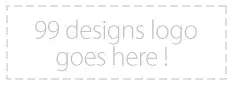

# 设计竞赛需要一个身份

> 原文：<https://www.sitepoint.com/design-contests-needs-an-identity/>

如果你一直在关注 [SitePoint 开发博客](https://www.sitepoint.com/blog/)，你会知道 SitePoint 的设计竞赛正在[以 99designs](https://99designs.com/) 的名义重新推出。

鉴于这个社区的性质，新网站的徽标设计向使用该网站的社区成员开放作为竞赛似乎是再合适不过的了。

从摘要来看:

> 99designs 是 SitePoint 设计大赛即将到来的演变，我们为我们的新 logo 举办一场设计大赛是再合适不过了。标志必须符合新网站的设计。我们正在寻找一个新鲜，简单的标志，并提供 1000 美元的奖金，我们保证将选择一个赢家，并支付。

比赛今天开始，将持续四天。已经有一些有前途的提交，但如果你认为你可以做得更好，去设计吧！

当前 WordPress 标签出现了一些奇怪的行为。对于那些在阅读器中多次收到这篇文章的读者，我深表歉意。我们正在努力修复它，这样它就不会再发生了！
<ins>固定！</ins>

## 分享这篇文章