# 2009 年设计、插图和摄影点滴

> 原文：<https://www.sitepoint.com/design-illustration-photography-bits-bobs-of-2009/>

现在是 2009 年的新年前夕，是时候展望 2010 年了，但也是时候回顾 2009 年的一些优秀设计(和伟大设计)并从中获得灵感。这是我在这一年中遇到的一些设计和摄影作品以及有用资源的列表。它是非正式的，涵盖了大量的网站，包装和平面设计，我喜欢今年，认为你可能会感兴趣。很难选出最喜欢的，但这些只是我在不同学科中发现的一些鼓舞人心的例子。我也对你今年遇到的设计好东西很感兴趣，所以请添加你自己最喜欢的。**酒精包装**先想到酒精不好吗？只是今晚想和朋友喝点汽水。无论如何，先从由 [MASH](https://www.mashdesign.com.au/) 设计的天鹅绒手套酒开始，它看起来像是非常奇特的东西。 [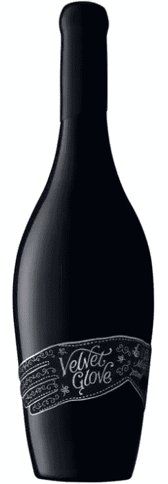](https://www.sitepoint.com/wp-content/uploads/2010/01/VelvetGlove.png) [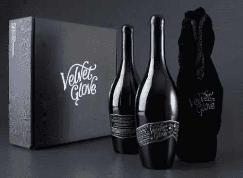](https://www.sitepoint.com/wp-content/uploads/2010/01/VelvetGlove2.png) 北海巨妖五香朗姆酒。我喜欢这瓶酒，喜欢它的标签，也喜欢网站的漂亮。 [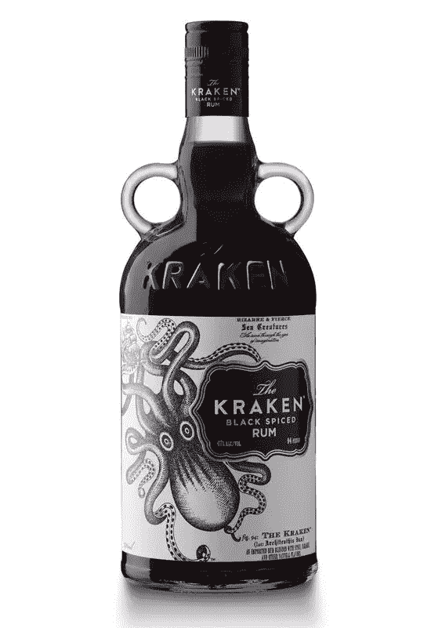](https://www.sitepoint.com/wp-content/uploads/2010/01/TheKrakenRum.jpg) **其他包装**这款纸盒曾出现在我今年[的一篇关于食品包装的博文中](https://www.sitepoint.com/offline-design-inspiration-part-3-food-packaging)。蝙蝠侠牛奶鸡尾酒听起来很恶心，但看起来很酷。由阿列克谢·哈托蒙基设计。 **广告**我不能 100%确定这是否真的是一个产品，或者是一个概念，但它让我发笑。奥美&马瑟，德国 [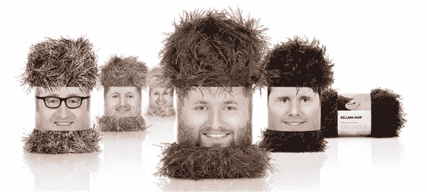](https://www.sitepoint.com/wp-content/uploads/2010/01/Wool.png) 为 Rellana Wool 设计的滑稽巧妙的包装这个广告在爱尔兰以外的地方可能没见过，但它是为面包师 Pat 设计的，广告语是“爱尔兰的烤面包”。把塞缪尔·贝克特的脸 PS 到吐司上很不错。对我来说，最好的网站能以快速简单的方式提供我想要的信息，如果它们看起来真的很好，那就是额外的奖励。实际上，我最常去的网站往往相当实用并提供服务，比如报纸和书签网站，如 [delicious](https://delicious.com/) 、[visualize . us](https://vi.sualize.us/)和 [ffffound](https://ffffound.com/) 。我只挑选了几个我喜欢的网站。每一张都代表着不同的风格——干净、多彩、俗气、插图精美的版式[Helveticons](http://www.helveticons.ch/)[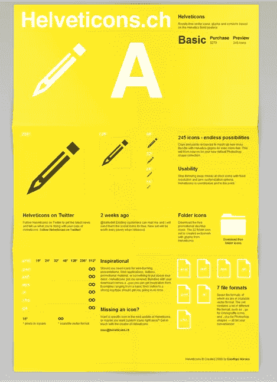](https://www.sitepoint.com/wp-content/uploads/2010/01/helveticons.png)[New To York](https://www.newtoyork.com/)[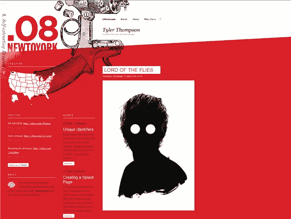](https://www.sitepoint.com/wp-content/uploads/2010/01/NewToYork.png)[工作室球拍](https://studioracket.org/)[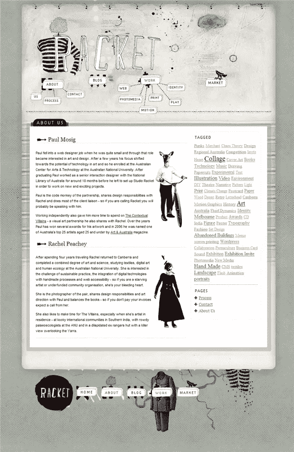](https://www.sitepoint.com/wp-content/uploads/2010/01/racket.png)[XixinoBahno](https://www.xixinobanho.org.br/)[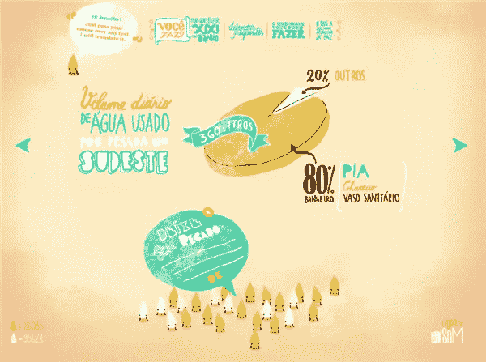](https://www.sitepoint.com/wp-content/uploads/2010/01/xixino.png)[杰克布鲁姆](https://oldergraphicdesigner.com/) [ 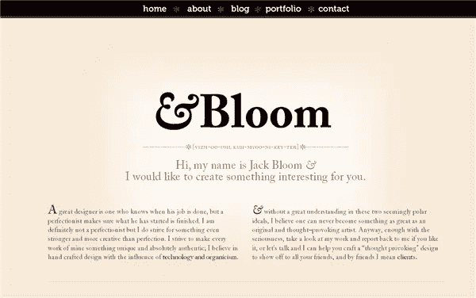 ](https://www.sitepoint.com/wp-content/uploads/2010/01/JackBloom.png) **插图**我不能挑出一个最喜欢的，所以这些只是我真正欣赏的不同风格的插图画家中的几个。Noma Bar 是一位来自以色列的插画师，他机智的插画展现了对负空间的高超把握。 [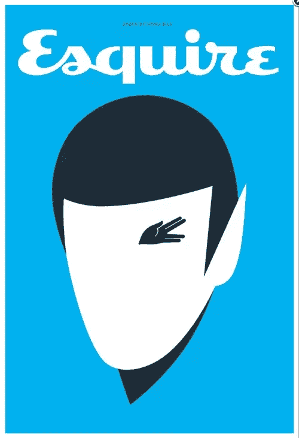](https://www.sitepoint.com/wp-content/uploads/2010/01/noma.png) [工作室 KXX](https://www.studiokxx.com/works/kestone_design_union/)**[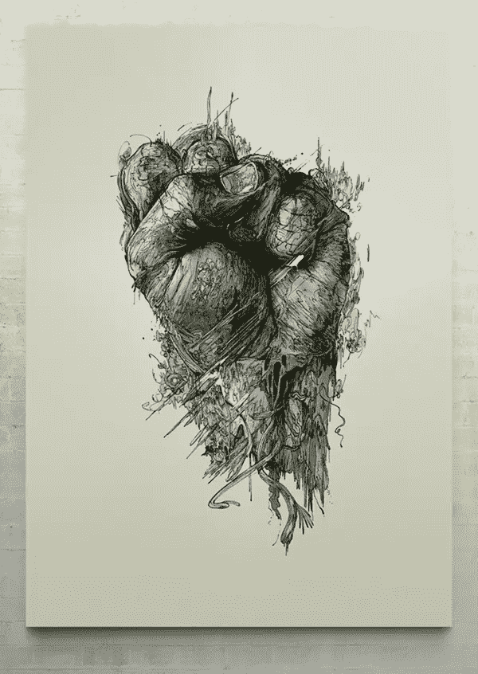](https://www.sitepoint.com/wp-content/uploads/2010/01/StudioKXX.jpg)**我可以连续几个小时看安德烈·戈尔杰耶夫的插图。**[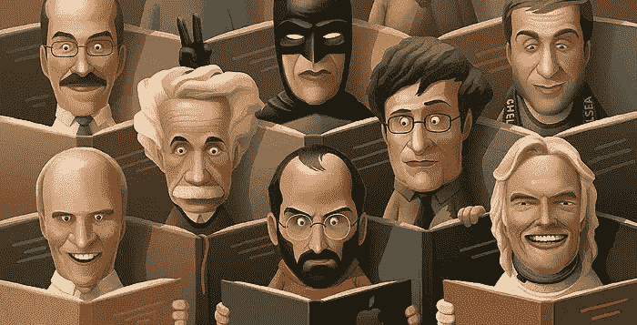](https://www.sitepoint.com/wp-content/uploads/2010/01/Andrey.jpg)****[杰西卡·希斯切](https://jessicahische.com/)是一位出色的类型设计师和插画师。** **[ 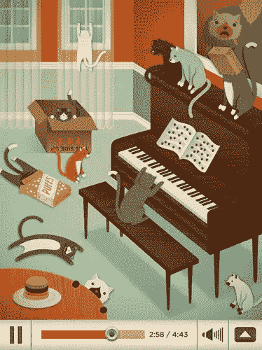 ](https://www.sitepoint.com/wp-content/uploads/2010/01/jessica.jpg)** 费尔南多·费拉罗的作品是例外。 [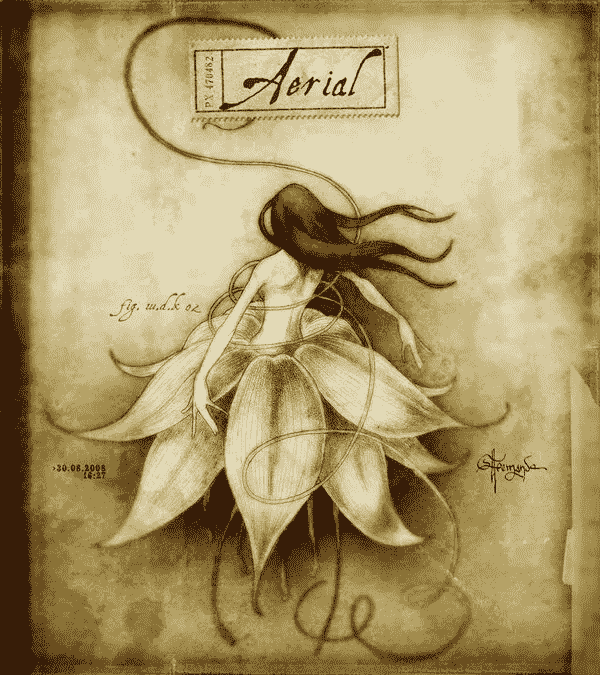](https://www.sitepoint.com/wp-content/uploads/2010/01/Fernando.jpg) 我第一次看到[林泽·亨特的](https://www.linziehunter.co.uk/)插图是在她收到的[垃圾邮件](https://www.flickr.com/photos/linzie/sets/72157602417089145/)的插图在网上真正走红的时候。我喜欢她幽默的风格。[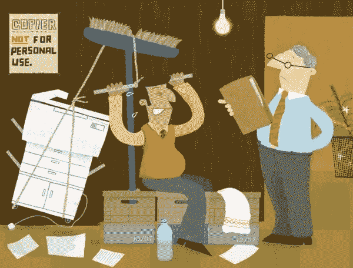](https://www.sitepoint.com/wp-content/uploads/2010/01/linziehunter.jpg)******摄影**Boston.com 的大画面持续不断地展示来自世界各地的精彩且发人深省的照片。蒂莫西·艾伦是 BBC 野生动物频道的摄影师。他的作品令人惊叹。 [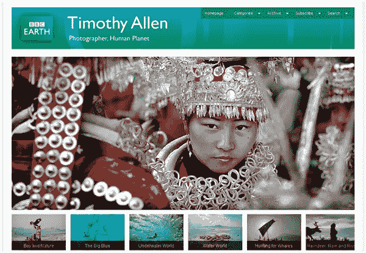](https://www.sitepoint.com/wp-content/uploads/2010/01/TimothyAllen.png) **最富想象力地使用 YouTube 的设计公司** [Boone Oakley](https://www.youtube.com/watch?v=VI3gdhZdPTM&annotation_id=annotation_69515&feature=iv) 在他们的网站上做了一些稍微不同的事情。也许有很多公司都这么做，但这是我第一次看到通过 Youtube 运营一个完整的网站。****

****<object classid="clsid:d27cdb6e-ae6d-11cf-96b8-444553540000" width="425" height="355" codebase="https://download.macromedia.com/pub/shockwave/cabs/flash/swflash.cab#version=6,0,40,0"><param name="src" value="https://www.youtube.com/v/Elo7WeIydh8&amp;hl=en_GB&amp;fs=1&amp;&amp;hl=en"><embed type="application/x-shockwave-flash" width="425" height="355" src="https://www.youtube.com/v/Elo7WeIydh8&amp;hl=en_GB&amp;fs=1&amp;&amp;hl=en"></object>

**我在 YouTube 上看到但在电视上看不到的最喜欢的广告**依云的精彩绝伦。

<object classid="clsid:d27cdb6e-ae6d-11cf-96b8-444553540000" width="425" height="355" codebase="https://download.macromedia.com/pub/shockwave/cabs/flash/swflash.cab#version=6,0,40,0"><param name="src" value="https://www.youtube.com/v/XQcVllWpwGs&amp;hl=en_GB&amp;fs=1&amp;&amp;hl=en"><embed type="application/x-shockwave-flash" width="425" height="355" src="https://www.youtube.com/v/XQcVllWpwGs&amp;hl=en_GB&amp;fs=1&amp;&amp;hl=en"></object>

唷！这只是我今年享受的视觉享受的一小部分。你呢？你喜欢什么样的设计？最后，我想祝大家 2010 年一切顺利。希望世界能平静一点，也能坚持一点。感谢在过去几个月里阅读我的帖子的每一个人，感谢 Sitepoint 的所有工作人员，特别是 Matt Magain。我真的很喜欢在这里写设计博客，并期待在 2010 年写更多的设计文章。 **祝新年一切顺利平安！** **詹妮弗****** 

## ****分享这篇文章****