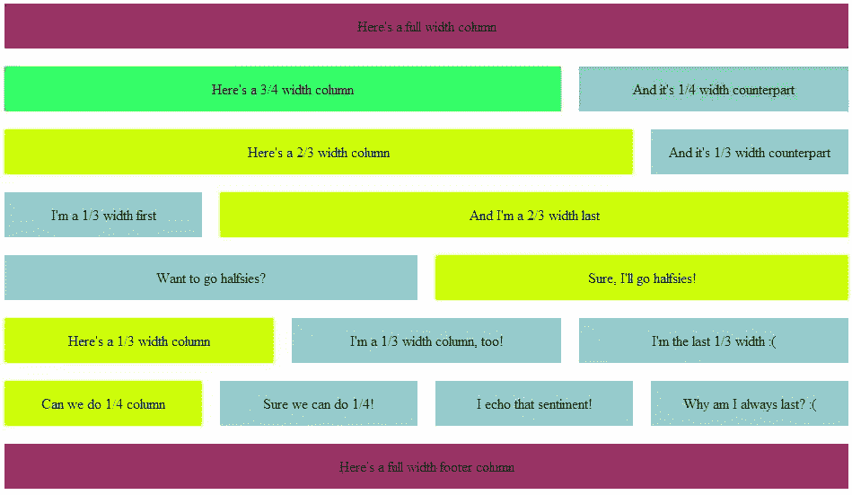

# 用 960 网格快速设计有组织的网站

> 原文：<https://www.sitepoint.com/design-organized-websites-rapidly-with-960-grid/>

在本文中，我将讨论 960 的强大功能，并向您展示如何创建一个 12 列的布局(或者其他大小，如果您愿意的话),这样您就可以开始使用网格系统了。我下面有一个全功能的 CSS 和 HTML 示例，你可以下载我的 Photoshop 模板来设计概念，并快速剪切它们以便快速实现。

我越来越发现 960 像素的宽度适用于我遇到的每一种设计情况。正如我将在本文中讨论的，使用 960 网格有很多很好的理由，一旦你有了一个合适的系统，你就可以开始运行了。

我用这个系统进行快速原型设计。只需轻轻一抖手腕，我就可以拥有一个在图形设计软件和网页设计软件中都易于使用的布局。只需在 Photoshop 中用十二个 80px 参考线的网格讲述(或设置)一个文件。您可以在很短的时间内轻松地对设计进行裁剪和布局，从而更快地获得客户的认可，并使设计与开发实现更加一致。

使用这样一个系统的另一个原因是——正如我将要展示的——你可以很容易地使这个设计具有响应性。

### 为什么是 960？

首先，在过去的 10 年里，我还没有坐在屏幕分辨率低于 960 的台式机或笔记本电脑前。虽然我知道旧显示器的最大像素是 800 像素，但 960 网格适应这个尺寸没有问题。怎么会？

960 可以用十几种方法整除:

*   2 x 480
*   3 x 320
*   4 x 240
*   5 x 192
*   6 x 160
*   8 x 120
*   10 x 96
*   12 x 80
*   15 x 64
*   16 x 60
*   20 x 48
*   24 x 40
*   30 x 32

这是什么意思？您可以创建一个网格系统来适应任何屏幕尺寸的屏幕布局。我不使用上面的大部分列宽(我只是想不出太多的场景需要 30 列，每列 32 像素)。只用几个就可以创建一个非常好的系统。

### 12 列来统治他们

现在我真的不认为 12 列是最终的网格系统。事实上，我经常使用 16 列和 24 列，但是 12 列是一个非常好的起点。以下是在 960 像素网格系统上构建的 12 列网格系统的一些布局方案:

*(点击看全尺寸版)*

还有其他的方法来分割它，但是你应该明白，通过一些 CSS 定义，你可以非常容易和有效地布置你的网格。我只选择了默认的 12 列，因为它涵盖了我需要的 99%。在我需要 16、20、24 甚至 30 列设计的极端情况下，我将要展示的设计很容易适应。

### 筹备布局

对于这篇文章，我将选择一个简化的布局。因为我通常只需要上述布局场景中的几个，所以我喜欢选择

1.  全宽
2.  半宽度
3.  1/3 宽度
4.  2/3 宽度
5.  1/4 宽度
6.  3/4 宽度

再说一遍，还有很多，但我也在考虑长期的响应式设计。如果你把设计分成太多的小部分，响应式设计会变得更加笨拙和笨拙。

有了上面的布局，您就拥有了大多数设计场景所需的所有列宽。全幅覆盖横幅和导航。3/4 和 1/4 包含带有侧边栏的文章。其他的非常适合标注框和其他设计元素。

### CSS

有了上面的列宽，我们现在可以设置 CSS 了。因为我们希望元素之间有一些空间，所以我们将为所有内容添加 10px 的边距，所以您会看到宽度发生了变化以反映这一点。

所以让我们来看看 CSS 模型的起源:

[sourcecode language="css"]

body {
最小宽度:960px
保证金:自动；
}

/*包装*/
。row {
宽度:960px
保证金:汽车；
}

[/sourcecode]

首先，我们简单地将主体宽度锁定在 960 像素。我们希望将列中的每一行都包装在一个包装器中，使所有内容都保持在应有的位置，尽管有几个很好的理由不这样做——比如您希望元素彼此移动的组合布局。

现在，我们设置“装订线”，即各列之间的宽度，这样我们的文本或其他设计元素就不会相互重叠。

[sourcecode language="css"]

/*列边距*/
。col_12，/*全宽*/
。col_9，/* 3/4 宽度*/
。col_8，/* 2/3 宽度*/
。col_6，/*半宽*/
。col_4，/* 1/3 宽度*/
。col_3 /* 1/4 width */
{
左边距:10px
右边距:10px
显示:内嵌；
浮动:左；
}

[/sourcecode]

我标记了每个列的编号，以便于参考，以防您忘记哪一列是哪一列。它发生了。

接下来，我们需要一种方法来确保最左边的列向左，而最右边的列向右。

[sourcecode language="css"]

/*名和姓*/
。第一个{
左边距:0；
}

。last {
右边距:0；
}

[/sourcecode]

然后，我们为每个列类型准备实际宽度。

[sourcecode language="css"]

/*考虑边距的列宽*/
。col _ 12 { width:940 px；}
。col _ 9 { width:620 px；}
。col _ 8 { width:700 px；}
。col _ 6 { width:460 px；}
。col _ 4 { width:220 px；}
。col _ 3 { width:300 px；}

[/sourcecode]

现在，让我们将所有这些放在一个无缝的 CSS 包中，您可以保存并立即使用它:

[source code language = " CSS "]
/*固定正文宽度*/
正文{
min-width:960 px；
保证金:自动；
}

/*包装*/
。row {
宽度:960px
保证金:汽车；
}

/*列边距*/
。col_12，/*全宽*/
。col_9，/* 3/4 宽度*/
。col_8，/* 2/3 宽度*/
。col_6，/*半宽*/
。col_4，/* 1/3 宽度*/
。col_3 /* 1/4 width */
{
左边距:10px
右边距:10px
显示:内嵌；
浮动:左；
}

/*名和姓*/
。第一个{
左边距:0；
}

。last {
右边距:0；
}

/*考虑边距的列宽*/
。col _ 12 { width:940 px；}
。col _ 9 { width:620 px；}
。col _ 8 { width:700 px；}
。col _ 6 { width:460 px；}
。col _ 4 { width:220 px；}
。col _ 3 { width:300 px；}

[/sourcecode]

### 查看 960，12 列网格的运行情况！

现在，让我们把它付诸实践。将上面的代码保存为 CSS 文档，命名为“960-12-col.css”。在同一文件夹中，复制并粘贴以下 HTML:

[源代码语言="htmtl"]

<html>
head>
<meta http-equiv = " Content-Type " Content = " text/html；charset=utf-8" / >
<标题>示例 960，12 列网格布局</标题>
<link rel = " style sheet " type = " text/CSS " href = " 960-12-col . CSS "/>
<样式>
/*列边距*/
。col_12，/*全宽*/
。col_9，/* 3/4 宽度*/
。col_8，/* 2/3 宽度*/
。col_6，/*半宽*/
。col_4，/* 1/3 宽度*/
。col_3 /* 1/4 宽度*/
{
高度:50px
margin-top:10px；
边距-底部:10px
文本对齐:居中；
显示:表格单元；
垂直对齐:居中；
}
</样式>
</头像>

下面是一个全宽列

下面是一个 2/3 宽度的列

而我是 2/3 宽度的 last

<

当然，我对半分！

下面是一个 1/3 宽度的列< /p > < /div >

我是最后 1/3 宽度的:^(

/div>

我附和这种情绪！

为什么我总是最后一个？:^(

下面是一个全角页脚列< /p > < /div

[/sourcecode]

确保第 7 行中的样式表与您保存的 CSS 文件相同。在浏览器中打开它，您会看到网格在运行:

*(点击看全尺寸版)*

上面 HTML 中的标记添加了一些东西，只是为了让网格易于查看。您可以删除或注释掉标题中的

### 960 的平面设计，12 列网格

所以，我不能只给你一个 CSS 模板。我把我的 Photoshop 模板也交给了你。[下载，保存，看看](https://www.dropbox.com/s/8l8oplagbdilppa/960_12_columns.psd)。每个标准的列布局都在那里，所以你可以看到每个是如何组合在一起的。

该指南将帮助您锁定您的设计，并使您的图形设计在以后转化为可行的代码变得非常容易。我在 Photoshop 中设计布局，然后发送给客户审查。一旦我们通过了无数次的审核，有了一个最终的设计，然后我会把它分解成代码，翻译成页面。

根据项目的不同，我可能会直接跳到 CSS 设计，并给他们发送一个链接供审查，但设计越复杂，我就越倾向于从一个图形开始，我可以先发送给他们并获得批准。

好好享受，让我知道你的想法！

## 分享这篇文章