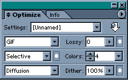
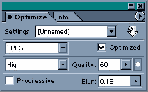
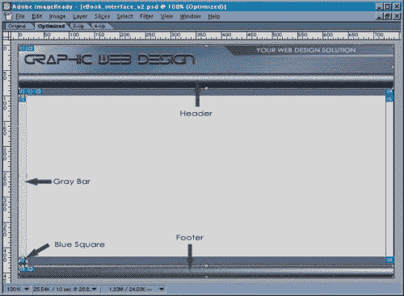
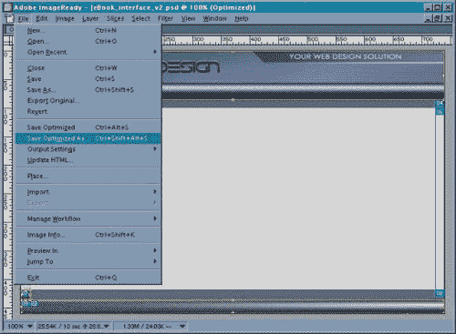
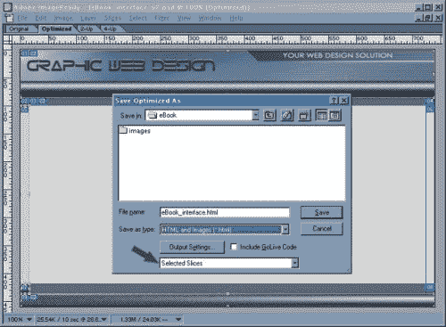

# 用 Photoshop 文章设计一个网站

> 原文：<https://www.sitepoint.com/design-website-photoshop-3/>

##### 优化和导出

我们现在将优化并导出每个切片。现在使用“切片选择工具”选择名为 gray_bar 的切片，按住 shift 键，单击 blue_square 切片。由于这两个都是单色图像，我们可以同时优化两者。使用这些设置将两个切片优化为 gif:

接下来，使用“切片选择工具”选择页眉，然后按住 shift 键，同时单击页脚。因为这些切片有复杂的颜色过渡，所以最好保存为 jpegs 格式。使用这些设置:

我在这里加入少量模糊的原因是为了平滑一些通常与 jpeg 图像相关的像素化。然而，这在优化照片时并不常见，因为照片看起来会失焦。

要导出这些图像，请使用“切片选择工具”选择页眉、页脚、蓝色方块和灰色条:

在“文件”菜单中选择“优化另存为”:

有了这个，你有几个选择:

1.  您可以选择目标位置(保存图像和代码的位置)，然后单击保存，或者
2.  您可以选择只保存 HTML，它将创建一个适合您设计的布局的 HTML 页面。
3.  第三个选项——仅保存我们选择的图像——是我们将要做的。

在“保存类型”对话框中选择“仅图像”。然后，在下面，选择“选定的切片”。默认情况下，ImageReady 会将所有选定的图像保存在“images”文件夹中。你可以点击“输出设置”框，在这个对话框的下半部分取消选择“将图像放入文件夹:”复选框。我通常会在分割图片之前创建一个新网站的文件夹结构——显然，你可以将文件保存到任何你喜欢的文件夹中。选择位置后，单击保存。

下一步是创建 HTML 页面，我们稍后将使用它作为网站其余部分的模板。如果你想知道为什么我们没有保存我们的原始布局图像的中心切片，这里是为什么。图像中心的灰色方框将包含您的内容。顶部和底部的蓝色横条(即页眉和页脚的下方和上方)同样用于为导航指定文本链接的位置。

**Go to page:** [1](https://sitepoint.com/design-website-photoshop) | [2](https://sitepoint.com/design-website-photoshop-2/) | [3](https://sitepoint.com/design-website-photoshop-3/) | [4](https://sitepoint.com/design-website-photoshop-4/)

## 分享这篇文章