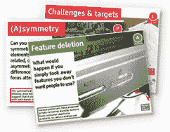

# 发布意图设计工具包

> 原文：<https://www.sitepoint.com/design-with-intent-toolkit-release/>

优秀设计的一个主要诀窍是在正确的时间找到正确的问题。但是你如何找到那些问题呢？

令人欣慰的是，英国工业设计师、工程师和研究员丹·洛克顿也许能帮上忙。

Dan 的 [Design with Intent Toolkit](http://www.danlockton.com/dwi/Download_the_cards) 为你提供了八种不同的方法，或者用 Dan 的话来说，就是“透镜*”*来看待设计问题。每一个镜头都是简单的一系列问题，这些问题解决了一个既定思想流派的设计挑战。

这八个镜头是:

| **建筑:** | 借鉴建筑、城市规划和交通管理的理念 |
| **防错:** | 借鉴人类工程学、健康和安全相关设计中常见的以安全为中心的理论 |
| **交互:** | 使用一些在 UI 设计中建立的更熟悉的人机交互思想 |
| **卢迪克:** | 使用从游戏和其他“好玩的”互动中获得的影响用户行为的技术 |
| **感性:** | 借鉴大脑如何处理周围世界的想法 |
| **认知:** | 使用基于我们对用户决策的了解的想法 |
| **权谋:** | 围绕着一些有用但可能不道德的操纵用户行为的技术 |
| **安全性:** | 采取“威慑和对策”的方法来改变用户行为 |

总共有 101 个问题，你可以从过去可能从未考虑过的角度来测试和完善你的设计想法。

虽然丹仍在完善内容，但[这些卡片目前可以免费下载](http://www.danlockton.com/dwi/Download_the_cards)并打印成 PDF 格式。显然，印刷版本将在不久的将来上市。与此同时，他们仍然在寻找建设性的反馈，所以如果可以的话，给他们一些爱。

当一个设计不太有效时，通常很难找到不同的方法来解决问题。这些卡片提供了一条有用的前进道路。

看看他们。应该好好利用这段时间。

###### 来自设计视图#70

## 分享这篇文章