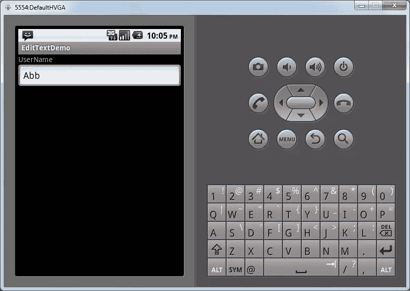
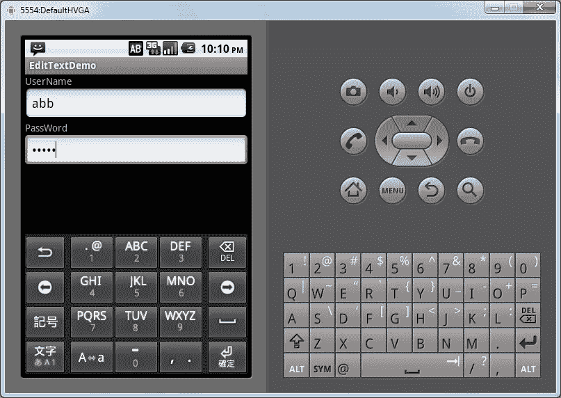
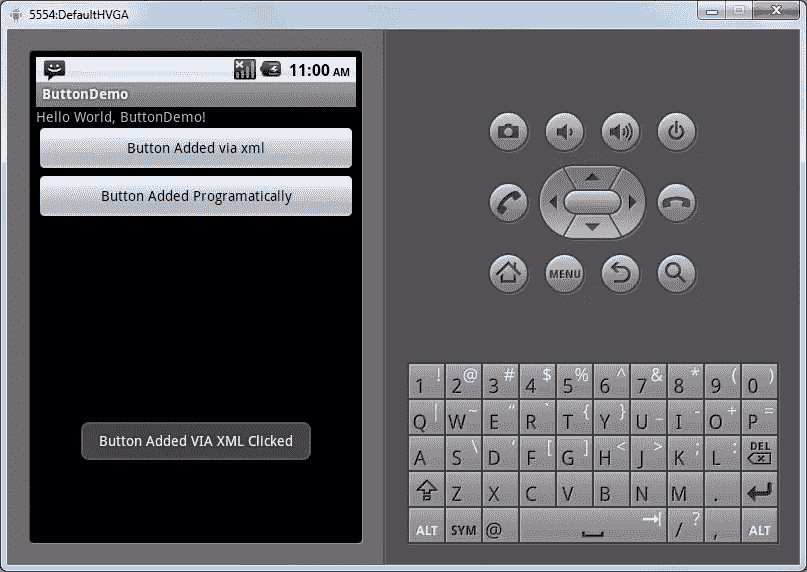
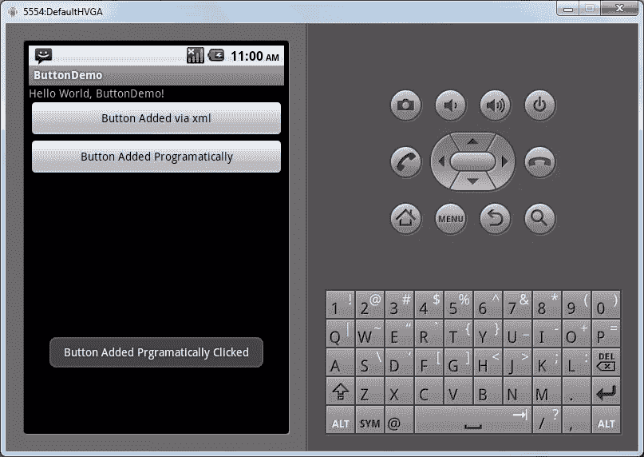
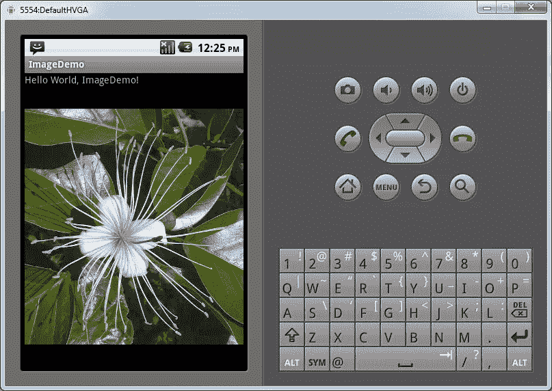
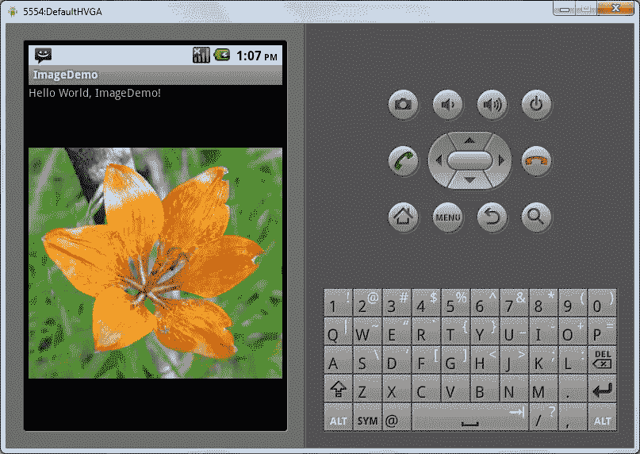
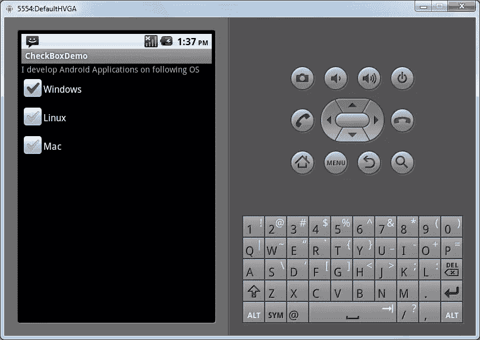
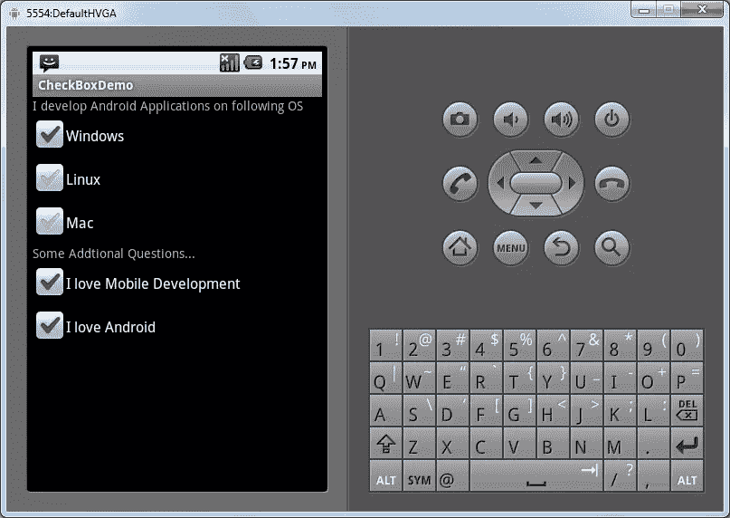
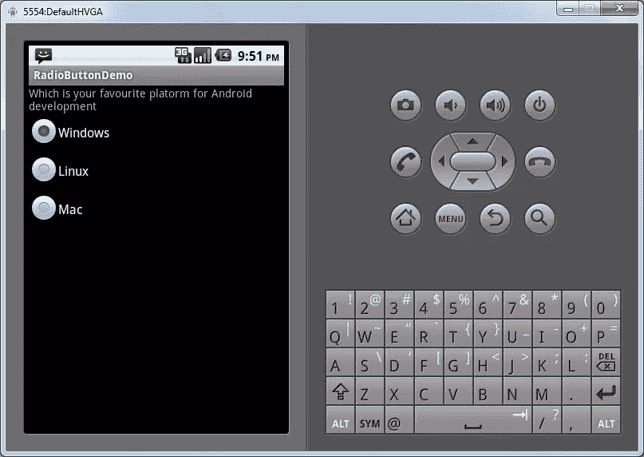

# 使用 Android GUI Tooklit 中的基本部件设计应用程序的用户界面

> 原文：<https://www.sitepoint.com/design-your-apps-user-interface-using-basic-widgets-in-androids-gui-toolkit/>

随着移动应用变得越来越先进，用户界面变得越来越重要。Android 作为一个平台，为 Android 开发者设计直观的界面提供了一个很好的 GUI 工具包。许多应用程序开发人员试图开发新的、前所未有的、创新的界面，但通常情况下，让你的应用程序易于使用的最佳方法是坚持使用熟悉的框架。这通常意味着最好坚持使用广泛使用的工具包中的标准界面元素。

像所有优秀的 GUI 工具包一样，Android 也提供了一些基本的小部件，如按钮、标签等。任何 Android 开发人员都可以用它来为自己的应用程序创建 UI。这里是最常见的 Android 界面元素的概述。

### 标签(文本视图)

Android 提供的最基本的小部件之一是 TextView(标签)，用于在屏幕上显示少量文本。TextView 通常用于向用户显示上下文信息或命名屏幕上的其他元素。

可以使用两种不同的方法将 TextView 添加到您的应用程序界面

*   通过 layout.xml 添加 TextView
*   通过代码添加 TextView。

#### 通过 Layout.xml 添加标签

添加 TextView 的方法之一是通过 layout.xml 文件。在 layout.xml 中，只需添加<textview>标签就可以添加一个 TextView。添加 TextView 的代码如下:</textview>

```
<LinearLayout xmlns:android="http://schemas.android.com/apk/res/android"
android:orientation="vertical"
android:layout_width="fill_parent"
android:layout_height="fill_parent"
android:id="@+id/info"
>
<TextView
android:layout_width="fill_parent"
android:layout_height="wrap_content"
android:text="@string/hello"
/>
</LinearLayout>
```

在上面的 TextView 节点中，您可以添加不同的属性(例如:- android:text)作为 XML 标签的属性。

#### 通过代码添加标签

通过 XML 添加 TextView 是向界面添加 TextView 的一种简单方法，但有时可能需要以编程方式添加 TextView。

下面是使用更标准的编程技术添加 TextView 的代码。

```
public class TextViewDemo extends Activity {
    /** Called when the activity is first created. */
    @Override
    public void onCreate(Bundle savedInstanceState) {
        super.onCreate(savedInstanceState);
        setContentView(R.layout.main);
        View linearLayout = findViewById(R.id.info);

        TextView ProgramaticallyTV = new TextView(this);
        ProgramaticallyTV.setText("Text View Added Programatically");

        ((LinearLayout) linearLayout).addView(ProgramaticallyTV);

    }

}
```

在这里，我们使用函数 findViewById 获得布局，然后创建一个新的 TextView 实例。然后，我们使用 setText 函数设置 TextView 的文本，最后，我们使用 addView 函数将 TextView 添加到布局中。

现在，如果我们通过添加这两个 TextView 来运行应用程序，它将如下所示。


### EditText

EditText 是 Android 工具包中的一个基本小部件，允许用户输入文本进行不同的处理。EditText 也可以通过 XML 甚至代码来添加。

#### 通过 Layout.xml 添加 EditText

要通过 XML 添加 EditText，需要将标签<edittext>添加到 layout.xml 文件中。</edittext>

它的代码如下:

```
<LinearLayout xmlns:android="http://schemas.android.com/apk/res/android"
android:orientation="vertical"
android:layout_width="fill_parent"
android:layout_height="fill_parent"
android:id="@+id/info"
>
<TextView
android:layout_width="fill_parent"
android:layout_height="wrap_content"
android:text="UserName"

/>
<EditText
android:id="@+id/username"
android:layout_width="fill_parent"
android:layout_height="wrap_content"/>
</LinearLayout>
```

EditText 小部件有许多属性，如 android:text，可以用来设置它的 Text 或 android:password，使 EditText 成为一个密码字段。

如果我们现在运行应用程序，屏幕将如下所示:



#### 通过代码添加编辑文本

如果用户想要动态地或基于某种条件添加 EditText，可以通过代码添加 EditText。

以下代码为 password 添加一个 EditText，然后使用 setTransformationMethod 方法将其转换为 password EditText。

```
public void onCreate(Bundle savedInstanceState) {
   super.onCreate(savedInstanceState);
   setContentView(R.layout.main);

   View linearLayout =

   TextView tvPassword = new TextView(this);
   tvPassword.setText("PassWord");
   ((LinearLayout) linearLayout).addView(tvPassword);

   EditText etPassword = new EditText(this);
   etPassword.setTransformationMethod(new PasswordTransformationMethod()

);

   ((LinearLayout) linearLayout).addView(etPassword);

}
```

上面，我们创建了一个 EditText 的实例，然后使用 setTransformationMethod 将 EditText 设置为密码。

如果我们现在运行应用程序，屏幕将如下所示:



### 小跟班

按钮是 Android Toolkit 提供的另一个非常基本且非常方便的小部件。您可以在 UI 中添加按钮，然后响应每个按钮上的点击。

也可以通过 XML 布局或代码添加按钮，就像 TextView 一样。

#### 通过 Layout.xml 添加按钮

要通过 layout.xml 文件添加按钮，需要在 layout.xml 中指定<button>标记。</button>

像 TextView 一样，您可以将按钮的其他属性指定为 XML 标签的属性，例如 *android:text* 。

```
<LinearLayout xmlns:android="http://schemas.android.com/apk/res/android"
android:orientation="vertical"
android:layout_width="fill_parent"
android:layout_height="fill_parent"
android:id="@+id/mainlayout"
>
<TextView
android:layout_width="fill_parent"
android:layout_height="wrap_content"
android:text="@string/hello"
/>
<Button android:id="@+id/xmlbutton"
android:layout_width="fill_parent"
android:layout_height="wrap_content"
android:text="Button Added via xml"
android:onClick="xmlButtonClick"
/>
</LinearLayout>
```

该按钮还有一个名为 **android:onClick** 的属性，允许您指定单击处理程序(单击按钮时调用的函数)。

要通过代码处理按钮点击，我们需要创建如下方法:

```
public void xmlButtonClick(View v) {

   Toast.makeText(getApplicationContext(), "Button Added VIA XML
Clicked", Toast.LENGTH_SHORT).show();

}
```

这个方法只是在按钮被点击时在屏幕上显示一个 toast。



#### 通过代码添加按钮

我们还可以通过代码添加一个按钮，并附加 click 处理程序来处理按钮被单击的情况。下面是添加按钮并处理其点击的代码。

```
public void onCreate(Bundle savedInstanceState) {
   super.onCreate(savedInstanceState);

   setContentView(R.layout.main);

   View linearLayout =

   Button buyButton = new Button(this);
   buyButton.setText("Button Added Programatically");

   buyButton.setOnClickListener(new Button.OnClickListener() {
      public void onClick(View v) {
       Toast.makeText(getApplicationContext(), "Button Added
Prgramatically Clicked", Toast.LENGTH_SHORT).show();
       }
      });

   ((LinearLayout) linearLayout).addView(buyButton);

}
```

在本例中，我们使用 findViewById 函数获取布局，然后创建按钮的新实例。我们使用按钮上的 setText 方法将文本添加到按钮中，然后使用 setOnClickListener 设置 clickhandler，以便在单击按钮时显示 toast。

当我们运行程序并点击按钮时，吐司将如下所示。



### 形象

android 提供的 ImageView 小部件用于在 Android 屏幕上显示图像。要使用它，您需要将图像添加到 res/drawable 文件夹中。

像其他小部件一样，ImageView 可以通过 layout.xml 文件或代码添加。

#### 通过 Layout.xml 添加 ImageView

要通过 layout.xml 添加 ImageView，我们需要在 layout.xml 文件中添加<imageview>标记。</imageview>

添加 ImageView 的代码如下:

```
<LinearLayout xmlns:android="http://schemas.android.com/apk/res/android"
android:orientation="vertical"
android:layout_width="fill_parent"
android:layout_height="fill_parent"
android:id="@+id/info"
>

<TextView
android:layout_width="fill_parent"
android:layout_height="wrap_content"
android:text="@string/hello"
/>
<ImageView xmlns:android="http://schemas.android.com/apk/res/android"
android:id="@+id/flower1"
android:layout_width="fill_parent"
android:layout_height="fill_parent"
android:adjustViewBounds="true"
android:src="@drawable/flower1"
/>
</LinearLayout>
```

在 layout.xml 文件中，您可以使用属性 *android:src* 来指定要显示的图像的名称。在这个例子中，我使用了保存在 res/drawable/flower1.jpg 位置的 flower1。

如果我们现在运行该程序，屏幕将如下所示:



#### 通过代码添加 ImageView

有时，通过代码添加 ImageView 可能会很方便。例如，您可能希望仅在满足特定编程条件时才显示图像。

以下是通过代码添加 ImageView 的代码:

```
public void onCreate(Bundle savedInstanceState) {
   super.onCreate(savedInstanceState);
   setContentView(R.layout.main);

      View linearLayout = findViewById(R.id.info);
      ImageView Flower2Image = new ImageView(this);
      Flower2Image.setImageResource(R.drawable.flower2);
      ((LinearLayout) linearLayout).addView(Flower2Image);

}
```

在这个例子中，我们首先使用函数 findViewById 找到布局。然后，我们创建一个新的 ImageView 实例。然后，我们使用函数 setImageResource 在新的 ImageView 实例上设置图像，最后，我们传递要显示的图像的 ID。

最后，我们使用 addView 函数将 ImageView 实例添加到布局中。

如果我们现在运行该程序，将会得到以下输出:



### 检验盒

用户界面通常由用户可以选择或取消选择的不同选项组成。复选框对于创建这样的选项非常有用。Android 的 UI 工具包还为我们提供了一个复选框小部件，它可以帮助我们创建供用户选择或取消选择的选项。

像其他小部件一样，可以通过 layout.xml 或代码添加复选框。

#### 通过 Layout.xml 添加复选框

要通过 layout.xml 文件添加 CheckBox，我们需要在 layout.xml 中添加<checkbox>标记。</checkbox>

添加复选框的代码如下:

```
<LinearLayout xmlns:android="http://schemas.android.com/apk/res/android"
android:orientation="vertical"

android:layout_width="fill_parent"
android:layout_height="fill_parent"
android:id="@+id/info"
>
<TextView
android:layout_width="fill_parent"
android:layout_height="wrap_content"
android:text="@string/develop"
/>

<CheckBox xmlns:android="http://schemas.android.com/apk/res/android"
android:id="@+id/windows"
android:layout_width="wrap_content"
android:layout_height="wrap_content"
android:checked="true"
android:text="Windows" />

<CheckBox xmlns:android="http://schemas.android.com/apk/res/android"
android:id="@+id/linux"
android:layout_width="wrap_content"
android:layout_height="wrap_content"
android:text="Linux" />

<CheckBox xmlns:android="http://schemas.android.com/apk/res/android"
android:id="@+id/mac"
android:layout_width="wrap_content"
android:layout_height="wrap_content"
android:text="Mac" />
</LinearLayout>
```

如果我们现在运行该应用程序，它将如下所示:

用户将能够选择或取消选择屏幕上的不同选项。



#### 通过代码添加复选框

有时，我们可能希望仅在特定条件下添加复选框。对于这种情况，可以通过代码添加复选框。

下面是将一个 TextView 和另外两个 CheckBox 动态添加到前一个屏幕的代码。

```
public void onCreate(Bundle savedInstanceState) {
   super.onCreate(savedInstanceState);
   setContentView(R.layout.main);

   View linearLayout =

   TextView tvAdditionalQuestions = new TextView(this);
   tvAdditionalQuestions.setText("Some Addtional Questions...");
   ((LinearLayout) linearLayout).addView(tvAdditionalQuestions);

   CheckBox cbMobileDevelopment = new CheckBox(this);
   cbMobileDevelopment.setText("I love Mobile Development");

   findViewById(R.id.info);

   ((LinearLayout) linearLayout).addView(cbMobileDevelopment);

CheckBox cbLoveAndroid = new CheckBox(this);
cbLoveAndroid.setText("I love Android");
   ((LinearLayout) linearLayout).addView(cbLoveAndroid);

}
```

这里，我们创建了一个 checkbox 实例，并使用 *setText* 方法为其设置文本。

如果我们现在运行应用程序，屏幕将如下所示:



### 单选按钮

单选按钮类似于复选框，因为它们也允许用户选择选项。一个主要的区别是在一组单选按钮中，一次只能选择一个。

要使一个单选按钮成为一个组的一部分，必须将其添加到一个单选组中。

#### 通过 Layout.xml 添加单选按钮

要通过 XML 文件添加 tadio 按钮，您必须首先创建一个<radiogroup>标记，然后在其中添加<radiobutton>标记。</radiobutton></radiogroup>

下面是通过 XML 添加三个单选按钮的代码

```
<LinearLayout xmlns:android="http://schemas.android.com/apk/res/android"
android:orientation="vertical"
android:layout_width="fill_parent"
android:layout_height="fill_parent"
android:id="@+id/info"
>
<TextView
android:layout_width="fill_parent"
android:layout_height="wrap_content"
android:text="Which is your favourite platorm for Android development"
/>

<RadioGroup
xmlns:android="http://schemas.android.com/apk/res/android"
android:orientation="vertical"
android:layout_width="fill_parent"
android:layout_height="fill_parent"
>
<RadioButton android:id="@+id/windows"
android:layout_width="wrap_content"
android:layout_height="wrap_content"
android:text="Windows" />

<RadioButton android:id="@+id/linux"
android:layout_width="wrap_content"
android:layout_height="wrap_content"
android:text="Linux" />

<RadioButton android:id="@+id/mac"
android:layout_width="wrap_content"
android:layout_height="wrap_content"
android:text="Mac" />
</RadioGroup>
</LinearLayout>
```

在这里，我们为想要显示给用户的选项添加单选按钮标签。

如果我们现在运行程序，屏幕将如下所示:



#### 通过代码添加单选按钮

像其他小部件一样，甚至单选按钮也可以通过代码添加。就像我们在 XML 文件中所做的一样，首先我们需要创建一个单选按钮组。然后，我们将创建单选按钮的实例，最后，我们将这些实例添加到单选按钮组中。

完成后，我们可以将单选按钮组添加到布局中。

以下是添加两个单选按钮的代码:

```
public void onCreate(Bundle savedInstanceState) {
   super.onCreate(savedInstanceState);
   setContentView(R.layout.main);

   View linearLayout =

   TextView tvAdditionalQuestions = new TextView(this);
   tvAdditionalQuestions.setText("Would You Like to Switch your
development Enviroment...");
   ((LinearLayout) linearLayout).addView(tvAdditionalQuestions);

   RadioGroup rgAddtionalQuestion = new RadioGroup(this);
   rgAddtionalQuestion.setOrientation(RadioGroup.VERTICAL);

   RadioButton rbYes = new RadioButton(this);
   rbYes.setText("Yes");
rgAddtionalQuestion.addView(rbYes);

   RadioButton rbNo = new RadioButton(this);
   rbNo.setText("No");
rgAddtionalQuestion.addView(rbNo);

   ((LinearLayout) linearLayout).addView(rgAddtionalQuestion);

}
```

如果我们现在运行应用程序，屏幕将如下所示:


### 结论

Android 为创建一个明智、直观的用户界面提供了强大的支持。Android 的 GUI 工具包提供了各种各样的小部件，所有这些部件都可以以不同的组合使用，为您的应用程序创建理想的 UI。所以，享受创建你的 Android 应用吧。

## 分享这篇文章