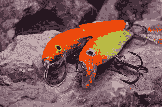
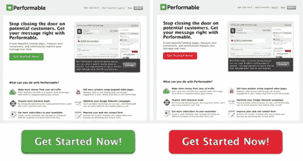
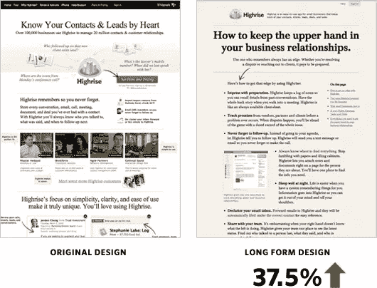
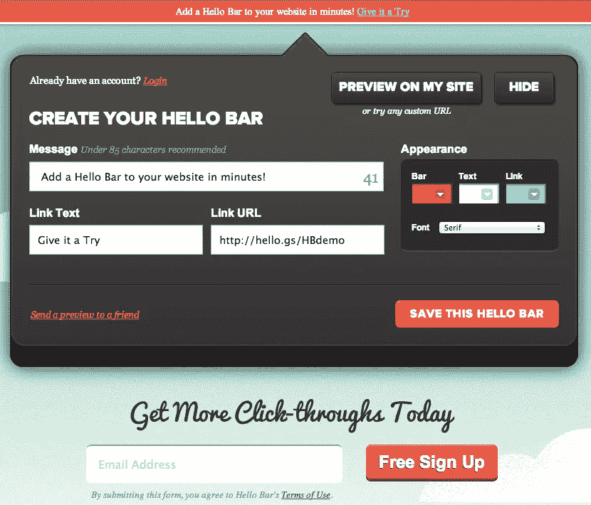
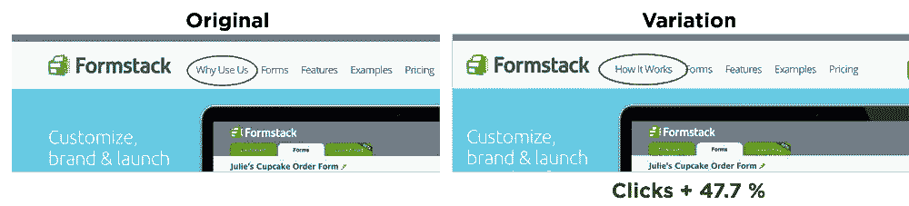

# A/B 测试设计指南

> 原文：<https://www.sitepoint.com/designers-guide-a-b-testing/>

周卡

正如阿努姆·汗在一月份为 SitePoint 撰写的关于色彩心理学和设计的文章中指出的，在理想的世界中，客户会简单地接受设计师的所有想法，然后让他们继续做下去。

然而，这在现实中很少发生，所以设计师必须适应客户和客户营销部门的想法。

这通常会导致对 [A/B 测试](http://en.wikipedia.org/wiki/A/B_testing "Wikipedia: A/B testing explanation")的讨论，其想法是不同的设计可以在不同的组上应用和测试，以查看哪个更有效。

## 什么是 A/B 测试？

首先，让我们来看看什么是 A/B 测试，以及为什么执行它是一个好主意。A/B 测试是将两种(或更多)不同的设计发送给目标受众中的不同群体，以便根据预先确定的标准确定哪种设计表现最佳。

这一标准可以通过多种方式来衡量，包括点击率、浏览量、订阅量、直销量或任何这些方式的组合。

每个版本都有或大或小的不同。通常，这些差异包括**行动号召(CTA)** 、颜色、输入表格、特别优惠、文本或任何诱使访问者留在网站上或采取行动的东西。

然而，同样值得指出的是，最近的一项研究发现，如果没有正确执行，许多 [A/B 测试结果会产生误导](https://www.sitepoint.com/winning-ab-test-results-misleading/)。

这意味着在开始测试之前，您应该具备以下条件:

*   一个大规模的“样本”——这是参与测试的人数，取决于网站的流量。Evan 的令人敬畏的 A/B 工具提供了一些关于管理样本大小的建议。
*   测试将持续多长时间的计划——许多人犯了这样的错误，一显示阳性结果就停止测试，这又产生了错误的结果。在[可视化优化器](http://visualwebsiteoptimizer.com/ab-split-test-duration/)上有一些关于这方面的指南。
*   测试软件和谷歌分析

## 应该用什么软件？

目前[optimized](https://www.optimizely.com/)通常是执行 A/B 测试软件的流行选择。你也可以使用[谷歌分析内容实验](https://support.google.com/analytics/answer/1745147?hl=en&topic=1745207)来执行目标测试。

## 为测试选择设计元素

下一个显而易见的问题是:“您应该尝试页面的哪些元素？”

请始终注意，最好不要在测试中改变太多不同的元素。

事实上，坚持每次测试只改变一个变量是明智的。改变多个元素将使得几乎不可能确定哪个变量获得积极或消极的结果。

在开始测试之前，从 Google Analytics 收集关于流量的数据，并确定你的目标。您可以查看跳出率、细分和关键绩效指标，并使用这些指标来帮助您确定目标指标。

一旦你做到了这一点，你就可以决定如何通过设计来实现你想要的东西。要做到这一点，请记住，不仅仅是使用颜色，你可以将心理学应用到页面上，还有其他有效的技巧。

### 减少选择，简化决策

一个简单而有效的策略是限制访问者的选择，确保他们*有*做你想让他们做的事情。

要做到这一点，最好保持简单，以便引导游客。将小样本的选择限制为一个，大样本的选择限制为两个(最多三个)。如果是购买选择，这很容易，因为你也可以使用颜色来进一步推动选择。

超过三个选择，你的访客很可能无法做出选择而离开。

根据希娜·艾扬格教授的研究，当面对太多选择时，用户通常选择不采取行动。如果你曾经在美食街或超市因选择而手足无措，你会熟悉这种感觉。

这项研究观察了两种不同果酱陈列在高档商店的销售情况。为了衡量购物者的反应，口味的数量有所不同，一个周六提供 24 种，另一个周六提供 6 种。

研究发现，在只有六种选择的一天里，购买最多的果酱。那么这一课如何应用到设计中呢？

*   确保设计整洁
*   保持严格的字数限制
*   想想访问者会如何浏览网页
*   考虑移动，因为这也将决定你的页面如何转换

虽然我已经说过可以测试一个以上的变量，但我仍然不推荐这样做，尤其是如果你是 A/B 测试的新手。

### 标题和图片

波因特研究所的 Steve Outing 和加州大学的 Laura Ruel 进行了一项研究，追踪了 46 名读者在阅读在线内容时的眼睛方向，持续了一个小时。

受试者的整体行为模式如下:

*   在从左到右扫描之前，眼睛首先注视页面的左上角
*   页面顶部的导航吸引了很多注意力
*   大标题，尤其是在左上角，比小标题更能吸引注意力
*   换行符阻止人们看下面的内容(比如横线)
*   主页上的文字比图片更受欢迎
*   短段落比长段落更受关注
*   一个栏目比几个栏目表现更好
*   大广告比小广告更受关注

有趣的是，受试者对文本比对图像表现出更多的关注，只要它是显性的、简短的、活泼的并且在正确的地方。

你应该*永远不要*认为图片更能吸引注意力，从而低估文本的力量。

### 按钮和颜色

如果你想在登录页面上测试一个 CTA 按钮，那么你应该看看按钮颜色是如何提示动作的。在这个接受了 2000 次访问并且只运行了几天的 [Hubspot 测试](http://blog.hubspot.com/blog/tabid/6307/bid/20566/The-Button-Color-A-B-Test-Red-Beats-Green.aspx)中，红色按钮的表现比绿色按钮好 21%。

> 考虑一下:这个页面的转化率增加 21%可能意味着所有下游指标增加 21%。因此，通过让 21%以上的人点击这个过程的顶部，我们在底部也增加了 21%。这就是为什么优化页面如此有价值。我们不需要增加页面流量就能看到改进的结果。相反，我们提高了页面的效率。通过提高现有流量的转化率，我们增加了可观的价值。

这是一个值得记住的有趣的考虑。A/B 测试并不意味着你必须对一个网站进行彻底的检查，甚至参与制作一个复杂的登陆页面或彻底的改变。一个很小的变量就能造成很大的不同，所以坚持简单的方法可以得到最好的结果。

### 形象

图片会对转化率产生很大的影响，所以绝对值得测试。在由 [Signal v Noise](http://signalvnoise.com/posts/2991-behind-the-scenes-ab-testing-part-3-final) 进行的一项测试中，人们发现即使是一张图像上某人的脸也可能返回不同的结果。

结果发现，不出所料，当使用人的图像时，那些笑容最灿烂的人返回的结果最好。然而，研究还发现，当涉及到性别或特征时，个人是谁并不特别重要，他们只需要微笑就可以了。

进行的测试还研究了没有图像的长格式和短格式内容，以及包括人物和长格式和短格式选项的设计。在这种情况下，最初最好的结果是长格式，大概是因为它看起来比短格式要简单得多，如下所示。

然而，当将长格式添加到一个人的图像中时，它的效果要差得多，这表明当涉及到大量文本和图像时，您应该使用其中的一种。

### 形式

在 [Hello Bar](https://www.hellobar.com) 可以找到一个有效的 CTA 表单的很好的例子，因为在你进入注册阶段之前，点击“试用”会直接带你进入产品**。**

这是一个很好的想法，因为它允许访问者真正沉浸在产品中，而不必首先通过注册，这是许多网站的下车点。

另一个好主意是在访问者已经采取行动之后，例如在网上研讨会、播客或类似活动之后，将表单放在登录页面上。重定向到一个简单的电子邮件简讯可以非常有效，这里你会想测试不同长度的形式，以查看哪一个是最有效的。

为了建立一个清单，你需要尽可能多的信息，但是要求填写一个大的表格会让大多数人却步，所以试着用更短的表格。

### 导航调整会产生深远的影响

当通过导航系统提示用户采取行动时，想想网站上哪些页面被访问得最多。这会给你一个指示，告诉你它们应该在导航菜单上的什么位置，以及如何使用语言和颜色来获得最佳效果。

一个简单的语言变化到一些更友好的东西可以使所有的差异。例如，在这个 A/B 测试中的[，将文本从“为什么使用我们？”《它是如何工作的》获得了 T2 47.7%的点击率。这理想地证明了测试并不一定要复杂，要想成功，你需要了解你的目标受众的想法。](http://blog.optimizely.com/2013/03/08/ab-testing-and-website-redesigns/#more-596)

简单。

### 结论

当进行 A/B 测试时，许多人都有点害怕，但这不一定是一个令人生畏的过程。

保持简单，一次运行一个测试，并确保你不会在数学上陷入太多的困境(通过使用工具)，这将是一次非常有益的经历。

这是从设计的角度来看，事实上，你已经通过推动交通和本质上的鼓励和转化来满足客户。

## 分享这篇文章