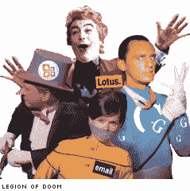
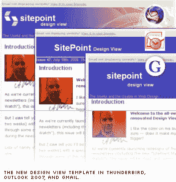
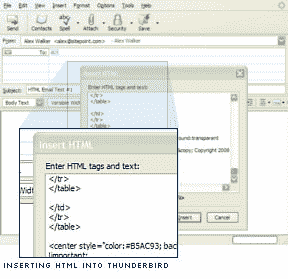
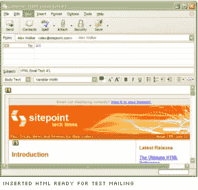
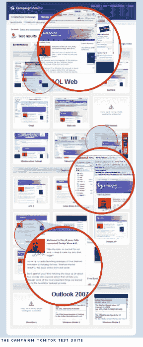

# HTML 电子邮件设计指南

> 原文：<https://www.sitepoint.com/designers-guide-html-email/>

我们讨厌喜欢它，也喜欢讨厌它，但是 HTML 电子邮件已经存在了。来参加我们的 HTML 时事通讯重新设计过程的一次下流之旅，并了解我们是如何迎头痛击这个怪物的！

##### 第一部分 HTML 电子邮件的黑暗之心

有时候我为可怜的 ie 6 感到难过。它得不到太多的爱。你只需要逛逛更著名的 web dev 博客和论坛，就能意识到 IE6 已经成为网络头号玩家有一段时间了——而且还有那些可爱的小渲染 bug，也许这是理所应当的。

然而，如果你曾经怀有重建你与 IE6 的破碎关系的秘密愿望——重新点燃那团火焰——这很容易做到。只要花一点时间处理 HTML 邮件，我保证第二周你的左屁股上会纹上“我爱 IE6”的字样。

是的，我的朋友，你不知道渲染不一致的意义，直到你深入到 HTML 邮件客户端渲染的黑暗核心。

在这个阶段，当你被要求处理 HTML 邮件时，我已经设法拼凑出一些粗略的经验法则。

**规则 1:** 跑。立刻。不要打包。不要想。快走吧。

规则 2: 如果你不能打败守卫，你需要向一个不变的核心真理投降，蚱蜢。设计 HTML 电子邮件的真正技巧不是控制它是否崩溃，而是控制它如何崩溃。

***简称***

我们以前的简讯模板有两个主要问题:

首先，像几乎所有传统的 HTML 邮件一样，我们的旧模板在 Outlook 2007 中爆炸了。任何新的模板设计都需要考虑 Outlook 2007 的“前珍珠果酱”时代的渲染能力——没有背景图像和喜剧 CSS 支持。

其次，现实情况是，2008 年，我们大多数人都会屏蔽来自未知发件人的新邮件的图片，这是有充分理由的。这意味着你只需要假设你的第一封也是最重要的 HTML 邮件到达时没有任何支持图片。如果你的品牌和身份与图片联系在一起，你的电子邮件会是裸体的，而且被打得满是洞——这可不是一个好的第一印象。我们需要一些东西，如果收件人拒绝这些照片，至少看起来模糊易读和专业。

***邮件客户端的陌生世界***

从我们最初的测试中，我们发现我们可以将大多数邮件客户端分成三个主要组:

1.  **天使的唱诗班:**这组邮件客户端具有强大且普遍可靠的 HTML 渲染能力，包括雷鸟、苹果邮件和 Opera 邮件。把你的歌单递给他们，他们多半会唱给你听，完美无缺。本质上，您可以将这些邮件客户端视为普通的现代浏览器。

3.  **糊涂人:**这个组包括大多数剩余的邮件客户端，包括 Outlook 2003、Outlook Express 和 Yahoo Mail。虽然你可能会在他们的渲染中遇到一些变化——通常是在文本大小和边距/填充上——但这些混搭通常会尊重你的页面布局。任何不容易解决的问题通常都微不足道，不足以接受。这些客户就像 IE6——以一种模糊可预测的方式令人恼火。

5.  毁灭军团:这是一群阴险的亡命之徒，由邪恶的 Outlook 2007 领导，还包括 Gmail、Hotmail 和 Lotus Notes。各自用自己独特却邪恶的超能力颠覆破坏你的 HTML 渲染。由于这是一个问题组，我将对他们进行更多的阐述。

*   Outlook 2007: 不支持背景图片。几乎没有 CSS 定位支持。不完整的一般 CSS 支持。
*   Gmail: 主动去除所有背景图片，如果你不小心声明的话，还会删除背景颜色信息。用一堆乱七八糟的 CSS 类重写你的邮件，让你几乎无法追踪哪个规则在做什么。
*   **荷音:**像狐狸一样疯狂。再次，删除所有背景，很少考虑填充和空白。

***右脚入门***

毫无疑问，HTML 电子邮件是一个完全彻底的雷区。几乎没有什么规则可以让你依赖于所有的邮件客户端，所以除非你有丰富的个人经验可以借鉴，否则你最有可能希望从一个基本原则都正确的模板开始。

值得庆幸的是，Campaign Monitor 和 MailChimp 都提供了一系列优秀的免费下载模板，这些模板会让你有一个良好的开端。

*   [活动监控 HTML 电子邮件模板](http://www.campaignmonitor.com/resources/templates.aspx)
*   [MailChimp HTML 电子邮件模板](http://www.mailchimp.com/resources/templates/)

最终，我们结合了几个模板的元素，为我们提供了所需的坚实基础。

一个有趣的考虑是内容宽度——上面提供的所有模板都比退役的设计视图模板薄得多。

虽然这似乎有悖常理——毕竟屏幕比以往任何时候都大——但用户更倾向于在网络邮件环境(如 Gmail、Yahoo Mail 等)中阅读 HTML 电子邮件。

快速浏览一下这些客户端，你会发现它们都把额外的水平空间用于广告和第三级导航，为你的内容留出了更少的宽度。虽然这对于展示你的内容来说并不理想，但另一种选择更糟糕——一些主流的网络邮件客户端都有裁剪或水平滚动内容的功能。

标题横幅是我们的主要考虑因素。最简单的方法是将你的标题和品牌放入一个大的横幅图片中，并嵌入整个图片。

当然，不利的一面是，如果图像被屏蔽(通常是现在的默认情况)，这将使你的电子邮件变得面目全非，没有品牌。

我们决定用我们的横幅打个赌。“SitePoint 设计视图”文本实际上是真实文本，用内联 CSS 着色和定位；这意味着即使图片被屏蔽，时事通讯至少可以清楚地识别自己。同样，如果不支持 CSS 定位，默认定位看起来也没那么糟糕。

我们在横幅的背景图像中包含了徽标的图形部分(“括号”部分),假设如果背景图像受支持，那么 CSS 定位也应该受支持，以便将其与文本对齐。

有些人可能会说这是一个冒险的假设，但迄今为止，它还没有被证明是完全不正确的。当然，总有下一周。我们并不认为这种真实文本和背景图像的混合是解决这个问题的唯一方法，甚至是最好的方法，但我们现在坚持这样做。

##### 第二部分–初始测试阶段

所以，让我们假设你已经从一个模板开始，并且想出了一个你满意的 HTML 设计。你需要开始初步测试。

尽管有很多发送测试邮件的方法，我发现雷鸟是最简单的。

一旦你设置了雷鸟:

1.  选择 HTML 模板并将其复制到剪贴板。

3.  在雷鸟中创建一个新的电子邮件，然后选择并删除任何自动包含的签名。

5.  点击文本区域，进入**插入>HTML**——一个文本框将会弹出，允许你粘贴你的 HTML。

7.  点击“**插入**，你就可以发送了。

然而，您可能目前没有使用 Thunderbird 作为您的默认邮件客户端，事实上，您可能也不希望这样做。如果是这种情况，请考虑创建一个新的 Gmail 帐户，并使用 Gmail 的 SMTP/POP 服务器设置从 Thunderbird 发送您的测试邮件。这将使你的日常邮件保持干净，并与你的测试邮件分开。

您还可以在 Thunderbird 中设置群组(称为“邮件列表”)，使您能够从一个地址向多个不同的地址(和客户)发送邮件。在我自己的早期测试阶段，我的团队包括:

*   我的默认雷鸟账户
*   一个 Gmail 账户
*   雅虎邮箱账户
*   MS Outlook 2007 帐户

这些当然不是您可能考虑进行早期测试的唯一客户，但是它们给了我们一个在整个过程中所处位置的合理快照。

运行 Outlook 2007 测试平台是最麻烦的。我最初尝试从微软下载试用版。不幸的是，安装程序随后通知我，它很乐意安装 Word、Access、PowerPoint 和其他所有应用程序。除了 Outlook 2007——由于未知的原因，它是灰色的。哦，太好了！

最终我找到并安装了完整版。同样，为了保持整洁，我建立了一个全新的 Gmail 账户，专门用于接收 Outlook 2007 邮件。

虽然考虑使用 Campaign Monitor 这样的服务来生成 Outlook 2007 屏幕截图可能很诱人，但通过在线服务调整 HTML 的实用性是值得怀疑的——您需要做大量的调整，这将是缓慢而昂贵的。

我们在这个阶段发现的一件真正有用的事情是，像 IE 一样， [Outlook 支持条件注释。虽然从很多方面来说这是一种冰冷的安慰，但它至少允许您删除在 Outlook 2007 中没有机会工作的项目(如表单和复杂的定位 CSS)。](https://www.sitepoint.com/conditional-comments-for-html-email/)

但是，要小心。这是黑魔法，所以要小心使用——如果可以的话，千万不要使用。

##### 第三部分–最终测试阶段

好了，你有了一个模板，它在你的小测试组中表现良好。或许是时候硬着头皮去电子邮件测试服务了。我们使用过 Campaign Monitor，但我知道 MailChimp 也有一个非常好的同类服务。

上传和导入您的 HTML 后，Campaign Monitor 服务允许您在大约 20 个不同的邮件客户端中测试您的模板——尽管在繁忙时间一些客户端会超时。

但是，请记住，一组测试的成本大约为 5.00 美元，并且可能需要一个小时才能生成，所以在开始这一阶段的测试之前，您应该确信您的模板已经接近完成。这不是渐进调整的时候。

活动监视器测试套件分为三大组:

**基于网络的电子邮件客户端**

*   美国在线网站
*   康卡斯特公司
*   Earthlink
*   谷歌邮箱
*   Mail.com
*   MSN Hotmail
*   Windows Live Hotmail
*   雅虎！经典的
*   雅虎！邮件

**桌面电子邮件客户端**

*   美国在线 9
*   Lotus Notes 6.5.4
*   展望 2003
*   展望 2007
*   Outlook Express 6
*   Outlook XP
*   雷鸟
*   Windows Mail(其实那是什么？)

**手机邮件客户端**

*   黑莓
*   Windows Mobile 5
*   Windows Mobile 6

我们也有自己的苹果邮件客户端和 iPhones 来测试设计。

虽然这看起来确实是一个非常全面的测试列表(特别是与你通常测试一个网页设计的五六个浏览器相比)，但它仍然不足以让你放松警惕——正如我们艰难地发现的那样。

当我们准备发送新的《科技时报》模板的第一版时，Matt 仍然报告说在 Gmail 中发现了严重的布局问题。然而，我花了相当多的时间来解决 Gmail 的问题，看不出他报告的任何问题。

在为 IM 争论了大约 30 分钟后，我们意识到我正在 Firefox 中查看 Gmail 中的模板，而他正在 Internet Explorer 7 中查看 Gmail 中的相同模板！

小面额硬币掉落的提示声。

当然，仔细想想，这是常识，但这实际上意味着你真的需要看到被测试的九个基于网络的客户端中的每一个的四个版本 Firefox、IE7、Safari 和 Opera 中的每一个 webmail 客户端。

开始对 IE6 感到温暖和模糊了吗？

我想是的。

##### 摘要

尽管有很多批评者，HTML 在电子邮件中还是有一席之地的。RSS 不会杀死它。对垃圾邮件的恐惧也不是。

在 SitePoint，我们每个月都能看到成千上万的新订阅者订阅我们的时事通讯。这些用户仍然总是选择 HTML 而不是纯文本，比例为 15-20 比 1。

随着时间的推移，这些数字没有下降的迹象。

简而言之，虽然我们可能不喜欢，但你的客户可能更喜欢 HTML 电子邮件，他们的受众也是如此。

因此，坚持使用模板，尽可能保持简单，并尽早经常测试。

## 分享这篇文章