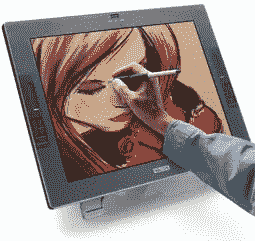

# 设计师的愿望清单:触摸感应 LCD 显示屏

> 原文：<https://www.sitepoint.com/designers-wishlisttouch-senstive-lcd-display/>

这里有一些东西可以让你在一周开始的时候，因为没有这些东西而感到暴躁和不满足。

忘记那些普通的 21 英寸液晶显示器的白日梦吧——现在是时候升级那些白日梦了，因为你可以感受到 Wacom 即将发布的 [Cintiq 21UX 交互式笔显示器](http://www.wacom.com/lcdtablets/index_21UX.cfm)的优雅线条。

显然，这款 21.3 英寸触摸感应 LCD 显示器'*比以前的型号*提供了更大的屏幕面积、更高的压力灵敏度、更好的笔控制、更高的分辨率和更高的舒适度。

我个人发现，在多年的标准“鼠标操作”之后，即使使用普通的笔/平板电脑也是一种新发现。虽然精细的运动技能灵巧性对于修图之类的工作来说是令人敬畏的，但我发现真正的不同是你制作的线条的质量。“鼠标绘画”本质上来自手腕的微小运动。这些肌肉非常擅长少量操纵小物体——比如制表或缝纫——但不太擅长流畅的动作。

相比之下，平板电脑绘图迫使你从肩膀和肘部开始工作。这样做的效果是给你的线条一个大的，自然的流动和重量，这是只用鼠标很难做到的。事实上，有很多毕加索用他粘在扫帚柄上的画笔来强调这种流动的有机效果的照片。

令人略感沮丧的是，价格并没有高到让你可以“不加考虑”地放弃，继续你的生活。同样大小的液晶显示器的零售价仍在 800-1000 美元左右，更大的 Wacom 平板电脑的零售价约为 500-700 美元，Cintiq 21UX 的定价(建议零售价为 2500 美元)确实值得你考虑。

不过，到目前为止，我还没能想出一个足够狡猾的方案，在短期内把它放到我的办公桌上。

## 分享这篇文章