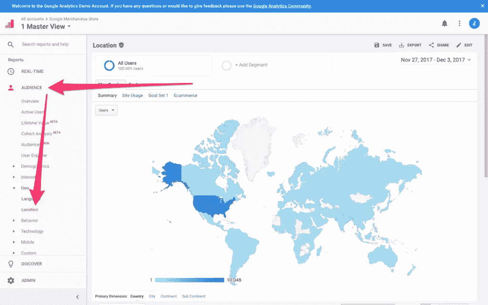
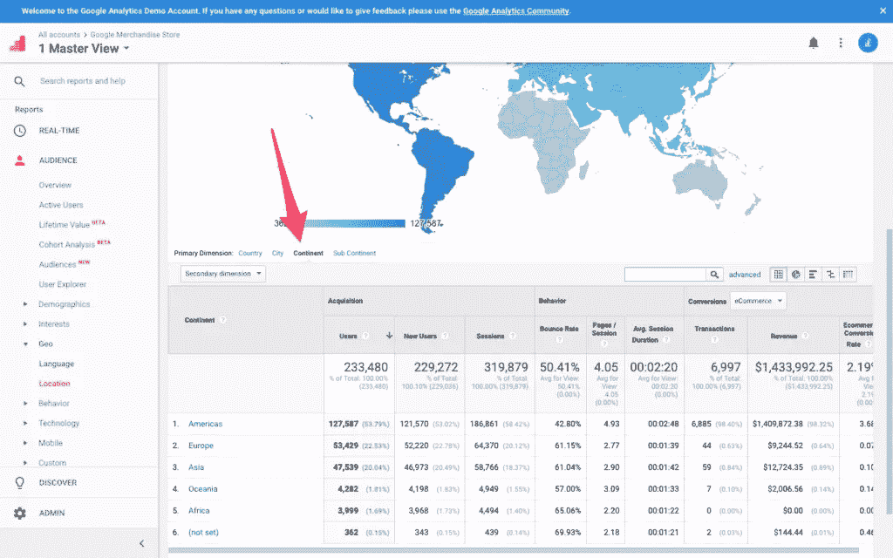
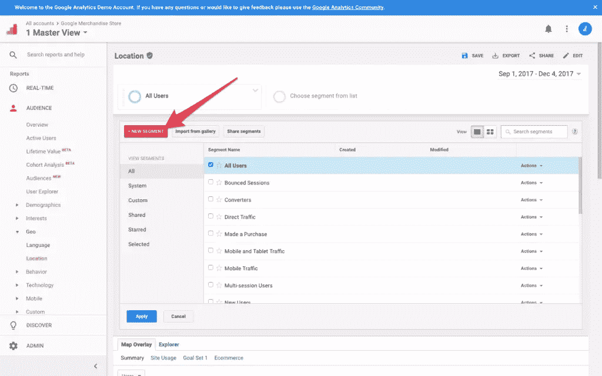
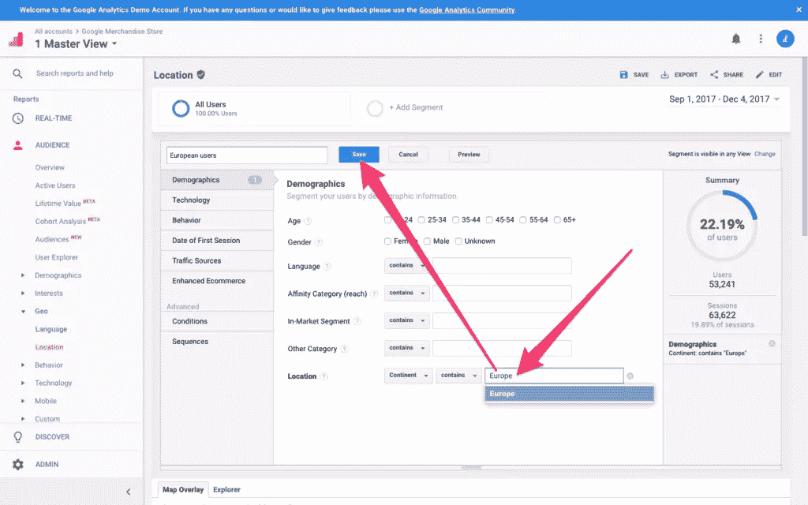
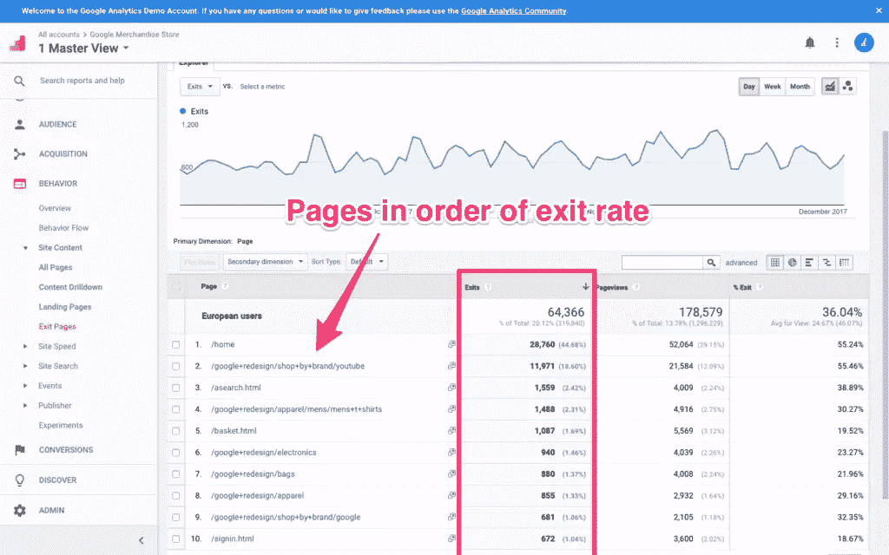
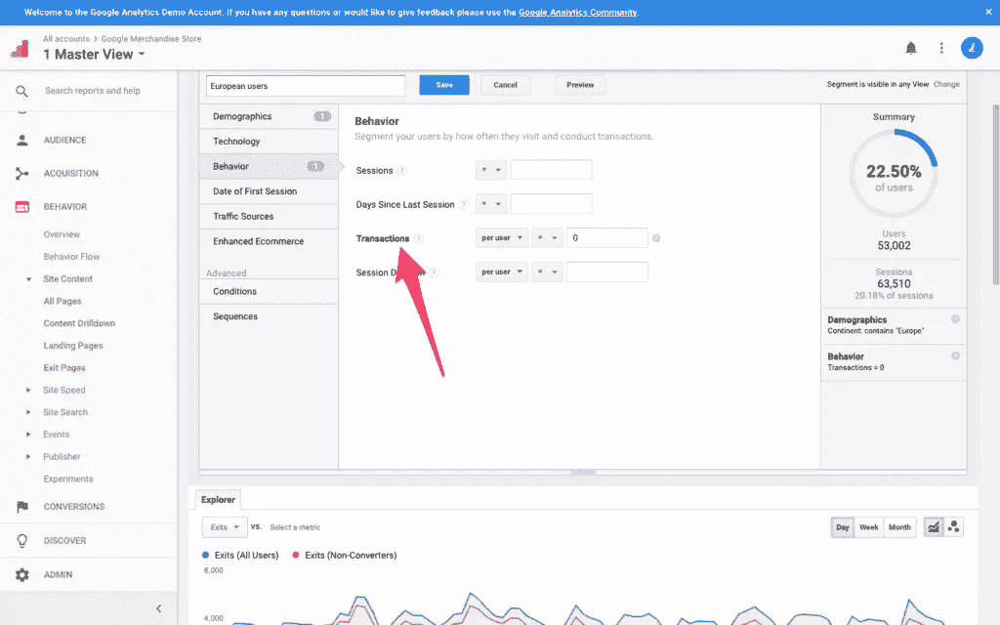

# 根据地理位置和人口统计数据为不同文化进行设计

> 原文：<https://www.sitepoint.com/designing-cultures-location-demographics/>

在用户界面设计中，红色在西方文化中通常意味着“不”或“错误”。但是为什么它不能代表积极的 T2 呢？嗯，实际上，在亚洲文化中，红色象征长寿、庆祝、幸福和繁荣。新娘在婚礼上穿红色礼服，并收到红包。这与“没有”或“错误”相去甚远。

颜色很重要。颜色有意义。颜色帮助用户更快地做出决定，因为颜色表明了交互的结果。

考虑一个标有“不”字的绿色按钮。现在，在西方文化中，这是非常令人困惑的，因为绿色表示“是”，而实际上是说“不”。如果我们仓促行事(正如用户经常做的那样)，我们甚至可能在完全误解这意味着什么的情况下点击绿色按钮。

在亚洲文化中，红色通常不表示“不”，所以在用户界面设计中使用红色可能会导致用户无意中犯错误。但是当然，也有例外。例如，Pinterest 在他们的品牌中使用红色，但我们可以很快破译这一点，因为红色在他们的网站上随处可见(徽标、图标、按钮等)。).背景很重要。此外，在特定文化中意味着什么，对于 UI 设计来说可能并不总是正确的。

我们稍后会再多聊一会儿诊断方面的内容。现在，让我们学习如何使用 Google Analytics 找出我们的用户来自哪里。

## 位置人口统计

在 Google Analytics 侧边栏中，列出了五种类型的报告(*实时、受众、获取、行为、转化*，选择*受众→地理→位置*。与大多数报告一样，您首先会看到一个概述。对于*地理→位置*报告，该概览是一张地图。

### 获取真实数据

在读取数据之前，您需要定义一个合适的日期范围。想想临近年底的 30 天时间跨度，其中包含了不止一个，而是两个西方节日(感恩节和圣诞节)。众所周知，假日期间网站流量很低，我们希望分析已知的真实数据。当有问题的网站获得大量流量时，分析数据总是更容易。

从右上角的日期范围选择器中，选择您认为合适的范围(我会选择最近 3 个月的范围)。

### 您对用户位置人口统计的第一次观察

尽管颜色的含义在不同地区略有不同，但其核心象征意义并没有太大变化。出于这个原因，按国家分析数据似乎有点夸张。由*大陆*可能会好些。

向下滚动到细分表，选择“大陆”作为*主维度*。这将使你的观察更容易。

虽然*美洲*占所有用户的 54%，但*欧洲*以 23%的份额位居第二。我们首先要弄清楚一个群体是否比另一个群体有更多的麻烦。*大洋洲*和*非洲*各占不到 2%的少数，所以一开始它们不应该是主要关注点。*亚洲*总计占 20%，指标类似于*欧洲*。美国人是最常见的人群。

让我们关注两个最大的人口统计数据。

## 哪个人群有问题？

您可以通过比较某些指标(如*跳出率*、*页面/会话*、*平均页面数)来确定哪些维度遇到的问题最大。会话持续时间*，最重要的是*目标转换率*，以及其他维度，一旦你做到了这一点，你就可以开始定位那些用户退出你的网站的*精确*时刻。

让我们假设欧洲是你转化率最低的人群。我们需要细分这个维度，过滤欧洲用户。

向上滚动并点击“+添加段”按钮，然后点击“+新段”。

为您的细分市场命名，例如“欧洲用户”，并在描述为“位置”的输入字段中键入“欧洲”(它应该自动完成为“欧洲”)。单击“保存”保存更改。

## 他们在哪里遇到麻烦了？

既然我们知道了谁遇到了麻烦，我们就能找出问题出在哪里。从报告侧边栏导航到*行为→网站内容→退出页面*，报告将准确指出用户离开网站的位置，或者更具体地说，我们转化率最低的人群离开的位置。

等等，小心！

所有用户最终都会离开，对吗？所以我们要确保我们过滤掉了那些*转化了*的用户，因为显然我们只想识别那些没有转化的用户，并找出原因。您可以导航回您的细分市场，并调整细分市场条件。在 segment customizer 下拉菜单的*行为*选项卡中，将事务值定义为“0”，过滤掉所有转换的用户(这些用户没有问题)。

现在我们知道了是谁，在哪里，我们可以开始找出原因了。

## UX 怎么了？

如果一个维度(一个洲)比任何其他维度更难转换，您可能要考虑这样一个事实，即这里有一个特定于位置的问题。现在，尽管我之前说过关于颜色的问题，但实际上有许多问题可能会导致特定人群退出转换。让我们考虑一个用户购物的顾客之旅(假设您已经识别出一个对顾客结账之旅至关重要的网页，其退出率非常高)。

可能导致不转换的可能问题:

*   您没有使用 HTTPS/SSL 加密
*   成本不以买方货币显示
*   不清楚你运送到哪些国家
*   颜色使得用户界面很难交互
*   支付选项有限(例如，PayPal 并非在所有地方都存在)。

## 接下来呢？

从这里，您可以简单地通过观察来诊断特定的 UX 缺陷，然后进行必要的修改，看看度量是否有所改进。如果问题仍然不清楚，你可以尝试可用性测试来帮助定位。如果问题*是*清楚的，但解决方案不是，那么尝试 [A/B 测试](https://www.sitepoint.com/a-b-testing-introduction/)。

一个[分析优先的设计方法](https://www.sitepoint.com/ux-analytics-what-they-are-why-they-matter/)可以确保你在随意投入可用性测试之前识别 UX 中的缺陷，并且 A/B 测试正确的东西。时间是宝贵而有限的，所以我们不想浪费它。

你可以点击查看我们的 UX 分析系列[中的所有文章。](https://www.sitepoint.com/blog/)

## 分享这篇文章