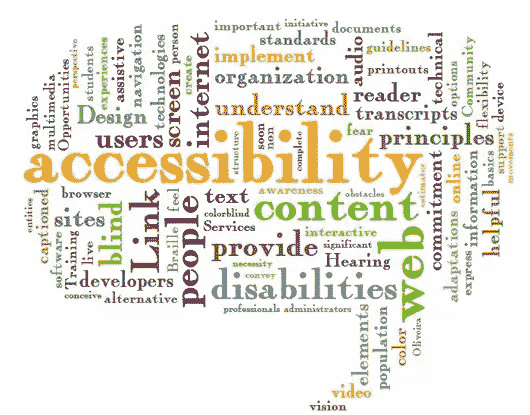

# 为残障人士设计:508 条款和初学者的国际无障碍合规性

> 原文：<https://www.sitepoint.com/designing-disabilities-section-508-international-accessibility-compliance-beginners/>

许多图形设计人员、web 开发人员或技术和媒体行业的其他人最终会遇到一个需要遵守“Section 508”或其他可访问性标准的项目。这个术语对初学者来说可能相当吓人，因为它经常涉及法律含义。虽然第 508 节仅对美国联邦机构或联邦资助的机构具有法律约束力，但提供公共服务的组织通常会要求网站或软件符合第 508 节的要求。

### 什么是 508 条款？

1998 年，美国立法者将 1973 年《康复法》新的第 508 条签署为法律，这改进了 1986 年《康复法》中增加的第 508 条修正案。2001 年，发生了更多的变化。电子和信息技术(EIT)无障碍标准与联邦采购条例(FAR)的修正案一起发布。抛开历史和法律后勤不谈，**这些规则和条例要求联邦政府和联邦政府资助的机构为残疾人提供方便的电子和信息技术**。基本上，出台了一项法律，为残疾人提供平等机会。使用联邦信息和技术的残疾联邦雇员或公众成员现在可以和其他人一样访问。

### 为什么会影响设计师和开发者？

因为第 508 条适用于美国联邦软件、硬件、下载、网站、文档等。设计人员或开发人员可能会在简报中遇到需要遵守 508 条款的项目。一些非联邦机构，虽然法律上不要求符合 508，但也可能要求项目符合这些大纲，特别是如果机构提供公共服务或其目标市场包括大量残疾人。

如果你最近获得了一个客户，他需要一个符合 Section 508 要求的设计，不要太害怕。这听起来很难学或者很难学，但是它只需要小心地遵守一组遵从性规则，其中许多规则已经是最佳实践了。例如，网页图片必须有一个替代的(“alt”)描述，不要太长，不要重复页面上的其他文本，并且准确地描述图片。必须遵循特定的颜色要求，以确保色盲或其他视力残疾的人可以阅读文本。遵循 Section 508 要求的困难之处在于找到一个简单明了的列表。

要记住的另一个考虑是，508 条款是使每个人都能访问文档或网站的最低要求。一个勤奋的设计师也会确保它易于导航，看起来有吸引力，就像其他设计一样。所以，你可能也想看看 W3C 的[网页可访问性倡议(WAI)](https://www.w3.org/WAI/) 指南。这些指南非常有助于您创建国际公认的网页可访问性标准。

### 设计师如何使设计符合 508 条款？

图片来源:[菲易勒雅斯](http://www.flickr.com/photos/28968923@N08/2908748583/)via[Compfight](http://compfight.com)[cc](http://creativecommons.org/licenses/by-sa/2.0/)

第 508 条有三个主要要求需要满足:

1.  **技术**——这些需求确保网站、软件、操作系统等的*编码*。与辅助技术兼容。
2.  **功能性**–这些要求确保除了技术编码之外，整个系统对于残障人士来说是*可用的*。
3.  **支持**-这些要求确保了*支持文档和替代信息*也可以被残疾人访问。

如果一个项目不满足所有这三个要求，那么它就是不合法的。

如果需要，您可以参考[官方第 508 节](https://www.section508.gov)合规指南。此外，以下是快速学习如何使您的文档 508 兼容的一些优秀资源，包括测试您的工作以确保您的项目满足要求的网站:

*   美国接入委员会——本网站的[第 508 节标准](http://www.access-board.gov/guidelines-and-standards/communications-and-it/about-the-section-508-standards/section-508-standards)对我们上面讨论的三个不同要求提供了极好的详细解释。本网站上的[508 条款标准](http://www.access-board.gov/guidelines-and-standards/communications-and-it/about-the-section-508-standards/guide-to-the-section-508-standards)指南允许您选择您正在设计的具体技术类型，并给出了标准的详细解释和示例。
*   [JimThatcher.com](http://jimthatcher.com/webcourse1.htm)——这个网站提供了一个很好的免费课程，让你了解让网站设计符合 508 标准意味着什么。许多优秀的现实生活中的例子包括和解释很容易理解。
*   [Webucator.com](http://www.webucator.com/)–这个网站是一个很好的资源，可以提供低成本但全面的网络无障碍和 508 条款培训。然而，他们也为那些想自学的人提供免费的第 508 章的[教程。](http://www.web-accessibility-tutorial.com/)
*   [SSB Bart Group](https://www.ssbbartgroup.com)——通过这个小组可以获得另一个关于可访问性的优秀培训和课程的选择，但是你也可以[免费测试你的网站的可访问性](https://amp.ssbbartgroup.com/express?keyword=section+508+compliance+testing&lead_source=Tools+-+508&campaignID=701000000009L3e&adID=1008)，包括它是否符合 508 条款的标准。他们也对第 508 条提供了很好的[解释。](https://www.ssbbartgroup.com/blog/2010/09/15/basics-of-section-508-compliance/)
*   [HowTo.Gov](http://www.howto.gov/)–要获得大量精彩信息，请访问 HowTo.Gov 网站，该网站包括基本概述、教程和资源，帮助您确保从网站到多媒体的一切都符合 508 标准。你可能也想看看这个关于[无障碍测试](http://www.howto.gov/training/classes/accessibility-testing)的视频。
*   web aim——这个网站为 HTML、脚本、插件、Java 等等提供了一个很好的符合 508 的清单。该清单包括对某些标准的进一步解释的链接。
*   Viget.com——关于网页设计中的[可访问性和 508 合规性的基本概述，Viget 提供了一篇关于这个主题的简单易懂的文章。这是一个很好的起点，因为它澄清了常见的误解。](http://viget.com/inspire/a-designers-guide-to-accessibility-and-508-compliance)
*   美国 HHS——美国卫生与公众服务部对 508 条款进行了精彩的[概述，并提供了分步指南和测试。](http://www.hhs.gov/web/508/index.html)

### 知道你需要什么培训

您的客户要求他们的文档、网站或软件符合 508 标准，他们需要您在遵守 508 准则方面拥有专业知识和经验。因此，如果你想将 508 条款列为你的技能或专长之一，你可以考虑遵循它们，即使是在那些不特别受益于或不要求你遵守那些可访问性标准的项目中。

如果您的客户不是法律要求的客户，但仍然希望遵循 Section 508 标准以实现可访问性，那么您可能可以自学这些指导原则并使用免费的测试资源。然而，如果你正在为联邦客户或寻求联邦资助的客户挑选项目，那么你可能需要完成正式的课程和培训，以确保你能够充分满足客户的需求。

 **你有什么有用的资源来学习 508 条款遵从性吗？第 508 节与国际无障碍标准相比如何？你觉得这些标准是乏味和麻烦的，还是你认为它们很重要并且被忽视了？** 

## **分享这篇文章**