# 设计表单布局:对齐

> 原文：<https://www.sitepoint.com/designing-form-layout-alignment/>

以下是我们的书《设计 UX:形式 T2》的一小段摘录，作者是杰西卡·恩德斯。这是形式设计的终极指南，是有效 UX 设计的关键部分。SitePoint Premium 会员可以通过他们的会员身份访问，或者您可以在世界各地的商店购买一份。

你和一个朋友各自开车去一家餐馆吃饭。你的两条路线都沿着一条有两条车道的公路。这些公路一样长。在你的路线上，所有的慢车都在做正确的事情，坚持走一条车道，所以你可以在另一条车道上呼啸而过。在你朋友的路线上，缓慢的汽车分散在高速公路的两条车道上，所以她不得不迂回前进。你们中的哪一个将首先到达餐馆？

### 完成的垂直路径

一条笔直、通畅的路线对于驾驶和填表来说是最快的。因此，下一步是垂直排列所有表单字段，以及页面上的主按钮(称为**主操作按钮**):

现在你已经创造了一条笔直、通畅、垂直的完成之路。你不仅加快了表格的填写速度，而且看起来更整洁、更简单。(我们很快会谈到一些字段与其标签之间的距离。)

#### 不要把问题放在一起

因为完成的垂直路径会使表单更长，所以您可能会想把一些问题挤在一起:

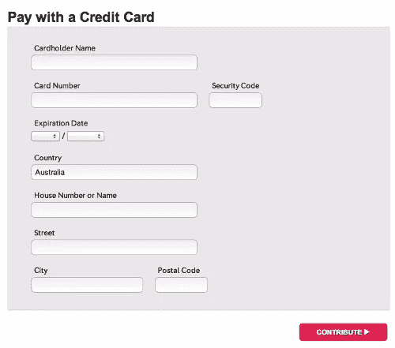

在此表单中，安全代码和邮政编码问题被放在其他问题旁边

这是一个坏主意，原因如下:

*   它打断了表单的流畅流程(就像快车道上抛锚的汽车)。
*   用户通常看不到右边的问题，因为它不在他们的视野范围内(大约只有 9 个字符宽)。
*   它会阻止表单在大小屏幕上无缝工作。(稍后会有更多相关内容。)

同样，你可能还记得第三章，对于用户来说，表单的*感知*长度，而不是实际长度，才是最重要的。完成的垂直路径不仅客观上使表单填写更快，而且让*感觉*更快。

### 对齐答案字段

然而，有时可以节省空间的一个方法是使用答案字段。查看上市许可问题的答案字段:

每当答案字段比较小的时候，我们就可以把它们横着放。(为此，我们将“小型”定义为三个或更少的选项，所有选项都带有短标签。)这种形式在触摸屏和小屏幕上仍然有效。营销同意就是这么一个问题:

其实出生日期也是一个回答域很小的问题。你可能没有意识到我们已经把它们放在一条线上了:

但是记住:如果答案字段很小，你只能把它们放在一起。否则，这种设计在某些情况下是行不通的。例如，社交网络有相当多的答案选项。如果我们试图将它们水平放置，它们会脱离边缘——尤其是在移动设备上——并引发可怕的水平滚动条:

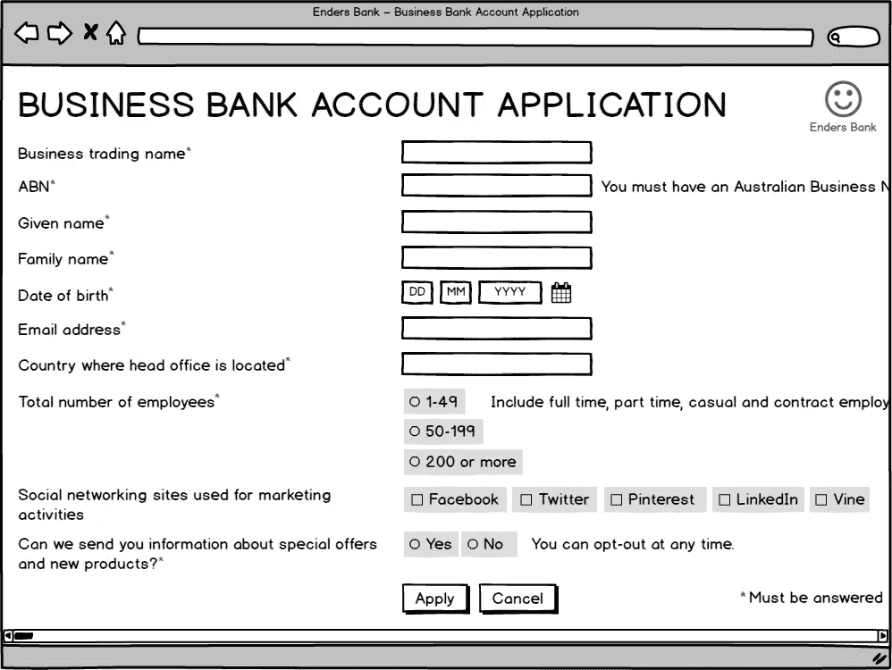

如果我们水平放置一长串答案字段，我们很可能会变出水平滚动条，即使在更大的屏幕上也是如此

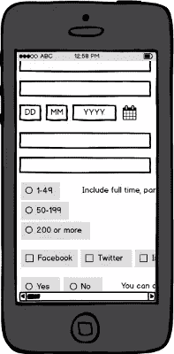

如果我们的答案字段不小，我们甚至更有可能在手机上显示水平滚动条。

假设我们不能构建一个定制的小部件，最好将它们作为一个单独的垂直列表:

较大的单选按钮或复选框组应该垂直对齐。

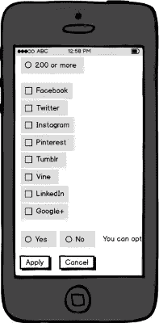

单选按钮或复选框组的垂直对齐也适用于移动设备。

### 标签放置

我们表单的移动视图有一个问题，您可能已经从上面的一些插图中注意到了。在小屏幕上，当焦点在文本框中时，相应的标签不可见，如下例所示:

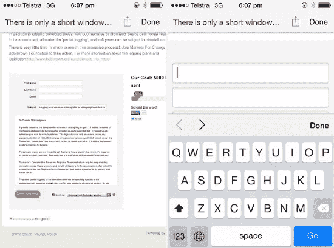

左边的标签最初是可见的，但是当用户开始填写表单时就会消失。

我们可以通过将标签放在字段上方来避免这个问题。但是这产生了一个新问题:表单在视觉上变得很长。

这是它在大屏幕上的样子:

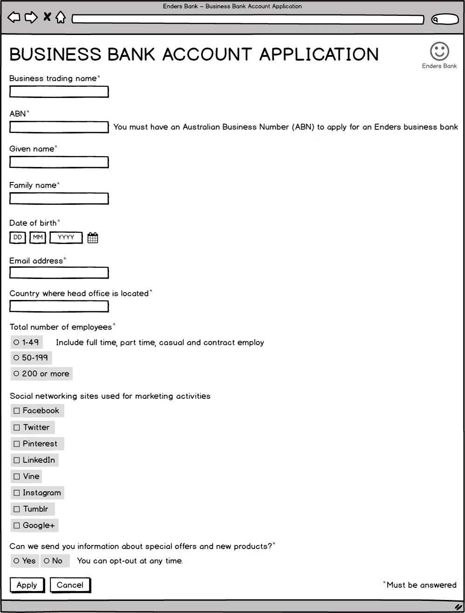

当标签位于字段上方时，表单会变长。

你需要做的是将表单编码成*响应*。**当屏幕变大时，标签应该放在字段的左边；当屏幕变小时，标签应该放在字段上面。**这样，我们可以利用大屏幕上的空间，同时确保表格也可以在较小的屏幕上填写。

如果我们将示例表单编码为响应式，它在移动设备上的外观将是这样的:

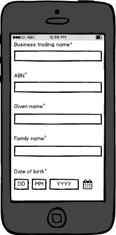

在移动设备上，标签位于字段上方，以便在需要时可以看到。

这是它在大屏幕上的样子:

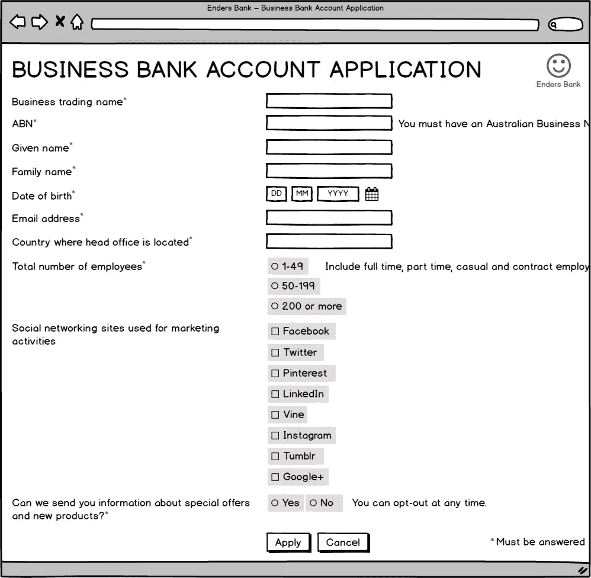

下面是一个现实世界中的响应式表单标签示例—首先是表单的大屏幕版本，然后是较小的屏幕:

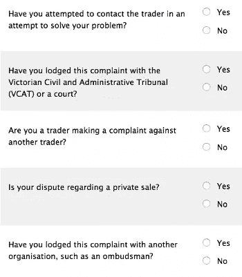

在更大的屏幕上，标签在字段的左边，所以表单看起来简洁明了。

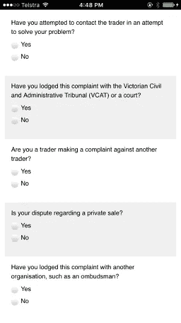

在较小的屏幕上，标签在字段上方，所以它们总是在视图中。

#### 那项研究怎么样？

在 UXMatters 网站上最受欢迎的文章之一，也是卢克·乌鲁布莱夫斯基的书和文章中引用的，是 Matteo Penzo 的眼球追踪研究。这项研究经常被用来证明标签应该*永远不要*放在字段的左边，而应该总是在上面。

问题是，你永远不应该把设计决策建立在一个单一的研究上，尤其是一个未知的方法论，以及结果中非常微小的差异！相反，你需要根据理论和用户研究的观察来权衡所有不同的利弊。当你这样做的时候，很明显，在大屏幕上，标签在字段左边的好处超过了成本。有一半长的表格，眼球运动稍微增加一点是值得的。

#### 避开阴沟

除了已经说过的，当标签在字段的左边时，有两种方法可以增加表单的可用性。这些技巧对于防止标签和答案字段之间出现大的“空白”非常重要:

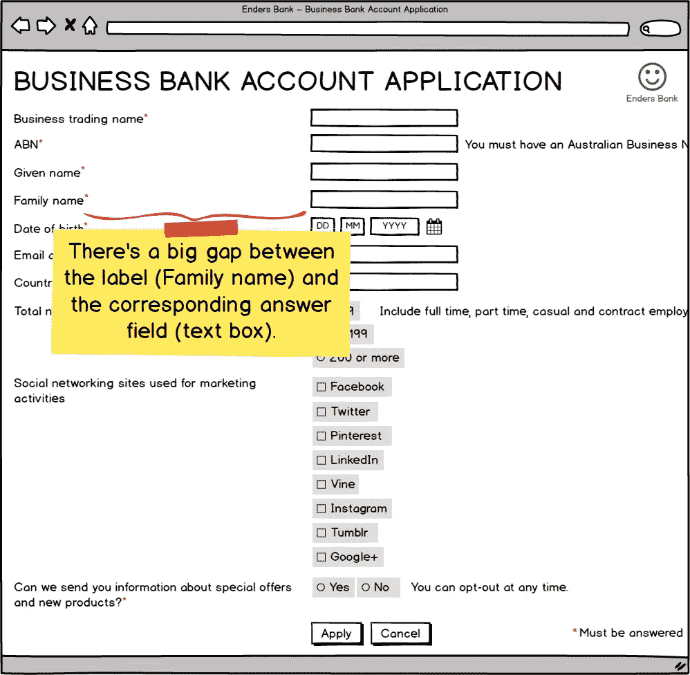

对于我们示例表单上的许多问题，标签离相应的答案字段很远。

这些间隙会使用户很难将标签与其答案字段相关联。

如果标签大多很短，您可以将它们设定为右对齐，这样它们就在字段旁边:

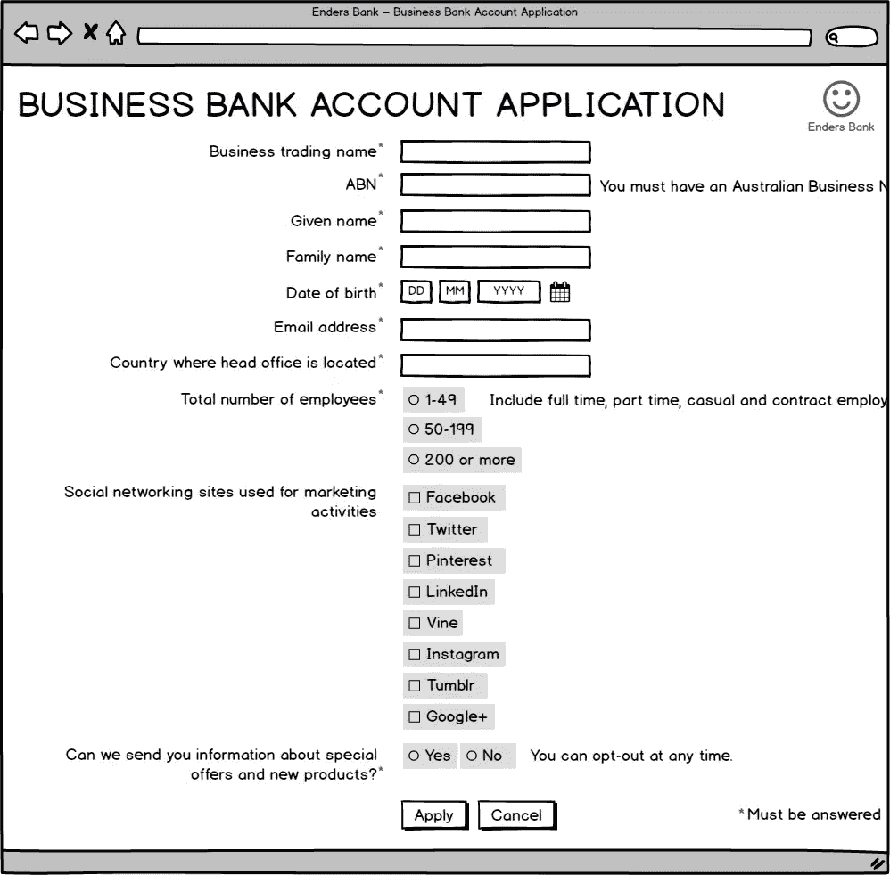

标签设置为右对齐。

如果标签大部分都比较长，如果对齐的话会很难阅读。在这种情况下，将它们设置为左对齐(像普通文本一样)，但在表单中添加斑马条纹:

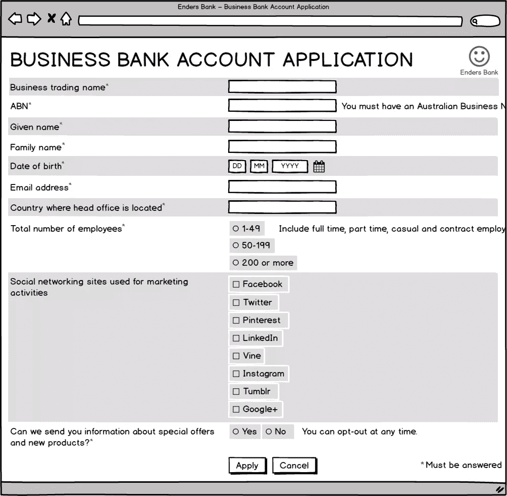

标签后面的斑马条纹设置左对齐。

**斑马条纹**是你在每第二个问题后面看到的微弱阴影。这有助于眼睛将标签与视野联系起来(正如我不久前进行的一项研究和后续研究所展示的)。

(如果你想了解更多关于标签放置的内容，我在 SitePoint 网站上写了[一篇详细的文章，](https://www.sitepoint.com/definitive-guide-form-label-positioning/)[也在我自己的网站](http://www.formulate.com.au/blog/eyetracking-research-and-form-design)上提供了一些评论。)

### 按钮对齐

#### 单步表单

如果你只有一个主要动作，把它和你的字段排在一起，以便快速完成。这就是我们对示例表单所做的工作:

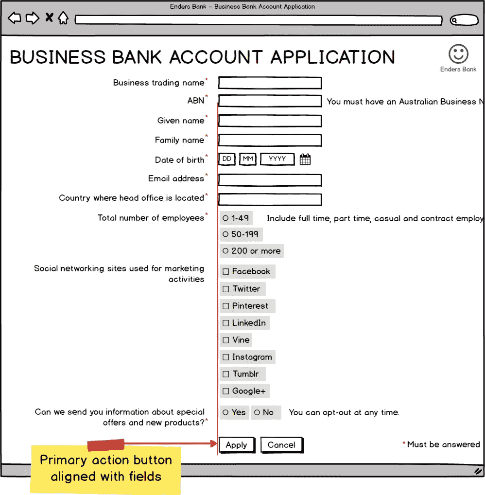

主要操作按钮的左边缘与字段的左边缘对齐。

#### 多步形式

如果您的表单经历了多个步骤，您需要为用户提供在步骤之间移动的按钮。一种选择是将“下一步”按钮与字段对齐，这与我们的单步表单一致:

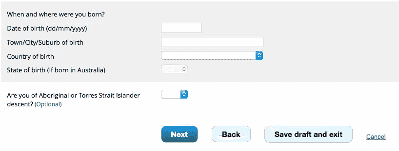

接下来是我们的主要操作，因此它与字段垂直对齐。

另一种选择是将“下一个”按钮放在右边，将“上一个”按钮放在左边(对于讲英语的观众):

说英语的人通常认为右是向前的，左是向后的，所以我们可以这样排列按钮。

这两种方法都被证明是有效的，但是这取决于具体的环境。如果你不确定哪一个适合你的表单，可以对你的目标用户做一些可用性测试。

(你也可以在手风琴中加入多步形式，但是手风琴有很多可用性问题，所以最好避免。)

#### 手机上的按钮

在小屏幕上，您可能希望将按钮设计得具有响应性，以便它们:

*   堆叠在一起，主要操作在顶部
*   占据屏幕的整个宽度，除了两边的一点点空白(这样它们仍然是清晰的按钮)。

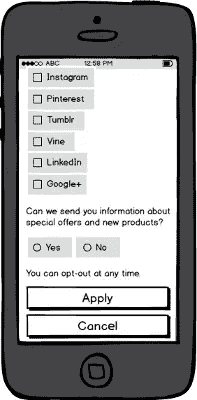

编码我们的表单以响应屏幕大小，我们可以确保按钮在移动设备上仍然工作良好。

到目前为止，我们的表单看起来真的很好，并且非常容易启动。但是我们还可以做进一步的改进，接下来我们将对此进行探讨

## 分享这篇文章