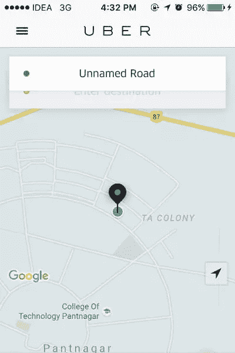

# 设计更好的移动应用程序界面的注意事项

> 原文：<https://www.sitepoint.com/designing-mobile-application-interfaces/>

今年五月[谷歌宣布移动搜索终于首次正式超过桌面搜索](http://searchengineland.com/its-official-google-says-more-searches-now-on-mobile-than-on-desktop-220369)。手机现在是大多数用户的默认格式。

因此，随着移动用户界面成为大多数人的新“家庭用户界面”，开发人员在创建移动应用程序或基于网络的移动应用程序时应该注意一些因素。

让我们研究一些常见的移动应用程序 UI 元素，看看新手通常如何实现它们，然后看看解决这个问题的更好方法。

## 尽可能限制文本输入的使用

大多数移动应用程序都有一个输入框来捕捉用户的反馈。在我看来，文本字段应该只在绝对必要的时候才在移动应用程序中使用——密码字段就是一个完美的例子。

即使是使用大屏幕手机的用户也不会像在台式电脑上那样舒服。打字输入可以通过多种方式最小化。

*   替代输入方法，如滑块和微调元素
*   用于登录的 OAuth 可以提供更好的身份验证方式

案例研究:优步的移动应用以一种出色的方式解决了这个用户界面问题。优步使用全球定位系统追踪用户的位置，然后要求锁定他们的位置，而不是要求用户输入地址。这允许用户更容易和更快速地预订乘车。

### 文本界面元素

在应用程序中，应该尽量减少文本 UI 元素的使用。支持使用图标。例如，你可以在应用程序中使用垃圾桶图标，而不是带有文本“删除”的按钮。

然而，应该注意的一件重要事情是，图标和它们的表示应该在整个应用程序中保持一致。

**案例分析**:iOS 的照片应用程序很好地利用了图标和文本，值得称赞。“删除”、“喜欢”和“分享”这些符号在整个用户界面中都是统一的，即使是第一次使用，它们的含义也是显而易见的。

## 在屏幕之间转换

不同屏幕之间的过渡应该平滑，过渡控件最好位于屏幕的下半部分。这是因为拇指通常用于在屏幕之间导航，大多数拇指不容易访问大手机屏幕的上半部分。

这有助于用户更快地在应用程序的不同部分之间切换。

iOS 版 Chrome 可以让你用拇指在浏览器历史记录中来回滑动。

**案例分析** : Twitter 应用的转换按钮位于屏幕底部。这有助于拇指快速访问应用程序的各个部分，如主页、通知、消息和我。如果按钮在顶部，在大屏幕的情况下会很困难。

## 手机:越多越好

整体设计是移动应用程序 UI/UX 最重要的方面之一，它应该是最小的，屏幕不应该是杂乱的。沉重的动画不应该进入应用程序。

在现代设计哲学中，如谷歌的材料设计，重点放在极简主义的设计方法上。一个应用程序的登陆页面是它给人留下第一印象的地方，混乱的用户界面会让用户迷失方向，几乎肯定会减少他们继续使用的机会。

**案例分析** : Google Inbox 在实现材料设计框架方面做得很好，保持了干净、易用、直观的 UI。屏幕保持整洁，转换流畅，当我的收件箱空了的时候，它显示一个令人愉快的图像。尽管简化了 UI 显示，但我在应用程序中找到任何功能都没有任何困难。

### 包扎

手机比以往任何时候都更便宜、更快、更强大，在未来十年里，它们只会变得更加普遍。移动应用程序开发人员需要遵循这些简单的设计原则，使他们的应用程序更加直观、简洁和易于使用。

开发人员应该确保阅读并遵循特定于操作系统的风格指南，因为它们提供了在 UI 方面什么可行什么不可行的重要见解。

## 分享这篇文章