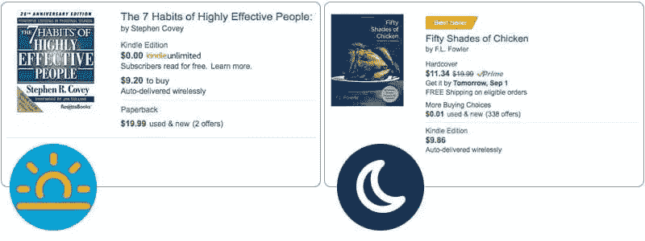
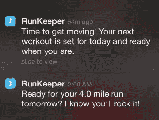

# 为道德的早晨和淘气的夜晚设计

> 原文：<https://www.sitepoint.com/designing-moral-mornings-naughty-nights/>

#### 你是一个有道德的人吗？

当然，这是一个愚蠢的问题。我们都有自己的道德框架。该框架可能与一些框架非常相似，但与其他框架非常不同。

但是你的道德框架有多灵活呢？经常变吗？例如，如果我今天问你一个问题，你会期望一周后给出不同的答案吗？大概不会。

显然，我们的道德指南针并不像我们想的那样固定——即使是在一天的过程中。

现在，当我们在这里谈论“道德”时，我们不是在谈论那些显而易见的大问题。我们大多数人都明白伤害或杀戮是错误的。但是那些小罪呢？你是否:

*   总是在你的狗拉完屎后舀？
*   去健身房还是看网飞？
*   早餐选麦片还是甜甜圈？
*   说出你迟到的真实原因——或者没有？
*   把杯子放在水槽上还是洗干净？

一天有一百万个小测试。

## 《晨德论》

根据最近的一项研究——早晨道德效应(Maryam Kouchaki & is AAC h . Smith)——我们的决定在正常的一天中会发生变化。在一天的早些时候，我们更有可能更严格地坚持我们的道德和伦理准则，并选择穆兹利。

但是随着时间的推移，我们越来越有可能放松警惕，选择容易的选项而不是“正确”的选项。那是拨披萨而不是煮冰箱里的东西。哈佛的研究表明:

> 根据自我调节的强度模型(鲍梅斯特等人，1998；穆拉文和鲍梅斯特，2000)，自我控制的能力就像肌肉一样，需要休息后才能恢复力量。因此，所有的自我控制行为都来自于同样的有限资源，而这种资源的耗尽会阻碍一个人随后进行自我控制的能力。

有趣的东西。

### 这对应用程序设计意味着什么？

我们不可能总是知道用户的当地时间，但是当我们知道的时候，这可以帮助我们决定什么时候给他们提供什么。有时候，我们想激发他们的责任感、雄心和目标。那是 AM 的事。

还有其他时候，我们可能想要迎合他们自我放纵或逃避现实的意识。那更像是 PM 的事情。

例如，像亚马逊这样的书商可能会在早上通过让“*高效人士的 7 个习惯*”变得非常明显而获得更好的结果。人们被激励，并致力于做正确的事情。

但是随着下午时间的推移，人们疲惫了，也许《五十度鸡》增加了它的吸引力(是的，这是一本真正的书)。

像 [Runkeeper](https://runkeeper.com/) 这样的健身 app 呢？

Runkeeper 总是使用精心制作的信息来激励用户(并保持他们的参与度)。

哈佛的这项研究告诉我们，如果你在午餐前发送这些信息，效果会更好。

然而，在一天的晚些时候——当他们累了，想吃点糖的时候——是表扬他们已经做的事情的最佳时机。“嘿，从 8 月 1 日起你已经跑了 25 英里了。你正在杀死它！”。

外卖？漫长的一天过后，一点点爱能走很长的路。

*原载于 [SitePoint 设计简讯](https://www.sitepoint.com/newsletter/)* 。

## 分享这篇文章