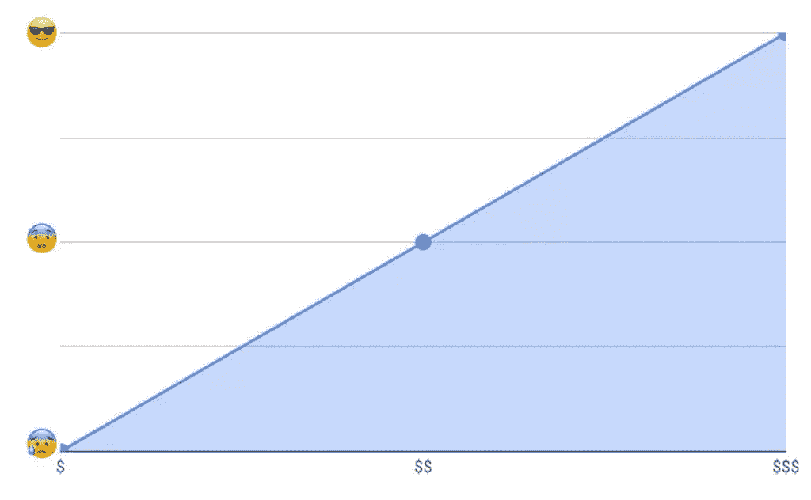
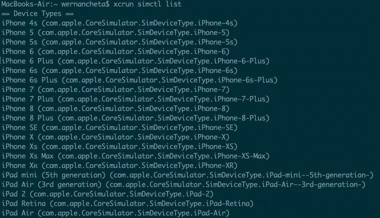

# 利用 Detox 对本地端到端测试和自动化做出反应

> 原文：<https://www.sitepoint.com/detox-react-native-testing-automation/>

**[Detox](https://github.com/wix/Detox) 是一个端到端的测试和自动化框架，运行在设备或模拟器上，就像一个实际的最终用户。**

软件开发要求快速响应用户和/或市场需求。这种快速的开发周期迟早会导致项目的某些部分被破坏，尤其是当项目变得如此庞大的时候。开发人员被项目的所有技术复杂性弄得不知所措，甚至业务人员也开始发现很难跟踪产品迎合的所有场景。

在这种情况下，需要软件保持在项目的顶部，并允许我们满怀信心地进行部署。但是为什么要进行端到端测试呢？单元测试和集成测试还不够吗？为什么要为端到端测试带来的复杂性而烦恼呢？

首先，大多数端到端框架已经解决了复杂性问题，在某种程度上，一些工具(无论是免费的、付费的还是受限的)允许我们作为用户记录测试，然后重放它并生成必要的代码。当然，这并没有涵盖您能够以编程方式处理的所有场景，但它仍然是一个非常方便的特性。

*想从头开始学习 React Native？这篇文章是从我们的优质图书馆摘录的。使用 SitePoint Premium 获得 React 本地书籍的完整收藏，涵盖基础知识、项目、技巧和工具&。[现在就加入，每月仅需 9 美元](https://www.sitepoint.com/premium/products/Z2lkOi8vbGVhcm5hYmxlL1Byb2R1Y3QvMzA3?utm_source=blog&utm_medium=articles)。*

## 端到端集成和单元测试

端到端测试对比集成测试对比单元测试:我总是发现“对比”这个词驱使人们去露营——好像这是一场善与恶的战争。这促使我们去露营，而不是互相学习，理解为什么而不是如何学习。这样的例子数不胜数:角度与反应，反应与角度与 Vue，甚至更多，反应与角度，Vue 与苗条。每个营地的垃圾都互相谈论。

jQuery 利用 facade 模式`$('')`驯服了疯狂的 DOM 野兽，让我专注于手头的任务，让我成为了一名更好的开发人员。Angular 通过利用将可重用部分组件化为可组合的指令(v1)使我成为一名更好的开发人员。React 通过利用函数式编程、不变性、身份引用比较和其他框架中没有的可组合性水平，使我成为一名更好的开发人员。Vue 通过利用反应式编程和推模型使我成为一名更好的开发人员。我可以继续下去，但我只是想证明一点，我们需要更多地关注为什么:为什么这个工具首先被创建，它解决了什么问题，以及是否有其他方法来解决同样的问题。

### 随着你的上升，你会获得更多的自信



随着你更多地模拟用户的旅程，你必须做更多的工作来模拟用户与产品的交互。但是另一方面，你得到了最大的信心，因为你测试的是与用户互动的真实产品。因此，您可以捕获所有问题——无论是样式问题(可能导致整个部分或整个交互过程不可见或不可交互),还是内容问题、UI 问题、API 问题、服务器问题或数据库问题。你得到了所有这些，这给了你最大的信心。

## 为什么要排毒？

我们首先讨论了端到端测试的好处，以及它在部署新功能或修复问题时提供最大信心的价值。但是为什么要特别排毒呢？在撰写本文时，它是 React Native 中最流行的端到端测试库，也是拥有最活跃社区的库。最重要的是，它是 React Native 在其[文档](https://github.com/facebook/react-native/wiki/Tests#end-to-end-tests)中推荐的。

排毒测试哲学是“灰箱测试”。灰箱测试是指框架知道它所测试的产品的内部情况的测试。换句话说，它知道自己是在 React Native 中，并且知道如何作为 Detox 进程的子进程启动应用程序，以及如何在每次测试后需要时重新加载它。所以每个测试结果都是相互独立的。

## 先决条件

1.  macOS High Sierra 10.13 或以上
2.  Xcode 10.1 或以上版本
3.  自制:

    ```
     /usr/bin/ruby -e "$(curl -fsSL https://raw.githubusercontent.com/Homebrew/install/master/install)" 
    ```

4.  节点 8.3.0 或更高版本:

    ```
     brew update && brew install node 
    ```

5.  苹果模拟器实用程序:`brew tap wix/brew`和`brew install applesimutils`

6.  排毒 CLI 10.0.7 或以上:

    ```
     npm install -g detox-cli 
    ```

## 查看实际效果

首先，我们克隆一个非常有趣的[开源 React 原生项目](https://github.com/ahmedam55/movie-swiper-detox-testing)为了学习方便，然后在里面加入 Detox:

```
git clone https://github.com/ahmedam55/movie-swiper-detox-testing.git
cd movie-swiper-detox-testing
npm install
react-native run-ios 
```

在[电影数据库网站](https://www.themoviedb.org/account/signup)上创建一个账户，以便能够测试所有的应用场景。然后分别用`usernamePlaceholder`和`passwordPlaceholder`在`.env`文件中添加您的用户名和密码:

```
isTesting=true
username=usernamePlaceholder
password=passwordPlaceholder 
```

之后，您现在可以运行测试:

```
detox test 
```

请注意，我不得不从最初的[回购协议中派生出这个回购协议，因为在 detox-cli、detox 和项目库之间有很多突破性的变化。使用以下步骤作为操作的基础:](https://github.com/azhavrid/movie-swiper)

1.  将其完全迁移到最新的 React 本地项目。
2.  更新所有库以解决测试时 Detox 面临的问题。
3.  如果环境正在测试，切换动画和无限计时器。
4.  添加测试套件包。

## 新项目的设置

### 给我们的依赖加上排毒

转到项目的根目录，添加 Detox:

```
npm install detox --save-dev 
```

### 配置排毒

打开`package.json`文件，在项目名称 config 之后添加以下内容。请务必将 iOS 配置中的`movieSwiper`替换为您的应用名称。在这里，我们告诉 Detox 在哪里可以找到二进制应用程序以及构建它的命令。(这是可选的。我们总是可以执行`react-native run-ios`来代替。)还要选择模拟器的类型:`ios.simulator`、`ios.none`、`android.emulator`或`android.attached`。并选择要测试的设备:

```
{
  "name": "movie-swiper-detox-testing",

  // add these:
  "detox": {
    "configurations": {
      "ios.sim.debug": {
        "binaryPath": "ios/build/movieSwiper/Build/Products/Debug-iphonesimulator/movieSwiper.app",
        "build": "xcodebuild -project ios/movieSwiper.xcodeproj -scheme movieSwiper -configuration Debug -sdk iphonesimulator -derivedDataPath ios/build",
        "type": "ios.simulator",
        "name": "iPhone 7 Plus"
      }
    }
  }
} 
```

下面是上面配置的详细内容:

*   执行`react-native run-ios`创建二进制应用程序。
*   在项目根目录下搜索二进制 app:`find . -name "*.app"`。
*   将结果放在`build`目录中。

在启动测试套件之前，确保您指定的设备`name`可用(例如，iPhone 7)。您可以通过在终端执行以下命令来实现这一点:

```
xcrun simctl list 
```

它看起来是这样的:



既然我们已经将 Detox 添加到我们的项目中，并告诉它使用哪个模拟器来启动应用程序，我们需要一个测试运行程序来管理断言和报告——无论是在终端上还是其他地方。

排毒既支持 [Jest](https://jestjs.io/) 又支持[摩卡](https://mochajs.org/)。我们将使用 Jest，因为它有更大的社区和更大的功能集。除此之外，它支持并行测试执行，随着端到端测试数量的增加，这可以方便地加速端到端测试。

### 向开发依赖项添加 Jest

执行以下命令来安装 Jest:

```
npm install jest jest-cli --save-dev 
```

### 生成测试套件文件

要初始化 Detox 以使用 Jest，请执行以下操作:

```
detox init -r jest 
```

这将在项目的根目录下创建一个`e2e`文件夹，其中包含以下内容:

*   **e2e/配置. json** 包含了测试运行程序的全局配置:

    ```
     {
          "setupFilesAfterEnv": ["./init.js"],
          "testEnvironment": "node",
          "reporters": ["detox/runners/jest/streamlineReporter"],
          "verbose": true
      } 
    ```

*   **e2e/init.js** 包含了在执行任何测试之前运行的初始化代码:

    ```
    const detox = require('detox');
      const config = require('../package.json').detox;
      const adapter = require('detox/runners/jest/adapter');
      const specReporter = require('detox/runners/jest/specReporter');

      // Set the default timeout
      jest.setTimeout(25000);
      jasmine.getEnv().addReporter(adapter);

      // This takes care of generating status logs on a per-spec basis. By default, jest only reports at file-level.
      // This is strictly optional.
      jasmine.getEnv().addReporter(specReporter);

      beforeAll(async () => {
        await detox.init(config);
      });

      beforeEach(async () => {
        await adapter.beforeEach();
      });

      afterAll(async () => {
        await adapter.afterAll();
        await detox.cleanup();
      }); 
    ```

*   **e2e/firstTest.spec.js** 是默认的排毒测试文件。这是我们对应用程序进行所有测试的地方。我们将详细讨论`describe`和`it`模块，以及我们稍后将要创建的测试套件。

### 最后，我们运行测试

要运行测试，请导航到项目的根目录并执行以下操作:

```
detox test 
```

恭喜你！我们已经为编写令人敬畏的测试做好了一切准备。您可以创建和管理任意数量的`e2e/*spec.js`文件，测试运行程序将一个接一个地执行它们。规格文件代表一组要测试的独立特征。例如，结帐、客人结帐、用户验证或注册。

在规范文件中，您将拥有`describe`。这包含最小的测试块— `it`块—它是为读取而创建的。例如:`it should reject creating an account if name already exits`。在这个`it`块中，添加必要的断言来确保这是真的。理想情况下，我们应该在每个`it`模块后重新加载 React Native。这是只要他们不互相依赖。这可以防止误报，并使调试更容易。知道这个测试失败了，你就不必担心所有其他的场景。

## 深入我们的测试套件

我们将检查应用程序是否满足以下情况。

*   **不允许使用错误的凭证登录**。这一点似乎显而易见，但它对应用程序工作流至关重要，因此需要在每次更改和/或部署时进行测试。
*   **它应该使用有效凭证对用户进行身份验证**—测试身份验证功能是否正常工作。
*   当用户退出时，它应该会把用户踢出去——测试退出是否会把用户从浏览、探索和图书馆屏幕上带走。
*   **它应该只允许客人浏览屏幕**。用户可以作为来宾登录或继续，在这种情况下，他们只能访问浏览屏幕及其功能。
*   **它应该获取与查询**匹配的电影——测试呈现的电影是否与搜索查询匹配。
*   **应该添加到收藏夹**—测试添加到收藏夹电影功能，并确保添加的电影出现在收藏夹电影列表中。
*   它应该添加到观看列表—类似于测试添加到最喜欢的电影，但用于观看列表功能。
*   **点击“更多”时应显示全部内容**—测试浏览部分的**更多**按钮功能:
    *   每日趋势
    *   趋势周刊
    *   流行的
    *   顶级
    *   确保它导航到包含所有符合所选标准的电影的电影列表视图。

## 遍历测试套件的代码

现在是我们检查测试应用程序的代码的时候了。不过，在这之前，我建议你先在你的设备或模拟器上运行这个应用程序。这是为了让您熟悉应用程序中的不同屏幕和 UI 组件。

我们需要做的第一件事是定义我们将用来执行各种测试的函数。当我发现自己匹配同一组 UI 元素并执行一组特定的操作时，我会将其抽象为自己的函数，这样我就可以在其他测试中重用它，并将修复和更改集中在一个地方。下面是一些我认为有用的抽象的例子:

*   `loginWithWrongCredentials()`
*   `loginWithRightCredentials()`
*   `goToLibrary()`
*   `signOut()`
*   `searchForMovie(title)`

排毒的 API 应该很容易让你理解，即使你以前没有使用过它。代码如下:

```
// e2e/firstTestSuite.spec.js

// fetch the username and password from the .env file
const username = process.env.username;
const password = process.env.password;

const sleep = duration =>
  new Promise(resolve => setTimeout(() => resolve(), duration)); // function for pausing the execution of the test. Mainly used for waiting for a specific UI component to appear on the screen

const loginWith = async (username, password) => {
  try {
    // click on login btn to navigate to the username, password screen
    const navigateToLoginBtn = await element(by.id("navigate-login-btn"));
    await navigateToLoginBtn.tap();

    const usernameInput = await element(by.id("username-input"));
    const passwordInput = await element(by.id("password-input"));

    await usernameInput.tap();
    await usernameInput.typeText(username);
    await passwordInput.typeText(password);

    const loginBtn = await element(by.id("login-btn"));

    await loginBtn.tap(); // to close the keyboard
    await loginBtn.tap(); // to start the authentication process

    const errorMessage = await element(
      by.text("Invalid username and/or password")
    );

    return { errorMessage, usernameInput, passwordInput };
  } catch (e) {
    console.log(
      "A sign out has not been done, which made the `navigate-login-btn` not found"
    );
  }
};

const loginWithWrongCredentials = async () =>
  await loginWith("alex339", "9sdfhsakjf"); // log in with some random incorrect credentials
const loginWithRightCredentials = async () =>
  await loginWith(username, password); // log in with the correct credentials

const goToLibrary = async () => {
  const libraryBtn = await element(by.id("navigation-btn-Library"));
  await libraryBtn.tap();
};

const goToExplore = async () => {
  const exploreBtn = await element(by.id("navigation-btn-Explore"));
  await exploreBtn.tap();
};

const signOut = async () => {
  await goToLibrary();

  const settingsBtn = await element(by.id("settings-btn"));
  await settingsBtn.tap();

  const signOutBtn = await element(by.id("sign-out-btn"));
  await signOutBtn.tap();
};

const continueAsGuest = async () => {
  const continueAsGuestBtn = await element(by.id("continue-as-guest"));
  await continueAsGuestBtn.tap();
};

const searchForMovie = async movieTitle => {
  const searchMoviesInput = await element(by.id("search-input-input"));
  await searchMoviesInput.tap();
  await searchMoviesInput.clearText();
  await searchMoviesInput.typeText(movieTitle);
};

const goBack = async () => {
  const goBackBtn = await element(by.id("go-back-btn"));
  goBackBtn.tap();
};

const goToWatchListMovies = async () => {
  const watchListBtn = await element(by.id("my-watchlist"));
  await watchListBtn.tap();
};

const goToFavoriteMovies = async () => {
  const favoriteMoviesBtn = await element(by.id("my-favorite-movies"));
  await favoriteMoviesBtn.tap();
};

const clickFavoriteButton = async () => {
  const addToWatchListBtn = await element(by.id("add-to-favorite-btn"));
  await addToWatchListBtn.tap();
};

const clickWatchListButton = async () => {
  const addToWatchListBtn = await element(by.id("add-to-watch-list-btn"));
  await addToWatchListBtn.tap();
};

const removeTestMoviesFromLists = async () => {
  try {
    await loginWithRightCredentials();
    await goToLibrary();
    await goToWatchListMovies();

    const movieItemInWatchList = await element(
      by.text("Crazy Rich Asians").withAncestor(by.id("watch-list"))
    );

    await movieItemInWatchList.tap();
    await clickWatchListButton();
    await goToLibrary();
    await goToFavoriteMovies();

    const movieItemInFavorites = await element(
      by.text("Avengers: Endgame").withAncestor(by.id("favorite-list"))
    );

    await movieItemInFavorites.tap();
    await clickFavoriteButton();
  } catch (e) {}
  await signOut();
};

// next: add function for asserting movie items 
```

接下来，我们添加断言电影项目的函数。与我们上面定义的所有其他函数不同，这个函数实际上是在运行一个单独的测试，以断言特定的电影项目在屏幕上是可见的:

```
const assertMovieItems = async (moviesTitles = []) => {
  for (let i = 0; i < moviesTitles.length; i++) {
    const moviesItem = await element(by.text(moviesTitles[i]));
    await expect(moviesItem).toBeVisible();
  }
};

// next: create the test suite 
```

至此，我们已经准备好创建测试套件了。这应该包含在一个`describe`块中。为了让每个测试有一个“干净”的起点，我们使用以下生命周期方法:

*   `beforeAll`:在该测试套件运行之前执行一次。在这种情况下，我们调用`removeTestMoviesFromLists()`函数。正如您在前面看到的，这相当于一个启动检查序列，在这个序列中，用户登录并访问各种页面，然后单击测试中将使用的各种按钮。这确保了应用程序在开始运行测试之前处于最低功能状态。
*   `beforeEach`:在这个测试套件中的每个测试运行之前执行。在这种情况下，我们希望重新加载 React Native。请注意，这与在键盘上按下`⌘` + `r`、`rr`或`Ctrl` + `r`的效果相同。
*   `afterEach`:在该测试套件中的每个测试运行后执行。在这种情况下，我们希望注销用户，这意味着在我们的每个测试中，我们需要让用户重新登录。再次强调，这是编写测试时的一个好习惯:每个测试都必须有相同的起点。这确保了它们可以以任何顺序运行，并且仍然产生相同的结果:

    ```
    describe("Project Test Suite", () => {
        beforeAll(async () => {
          await removeTestMoviesFromLists();
        });

        beforeEach(async () => {
          await device.reloadReactNative();
        });

        afterEach(async () => {
          try {
            await signOut();
          } catch (e) {}
        });

        // next: run the individual tests
      }); 
    ```

现在让我们看一下各个测试。这些可以在`it`块中定义。每个`it`块都从空白开始，并断言一个特定的、定义良好的场景(我们在上一节中已经介绍过)。每个测试都有一个可预测的输出，这就是我们需要断言的:

```
it("should disallow login with wrong credentials", async () => {
  const {
    errorMessage,
    usernameInput,
    passwordInput
  } = await loginWithWrongCredentials();

  await expect(errorMessage).toBeVisible();
  await expect(usernameInput).toBeVisible();
  await expect(passwordInput).toBeVisible();
});

it("should login with right credentials", async () => {
  await loginWithRightCredentials();

  await goToLibrary();

  const watchListBtn = element(by.id("my-watchlist"));
  const favoriteMoviesBtn = element(by.id("my-favorite-movies"));

  await expect(watchListBtn).toBeVisible();
  await expect(favoriteMoviesBtn).toBeVisible();
});

it("should kick user out when sign out is clicked", async () => {
  await loginWithRightCredentials();
  await goToLibrary();
  await signOut();

  const loginBtn = await element(by.id("navigate-login-btn"));
  await expect(loginBtn).toBeVisible();
});

it("should allow guest in for Browse only", async () => {
  await continueAsGuest();
  await goToLibrary();

  const watchListBtn = element(by.id("my-watchlist"));
  const favoriteMoviesBtn = element(by.id("my-favorite-movies"));

  await expect(watchListBtn).toBeNotVisible();
  await expect(favoriteMoviesBtn).toBeNotVisible();

  await goToExplore();

  const moviesSwipingView = element(by.id("movies-swiping-view"));

  await expect(moviesSwipingView).toBeNotVisible();
});

it("should fetch and render the searches properly", async () => {
  await loginWithRightCredentials();

  const searches = [
    {
      query: "xmen",
      results: ["X-Men: Apocalypse", "X-Men: Days of Future Past"]
    },
    {
      query: "avengers",
      results: ["Avengers: Endgame", "Avengers: Age of Ultron"]
    },
    { query: "wolverine", results: ["Logan", "The Wolverine"] }
  ];

  for (let i = 0; i < searches.length; i++) {
    const currentSearch = searches[i];

    await searchForMovie(currentSearch.query);
    await assertMovieItems(currentSearch.results);
  }
});

it("should add to favorite", async () => {
  await loginWithRightCredentials();

  await searchForMovie("avengers");
  await element(by.text("Avengers: Endgame")).tap();

  await clickFavoriteButton();
  await goBack();
  await goToLibrary();
  await goToFavoriteMovies();

  await sleep(3000);

  var movieItemInFavorites = await element(
    by.id("favorite-list").withDescendant(by.text("Avengers: Endgame"))
  );

  await expect(movieItemInFavorites).toBeVisible();
});

it("should add to watchlist", async () => {
  await loginWithRightCredentials();

  await searchForMovie("crazy rich");
  await element(by.text("Crazy Rich Asians")).tap();

  await clickWatchListButton();

  await goBack();
  await goToLibrary();
  await goToWatchListMovies();

  await sleep(3000);

  const movieItemInFavorites = await element(
    by.id("watch-list").withDescendant(by.text("Crazy Rich Asians"))
  );

  await expect(movieItemInFavorites).toBeVisible();
});

it("should show all lists more is clicked", async () => {
  await loginWithRightCredentials();

  const trendingDailyMoreBtn = await element(by.id("trending-daily-more"));
  await trendingDailyMoreBtn.tap();

  await goBack();
  await sleep(300);

  const trendingWeeklyMoreBtn = await element(by.id("trending-weekly-more"));
  await trendingWeeklyMoreBtn.tap();

  await goBack();
  await sleep(300);

  const popularMoreBtn = await element(by.id("popular-more"));
  await popularMoreBtn.tap();

  await goBack();
  await sleep(300);

  const browseSectionsView = await element(by.id("browse-sections-view"));
  await browseSectionsView.scrollTo("bottom");

  const topRatedMoreBtn = await element(by.id("top-rated-more"));
  await topRatedMoreBtn.tap();
}); 
```

从上面的代码中，您可以看到每个测试的工作流程可以总结为四个步骤:

1.  **初始化状态**。这是我们登录用户的地方，因此每个测试都有相同的起点。
2.  **选择 UI 组件**。这就是我们使用[匹配器](https://github.com/wix/Detox/blob/master/docs/APIRef.Matchers.md)来定位特定 UI 组件的地方。
3.  **触发动作**。这就是我们[在我们选择的 UI 组件上触发动作](https://github.com/wix/Detox/blob/master/docs/APIRef.ActionsOnElement.md)的地方。
4.  **断言期望输出存在或不存在**。在这里，我们使用`expect()` [方法](https://github.com/wix/Detox/blob/master/docs/APIRef.Expect.md)来测试动作是否触发了另一个 UI 组件在屏幕上显示或隐藏。如果断言返回`true`，则测试通过。

*注意:由于应用程序不断变化的特性，我们断言的电影项目可能会非常频繁地变化。如果你是在这篇文章发表后的某个时候读到这篇文章的，请确保首先手动验证特定的项目是否在屏幕上可见。这有助于避免测试不必要的失败，并且会让你在让演示工作的时候少一些麻烦。*

### 匹配项

您可以通过 ID、文本、标签、父元素、子元素(任何级别)或特征来匹配或选择任何 UI 元素。这里有几个例子:

```
const usernameInput = await element(by.id("username-input")); 
```

```
const errorMessage = await element(by.text("Invalid username and/or password")); 
```

### 要执行的操作

排毒可以对 UI 元素执行一组庞大的动作:`tap`、`longPress`、`multiTap`、`tapAtPoint`、`swipe`、`typeText`、`clearText`、`scroll`、`scrollTo`、[以及其他](https://github.com/wix/Detox/blob/master/docs/APIRef.ActionsOnElement.md#methods)。

这里有几个例子:

```
await usernameInput.tap();

await usernameInput.typeText(username);

await passwordInput.clearText();

const browseSectionsView = await element(by.id("browse-sections-view"));

await browseSectionsView.scrollTo("bottom"); 
```

### 要测试的断言

Detox 有一组[断言](https://github.com/wix/Detox/blob/master/docs/APIRef.Expect.md#methods)，可以针对匹配的 UI 元素执行:`toBeVisible`、`toNotBeVisible`、`toExist`、`toNotExist`、`toHaveText`、`toHaveLabel`、`toHaveId`、`toHaveValue`。这里有几个例子:

```
const assertMovieItems = async (moviesTitles = []) => {
  for (let i = 0; i < moviesTitles.length; i++) {
    const moviesItem = await element(by.text(moviesTitles[i]));
    await expect(moviesItem).toBeVisible();
  }
};

await assertMovieItems(["Avengers: Endgame", "Avengers: Age of Ultron"]); 
```

```
const watchListBtn = element(by.id("my-watchlist"));
await expect(watchListBtn).toBeNotVisible(); 
```

## 挑战和方法

### 无休止的循环动画或计时器

我面临的一个问题是，如果有一个定时器循环或动画永远不会结束，排毒就会停止。我必须执行以下操作来调试此类问题:

1.  在应用程序树中搜索和调试部件，并通过修改和删除它们来导入。
2.  再次运行测试套件，检查问题是否仍然存在。
3.  在那之后，大多数时候，问题是动画在结束后会自动启动。所以我导入了`react-native-config`，这是一个非常方便的工具，可以设置一些环境变量，根据环境切换一些行为或功能。在我的例子中，它在`.env`文件中添加了`isTesting=true`，在代码库中检查它，并禁用动画循环或缩短持续时间，因此它加快了测试套件的速度。

正如你所看到的，这主要是一个在你的应用程序中摆弄动画设置的问题。关于排毒的更多信息，你可以查阅以下文件:

*   [同步故障排除](https://github.com/wix/Detox/blob/master/docs/Troubleshooting.Synchronization.md)
*   [排除失败测试的故障](https://github.com/wix/Detox/blob/master/docs/Troubleshooting.RunningTests.md)
*   [片状剥落故障排除](https://github.com/wix/Detox/blob/master/docs/Troubleshooting.Flakiness.md)

### 向适当的 UI 元素添加 TestID

另一个挑战是挖掘要传递`testID`的组件，因为 Detox 不支持定制组件。有时，您需要用内置组件——比如`View`组件——包装组件，以便与之匹配和交互。如果内部内置组件的代码是在`node_modules`文件夹中导入的库，那就更是如此。

### 用上下文数据组合 TestID

我必须处理的另一个场景是在多个地方使用不同的事件处理程序和标题呈现的组件。因此，我必须创建一个复合的`testID`，带有标题、小写字母和连字符，以及组件的`testID`标识符。

例如，所有浏览部分的 **more** 按钮:因为为它们中的每一个渲染的是相同的组件:

```
 const testID = `${(this.props.title||'').toLowerCase().replace(/\s/g, '-')}-more`

 return (
  ...
    <AppButton
       onlyText
       style={styles.moreButton}
       textStyle={styles.moreButtonText}
       onPress={this.onMorePress}
       testID={testID}
    >
       MORE
    </AppButton>
 } 
```

有时，它不是一个单独的道具，而是子元素，所以您最终会过滤它们并映射它们以获得文本节点及其值。

### 缩小选择器范围

由于一些导航器倾向于在树中保留先前的屏幕，Detox 会找到两个具有相同标识符(文本、ID、标签)的项目，并抛出一个异常。因此，我们需要从特定的屏幕中过滤出我们需要的项目。您可以通过使用`withAncestor()` [匹配器](https://github.com/wix/Detox/blob/master/docs/APIRef.Matchers.md#match-by-id-and-by-parent-id)来实现，它通过一个特定的祖先 ID 进行匹配:

```
const movieItemInWatchList = await element(
  by.text("Crazy Rich Asians").withAncestor(by.id("watch-list"))
);

await movieItemInWatchList.tap(); 
```

### 让我们以更吸引人的方式来看看结果

您可以查看下面运行的测试的屏幕记录。当您运行应用程序的测试时，应该会得到类似的结果。

[https://www.youtube.com/embed/LgL7ftmTV6A?rel=0](https://www.youtube.com/embed/LgL7ftmTV6A?rel=0)

<br>

*为了模拟文本输入，当选择输入时，**键盘**必须出现。要启用它，请转到**模拟器>键盘>切换软件键盘**。您应该在开始运行测试之前完成这一步。*

## 结论

在本教程中，您学习了如何使用 Detox 在 React 本机应用程序中实施端到端测试。

具体来说，您学习了如何添加 Detox 配置以在 iOS 上运行测试，编写选择器以与 UI 组件交互，以及在与 UI 交互后断言特定内容存在于屏幕中。最后，您了解了一些您可能会遇到的最常见的挑战以及如何解决它们。

在本教程中，我们只针对 iOS 进行了测试，但是您应该也能够在 Android 上运行测试。请注意，您可能需要将您的应用程序降级到 React Native 和 Detox 的较低版本，才能在 Android 上运行。这是因为 iOS 支持在 Detox 更好。

你可以在这个 [GitHub repo](https://github.com/ahmedam55/movie-swiper-detox-testing) 上查看源代码。

## 分享这篇文章