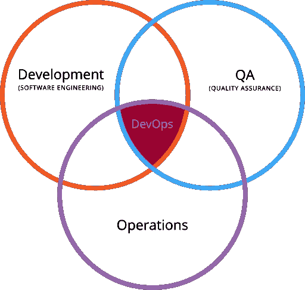
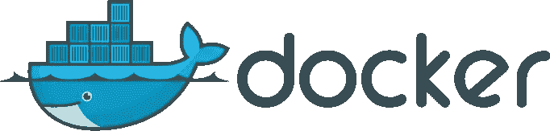

# DevOps 举例:工具，DevOps 文化的利与弊

> 原文：<https://www.sitepoint.com/devops-by-example-tools-pros-and-cons-of-a-devops-culture/>

在应用程序和网站的构思和最终发布之间有许多步骤——设计、编程、质量保证和部署。让我们缩小开发和运营周期之间的差距，并回顾 DevOps 运动的一些实践。

## 传统软件开发:开发与运营

传统上，一个项目的不同状态有不同的团队和过程，从最初的**分析和设计**(当一个产品或想法构思出来的时候)，到实际的**开发和测试**(例如，当代码正在编写或产品正在开发的时候)，到最后的**部署和维护**(例如，当一个网站、应用程序或产品上线的时候)。

这种差异是有充分理由的:他们都需要不同的技能。然而，严格的(有时甚至是官僚的)职责分离会增加许多不必要的延迟，经验证明，模糊其中一些界限对所有相关方以及整个流程都是有利的。

不仅软件开发如此，很多行业都是如此。以丰田为例，这家日本汽车制造商多年来一直有一种强烈的文化，即从生产链中减少他们所谓的“浪费”,以便他们可以加快从开发到运营的变革流程。此外，事实上，丰田的实践在软件开发(参见"[精益软件开发](https://en.wikipedia.org/wiki/Lean_software_development)")和 DevOps(参见"[看板:从丰田到 DevOps？](http://kanbantool.com/kanban-library/why-kanban/kanban-from-toyota-to-devops)、[用丰田生产系统解释 DevOps](http://william.holroyd.name/2014/10/13/using-the-toyota-production-system-to-explain-devops/) )。

## DevOps:为了胜利的文化变革

DevOps 是开发、运营和质量保证的交汇点。图片来自[维基媒体](https://upload.wikimedia.org/wikipedia/commons/thumb/b/b5/Devops.svg/512px-Devops.svg.png)，经由[HostingCanada.org](https://hostingcanada.org)的加里·斯蒂文斯。

与敏捷开发非常相似，DevOps 并不是一个特定的工具或技术，您可以实现它并完成它。相反，它是一种文化——甚至是一种心态——你的团队和组织可以采纳，这将使过程更顺利。

但是到底是什么呢？想象一下，开发人员能够完成一些通常分配给系统管理员的任务，比如创建新的服务器、更新生产站点、部署应用程序。还可以想象系统管理员与开发人员分担一些职责，并且能够同时管理多台服务器。

### 利益

接受 DevOps 文化的公司报告了显著的改进，在其中一些公司中进行的不同调查似乎证实了这些说法(参见“[持续交付:巨大的好处，但也有挑战](http://ieeexplore.ieee.org/document/7006384/?reload=true&arnumber=7006384)”)。

这些改进包括:

*   **加速[上市时间](https://en.wikipedia.org/wiki/Time_to_market)** :缩短从构思创意到上市销售或生产所需的时间。
*   **构建正确的产品**:通过更频繁的发布和想法的现场测试，开发人员可以更快地从用户那里获得反馈(稍后在“A/B 测试”部分会有更多的介绍)。
*   **成本降低**:报告显示平均降低 20%。
*   **提高生产力**:通过持续交付，开发人员和测试人员节省了设置和修复工作环境的时间。此外，部署速度也大大加快了(在“与 Jenkins 的持续集成”一节中有更多相关内容)。
*   **可靠的版本**:随着更小和更频繁的发布，代码的变化——因此引入的错误和它们的影响——也更小。
*   **提高产品质量**:公司报告公开的错误和其他问题显著减少(在某些情况下，减少了 90%以上)。
*   **提高客户满意度**:毫不奇怪，这是之前所有改进的副产品。

## 例子

### 与 Docker 相同的生产和开发环境

传统观点认为不应该将生产环境和开发环境混在一起——为了避免灾难，这两者应该小心地分开。虽然在没有测试和回滚机制的情况下对一个活动平台进行更改确实会导致灾难，但拥有多个环境需要很高的运营成本。

自动化环境的创建是 DevOps 的关键，而实现这一点的技术是 T2 Docker。我们不会在这里深入讨论全部细节，但原则是，使用 Docker，您可以创建一个经过良好测试的功能性环境(称为*映像*，运营方的开发人员和工程师将能够将其作为*软件容器*发布。每当需要更新或修补时，QA 团队将只修补映像，并且这些更改将被复制到每个启动的新容器中。

这使得程序员和设计人员能够独立地启动不断更新且已知可以工作的环境(并且根据需要部署任意数量的环境)，甚至将更改部署到实时平台，因为 QA 人员正在维护这些环境，并且已经设置了适当的测试。它还提供了与服务器管理员的沟通渠道，因为他们基本上都在一个对生产和开发都有好处的工作环境中一起工作。

请注意，如果开发和部署是由同一批人完成的，这也是有效的——就像在一个自由职业开发人员中一样——因为这些在不同环境中测试和实现实时应用程序的问题仍然有效，不管谁负责这项工作。

关于 Docker 的更多信息，请参见[了解 Docker、容器和更安全的软件交付](https://www.sitepoint.com/docker-containers-software-delivery/)。

### A/B 测试

维基百科[对](https://en.wikipedia.org/wiki/A/B_testing) A/B 测试的描述如下:

> 在市场营销和商业智能中，A/B 测试是一个带有两个变量 A 和 B 的随机实验的术语，这两个变量是受控实验中的对照和变异。

原则是，你可以**在真实环境中测试一个想法的变体**，根据受欢迎程度或用户反馈，在可用性和其他方面做出改进。鲁莽的部分是，你与你的实际观众进行这些测试——反正他们是最有资格获得反馈的人——这是脸书，例如，[在大规模进行社会实验时做的事情。在 web 开发领域，想想用谷歌分析测试登陆页面的](http://www.pnas.org/content/111/24/8788.full)[的](https://support.google.com/adwords/answer/2404033?hl=en)[实验](https://support.google.com/analytics/answer/1745147?hl=en)。

所有这些与 DevOps 有什么关系？嗯，有了**自动化部署流程**，您可以给予相关各方——无论是设计师、开发人员，甚至是没有任何编程或工程背景的科学家——进行实验所需的自主权，同样，也有适当的保护机制来测试、拉动或回滚更改。

### 与 Jenkins 的持续集成

*Jenkins logo ( [维基媒体](https://upload.wikimedia.org/wikipedia/commons/thumb/e/e3/Jenkins_logo_with_title.svg/682px-Jenkins_logo_with_title.svg.png) )*

[Jenkins](https://jenkins.io/) 是一个[持续集成](https://en.wikipedia.org/wiki/Continuous_integration) (CI)和[持续交付](https://en.wikipedia.org/wiki/Continuous_delivery) (CD)软件——一个具有数百个插件的编排系统，可以自动完成从构建应用程序和测试到最终部署的所有工作。这些插件可以集成从 Git 或 Mercurial 等源代码平台到亚马逊网络服务(AWS)或谷歌云平台(GCP)等云服务的构建软件，通过所有预定的测试。从本质上来说，**这是一条从源头到交付的管道**，也就是说[成为了 DevOps](http://www.infoworld.com/article/3046038/application-development/why-jenkins-is-becoming-the-engine-of-devops.html) 的引擎。

同样，我们看到每个相关人员(开发人员、QA 和系统管理员)如何在一个有效的自动化工作流中协同工作:

*   开发人员需要一个新的工作环境吗？詹金斯将启动 Docker 来启动它。
*   系统管理员需要通过一个新的 QA 测试才能进行更新吗？他们只是把它添加到詹金斯管道。
*   **开发人员是否希望对生产站点进行更改，并发布新的服务器**？没问题:系统管理员已经指导 Jenkins 运行什么测试，如果一切顺利，如何启动服务器。

正如您所看到的，流程中有很多自动化，各方之间也有相当多的信任，所有这些都需要大量的工作来建立，但一旦建立起来，也给每个人提供了很大的独立操作空间。

## 挑战和失败

转换到 DevOps 文化可能会带来许多好处，但也伴随着一些需要克服的挑战。

第一个是在**组织**级别。随着开发和部署限制的消除，程序员和系统管理员有了更多的独立性，相关人员将需要采用不同的思维方式，从运营到开发的*反馈循环*的适当机制将需要设置到位——例如问题跟踪器、讨论板(想想 [Slack](https://slack.com/) )等等。

第二个关键挑战是关于**流程**。您不再希望开发人员和服务器管理员自己花费时间在更改后单独进行测试。您想要的是自动化测试过程，这样您就可以允许不同的团队进行更改，并快速检查事物是否仍然存在，并在出现问题时撤销这些更改。

最后，还有一个**技术**挑战。如前所述，一旦您的组织从头到尾仔细审查了流程，您可能需要采用或创建一种技术来处理更适合您的流程和组织的自动化和反馈循环。

这不是小事:**你不能简单地复制/粘贴**别人正在使用的流程和技术。这些问题需要单独解决，有关各方之间必须有相当程度的信任。

正如 Dave Roberts 在“为什么‘企业开发’没有意义”中所评论的:

> 关键是要明白，简单地部署一个工具，甚至是一个宽泛的解决方案，而没有*考虑你的独特情况*和你的价值流的当前状态及其当前约束，是愚蠢的。

## 概述

这与应用程序无关。你可以使用诸如 Docker、Jenkins、Kanban 这样的工具，但是如果你不能依靠你的链条另一端的人，你就永远不会做任何实际的开发工作。

相比之下，你可以不用这些工具，而是实现你自己的解决方案，并建立一个适合你或你的组织的 QA 链。如果你与来自不同团队的同事交流顺畅，甚至在需要的时候自己临时做一些他们的工作——相信他们也能做同样的事情，因为你已经做好了逆转变化的一切必要准备——那么你正在进行一场听起来非常像 DevOps 的文化转变。

前方的利益很可能值得努力。

## 分享这篇文章