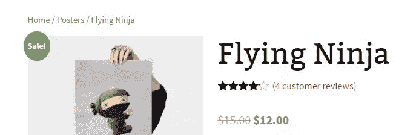
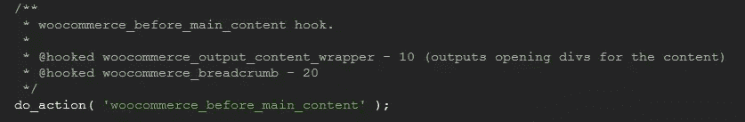
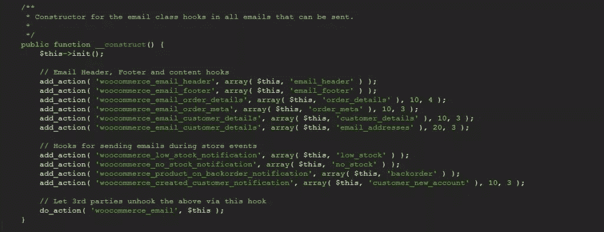
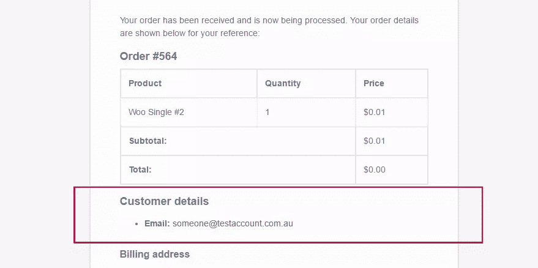
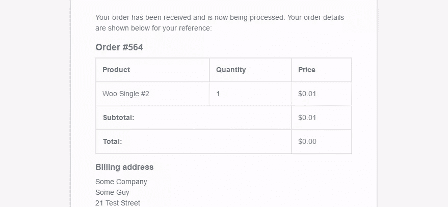
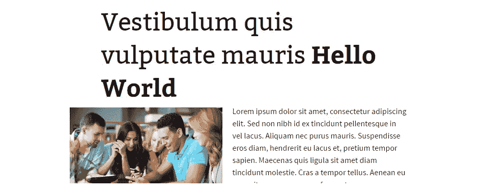

# 深入挖掘 WordPress 挂钩和过滤器

> 原文：<https://www.sitepoint.com/digging-deeper-wordpress-hooks-filters/>

WordPress 加载了一系列的钩子和过滤器，当 WordPress 运行时，这些钩子和过滤器可以让你钩住特定的部分。例如，你可以附加一个自定义函数，这样当 WordPress `save_post`动作被调用时它就会执行，让你可以访问正在保存的文章。

插件和主题是一个钩子丰富的领域。任何像样的插件或主题都会附带一系列这样的钩子，它们要么在内部使用来操作，要么向开发人员公开。当一个插件或主题没有被充分展示时，你可能会在定制它的操作方式上有问题。


一般来说，你将遇到的插件和主题将基于[面向对象的设计方法](https://www.sitepoint.com/object-orientated-development-with-wordpress/)，其中一个或多个类定义了功能如何工作。在这些类中，它们可能定义了挂钩，您希望完全删除这些挂钩，或者用您自己的自定义函数来替换它们。

今天我们将深入探讨 WordPress 钩子，以及如何在传统意义上和处理类或对象时处理它们。

## 拆卸标准挂钩

当钩子和过滤器不在一个类中时，它们很容易被移除。要移除这些挂钩，您需要使用 [`remove_action`](https://codex.wordpress.org/Function_Reference/remove_action) 功能。最基本的是，您需要提供以下内容:

*   `$tag`–该函数所附加的挂钩的名称。
*   `$function_to_remove`–应该删除的功能的名称。
*   `$priority`–功能连接到挂钩时的优先级。

当用`do_action`创建动作挂钩时，只要 WordPress 到达它，它就会触发所有用`add_action`添加的功能。

### 示例 1:标准 WooCommerce 挂钩

让我们看一个直观的例子。考虑一下 WooCommerce 插件。当你在一个页面上时(使用`single-product`模板),你会默认看到面包屑栏。



这是通过`do_action( 'woocommerce_before_main_content' );`挂钩输出的。它的目的是输出产品的起始内容包装和面包屑。



因为我们知道动作的名称和附加到该钩子上的函数名称，所以我们可以完全删除该函数，如下所示。

```
//remove breadcrumbs from single product
remove_action('woocommerce_before_main_content', 'woocommerce_breadcrumb', 20); 
```

现在面包屑会消失。只要你知道挂钩的**名称，你想要删除的函数**的**名称和**优先级**，你就可以删除和替换你认为合适的函数。挂钩的优先级很重要，因为它必须与函数最初被挂钩时使用的优先级相匹配。**


## 移除添加到类内部的挂钩

当你在类中定义了动作和过滤器时，这就有点棘手了。即使你可能知道钩子的**名和函数**的**名，你也不能像我们之前那样使用`remove_action`。**

问题是，如果一个插件或主题在类内部定义了这些动作，这些钩子现在被附加在类内部**。要删除它们，您需要将类变量传递给`remove_action`函数，如下所示:**

```
//remove a hooked function from within a call
function('hook_name', array($myclass, 'my_function_remove'), 10); 
```

### 那么类对象到底在哪里呢？

这通常是最棘手的部分。要删除你的函数，你需要一个类对象。要找到它，你需要搜索插件或主题的文档(如果有的话)，或者(不那么令人兴奋地)搜索它们的源代码来找到变量名。

如果该类是一个[单例类](http://www.phptherightway.com/pages/Design-Patterns.html#singleton)，这意味着在同一时刻应该只有一个单例类，那么您应该能够通过使用一个类的内置函数返回该类的实例来获取该类，例如:

`$myClassObject = MyClass::getInstance()`

如果该类没有这样的方法，您可以尝试通过全局调用来获取该对象，例如:

`global $myClassObject`

由于每个开发人员的开发方式不同，您可能需要搜索以找到您需要的变量。如果该类的结构正确，您应该能够获得该对象。

如果你试图删除输出的视觉元素，你应该能够追溯它们的来源，例如:

1.  如果您试图删除一些文本，检查元素并查看它是否有任何类或 ID。
2.  如果你有要搜索的东西，你可以打开你的主题或者插件，搜索那些类或者 ID 在哪里被使用，它们很可能会被包装在一些函数中。
3.  如果你找到了一个导致输出的函数，试着看看它是否和`add_action`挂钩。

如果你成功了，你应该有钩子的名字和你想要移除的函数的名字。你所需要的只是物体本身，你就可以开始了！

### 示例 WooCommerce 类中的钩子

让我们看一个实际的例子，这样你就可以知道如何应用这种技术。

在 WooCommerce 中， [`WC_Emails`](https://docs.woothemes.com/wc-apidocs/class-WC_Emails.html) 类用于生成发送出去的电子邮件的输出(比如新的、正在处理的和已完成的订单)。在`WC_Emails`内部，构造函数将所有不同的函数附加到钩子上来构建输出，如下所示。



当显示一封邮件时，WordPress 会点击`woocommerce_email_customer_details`钩子，并触发所有与之相关的功能。当这种情况发生时，它将触发在`WC_Emails`类中定义的`customer_details`函数，输出客户详细信息。



如果我们不想显示这些细节，我们必须从类中移除`customer_details`函数。

幸运的是，在构造函数的底部是用 [`do_action`](https://developer.wordpress.org/reference/functions/do_action/) 调用的`woocommerce_emails`动作。我们可以挂在那里，这样我们就可以删除我们的客户资料。这个钩子通过`$this`传递给对象本身，所以它非常适合我们的需求。

```
//Remove email details from the `WC_Emails` class
function remove_customer_email_details($instance) {

    //remove `customer_details` hooked function
    remove_action('woocommerce_email_customer_details', array( $instance, 'customer_details'), 10);
}
add_action('woocommerce_email', 'remove_customer_email_details'); 
```

我们调用`remove_action`并传入`$instance`和`customer_details`函数，当我们查看电子邮件时，客户的详细信息消失了，完全被删除了。



在这个场景中，WooCommerce 为我们留下了一个完美的挂钩位置，因此我们可以删除这些功能。插件或主题开发者可以把这些方便的挂钩放在其他开发者可能需要的地方。在这种情况下，如果开发人员没有考虑到这一点，你可能很难删除一些功能。

### 示例 2:自定义类中的钩子

有了 WooCommerce，他们就有了一个由优秀开发人员组成的专门团队，还有一系列志愿者或贡献者在不断努力改进他们的插件。他们已经经历了多年的开发，所以他们知道证明正确挂钩的重要性，以便开发人员可以定制东西。

在这个例子中，我们只看一个简单的情况。这个例子背后的想法是，你不能保证你将有钩子可以依赖，如果开发者甚至在考虑人们扩展他们的工作。在这个场景中，我们在父主题和子主题之间工作。在父主题中我们有主类，在子主题中我们有额外的函数。

**注意:**指出`remove_filter`和`remove_action`是一样的很有用。归根结底，它们都是移除挂钩功能的一种方式，WordPress 很乐意让你互换使用它们。

```
//A simple test class, loaded directly in your website
//Loaded from the parent theme
class testClass{

    //magic constructor
    public function __construct(){
        add_filter('the_title', array($this, 'wrapTitle'), 10, 1);
        add_filter('add_extra_word', array($this, 'output_word'), 10, 1);  
    }

    //wrap the title for each post 
    public function wrapTitle($title){
        $html = '';
        $html .= '<div class="titleWrap">';
        $html .= $title;

        //append a word to the end of the title
        $html = apply_filters('add_extra_word', $title);

        $html .= '</div>';

        return $html;
    }

    //append the word 'Hello World' to the end of the title
    public function output_word($title){
        $html = '';

        $html = $title . ' <strong>Hello World</strong>';
        return $html;
    }
}
$testclass = new testClass(); 
```

这个类在`_construct`方法中的`the_title`钩子上添加了一个名为`wrapTitle`的函数。这意味着一旦类被加载，它将把这个函数挂在标题上，并在每次我们显示一篇文章时被调用。在`wrapTitle`函数中，它将当前标题包装在一个 div 中，然后调用`add_extra_word`过滤器。

回到构造函数中，我们将另一个名为`output_word`的函数挂在了`add_extra_word`过滤器上。这个功能的目的是将粗体的 **Hello World** 文本添加到标题的末尾。



如你所见，这不是很吸引人。我们想把这个加在标题后面的词去掉。这是移除类中添加的函数的绝佳机会。我们是这样做的:

```
//removes the extra word appended to the title (added by the class)
//Added to your child theme 
function remove_extra_word(){
    global $testclass;
    remove_filter('add_extra_word', array($testclass, 'output_word'), 10);
}
add_action('init', 'remove_extra_word'); 
```

我们首先在`init`上挂接要加载的函数。我们这样做而不是直接在 PHP 文件中执行`remove_filter`的原因是，我们希望它只在 WordPress 开始加载时触发。如果我们在类被加载之前就声明了这个函数，它将什么也不做(因为类需要先存在)。

我们通过使用`global $testclass`获取类的副本。我们这样做是因为这个类无法直接给我们对象。

在函数内部，我们现在使用了`remove_filter`函数，并移除了附加在我们的类中定义的`add_extra_word`动作上的`output_word`函数。

当这一切都完成后，你好世界的文字将被删除，你的标题将恢复正常。


我们设法通过添加我们自己的自定义函数和移除我们的挂钩动作来完成所有这些。

### 这种技术行不通的地方

如果你根本没有办法找到类**的对象**(要么作为变量在钩子中传递，要么通过其他方法传递)，那么这种技术将会失败。面向对象设计原则的一个核心部分是，应该总是有一个对对象的引用，这样它就可以被访问，或者，如果没有，一个简单的方法来加载对象。

如果发生这种情况，您可以尝试以下步骤(随着我们的深入，每个步骤都越来越激烈，越来越不推荐):

*   联系主题或插件开发者，要求额外的挂钩。
    *   大多数开发人员都非常热衷于帮助人们，所以这是一个很好的起点。当他们更新他们的插件或主题时，你应该能够无缝地更新(如果设置正确的话)。
*   改变你的插件或主题。
    *   如果它不适合你，看看是否有其他东西可以提供更好的功能，对开发者更友好。
*   直接手动编辑你的插件或主题。
    *   如果你必须坚持你的插件或主题，并且你迫切需要改变它的工作方式，那么你可以直接编辑文件。一般来说，这是一个可怕的建议，因为如果你更新了你的主题或插件，你所做的任何改变都会丢失。然而，有时候你只是需要解决一个问题。

## 把一切都包起来

希望在做完这一切之后，你应该对如何使用 WordPress 的钩子系统来移除和调整你的主题和插件的功能有一个很好的理解。如果你有足够的耐心，并且能够找到钩子、函数和类对象，你就可以在你认为合适的时候删除和替换功能。

你可能想检查一些你当前安装的插件，看看它们对开发者有多友好。他们提供各种各样的钩子和过滤器吗？他们的值或设置是否明确地硬编码在他们的主题或插件中？如果你想扩展和定制你的网站，这些信息是很重要的。

关于 WordPress hook 系统的更多阅读，请查看 Agbonghama Collins 的[揭开 WordPress Hook 系统的神秘面纱](https://www.sitepoint.com/wordpress-hook-system/)。

## 分享这篇文章