# 如何用 Node.js 构建你的第一个 Discord Bot

> 原文：<https://www.sitepoint.com/discord-bot-node-js/>

如今，机器人正被用于自动化各种任务。自从亚马逊的 Alexa 设备发布以来，围绕自动化机器人的宣传才开始增长。除了 Alexa，其他通信工具如 Discord 和 Telegram 都提供 API 来开发定制的机器人。

本文将专注于使用公开的 Discord API 创建您的第一个 bot。也许最知名的不和谐机器人是音乐机器人。音乐机器人让你输入一首歌曲的名字，机器人会把一个新用户连接到你的频道，播放你要求的歌曲。这是年轻人在游戏或流媒体服务器上常用的机器人。

让我们开始创建一个自定义的不和谐机器人。

*本文更新于 2020 年。要了解更多 Node，请查看 [Node.js Web Development](https://www.sitepoint.com/premium/books/node-js-web-development-fourth-edition/) 。*

## 先决条件

*   已安装 Node.js v10 或更高版本(基础知识)
*   不一致的账户和不一致的客户
*   使用终端的基本知识

## 步骤 1:设置测试服务器

首先，我们需要一个测试服务器，稍后我们可以在上面测试我们的 Discord bot。我们可以通过单击屏幕左侧的加号图标来创建一个新服务器。

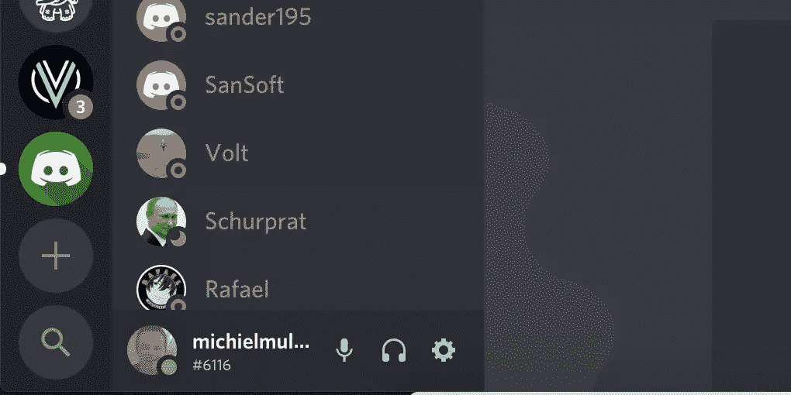

将显示一个弹出窗口，询问您是要加入服务器还是创建新服务器。当然，我们想要创建一个新的服务器。

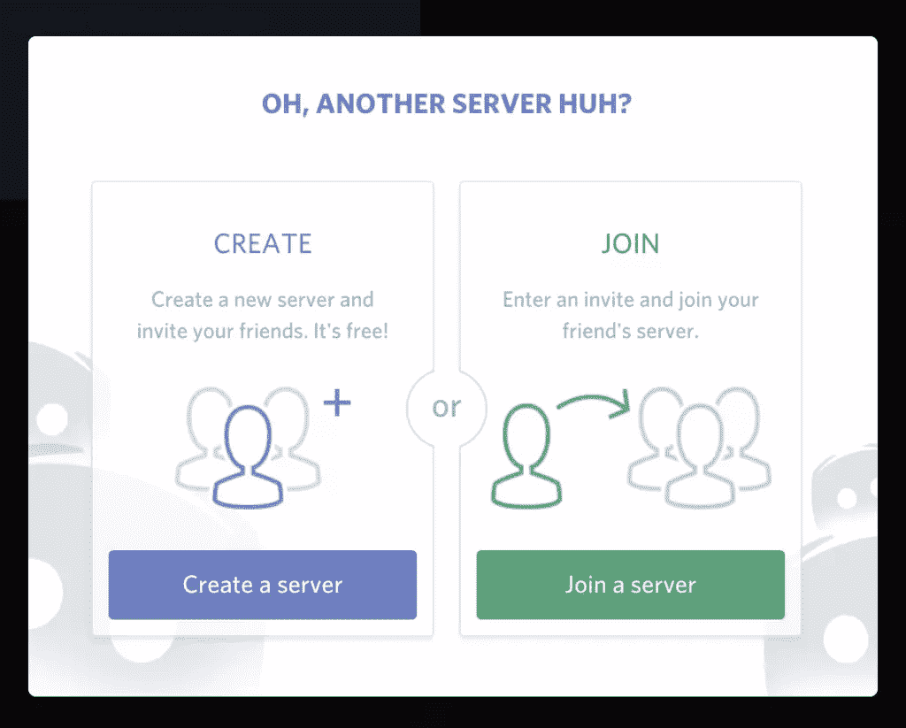

接下来，我们需要输入服务器的名称。为了简单起见，我将服务器命名为`discord_playground`。如果需要，您可以根据您所在的位置更改服务器位置，以获得更好的 ping 效果。

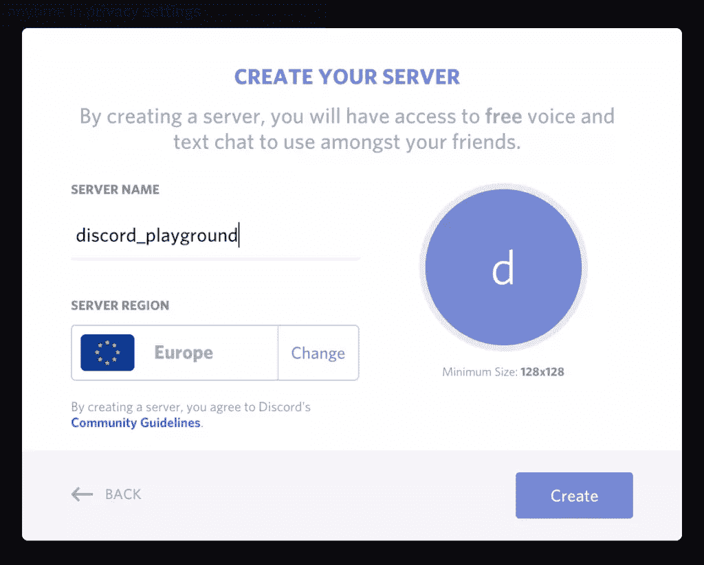

如果一切顺利，您应该会看到新创建的服务器。

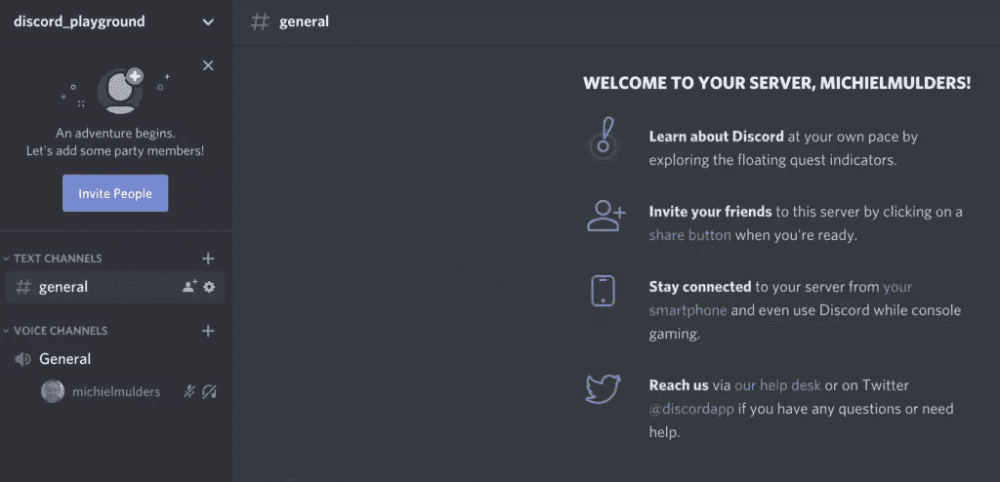

## 步骤 2:生成身份验证令牌

当我们想通过代码控制我们的 bot 时，我们需要首先在我们的 Discord 帐户下注册 bot。

要注册机器人，请进入 [Discord 开发者门户](https://discordapp.com/developers/applications/)并使用您的帐户登录。

登录后，您应该能够看到仪表板。让我们通过点击*新应用程序*按钮来创建一个新应用程序。

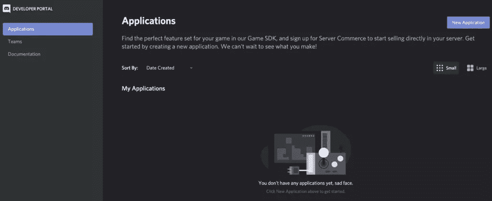

接下来，您将看到一个弹出窗口，要求您输入应用程序的名称。让我们称我们的机器人为`my-greeter-bot`。通过点击*创建*按钮，Discord 将创建一个 API 应用程序。

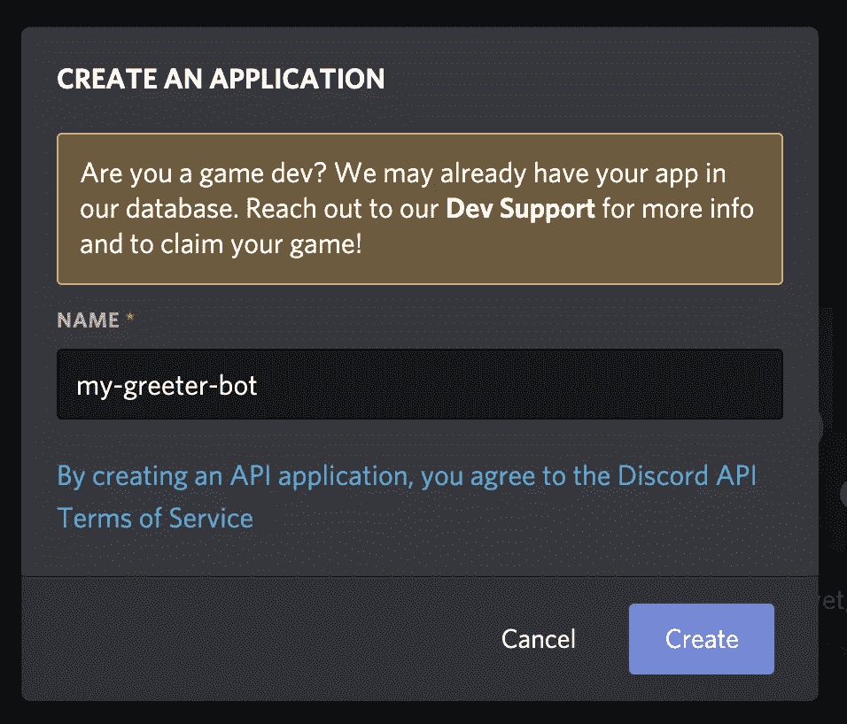

创建应用程序后，您将看到新创建的`my-greeter-bot`应用程序的概述。您将看到诸如客户 ID 和客户机密等信息。这个秘密稍后将被用作授权令牌。

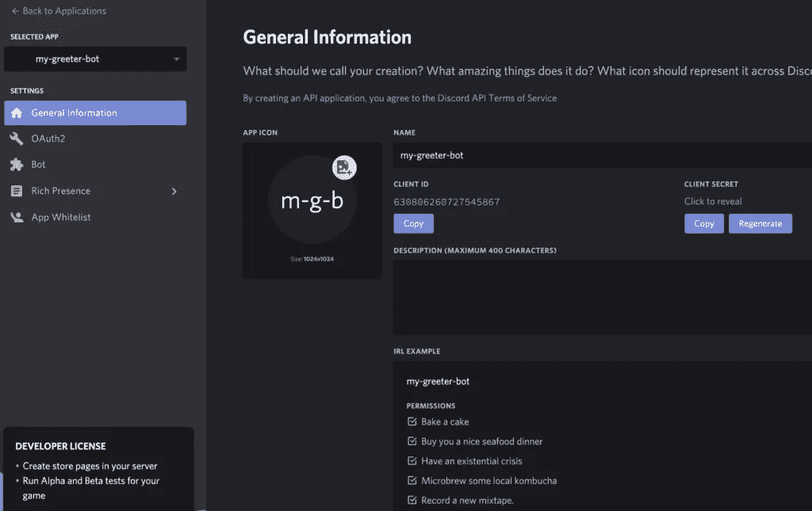

现在，点击*设置*菜单中的*机器人*菜单选项。Discord 将构建我们的`my-greeter-bot`应用程序，并向其中添加一个机器人用户。

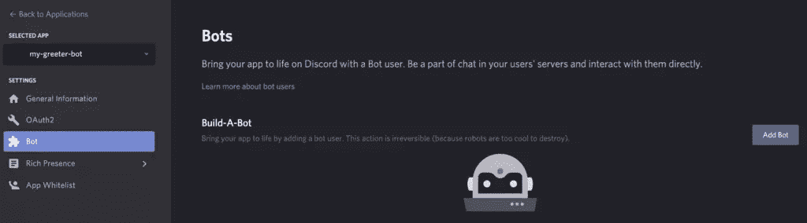

当 bot 构建完成后，您将获得自定义 bot 的概述。看一下*令牌*部分。复制这个授权令牌并把它写在某个地方，因为我们稍后需要它来连接我们的 bot 用户。

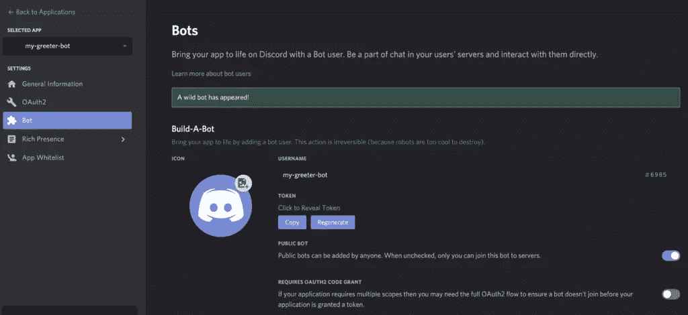

## 步骤 3:定义权限并将 Bot 添加到服务器

第三，我们希望为机器人定义权限，并将其添加到我们的 Discord 服务器中。

导航到*设置*菜单下的 *OAuth2* 部分。在这里，我们可以定义我们的机器人的范围。因为我们只想启用一个简单的机器人，所以我们选择了*机器人*选项。

您可能会注意到下面的授权 URL 现在已经发生了变化。然而，`permissions=0`部分表明我们还没有设置权限。

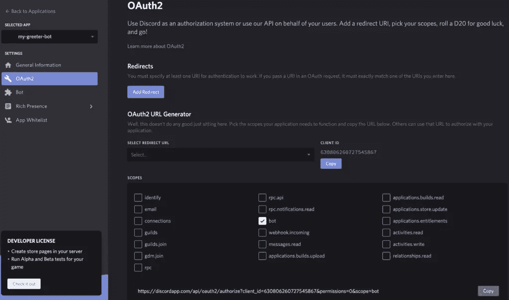

如果我们继续向下滚动，你会发现*机器人权限*部分。我们希望机器人能够`Send Messages`和`Read Message History`。我们需要读取消息历史的权限，这样我们就可以检测用户的请求。

当您选择这两个选项时，请注意授权 URL 中 permissions 参数的数字已经改变。

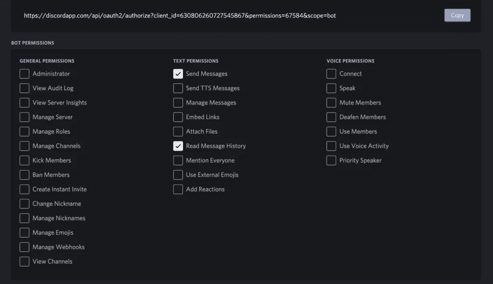

最后，复制这个 URL 并将其粘贴到您最喜欢的 web 浏览器中。您将看到一个概述，询问您希望将机器人添加到哪个服务器。让我们选择我们新创建的`discord_playground`。

点击*授权*按钮将机器人添加到我们的服务器。

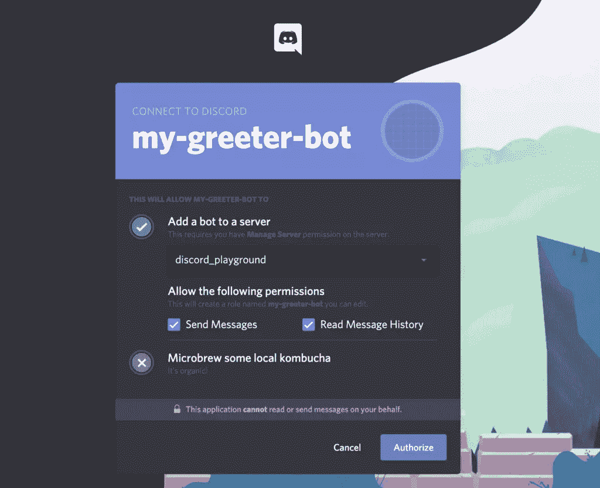

如果您能够成功地将 bot 添加到您的服务器，您应该会看到下面的成功屏幕。

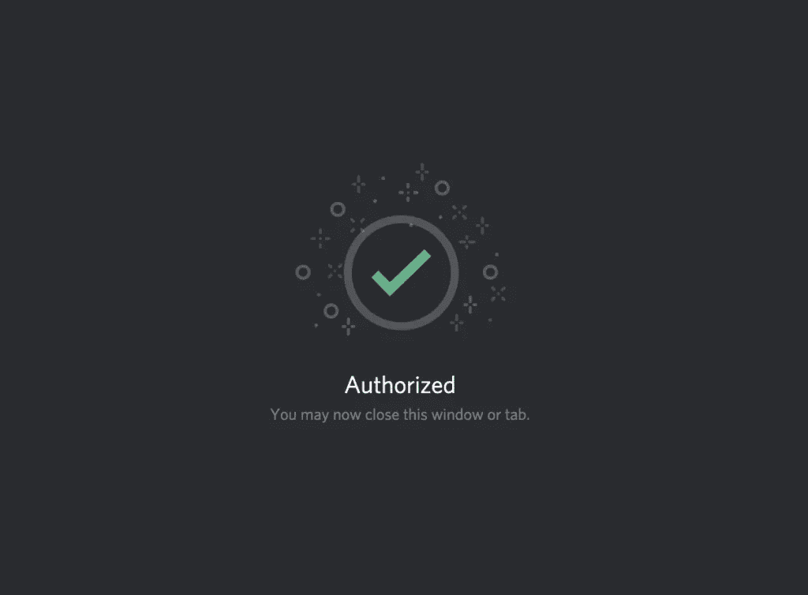

如果你想再次检查你的机器人是否被添加，去*通用*频道。您应该会看到一条类似的消息，表明 bot 已经加入了通道。

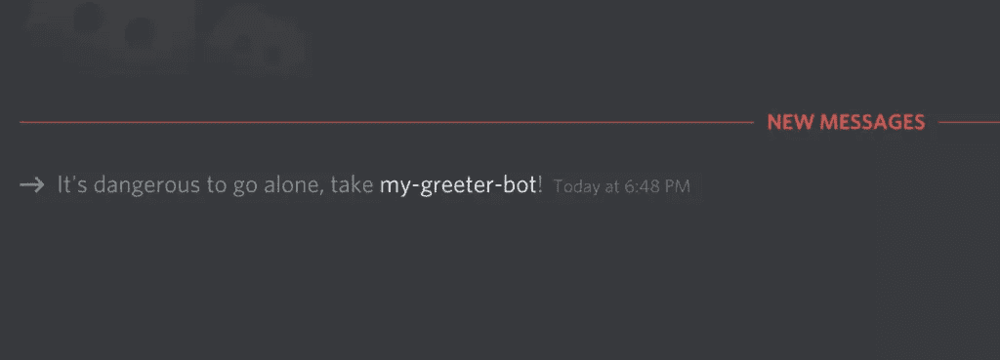

**成功！**

## 步骤 4:项目设置

最后，我们来设置项目。你可以在 [GitHub](https://github.com/sitepoint-editors/discord-bot-sitepoint) 上找到基础项目。请使用`git clone https://github.com/sitepoint-editors/discord-bot-sitepoint`在您的机器上本地克隆存储库。

项目依赖于两个依赖项，`dotenv`和`discord.js`。第一个依赖项允许我们使用一个`.env`文件来保存我们写下的 bot 令牌。很明显，我们需要第二个依赖项`discord.js`，来开发 Discord bot。

为了安装这两个依赖项，请在项目文件夹中执行`npm install`。

最后，为了完成安装，在项目的根目录下创建一个`.env`文件。向文件中添加一个名为`TOKEN`的环境变量，如下所示:

```
TOKEN=my-unique-bot-token 
```

## 第五步:探索 Discord.js

让我们看看位于项目根目录下的`index.js`文件:

```
require('dotenv').config();
const Discord = require('discord.js');
const bot = new Discord.Client();

const TOKEN = process.env.TOKEN;

bot.login(TOKEN); 
```

我们首先通过从环境`.env`文件中请求配置来加载我们已经定义的环境变量。这允许我们使用通过`process.env.ToKEN`定义的`TOKEN`变量。上面代码片段的最后一行显示了我们如何将令牌传递给登录函数，以便访问我们创建的 bot。

`bot`变量实际上是我们的 Discord 客户端，我们将通过它进行交互。

### 监听“就绪”事件

接下来，我们可以监听事件。首先，我们正在收听一个`ready`事件。一旦我们连接到机器人，就绪事件就被触发:

```
bot.on('ready', () => {
  console.info(`Logged in as ${bot.user.tag}!`);
}); 
```

如果您使用权限`TOKEN`登录到机器人，您的终端应该打印出您的机器人名称`bot.user.tag`。

你可以通过简单地在你的终端中执行`node index.js`来启动这个机器人。确保在项目的根目录下执行该命令。

如果 bot 连接成功，您应该看到您的 bot 的名称被打印在终端中。

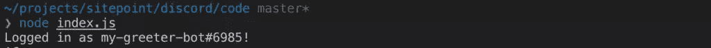

### 监听“消息”事件

除了*就绪*事件，Discord 客户端还允许您监听*消息*事件。这意味着机器人可以读取发送到通道的任何消息。回到 permissions 部分，这就是为什么我们需要给 bot 权限来读取消息历史的确切原因。

```
bot.on('message', msg => {
  if (msg.content === 'ping') {
    msg.reply('pong');
    msg.channel.send('pong');
  }
}); 
```

如果我们进一步研究代码，您会发现我们正在寻找一个包含内容`ping`的消息。如果我们收到一条只包含`ping`的消息，机器人会回复`pong`。之后，我们使用`msg.channel.send`再次发送`pong`到频道。

请注意这两个命令之间的区别:

*   `msg.reply`:标记发送消息的初始用户
*   `msg.channel.send`:向频道发送消息，不标记任何人

尝试用`node index.js`运行机器人，并向`general`频道发送消息`ping`。验证您是否看到相同的结果。

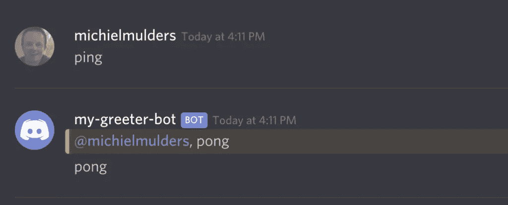

## 查找标记的用户

为了添加一个新命令，我们必须用一个`else … if`来扩展我们的`if`子句:

```
if (msg.content === 'ping') {
  msg.reply('pong');
  msg.channel.send('pong');

} else if (msg.content.startsWith('!kick')) {
  if (msg.mentions.users.size) {
    const taggedUser = msg.mentions.users.first();
    msg.channel.send(`You wanted to kick: ${taggedUser.username}`);
  } else {
    msg.reply('Please tag a valid user!');
  }
} 
```

假设我们想通过发送类似`!kick @username`的消息来踢某人。因此，首先我们在消息内容中寻找`!kick`。如果我们找到一条以`!kick`开头的消息，我们可以检查用户是否在消息中被标记了`msg.mentions.users`属性。

如果有标记的用户，我们可以用`msg.mentions.users.first()`选择第一个提到的用户。接下来，我们在消息中用用户的用户名回复通道。

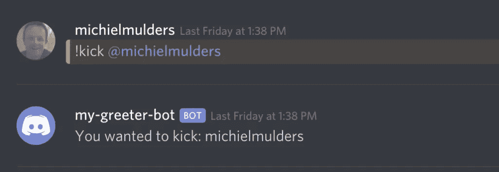

## 第六步:`else … if`链条的问题

接下来，我们就用所有这些`else … if`语句来讨论问题。如果您只定义了几个命令来监听消息事件，那么代码可读性很好。

然而，当我们决定以这种方式构建一个大项目时，我们最终会得到一连串的`else … if`语句。这里有一个小清单，列出了你不应该在任何不是小项目的项目中使用`else … if`链的原因:

*   更容易成为意大利面条式代码的受害者
*   代码很难读懂
*   调试起来不容易
*   很难组织代码
*   随着代码的增长，维护起来并不容易

因此，让我们来看看可以使用的命令模式。

### 实现命令处理程序

命令处理程序是一种由`discord.js`包支持的方法。在我们继续之前，用`git checkout advanced`看看`advanced`分支。这个分支包含命令处理程序的实现。

### 命令文件夹

首先，让我们探索一下命令文件夹。这个文件夹保存了一个`index.js`文件，它导出了我们将要定义的所有命令。为了简单起见，我们将只定义一个命令，`ping`:

```
module.exports = {
  Ping: require('./ping'),
}; 
```

接下来，让我们看看`ping`命令的实现，它基本上导出了一个包含以下内容的对象:

*   `name`:命令名。
*   为每个命令添加描述是最好的做法。
*   `execute`:接受`msg`和`args`输入的功能。这个函数拥有与我们在`else … if`链中相同的逻辑。

```
module.exports = {
  name: 'ping',
  description: 'Ping!',
  execute(msg, args) {
    msg.reply('pong');
    msg.channel.send('pong');
  },
}; 
```

### 导入命令

接下来，让我们将命令导入到`index.js`文件中。注意，我们在 Discord bot 上定义了一个命令集合。我们遍历所有命令，并将它们逐个添加到命令集合中。

`bot.commands.set`函数接受命令名和整个命令对象:

```
const Discord = require('discord.js');
const bot = new Discord.Client();
bot.commands = new Discord.Collection();
const botCommands = require('./commands');

Object.keys(botCommands).map(key => {
  bot.commands.set(botCommands[key].name, botCommands[key]);
}); 
```

之后，我们必须移除我们的`else … if`链并用一些动态代码替换它，以找到我们想要调用的正确命令:

```
bot.on('message', msg => {
  const args = msg.content.split(/ +/);
  const command = args.shift().toLowerCase();
  console.info(`Called command: ${command}`);

  if (!bot.commands.has(command)) return;

  try {
    bot.commands.get(command).execute(msg, args);
  } catch (error) {
    console.error(error);
    msg.reply('there was an error trying to execute that command!');
  }
}); 
```

我们首先尝试使用`.split(/ +/)`通过空格分割消息的内容。我们假设这个`args`数组中的第一项是我们的命令。为了检查该命令是否存在于我们的集合中，集合公开了一个`has()`函数，该函数简单地返回 true 或 false。如果命令不存在，我们返回一个空响应。

然而，如果命令存在，我们使用`get()`函数来检索正确的命令，并使用输入参数`msg`和`args`来执行它。

这是一种易于阅读的、动态的调用命令的方式，无需编写复杂的代码。如果需要，这允许您将项目扩展到数百个命令。

同样，如果你想测试我们代码的新版本，确保用`git checkout advanced`检查`advanced`分支。接下来，用`npm install`安装所有依赖项，用`node index.js`启动 bot。

## 包扎

安装和设置一个新的不和谐机器人一开始可能会觉得势不可挡。然而，`discord.js`包提供的 API 很简单，Discord 网站提供了[很好的例子](https://discordjs.guide/)。

由于本教程只介绍了两种权限，所以还有更多的内容。您可以在 [Discordjs.guide](https://discordjs.guide/popular-topics/permissions.html) 网站上了解更多关于权限的信息。

祝你建造第一个不和谐机器人好运！

*顺便说一下，你可以通过这个链接加入 [SitePoint 的 Discord 社区。来和我们一起讨论技术吧。](https://discord.gg/PyAM7tv)*

## 分享这篇文章