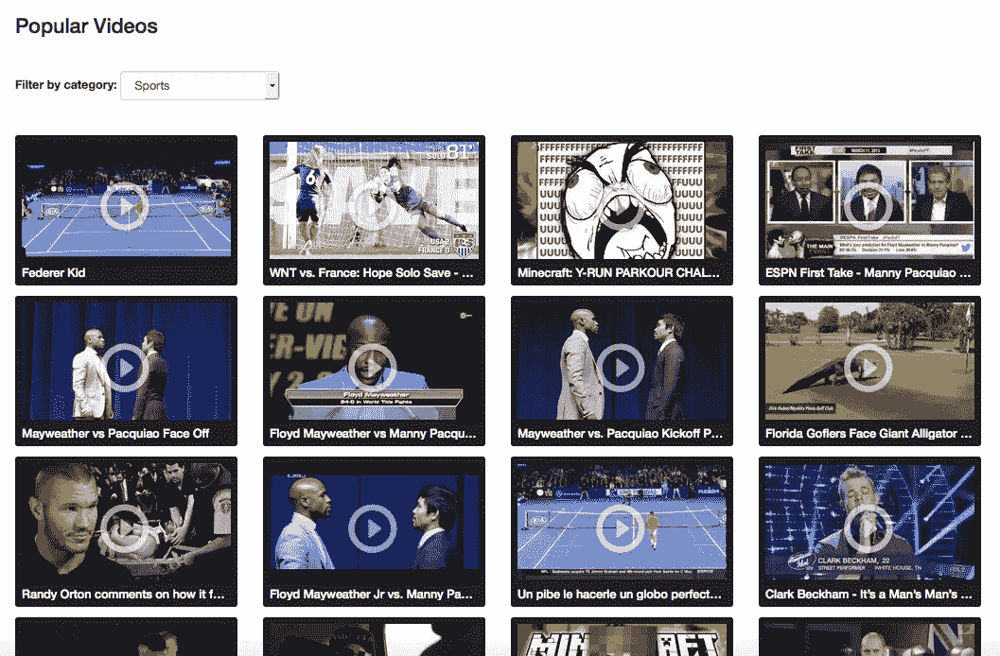
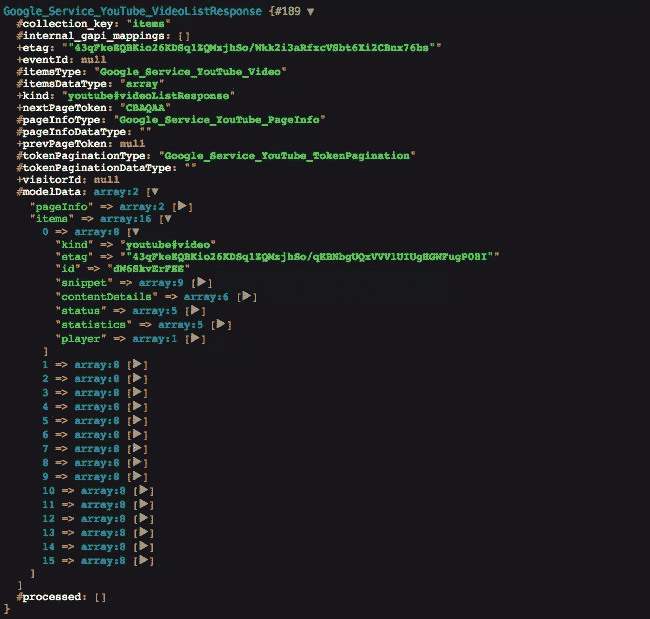
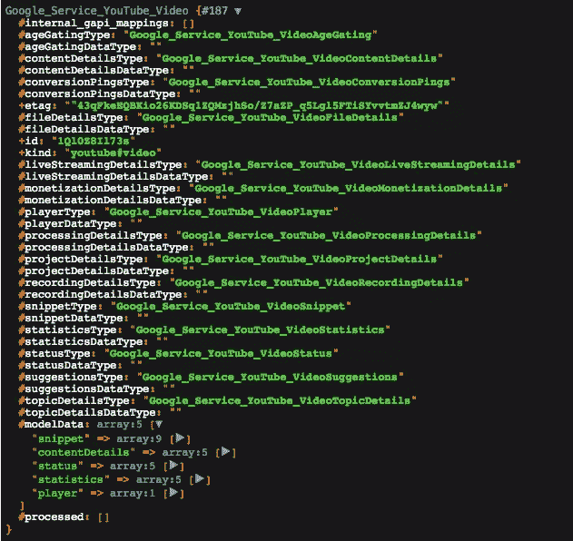
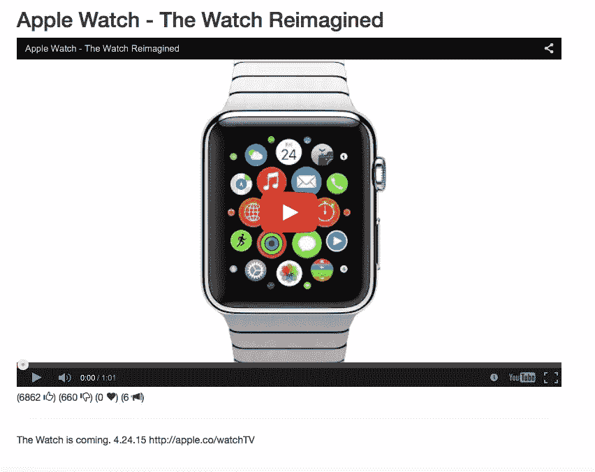

# 用 PHP 显示 YouTube 视频

> 原文：<https://www.sitepoint.com/displaying-youtube-videos-php/>

在这篇由两部分组成的文章中，我们将学习如何使用第 3 版的 [YouTube](https://www.youtube.com) API，并在此过程中构建一个演示。让我们开始吧。


## 我们正在建造的东西

我们将构建一个演示，让用户浏览 YouTube 上的热门视频，搜索视频，按类别浏览视频，并选择要观看的视频。

我将使用 [Laravel 5](http://laravel.com/docs/) 作为我选择的框架，使用[vagger](https://www.sitepoint.com/quick-tip-get-homestead-vagrant-vm-running/)作为我的开发环境。最终产品看起来会像这样:



## 准备项目

在[将拉韦尔 5](http://laravel.com/docs/5.0/installation) 安装到机器上后，安装`google/apiclient`:

```
composer require google/apiclient
```

要在 Google 开发者控制台上建立一个新项目，请查看这个[快速提示](https://community.sitepoint.com/t/starting-a-new-google-api-project/117282)开始。

## 注册环境变量

从 Google Developers 控制台获得凭据后，我们需要在应用程序中注册它们。

```
// .env

APP_DEBUG=true

app_name='Your app name (optional)'
client_id='Your client id'
client_secret='Your client secret'
api_key='Your developer key'
```

```
// config/google.php

return [
    'app_name'      => env('app_name'),
    'client_id'     => env('client_id'),
    'client_secret' => env('client_secret'),
    'api_key'       => env('api_key')
];
```

Laravel 从我们的应用程序文件夹的根目录下的`.env`文件中自动加载环境变量。现在我们已经设置好了配置，我们可以开始登录过程了。

## 登录和授权

在使用 Google API 登录之前，我们需要讨论一下作用域，以及为什么它们对授权过程很重要。

### 领域

作用域定义了应用程序的授权级别，所以请确保只请求您需要的内容。YouTube 的 API 有四个范围:

*   管理你的 YouTube 账户。
*   查看您的 YouTube 帐户。
*   `https://www.googleapis.com/auth/youtube.upload`:上传 YouTube 视频，管理您的 YouTube 视频。
*   `https://www.googleapis.com/auth/youtubepartner-channel-audit`:检索通道资源中的 auditDetails 部分。

对于我们的演示，我将只使用第一个，我们可以根据应用程序的需要扩展它。你可以在[文档](https://developers.google.com/youtube/v3/guides/authentication#Obtain_Access_Token)中阅读更多关于授权的内容。

```
// app/Services/GoogleLogin.php

namespace App\Services;

class GoogleLogin
{
  protected $client;

  public function __construct(\Google_Client $client)
  {
    $this->client = $client;

    $this->client->setClientId(\Config::get('google.client_id'));
    $this->client->setClientSecret(\Config::get('google.client_secret'));
    $this->client->setDeveloperKey(\Config::get('google.api_key'));
    $this->client->setRedirectUri(\Config::get('app.url') . "/loginCallback");
    $this->client->setScopes([
                                 'https://www.googleapis.com/auth/youtube',
                             ]);
    $this->client->setAccessType('offline');
  }

  public function isLoggedIn()
  {
    if (\Session::has('token')) {
      $this->client->setAccessToken(\Session::get('token'));
    }

    if ($this->client->isAccessTokenExpired()) {
      \Session::set('token', $this->client->getRefreshToken());
    }

    return !$this->client->isAccessTokenExpired();
  }

  public function login($code)
  {
    $this->client->authenticate($code);
    $token = $this->client->getAccessToken();
    \Session::put('token', $token);

    return $token;
  }

  public function getLoginUrl()
  {
    $authUrl = $this->client->createAuthUrl();

    return $authUrl;
  }
}
```

在使用我们的凭证构建了一个`Google_Client`实例之后，我们设置了所需的范围。`setAccessType`方法让我们的应用程序能够在用户不在时刷新令牌。

### 登录控制器

```
// app/Http/routes.php

Route::get('/login', ['uses' => 'GoogleLoginController@index', 'as' => 'login']);
Route::get('/loginCallback', ['uses' => 'GoogleLoginController@store', 'as' => 'loginCallback']);
```

```
// app/Http/Controllers/GoogleLoginController.php

class GoogleLoginController extends Controller
{

  public function index(\App\Services\GoogleLogin $ga)
  {
    if ($ga->isLoggedIn()) {
      return \Redirect::to('/');
    }

    $loginUrl = $ga->getLoginUrl();

    return "<a href='{$loginUrl}'>login</a>";
  }

  public function store(\App\Services\GoogleLogin $ga)
  {
    // User rejected the request
    if(\Input::has('error')){
      dd(\Input::get('error'));
    }

    if (\Input::has('code')) {
      $code = \Input::get('code');
      $ga->login($code);

      return \Redirect::to('/');
    } else {
      throw new \InvalidArgumentException("Code attribute is missing.");
    }//else
  }
}
```

`GoogleLoginController@index`方法将测试用户是否登录，如果是，将把他们重定向到主页。否则，我们生成一个新的登录 URL。

通过授权阶段后，Google 将把用户重定向到 Google 开发者控制台中用代码参数定义的回调 URL。该代码用于交换令牌。

## 列出视频

`Google_Service_YouTube`类是我们通向 YouTube API 的大门。它提供了对所有 YouTube 数据的访问。该类将一个`Google_Client`实例作为参数。创建一个提供者来绑定我们的实现是有意义的，这样我们就不必到处重复相同的代码。你可以在[文档](http://laravel.com/docs/5.0/providers)中了解更多关于服务提供商的信息。

```
php artisan make:provider YouTubeServiceProvider
```

这个命令将在我们的`app/Providers`文件夹中创建一个新类。我们需要将我们的服务提供商添加到`config/app.php`中的提供商列表中。

```
// config/app.php

'providers' => [
  'App\Providers\YouTubeServiceProvider',
]
```

```
// app/Providers/YouTubeServiceProvider.php

public function register()
{
  $app = $this->app;

  $this->app->bind('GoogleClient', function () {
    $googleClient = new \Google_Client();
    $googleClient->setAccessToken(\Session::get("token"));

    return $googleClient;
  });

  $this->app->bind('youtube', function () use ($app) {
    $googleClient = \App::make('GoogleClient');
    $youtube = new \Google_Service_YouTube($googleClient);

    return $youtube;
  });
}
```

`https://www.googleapis.com/youtube/v3/videos`端点返回视频列表，可以通过`$youtube->videos`使用我们的 YouTube 类访问它。

```
// app/Http/Controllers/YouTubeAPIController.php

public function videos()
{
  $youtube = \App::make('youtube');
  $videos = $youtube->videos->listVideos('snippet', ['chart' => 'mostPopular']);

  dump($video);
}
```



`listVideos`方法的第一个参数叫做`part`，它定义了结果中包含的信息。你可以添加`statistics`来获得关于票数、喜欢等数据。我们将在本文后面更多地讨论`part`参数。您可以在[文档](https://developers.google.com/youtube/v3/docs/videos/list)中了解更多关于支持值的信息。

第二个参数必须包含一个视频过滤器。在这种情况下，我们得到了 YouTube 上最受欢迎的视频。您还可以请求您喜欢或不喜欢的视频等。您可以在[文档](https://developers.google.com/youtube/v3/docs/videos/list)中阅读更多关于过滤器的信息。

```
// app/Http/Controllers/YouTubeAPIController.php

public function videos()
{
  $options = ['chart' => 'mostPopular', 'maxResults' => 16];
  if (\Input::has('page')) {
    $options['pageToken'] = \Input::get('page');
  }

  $youtube = \App::make('youtube');
  $videos = $youtube->videos->listVideos('id, snippet', $options);

  return view('videos', ['videos' => $videos]);
}
```

这种方法是不言自明的。page 参数用于分页，我们将在下面看到。

```
// resources/views/videos.blade.php

<ul class="list-unstyled video-list-thumbs row">
@foreach($videos as $video)
    <li class="col-lg-3 col-sm-4 col-xs-6">
        <a href="https://www.youtube.com/watch?v={{ $video->getId() }}" title="{{ $video['snippet']['title'] }}" target="_blank">
            
            <h2 class="truncate">{{ $video['snippet']['title'] }}</h2>
        </a>
    </li>
@endforeach
</ul>

<ul class="pagination pagination-lg">
    <li @if($videos->getPrevPageToken() == null) class="disabled" @endif>
      <a href="/videos?page={{$videos->getPrevPageToken()}}" aria-label="Previous">
        <span aria-hidden="true">Previous &laquo;</span>
      </a>
    </li>
    <li @if($videos->getNextPageToken() == null) class="disabled" @endif>
      <a href="/videos?page={{$videos->getNextPageToken()}}" aria-label="Next">
        <span aria-hidden="true">Next &raquo;</span>
      </a>
    </li>
</ul>
```

我们的观点是非常基本的-我们只输出视频标题，缩略图和链接。我们的 API 响应还包含喜欢、不喜欢、视图计数等，所以您可以使用它们来丰富您的页面，使用一些特殊的标记。分页链接使用户能够浏览视频。您可能已经注意到，这是通过令牌而不是普通的页面参数来完成的。

当你点击一个视频时，你将被重定向到使用该 ID 观看 YouTube 上的视频。为什么不获取视频的详细信息，并创建一个包含球员以及更多关于视频信息的页面呢？

## 单个视频页面

获取单个视频只需从之前的相同端点指定一个选项。由于结果是单个项目，我们将参数`maxResults`设置为`1`，并且我们移除了`chart`属性，因为它在这个请求中不相关。

```
// app/Http/routes.php

Route::get('/video/{id}', ['uses' => 'YouTubeAPIController@video', 'as' => 'video']);
```

```
// app/Http/Controllers/YouTubeAPIController.php

public function video($id){
  $options = ['maxResults' => 1, 'id' => $id];

  $youtube = \App::make('youtube');
  $videos = $youtube->videos->listVideos('id, snippet, player, contentDetails, statistics, status', $options);

  if(count($videos->getItems()) == 0){
    return redirect('404');
  }

  return view('video', ['video' => $videos[0]]);
}
```



因为这是一个单个项目的页面，所以我试图使用`part`参数获取尽可能多的信息。如果项目不存在，我们将用户重定向到`404` not found 页面。否则，我们用列表中的第一项来呈现视图。

```
// resources/views/video.blade.php

<div class="row">
    <h2>{{ $video["snippet"]["title"] }}</h2>
</div>

<div class="row">
    <iframe type='text/html' src='http://www.youtube.com/embed/{{ $video->getId() }}' width='100%' height='500' frameborder='0' allowfullscreen='true'></iframe>
</div>

<div class="row">
    (<span>{{ $video["statistics"]["likeCount"] }} <i class="glyphicon glyphicon-thumbs-up"></i></span>)
    (<span>{{ $video["statistics"]["dislikeCount"] }} <i class="glyphicon glyphicon-thumbs-down"></i></span>)
    (<span>{{ $video["statistics"]["favoriteCount"] }} <i class="glyphicon glyphicon-heart"></i></span>)
    (<span>{{ $video["statistics"]["commentCount"] }} <i class="glyphicon glyphicon-bullhorn"></i></span>)
</div>

<hr/>

<div class="row">
    <p>{{ $video["snippet"]["description"] }}</p>
</div>
```

因为我们向 YouTube API 请求了`player`部分，所以我们可以使用`$video['player']['embedHtml']`直接访问它，但是如果您想要定制播放器的尺寸，您可以像我们在示例中所做的那样使用视频 ID 来构建它。

需要注意的一点是:每个请求都有一次调用的成本，当您请求代码片段、统计数据等时，您会增加新的成本。你可以在[文档](https://developers.google.com/youtube/v3/getting-started#quota)中阅读更多关于配额和成本的信息。



## 包扎

在第一部分中，我们介绍了 YouTube API，并构建了一个小的演示程序，使用分页链接查询 YouTube 上最受欢迎的视频列表，以及一个查看单个视频的页面。在下一部分，我们将探索视频类别和搜索功能，敬请关注。你可以在 [Github](https://github.com/Whyounes/YouTubeAPI_Demo) 上查看最终结果，如果有任何问题或意见，可以在下面贴出。

## 分享这篇文章