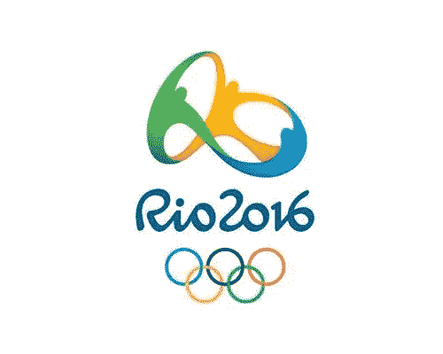

# 剖析 2016 里约奥运会标志

> 原文：<https://www.sitepoint.com/dissecting-the-rio-2016-logo/>

2016 年里约奥运会标志在里约热内卢的科帕卡巴纳海滩揭幕。该标识由手握奥运五环的彩色图形和 2016 里约字样组成。它是由巴西机构 Tatil 设计的。

根据奥运会组织者的说法，2016 年里约奥运会新会徽的灵感来自于“所有巴西人团结起来，举办地球上最盛大的节日，并自豪地推进我们国家进步的承诺”的愿景。这有点拗口。

> 它的本质是激情和变革的概念，这两个概念都反映了现代巴西——一个充满激情并正在将自己转变为世界领导者的国家。这一定位由四大支柱支撑:和谐的多样性、富有感染力的能量、生机勃勃的大自然和奥林匹克精神。这些都巧妙地结合在一起，赋予了 2016 里约奥运会新的多彩身份。

现在，当谈到奥林匹克标志时，几乎不用说，但是已经有一些与这个会徽有关的争议。《广告周刊》在他们的博客上报道称，由于新标志看起来有点像[特柳赖德基金会](http://www.telluridefoundation.org/)的标志，有抄袭的呼声。Tatil 设计机构的主任 Fred Gelli 承认与基金会的标志“相似”，但表示人们互相拥抱的一般概念并不新颖，并否认抄袭。也很对。

我个人喜欢这个标志，它有很好的运动感和色彩。在【2016 里约奥运会网站上查看正在使用的标志。

如何看待 2011 年第一个主要标识，里约 logo？它实现了“进步的承诺”吗？

## 分享这篇文章