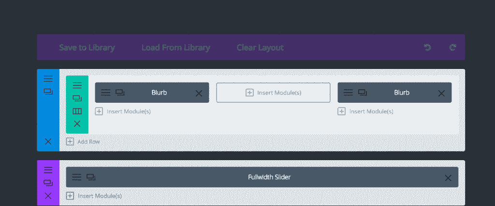
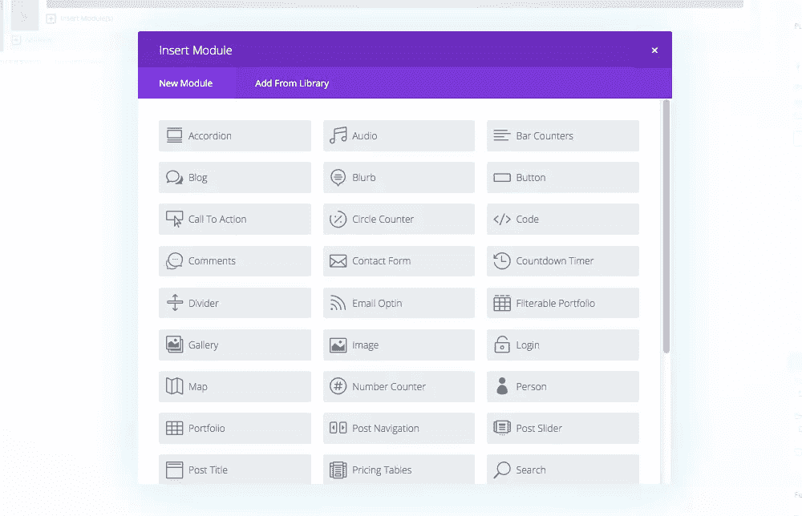
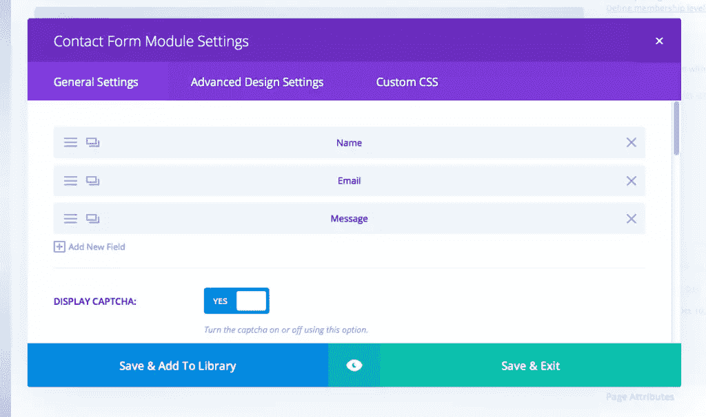
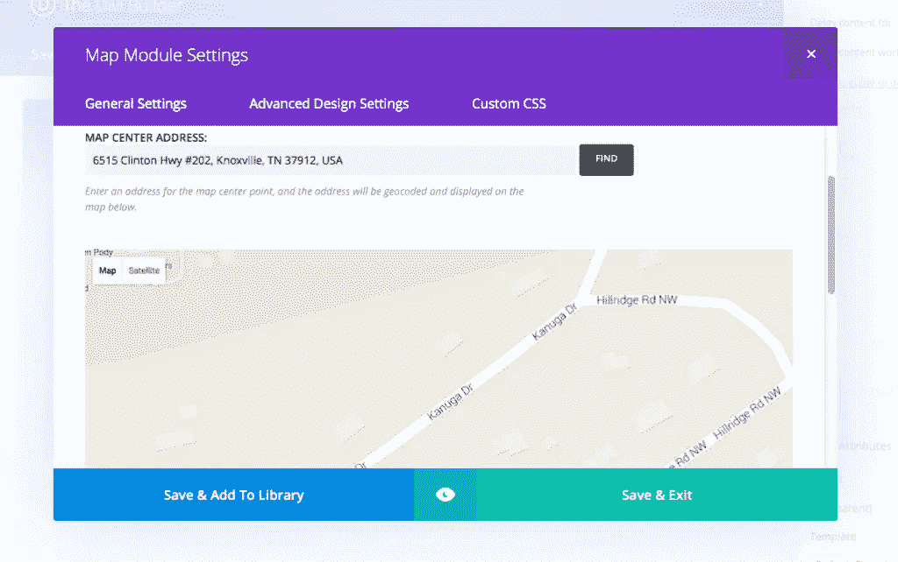
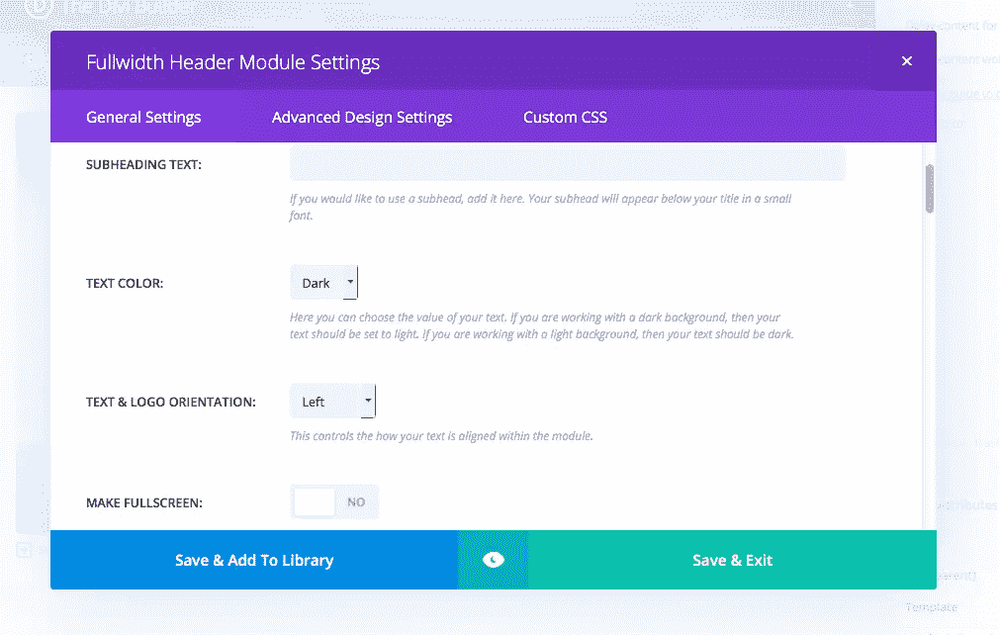

# 任何 WordPress 主题的 Divi Builder 插件

> 原文：<https://www.sitepoint.com/divi-builder-plugin/>

作为一名 WordPress 用户和开发者，我可以肯定地说我对框架很感兴趣。我喜欢尝试不同的框架和插件，因为我着迷于用 WordPress 能做些什么。当你深入其中的时候，你可以获得一些非常惊人的东西。

我一直觉得 WordPress 的一个弱点是他们对页面生成器的选择。WordPress 拖放页面生成器质量参差不齐，但大多数时候它们会带来麻烦。你试图整合它们，它们要么破坏了主题，要么它们的风格被主题本身所覆盖。WordPress 主题页面生成器似乎总是有局限性。

我一直喜欢的一个主题是 Divi(我之前在 SitePoint 上已经[报道过 Divi)，它有自己的页面生成器。我一直认为优雅的主题应该从页面生成器中创建一个独立的插件。很明显，他们一定是读懂了我的心思，因为他们刚刚发布了他们的页面生成器插件。](https://www.sitepoint.com/the-divi-wordpress-theme-changing-the-way-you-blog/)

## 优势

当我需要快速完成一个项目时，我有一个特定主题的库。问题是预设主题没有提供那么大的灵活性。我可以整天进去定制一个 WordPress 主题。我能做某事并不意味着我想做。为您的项目实现一个可定制的系统可能会更具成本效益，尤其是对于预算较低或对时间更敏感的项目。

### 它适用于任何主题

你可以将新的页面生成器插件放到任何主题中。这意味着如果你找到合适的主题，你可以很容易地定制它。这对于做特定事情的专业主题尤其有用。你不会成为试图黑掉一个主题让它看起来像你想要的那样的受害者。

### 避免使用短代码主题

使用模块化页面生成器的能力使得它非常适合过于依赖短代码的主题。这可能更多的是个人偏好，但是我不喜欢依赖短代码作为内容结构的主题。如果我想用代码包装每一段，我会用 HTML 构建站点。使用构建器，您可以添加模块并将您的内容放入其中来构建每个页面。每个模块还提供定制选项。

### 它是更新友好的

您可以使用页面构建器为您的站点创建页面布局，而不必修改现有的主题并担心您的自定义内容是否经得起未来的考验。这是一个很好的选择，因为即使你更新了主题，你的页面构建器内容也会保持不变，因为它与主题是分开的。

这可能是一把双刃剑，因为当你添加到一个主题时，你通常会使用一个子主题。当您更新基本主题时，子主题可以防止您丢失自定义内容。另一方面，这是一个插件，没有办法创建一个“子插件”。如果您对插件本身进行定制，比如对基本代码进行定制，那么当您更新 Divi Builder 插件时，它可能会被覆盖。

#### Divi Builder 解决这个问题的方法

您可以通过将代码和 CSS 应用到插件本身的指定区域来避免更新问题。每个模块都有一个部分，您可以在其中单独添加类和 CSS。每个模块都可以定制，给您最大的灵活性。另一个额外的好处是，当你更新的时候，你应用到每个模块的 CSS 将会在更新中延续，就像一个主题或者插件的选项会被更新一样。

## 布局

建立任何你能想象的布局。概念很简单。一切都从行开始，行可以相互堆叠。每行可以用不同的列和宽度变化的组合来构建。使用相互堆叠的行，您可以构建无限数量的布局组合。

## 特征

Divi builder 插件包含 46 个模块，可以让你建立一个强大的、功能丰富的网站。一切都可以在模块中找到，你可以把它放到布局模块中。

这意味着你可以按照你想要的方式建立一个网站，在你想要的地方提供你想要的功能。想象一下能够创建登录页面、服务页面、漂亮的案例研究和产品展示页面等等。以下是 Divi Builder 插件中可用模块的列表:

*   **Accordion**–Accordion 模块创建一个可扩展的 Accordion 部分，使您能够将大量信息放在一个紧凑的地方。
*   **音频播放器**–如果你有一个音频文件，比如 MP3，你可以把它上传到这里并嵌入到页面中。
*   **条形计数器**–条形计数器是一组动画条形图，代表您在设置中放置的值。这对于显示一些百分比非常有用，比如统计数据。
*   博客模块非常棒，因为你可以在页面的任何地方放置博客。如果您为不同类型的内容设置不同的类别，您可以高度自定义帖子在特定页面上显示的内容。
*   **广告**–广告模块使您能够在插件中创建一个带有图像或预设图标的部分。这是许多网站的共同特征，给了它一个图形的吸引力。
*   **按钮**–您可以创建令人惊叹的行动号召按钮，或者只是下载和其他页面的简单链接。您可以微调任何细节，从颜色到悬停状态、笔画，甚至图标。
*   **行动号召**–行动号召将按钮模块扩展了一点，使您能够在网站上创建彩色背景和强有力的信息，以说服访问者采取行动。
*   **圆形计数器**–圆形计数器类似于前面提到的条形计数器，但它使用圆形元素来表示数据。
*   **代码**–需要在页面的某个部分嵌入自定义代码？使用这个模块将它嵌入到页面中您想要的任何地方，而不用担心与您的其他内容冲突。
*   **评论**–想要一个专门的评论区吗？使用此模块定制外观和感觉，以获得更好的评论体验。

*   **联系表单**–使用此模块，您可以在页面的任何地方放置定制的联系表单。收集你能想象到的任何数据，并有能力创建自己的字段。
*   倒计时器–你的网站需要一个倒计时器吗？使用此模块。您可以指定天数，这对于大事件的倒计时来说非常方便。你可以为网上研讨会或会议建立一个很棒的注册页面。
*   **分隔线**–在任何元素之间放置一条分隔线，并在其周围留出指定的空间。
*   **电子邮件选项**–使用此模块连接 Mailchimp 或 Aweber 等电子邮件营销服务。收集电子邮件地址，建立你的名单。
*   **可过滤的投资组合**–你是设计师吗？创建一个作品集展示你的作品。它有一个完整的可排序功能，这意味着访问者可以按类别浏览你的作品。
*   **图库**–创建一个图片图库，从一张图片过渡到另一张图片。当你点击图片时，你也可以让图片在灯箱中打开。
*   **Image**–Image 模块使您能够将图像放置在页面上的任何位置，控制最大宽度，添加渐变等过渡，并使您能够将它们链接到其他页面。
*   **登录**–允许会员使用这个定制的登录模块登录您的网站。精心打造定制体验的外观和感觉。

*   **地图**–这是一个实时的谷歌地图，你可以通过模块内的列表输入地址和标绘点。这对企业和活动来说非常好，因为客户可以看到你相对于其他地标的位置。
*   **数字计数器**–显示统计数据，从零开始，一直计数到您在模块中输入的值。您可以显示大数字或百分比值。
*   **Person**–这对任何类型的机构和团队来说都很棒。您可以添加一个人的照片、社交链接、传记信息等。
*   投资组合(Portfolio)–这是一个常规的投资组合部分，您可以按类别显示项目。您可以指定显示的产品数量。
*   **帖子导航**–使用此模块放置指向下一篇和上一篇帖子的定制链接。这将吸引访问者来你的网站查看你的其他内容。
*   **文章滑块**–如果你正在创建一个博客页面，你可以启用文章滑块来循环浏览专题文章。
*   **文章标题**–使用此模块为您的页面或博客文章创建定制的文章标题。
*   **定价表**–创建定价表可能会很痛苦，但使用此模块，您可以为每个表输入信息并定制其外观。
*   **搜索**–让访问者使用搜索模块搜索您的整个网站。
*   如果你正在使用 WooCommerce，你可以在一个页面中嵌入你的部分或全部店铺。
*   **侧边栏**–使用此模块在页面的任何地方放置侧边栏。它可以让你制作出与页面相匹配的外观和感觉。
*   **滑块**–您可以创建自定义的图像和文本滑块。您可以启用带有文本和透明 PNG 的背景图像。
*   **社交媒体跟进**-通过本模块扩大您的社交媒体影响力，将访问者与脸书、Pinterest、Google+、LinkedIn 等联系起来。
*   **标签**-如果你有一个相关的内容，你希望访问者能够轻松地点击通过，你可以用这个模块创建一个标签部分。
*   **客户评价**–使用此模块将客户评价添加到您的网站。如果你有一个以上的，这个模块与循环通过他们，增加你的业务可信度。
*   **Text**–您可以在此模块中添加您的文本和正文。您还可以在此部分添加图像和媒体，就像任何其他博客部分一样。
*   **Toggle**–Toggle 模块类似于手风琴模块，但只有一个 Toggle 部分。
*   **视频**–将视频放在页面的任意位置。
*   **视频滑块**–如果您有多个视频要展示，您可以在此处输入，该模块将在这些视频之间轮换。

下面的部分都是定制的全宽使用。他们增加了对你网站的全宽部分有意义的功能。

这些部分是:

*   全角代码
*   全幅标题
*   全宽图像
*   完整宽度贴图
*   Fullwidth Menu
*   全幅投资组合
*   全角文章滑块
*   全角文章标题
*   全角滑块。

## 结论

如果你想创建一个高度定制化的网站，但是你不想局限于一个特定的主题，你可以使用 Divi Builder 插件来定制任何 WordPress 主题。有 46 个不同的模块可供选择，您可以为任何帖子或页面添加自定义功能和特性。

你可以[点击这里](http://www.elegantthemes.com/plugins/divi-builder/)查看 Divi Builder 插件。

## 分享这篇文章